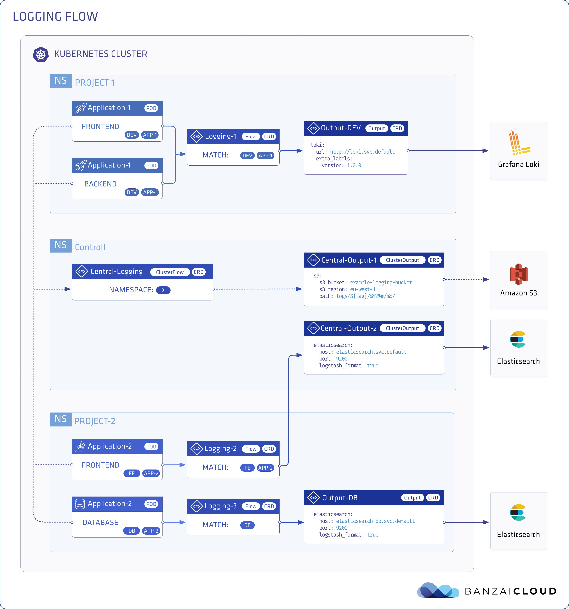
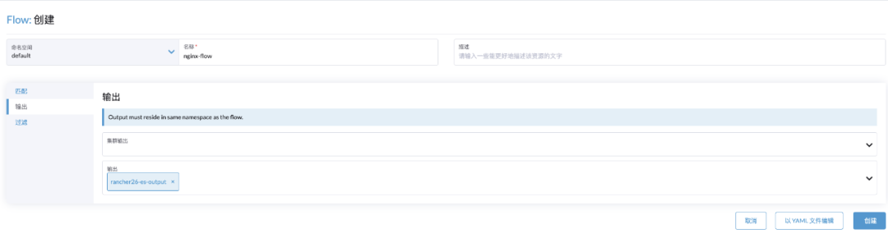

# Rancher 2.6 全新 Logging 快速入門

原文: https://mp.weixin.qq.com/s?__biz=MzkyNzM4Nzk1NQ==&mid=2247500852&idx=1&sn=6f993e57a508166cb8d32927742673f4&scene=21#wechat_redirect

## 背景概述

在 SUSE Rancher 2.5 以前，日誌收集的架構是使用 Fluentd 收集指定目錄日誌或者容器標準輸出流後，再通過 UI 日誌功能頁面的配置發送到指定的後端。如 Elasticsearch、splunk、kafka、syslog、fluentd 等常見的後端工具，可以自動化地收集 kubernetes 集群和運行於集群之上的工作負載日誌。這種方式無疑是非常簡單、易用、方便的，但是隨著用戶對雲原生理解的加深，對業務日誌分析顆粒度要求的提高，之前的日誌收集方式有些太過死板，靈活性非常差，已經無法滿足對日誌收集具有更高要求的用戶了。

於是從 SUSE Rancher 2.5 版本開始，BanzaiCloud 公司的開源產品 Logging Operator 成為了新一代 SUSE Rancher 容器雲平台日誌採集功能的組成組件。 SUSE Rancher 2.5 版本作為新日誌組件的過渡版本，保留了老版本的日誌收集方式，並將全新的 Logging Operator 作為實驗性功能使用；SUSE Rancher 2.6 版本則已經完全使用了 Logging Operator 作為日誌收集工具。

本文將由淺到深地探索全新的 SUSE Rancher 2.6 Logging Operator 功能和它的使用方式。

## 什麼是 Logging Operator

Logging Operator 是 BanzaiCloud 基於雲原生場景的開源日誌採集方案，SUSE Rancher 2.6 版本在整合了該產品之後，將會在用戶的操作下自動部署 Logging Operator 並自動配置 kuberletes logging pipeline。

### Logging Operator 架構


以上是 Logging Operator 官方架構圖。 Logging Operator 使用 CRD 的方式決定了日誌採集、規則路由、輸出這三個階段的配置，它使用 Daemonset 在集群節點上部署 Fluentbit 組件，使用 StatefulSet 部署 Fluentd 組件。首先由 Fluentbit 組件進行日誌收集並初步處理之後，發送到 Fluentd 組件進行進一步的解析處理，最終由 Fluentd 組件發送到不同的後端工具上。

### Logging Operator CRD

上文提到，Logging Operator 使用 CRD 的方式決定了日誌採集、規則路由、輸出這三個階段的配置，其使用的 CRD 主要有以下5種類型：

- `logging`：用於定義一個日誌採集端 (FleuntBit) 和傳輸端 (Fleuntd) 服務的基礎配置，在 SUSE Rancher 2.6 版本中，已經由 Rancher 自動化部署完成；
- `flow`：用於定義一個 namespaces (命名空間)級別的日誌過濾、解析和路由等規則;
- `clusterflow`：用於定義一個集群級別的日誌過濾、解析和路由等規則;
- `output`：用於定義 namespace (命名空間)級別的日誌的輸出和參數，它只能被同命名空間內的 flow 關聯；
- `clusteroutput`：用於定義集群級別的日誌輸出和參數，它能把被其他命名空間內的 flow 關聯。

以上 5 個 CRD 類型非常重要，決定了一個 Kubernetes 集群內每個命名空間甚至每個容器的日誌輸出到哪裡。



## 啟用 SUSE Rancher 2.6 Logging

SUSE Rancher 2.6 成功創建下游 Kubernetes 集群後，可以在集群工具頁面找到 Logging 工具的部署入口，如下圖所示：


點擊安裝按鈕後，選擇組件安裝的項目，一般選擇為 System 項目，在該項目中運行與集群運行相關的組件；點擊下一步後，UI 會要求輸入配置 Docker 根目錄和 System Log Path；

- 注意：如果底層容器運行時 (Runtime)為 Docker，默認為：`/var/lib/docker`。如果自定義過，請填寫正確的 Docker Root Dir 目錄，可以通過 `docker info ｜ grep Docker Root Dir` 命令查看；
- 注意：`System Log Path` 用於收集主機操作系統 Journal 日誌，如果填寫錯誤會導致主機操作系統日誌無法收集，確認該路徑的方法如下：

    ```bash

    ## 确认Journal Log Path检查方式，在节点上执行以下命令

    cat /etc/systemd/journald.conf | grep -E ^\#?Storage | cut -d"=" -f2

    1、如果返回persistent，则systemdLogPath应该是/var/log/journal；
    2、如果返回volatile，则systemdLogPath应该是/run/log/journal；
    3、如果返回auto，则检查/var/log/journal是否存在；
    - 如果/var/log/journal存在，则使用/var/log/journal；
    - 如果/var/log/journal不存在，则使用/run/log/journal；
    ```

輸入正確的 Docker 根目錄和 systemdLogPath 後，點擊安裝，SUSE Rancher 2.6 會自動部署 Logging Operator


執行以下命令檢查部署是否成功

```bash

kubectl get pod -n cattle-logging-system

NAME                                           READY   STATUS      RESTARTS   AGE
rancher-logging-96b68cc4b-vqxnd                1/1     Running     0          9m54s
rancher-logging-fluentbit-cntgb                1/1     Running     0          69s
rancher-logging-fluentbit-hwmdx                1/1     Running     0          71s
rancher-logging-fluentbit-nw7rw                1/1     Running     0          71s
rancher-logging-fluentd-0                      2/2     Running     0          9m34s
rancher-logging-fluentd-configcheck-ac2d4553   0/1     Completed   0          9m48s
```

部署完成後，SUSE Rancher 2.6 集群 UI 上多了一個日誌選項卡，可以由此配置上文提到的 flow、clusterflow、output、clusteroutput 資源對象，從而完成整個日誌採集、過濾路由、輸出的全流程配置。

從 SUSE Rancher 2.6 UI 上直接進行日誌採集流程的配置固然方便，但是對 Logging Operator 比較熟悉的“大神”或者經常使用的“大佬”，可以使用 SUSE Rancher 2.6 UI 直接進行配置，從而完成整個日誌採集、過濾路由、輸出的全流程配置；對於剛剛升級為 SUSE Rancher 2.6 或者剛剛接觸 Logging Operator 的“小白”朋友們，咱們還是不要著急上手了，深入淺出、循序漸進，繼續往下讀完，看看這些 CRD 是怎麼配置和工作的。

## Flow 和 ClusterFlow

從本文最開始的架構流程圖可以看出，整個 Logging Operator 最為核心的兩個概念就是 flow 和 output，其中 flow 就是用來處理日誌流的，決定了從哪裡採集、怎麼過濾、如何路由分發；clusterflow 具有相同的功能，是個全局 flow。

在了解 flow CRD 的定義之前，先用一個簡單的 flow 示例來進行以下分析：

```yaml

apiVersion: logging.banzaicloud.io/v1beta1
kind: Flow  
metadata:
  name: default-flow
  namespace: default ## 定義收集日誌的命名空間
spec:
  filters:  ## 定義過濾器，一個flow可以定義一個或者多個
    - parser:
        remove_key_name_field: true
        parse: ## parse支持apache2, apache_error, nginx, syslog, csv, tsv, ltsv, json, multiline, none, logfmt類型解析
          type: nginx ## 採集日誌按照Nginx格式進行處理
    - tag_normaliser:
        format: ${namespace_name}.${pod_name}.${container_name} ## 在fluentd裡面使用${namespace_name}.${pod_name}.${container_name}的格式
  localOutputRefs:
    - "elasticsearch-output" ## 定義Output
  match:  ## Kubernetes標籤來定義哪些日誌需要被採集
    - select:
        labels: ## 使用標籤匹配採集日誌
          app: nginx
```

這個 flow 的意思是，只會採集 default 命名空間內標籤 app=nginx 的容器日誌，採集日誌後按照 nginx 格式進行解析，並且將這個日誌流的 tag 在 fluentd 最終匯總時重定向為 `${namespace_name}.${pod_name}.${container_name}` 格式。

### match

上面的例子裡有一個非常重要的定義 match，它定義了哪些日誌需要被採集，根據 Logging Operato 官方文檔給出的說明，當前可以使用的字段有以下幾種：

- `namespaces` 使用命名空間進行匹配；
- `labels` 使用標籤進行匹配；
- `hosts` 使用主機進行匹配；
- `container_names` 使用容器名稱進行匹配。

設想一個場景，在一個 Kubernetes 集群中，我們想排除某些容器的日誌，使用匹配需要寫無數個匹配規則，這顯然是不合理的，所以官方給了 exclude 字段，使用排除。例子如下：

```yaml

apiVersion: logging.banzaicloud.io/v1beta1
kind: Flow  
metadata:
  name: default-flow
  namespace: default ## 定義收集日誌的命名空間
spec:
  filters:  ## 定義過濾器，一個flow可以定義一個或者多個
    - parser:
        remove_key_name_field: true
        parse: ## parse支持apache2, apache_error, nginx, syslog, csv, tsv, ltsv, json, multiline, none, logfmt類型解析
          type: nginx ## 採集日誌按照Nginx格式進行處理
    - tag_normaliser:
        format: ${namespace_name}.${pod_name}.${container_name} ## 在fluentd裡面使用${namespace_name}.${pod_name}.${container_name}的格式
  localOutputRefs:
    - "es-output" ## 定義Output
  match:  ## Kubernetes標籤來定義哪些日誌需要被採集
    - exclude: ## 排除所有標籤是app:nginx的容器
        labels:  
          app: nginx
```

上面這個例子會排除採集所有標籤是 `app:nginx` 的容器日誌；`exclude` 和 `select` 可以同時存在，也可以有多個 `exclude` 和 `select` 存在，更靈活的定義需要採集哪些容器日誌。

除了 flow 以外還有 clusterflow。設想一個場景，我們有 N 個 namespaces，但是我們需要採集除了某一個 namespaces 以外的所有 namespaces 的容器日誌。這個時候，每個 namespaces 設定一條 flow 明顯是不合理的，這就需要使用 clusterflow 設置規則來進行採集，示例如下：

```yaml
apiVersion: logging.banzaicloud.io/v1beta1
kind: ClusterFlow  ## 定義為clusterflow
metadata:
  name: default-cluster-flow
spec:
  filters:  ## 定義過濾器，一個flow可以定義一個或者多個
    - parser:
        remove_key_name_field: true
        parse: ## parse支持apache2, apache_error, nginx, syslog, csv, tsv, ltsv, json, multiline, none, logfmt類型解析
          type: nginx ## 採集日誌按照Nginx格式進行處理
    - tag_normaliser:
        format: ${namespace_name}.${pod_name}.${container_name} ## 在fluentd裡面使用${namespace_name}.${pod_name}.${container_name}的格式
  localOutputRefs:
    - "es-output" ## 定義Output
  match:  ## Kubernetes標籤來定義哪些日誌需要被採集 
    - exclude: ## 排除不想要採集的namespaces
        namespaces:  
          - default
          - kube-system
```

上面的示例表示這是一個 cluster 級別的 flow，根據 match 定義，將採集除了 default 和 kube-system 命名空間以外的所有命名空間日誌；與 flow 相同的是， clusterflow 中的 match 定義的 exclude 和 select 可以同時存在，也可以有多個 exclude 和 select 同時存在，從而製定更細緻的規則。

### filters

filters 是 Logging Operator 中的日誌處理插件，目前官方支持的日誌處理插件如下：

- Concat: 用於 fluentd 處理日誌多行的插件;
- Dedot: 處理帶.的字段替換插件，通常用於輸出到 elaticsearch 前的字段轉化;
- Exception Detector: Exception 日誌捕獲器，支持 java, js, csharp, python, go, ruby, php;
- Enhance K8s Metadata: banzaicloud 開發的 k8s 擴展元數據;
- Geo IP: fluentd 的 GeoIP 地址庫;
- Grep: fluentd 的 grep 過濾器;
- Parser: fluentd 的 Parser 解析器,parse 支持 apache2, apache_error, nginx, syslog, csv, tsv, ltsv, json, multiline, none;
- Prometheus:  Prometheus 插件，可用於對日誌做計數;
- Record Modifier: fluentd  字段修改插件;
- Record Transformer: Mutates/transforms incoming event streams;
- Stdout: 標準輸出插件;
- SumoLogic: Sumo Logic 公司的日誌處理插件;
- Tag Normaliser: fluentd 中的 tag 修改器。

### Parser 插件

Parser 插件最常用、最簡單，支持解析持 apache2, apache_error, nginx, syslog, csv, tsv, ltsv, json, multiline, none 格式的日誌。如果需要解析 nginx 的日誌，可以直接用 Parser 插件進行處理，示例如下：

```yaml
apiVersion: logging.banzaicloud.io/v1beta1
kind: Flow  
metadata:
  name: default-nginx-flow
  namespace: default ## 定義收集日誌的命名空間
spec:
  filters:  ## 定義過濾器，一個flow可以定義一個或者多個
    - parser:
        remove_key_name_field: true
        parse: ## parse支持apache2, apache_error, nginx, syslog, csv, tsv, ltsv, json, multiline, none, logfmt類型解析
          type: nginx ## 採集日誌按照Nginx格式進行處理
```

如果需要解析 json 格式的日誌，示例如下：

```yaml
apiVersion: logging.banzaicloud.io/v1beta1
kind: Flow  
metadata:
  name: default-flow
  namespace: default ## 定義收集日誌的命名空間
spec:
  filters:  ## 定義過濾器，一個flow可以定義一個或者多個
    - parser:
        remove_key_name_field: true
        parse: 
          type: json ## 解析為json格式
          time_key: time ## 自定義key
          time_format: "%Y-%m-%dT%H:%M:%S"
```

我們可以在Parser插件指定多種類型的日誌解析格式，示例如下：

```yaml
apiVersion: logging.banzaicloud.io/v1beta1
kind: Flow  
metadata:
  name: default-flow
  namespace: default ##定義收集日誌的命名空間
spec:
  filters:  ##定義過濾器，一個flow可以定義一個或者多個
    - parser:
        remove_key_name_field: true
        parse:
          type: multi_format
          patterns:
            - format: nginx ##解析Nginx格式
            - format: json  ##解析json格式
              time_key: time
              time_format: "%Y-%m-%dT%H:%M:%S"
```

從上面的幾個例子可以看出來，處理解析日誌格式是非常靈活的，可以搭配不同的插件和解析格式來應對不同類型的日誌格式。
介紹完常用的 Parser 插件後，再給大家介紹一個以往可能都沒有遇到過或者配置起來比較複雜的場景：如果需要統計業務日誌在一定時間段內打印了多少總數，用於分析業務運營指標，怎麼辦呢？可能大家第一時間想到的是，反正都已經處理完丟到類似 Kibana 的工具上了，直接過濾一下不就出數據了？這個方法是可以的，但是假設一下，想要通過日誌條目數量持續分析業務運營指標怎麼辦？接下來分享另外一個插件。

### Prometheus 插件

Prometheus 作為雲原生時代的監控利器，強大的時序型數據庫，配合 PromQL 和 Grafana 還有眾多的Exporter，基本可以監控我們需要的任何指標；Logging Operator 中也引入了 Prometheus 插件，用於統計暴露收集的指定日誌條目。示例如下：

```yaml
apiVersion: logging.banzaicloud.io/v1beta1
kind: Flow  
metadata:
  name: default-flow
  namespace: default ## 定義收集日誌的命名空間
spec:
  filters:  ## 定義過濾器，一個flow可以定義一個或者多個
    - parser:
        remove_key_name_field: true
        parse: ## parse支持apache2, apache_error, nginx, syslog, csv, tsv, ltsv, json, multiline, none, logfmt類型解析
          type: nginx ## 採集日誌按照Nginx格式進行處理
    - prometheus: ## Pormetheus插件
        metrics:
          - desc: The total number of nginx in log. ## 指標說明
            name: nginx_log_total_counter  ## 指標名稱
            type: counter ## 指標Prometheus類型
            labels: ## 指標標籤
              app: nginx
        labels: ## 指標標籤
          host: ${hostname}
          tag: ${tag}
          namespace: $.kubernetes.namespaces
    - tag_normaliser:
        format: ${namespace_name}.${pod_name}.${container_name} ## 在fluentd裡面使用${namespace_name}.${pod_name}.${container_name}的格式
  localOutputRefs:
    - "es-output" ## 定義Output
  match:  ## Kubernetes標籤來定義哪些日誌需要被採集 
    - select:
        labels: ## 使用標籤匹配採集日誌
          app: nginx
```

以上例子使用了 Parser 插件對 Nginx 日誌進行處理，使用了 Prometheus 插件對輸出的 Nginx 日誌進行統計。 Prometheus 插件主要有以下幾個字段：

- `desc`: 對該指標的描述；
- `name`: 指標的名稱；
- `type`: 指標的 Prometheus 數據類型(了解更多請參考  Prometheus 數據類型文檔)；
- `labels`: 指標的標籤(了解更多請參考 Prometheus Label 文檔)。

通過上面這個 Flow 就可以統計總共處理了多少行 Nginx 的日誌，並使用 Prometheus 暴露 counter 類型指標以做監控分析。

### 小結

通過以上兩個插件的使用示例可以看出 Logging Operator 的靈活、強大之處，此外，您還可以配合其他眾多的插件，靈活地完成對日誌採集處理的需求。
關於更多 Logging Operator 的 filter 支持的插件說明，請查看 https://banzaicloud.com/docs/one-eye/logging-operator/configuration/plugins/filters/

## Output 和 ClusterOutput

Output 和 ClusterOutput 兩個 CRD 定義了處理完成的日誌應該輸出到哪個地方。與 flow 和 clusterflow 相同的是，output 同樣是 namespaces 級別的，它只能被同命名空間下的 flow 引用；clusterflow 是集群級別的，可以被不同命名空間的 flow 和 clusterflow 引用。

### Output

Output 定義了日誌的輸出方式，目前 Logging Operator 支持輸出插件如下：

- Alibaba Cloud
- Amazon CloudWatch
- Amazon Elasticsearch
- Amzon Kinesis
- Amazon S3
- Amzon Storage
- Buffer
- Datadog
- Elasticsearch
- File
- Format
- Format rfc5424
- Forward
- GELF
- Goole Cloud Storage
- Grafana Loki
- Http
- Kafka
- LogDNA
- LogZ
- NewRelic
- Splunk
- SumoLogic
- Syslog

可以看到 Logging Operator 支持輸出的插件還是非常豐富的，基本上涵蓋了使用場景中的工具。下面我們將以常用的兩種插件 Kafka 和 Elasticsearch 進行舉例，配置 Output CRD。

### Output-Kafka

```yaml
apiVersion: logging.banzaicloud.io/v1beta1
kind: Output  
metadata:
  name: kafka-output
spec:
  kafka: 
    brokers: kafka-headless.kafka.svc.cluster.local:29092 ## kafka地址
    default_topic: topic
    topic_key: kafka-output ## kafka topic名稱；
    sasl_over_ssl: false ## 是否使用ssl
    format:
      type: json  ## 類型
    buffer: ## 發送buff配置
      tags: topic
      timekey: 1m
      timekey_wait: 30s
      timekey_use_utc: true
```

在上面這個簡單例子中，我們定義了一個輸出到 kafka 的 output CRD，可以看到幾個關鍵配置，kafka 的地址、topic 的名稱、是否使用 ssl；下面的 buffer指發送 buffer 配置，這樣一個發送到 kafka 的 output CRD 就完成了。 Buff 配置也可以根據實際情況進行調整。

### Output-Elasticsearch

```yaml
apiVersion: logging.banzaicloud.io/v1beta1
kind: Output  
metadata:
  name: elasticsearch-output
spec:
  elasticsearch:
    host: elasticsearch-elasticsearch-cluster.default.svc.cluster.local
    port: 9200
    scheme: https
    ssl_verify: false
    ssl_version: TLSv1_2
    buffer:
      timekey: 1m
      timekey_wait: 30s
      timekey_use_utc: true
```

在上面這個簡單例子中，我們定義了一個輸出到 elasticsearch 的 output CRD，其實和 kafka的 output 配置類似，需要定義 elasticsearch 的地址、端口、是否需要 ssl 認證；buffer 配置定義了發送時的 buff 配置。

關於更多配置項，查看文檔：https://banzaicloud.com/docs/one-eye/logging-operator/configuration/plugins/outputs/

### flow 和 output 相關聯

在定義好了 flow 和 output 之後，需要在 flow 定義 localOutputRefs 來與 output 進行關聯，以進行日誌的發送處理。示例如下：

```yaml
apiVersion: logging.banzaicloud.io/v1beta1
kind: Flow  
metadata:
  name: default-flow
  namespace: default ## 定義收集日誌的命名空間
spec:
  filters:  ## 定義過濾器，一個flow可以定義一個或者多個
    - parser:
        remove_key_name_field: true
        parse: ## parse支持apache2, apache_error, nginx, syslog, csv, tsv, ltsv, json, multiline, none, logfmt類型解析
          type: nginx ## 採集日誌按照Nginx格式進行處理
    - tag_normaliser:
        format: ${namespace_name}.${pod_name}.${container_name} ## 在fluentd裡面使用${namespace_name}.${pod_name}.${container_name}的格式
  localOutputRefs:
    - "elasticsearch-output" ## 輸出到elasticsearch-output
  match:  ## Kubernetes標籤來定義哪些日誌需要被採集 
    - select:
        labels: ## 使用標籤匹配採集日誌
          app: nginx
```

在上面這個例子中，localOutputRefs 配置了 elasticsearch-output，這樣就與我們剛剛定義的名稱為 elasticsearch-output 的 output 進行了關聯，日誌就可以從指定的 output 進行輸出。值得一提的是，Logging Operator 充分考慮了相同日誌需要輸出到不同地點的需求。比如下面這個例子，就可以將日誌同時輸出到 kafka 和 elasticsearch：

```yaml
apiVersion: logging.banzaicloud.io/v1beta1
kind: Flow  
metadata:
  name: default-flow
  namespace: default ## 定義收集日誌的命名空間
spec:
  filters:  ## 定義過濾器，一個flow可以定義一個或者多個
    - parser:
        remove_key_name_field: true
        parse: ## parse支持apache2, apache_error, nginx, syslog, csv, tsv, ltsv, json, multiline, none, logfmt類型解析
          type: nginx ## 採集日誌按照Nginx格式進行處理
    - tag_normaliser:
        format: ${namespace_name}.${pod_name}.${container_name} ## 在fluentd裡面使用${namespace_name}.${pod_name}.${container_name}的格式
  localOutputRefs:
    - "elasticsearch-output" ## 輸出到elasticsearch-output
    - "kafka-output" ## 輸出到kafka-output
  match:  ## Kubernetes標籤來定義哪些日誌需要被採集 
    - select:
        labels: ## 使用標籤匹配採集日誌
          app: nginx
```

### 小结

上文介紹的 flow、clusterflow 和 output、clusteroptput 功能都是靈活而強大的。在 SUSE Rancher 2.6 版本部署完 Logging 後，可以通過 yaml 編寫 CRD 並直接應用到集群中，也可以直接在 SUSE Rancher UI 上進行配置。下一章將會介紹如何在 SUSE Rancher UI 上對 flow 和 output 進行配置

## 在 SUSE Rancher UI 上對 flow 和 output 進行配置

本章節內容將會描述在 SUSE Rancher UI 上進行日誌採集配置。

### 創建 outputs/clusteroutputs

在 SUSE Rancher UI 上配置首先需要創建一個 flow 或者 clusterflow，進入日誌頁面選擇 outputs/clusteroutputs，選擇將要發送的後端工具，示例中以 es 為例，配置索引名稱、主機地址、端口、outputs 名稱，如果有 https 或者 ssl 需要先創建 secrets。


創建完成後的 CRD yaml 如下：

```yaml
apiVersion: logging.banzaicloud.io/v1beta1
kind: Output
metadata:  
  name: rancher26-es-output  
  namespace: default
spec:  
  elasticsearch:    
    buffer:      
      timekey: 1m
      timekey_use_utc: true      
      timekey_wait: 30s    
    host: 172.16.0.14    
    index_name: rancher26    
    port: 9200    
    scheme: http
```

### 創建 flow/clusterflow

Outputs 創建完成之後，開始創建 flow/clusterflow 規則：進入日誌頁面選擇 flows/clusterflows，點擊創建，進行 flow 配置，示例中將採集標籤為 app:nginx 的容器日誌：

- 輸入容器標籤匹配規則、名稱；如果有不想採集的主機或者容器，也可以進行選擇；頁面上也可以添加多個標籤匹配規則；


- 配置輸出規則，這裡選擇我們剛剛創建的 outputs，這裡可以選擇多個 outputs 和 clusteroutput，也可以同時選擇 output 和 clusteroptput；



- 配置過濾規則，這裡我們收集的是 nginx 日誌，所以使用 parser 插件，自動格式化 nginx 規則；
  


- 創建完成後的 CRD yaml 如下：

```yaml
apiVersion: logging.banzaicloud.io/v1beta1
kind: Flow
metadata:  
  name: nginx-flow  
  namespace: default  
  fields:    
    - nginx-flow
spec:  
  filters:    
    - parser:        
        parse:          
          type: nginx        
        remove_key_name_field: true  
  localOutputRefs:    
    - rancher26-es-output  
  match:    
    - select:
        labels:
          app: nginx
```

### 驗證

配置完成後，如果集群中有符合標籤要求的容器，就會自動採集並發送到 es；

- 通過查看 fluentd 的配置，可以查看 outputs 是否生效

    ```bash
    ## 進入rancher-logging-fluentd-0 Pod命令行
    cat fluentd/app-config/fluentd.conf
      <match **>
        @type elasticsearch
        @id flow:default:nginx-flow:output:default:rancher26-es-output
        exception_backup true
        fail_on_putting_template_retry_exceed true
        host 172.16.0.14
        index_name rancher26
        port 9200
        reload_connections true
        scheme http
        ssl_verify true
        utc_index true
        verify_es_version_at_startup true
        <buffer tag,time>
          @type file
          chunk_limit_size 8MB
          path /buffers/flow:default:nginx-flow:output:default:rancher26-es-output.*.buffer
          retry_forever true
          timekey 1m
          timekey_use_utc true
          timekey_wait 30s
        </buffer>
      </match>
    ```

- 查看 elasticsearch 中的索引
  


- 查看 kibana 中的日誌詳情


## 總結

至此，SUSE Rancher 2.6  全新的 Logging Operator 開箱使用就已經全部結束了。對比之前的日誌收集功能，的確強大了不少，配置非常靈活，可以自定義多種過濾器，甚至使用 Prometheus 暴露自定義指標進行業務運營分析等內容。但是與之前只需要輸入目標端地址就能使用的場景相對比，Logging Operator 確實也增加了一定的學習成本，建議“小白”朋友還是從零開始學習，搞清楚整體的運行架構和邏輯，這樣有助於故障發生時的定位排查。

## 一些 Tips

- 整體架構是由 Daemonst 類型的 fluentbit 組件進行日誌採集，fluentbit 組件日誌中會有日誌文件的打印輸出，當發現某些日誌未被採集的時候，可以查看 fluentbit 組件的日誌是否發現了這些日誌；
- Fluentd 組件負責匯總、處理、發送，當發現目標端沒有收到日誌，比如說 ES 沒有創建索引的時候，可以看看 Fluentd 組件的日誌。需要注意的是，截止文章發表時，Fluentd 的日誌沒有打印在標準輸出中，需要進入 Pod 內執行命令查看：

    ```bash
    tail -f fluentd/log/out
    ```
    
- 無論是 UI 還是 CRD 的 flow/outputs 配置，最終都會轉化為 fluentbit 和 Fluentd 的配置，如果對這兩個組件比較熟悉，出現異常的時候可以進入 Pod 中查看具體生效的配置是否正確；
- 由於過濾器的存在，錯誤的過濾、匹配的條件可能會導致日誌無法發送出去，這個時候需要檢查 flow 中配置的規則情況。

