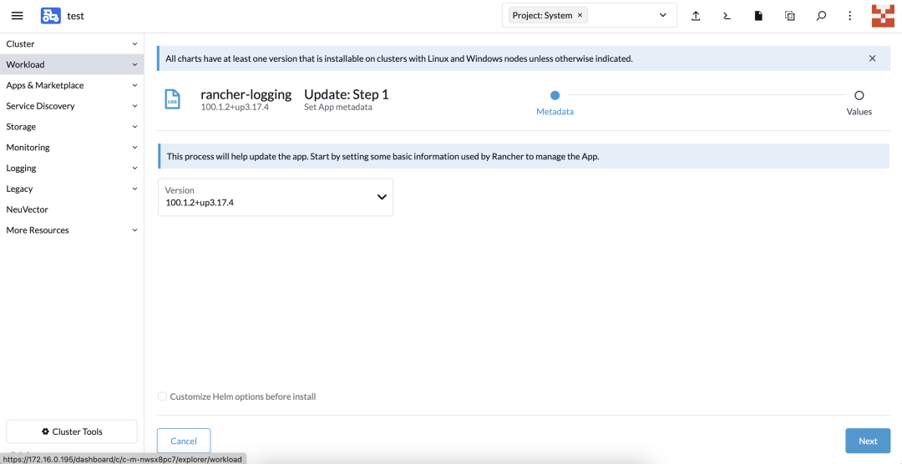
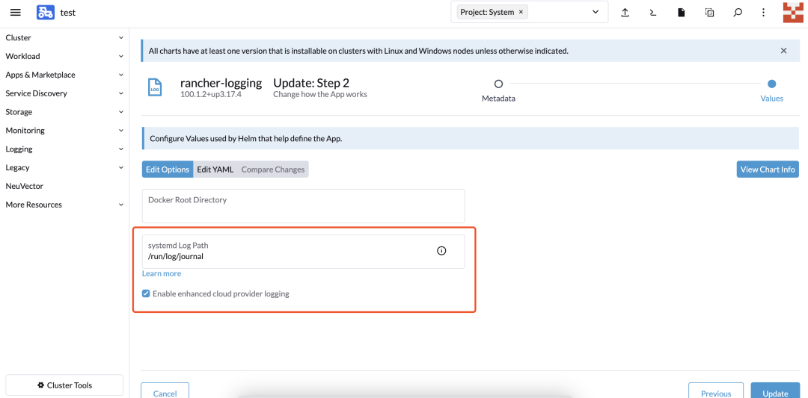
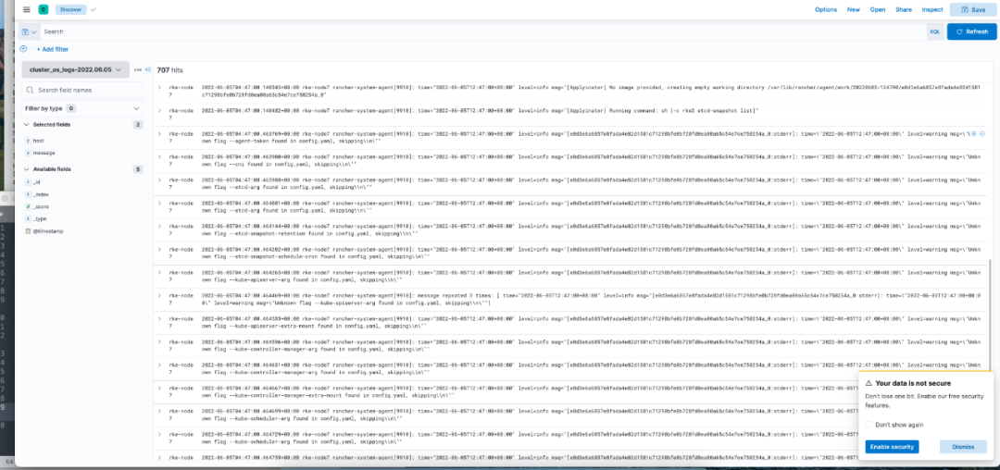

# Rancher 2.6 全新 Logging 快速入門（2）

原文: https://itcn.blog/p/22491197293.html

## 概述

本篇為 [Rancher 2.6 全新 Logging 快速入門](https://mp.weixin.qq.com/s?__biz=MzkyNzM4Nzk1NQ==&mid=2247500852&idx=1&sn=6f993e57a508166cb8d32927742673f4&scene=21#wechat_redirect) 的後續，為實際生產配置使用手冊。主要介紹以下日誌收集配置功能：

- 審計日誌收集
- Kubernetes 組件日誌收集
- 運行在 Kubernetes 上的容器應用日誌收集
- Runtime 日誌收集
- Kubernetes 事件收集和節點
- 節點 Kernel 日誌收集

Rancher 2.6 日誌採用了 logging-operator 方式進行日誌管理，對應概念如下:

- `logging`：用於定義一個日誌採集端 (FleuntBit) 和傳輸端 (Fleuntd) 服務的基礎配置，在 SUSE Rancher 2.6 版本中，已經由 Rancher 自動化部署完成；
- `flow`：用於定義一個 namespaces (命名空間)級別的日誌過濾、解析和路由等規則;
- `clusterflow`：用於定義一個集群級別的日誌過濾、解析和路由等規則;
- `output`：用於定義 namespace (命名空間)級別的日誌的輸出和參數，它只能被同命名空間內的 flow 關聯；
- `clusteroutput`：用於定義集群級別的日誌輸出和參數，它能把被其他命名空間內的 flow 關聯。

## Logging 配置使用

### ElasticSearch 和 kibana 部署

為了更好地演示效果，這裡部署臨時的 ElasticSearch 和 kibana 作為演示環境：

```bash
docker run -d --name elasticsearch  -p 9200:9200 -p 9300:9300 -e "discovery.type=single-node" elasticsearch:7.5.2
docker run --name kibana -e ELASTICSEARCH_HOSTS=http://172.16.1.232:9200 -p 5601:5601 -d kibana:7.5.2
```

!!! info
    注：將 ELASTICSEARCH_HOSTS 地址修改為實際 ElasticSearch 的地址。

部署完後可通過 http://ip:9200 訪問 ElasticSearch，通過 http://ip:5601 訪問 Kibana。

## 启用 Rancher Logging

切換到對應集群，選擇 cluster-Tools ——> Logging，並勾選自定義 Helm 選項：





`systemd Log Path` 存儲的是系統日誌，因為 k3s 和 RKE2 發行版日誌都存儲在此。因此為了收集此日誌，需要進行配置此選項。

要確定目錄位置，可在其中一個節點上運行：

```bash
cat /etc/systemd/journald.conf | grep -E ^\#?Storage | cut -d"=" -f2
```

- 如果返回 `persistent`，則應為: `systemdLogPath/var/log/journal`
- 如果返回 `volatile`，則應為：`systemdLogPath/run/log/journal`
- 如果返回 `auto`，請檢查是否存在 `/var/log/journal`
- 如果存在 `/var/log/journal`，則使用 `/var/log/journal`
- 如果不存在 `/var/log/journal`，則使用 `/run/log/journal`
- SUSE15 默認為 `/run/log/journal`

部署前勾選編輯 yaml，進行以下參數修改：

修改 loggint-Operator 的默認配置，如 fluentd 和 fluentbit 默認資源限制和容忍規則，將 fluentbit 部署到 Controller 節點用於系統日誌收集。

bufferStorageVolume 為 fluentd 收集 fluentbit 的 log buffer 目錄，有分佈式文件系統存儲，建議存儲到分佈式文件系統中，修改 storageClassName 為實際分佈式存儲的 stroageclass 名字。如果沒有對應存儲，可以修改為bufferStorageVolume: {}。

替換以下內容：

```yaml
fluentbit:
  filterKubernetes:
    Merge_Log: ''
    Merge_Log_Key: ''
    Merge_Log_Trim: ''
    Merge_Parser: ''
  inputTail:
    Buffer_Chunk_Size: ''
    Buffer_Max_Size: ''
    Mem_Buf_Limit: ''
    Multiline_Flush: ''
    Skip_Long_Lines: ''
  resources:
    limits:
      cpu: 500mp where you can insert the devi
fluentd:
  bufferStorageVolume:
      pvc:
        spec:
          accessModes:
            - ReadWriteOnce
          resources:
            requests:
              storage: 40Gi
          storageClassName: fast
          volumeMode: Filesystem
  livenessProbe:
    initialDelaySeconds: 30
    periodSeconds: 15
    tcpSocket:
      port: 24240
  nodeSelector: {}
  resources:
    limits:
      cpu: '2'
      memory: 4096M
    requests:
      cpu: 500m
      memory: 100M
  tolerations: {}
  replicas: 3
fullnameOverride: ''
```

!!! warning
    上述的設定必需根據個自　K8S　集群的元件與配置來進行相對的修改。

執行以下命令檢查部署是否成功：

```bash
kubectl get pod -n cattle-logging-system

NAME                                           READY   STATUS      RESTARTS   AGE
rancher-logging-96b68cc4b-vqxnd                1/1     Running     0          9m54s
rancher-logging-fluentbit-cntgb                1/1     Running     0          69s
rancher-logging-fluentbit-hwmdx                1/1     Running     0          71s
rancher-logging-fluentbit-nw7rw                1/1     Running     0          71s
rancher-logging-fluentd-0                      2/2     Running     0          9m34s
rancher-logging-fluentd-1                      2/2     Running     0          9m34s
rancher-logging-fluentd-2                      2/2     Running     0          9m34s
rancher-logging-fluentd-configcheck-ac2d4553   0/1     Completed   0          9m48s
```

### 集群審計日誌開啟和採集

要在集群所有 Controller 節點上創建審計日誌策略，需要在主機創建審計日誌策略文件 `/etc/kubernetes/audit-policy.yaml`，內容如下：

```yaml
apiVersion: audit.k8s.io/v1
kind: Policy
omitStages:
- "RequestReceived"
rules:
- level: Metadata
```

添加集群參數，從 Cluster-Manager 選擇對應的集群 —> `edit Config`，給 Api-server 添加以下參數：

```yaml
kube-apiserver-arg:
    - audit-log-maxsize=100
    - audit-log-maxage=60
    - audit-log-maxbackup=10
    - audit-policy-file=/etc/kubernetes/audit-policy.yaml
```

參數解釋：

- `maxsize`：表示日誌量多大時進行一次輪轉
- `maxage`：表示保留審計日誌多少天
- `maxbackup`：表示保留審計日誌文件多少份
- `policy-file`：定義審計日誌保存策略

添加 apiserver 目錄映射參數：

```yaml
 kube-apiserver-extra-mount:
        - /etc/kubernetes:/etc/kubernetes
```

因為 api-server 是 pod 方式啟動，為了能加載 auditlog-policy，需要將此目錄映射到 api-server pod 中。

完成後，集群會進入自動升級模式。等待升級完成，集群審計日誌將存儲在 `/var/lib/rancher/rke2/server/logs/audit.log` 文件和目錄。

### Kubernetes 組件日誌收集

RKE2 Kubernetes 組件日誌都集中在以下 namespace 中，在啟動 logging 時，配置日誌目錄會自動部署採集器進行採集：

應用以下 Yaml 到集群中：

```yaml
apiVersion: logging.banzaicloud.io/v1beta1
kind: ClusterOutput
metadata:
  name: test-output
  namespace: cattle-logging-system
spec:
  elasticsearch:
    buffer:
      timekey: 1m
      timekey_wait: 30s
      timekey_use_utc: true
    host: 172.16.1.166
    port: 9200
    scheme: http
    reconnect_on_error: true
    reload_on_failure: true
    reload_connections: false
    logstash_format: true
    logstash_prefix: k8s-components
---
apiVersion: logging.banzaicloud.io/v1beta1
kind: ClusterFlow
metadata:
  name: test
  namespace: cattle-logging-system
spec:
  globalOutputRefs:
  - test-output
  match:
  - select:
      namespaces:
        - cattle-monitoring-system
        - cattle-system
        - kube-system
```

- `ClusterOutput` 定義日誌發送到哪，這裡配置的是 ElasticSearch，根據實際情況，修改 ElasticSearch 的地址；
- `Logstash_prefix` 定義的是對應的 ElasticSearch 內的 index 名稱。建議根據對應集群名稱配置；
- `Logstash_prefix` 定義發送到 ES 後對應的 Index 名稱；
- `Logstash_format` 表示開啟 Index 按天自動創建輪轉；
- `ClusterFlow` 用於定義一個集群級別的日誌過濾、解析和路由等規則，在這裡 labels 與對應的採集 pod 的 label 相關連，這裡啟動 Hosttailer 後會自動啟動收集 pod 和集群層級收集關聯；
- `GlobalOutputRefs` 定義的為上面配置的 ClusterOutput 的名稱，表示輸出到什麼地方。

### Kubernetes Application 日誌採集

應用以下 Yaml 到集群中：

```yaml
apiVersion: logging.banzaicloud.io/v1beta1
kind: ClusterOutput
metadata:
  name: k8s-application-output
  namespace: cattle-logging-system
spec:
  elasticsearch:
    buffer:
      timekey: 1m
      timekey_wait: 30s
      timekey_use_utc: true
    host: 172.16.1.166
    port: 9200
    scheme: http
    reconnect_on_error: true
    reload_on_failure: true
    reload_connections: false
    logstash_format: true
    logstash_prefix: k8s-application

---
apiVersion: logging.banzaicloud.io/v1beta1
kind: ClusterFlow
metadata:
  name: test
  namespace: cattle-logging-system
spec:
  globalOutputRefs:
  - k8s-application-output
  match:
  - exclude:
      namespaces:
        - cattle-monitoring-system
        - cattle-system
        - cattle-logging-system
        - kube-system
        - cattle-fleet-system
  - select: {}
```

通過 exclude 將系統組件命名空間排除在外，採集的便是全部應用的標準輸出日誌。

### Runtime 日志采集

應用以下 Yaml 到集群中：

```yaml
apiVersion: logging-extensions.banzaicloud.io/v1alpha1
kind: HostTailer
metadata:
  name: runtimelog-hosttailer
  namespace: cattle-logging-system
spec:
  fileTailers:
    - name: runtime-tail
      path: /var/lib/rancher/rke2/agent/containerd/containerd.log
      buffer_max_size: 64k   #此值一定要修改，不然启动不成功
      disabled: false
      skip_long_lines: "true"
      containerOverrides:
        image: www.wanshaoyuan.com/rancher/mirrored-fluent-fluent-bit:1.8.15
  workloadOverrides:
      tolerations:
      - effect: NoSchedule
        key: cattle.io/os
        operator: Equal
        value: linux
      - operator: Exists
---
apiVersion: logging.banzaicloud.io/v1beta1
kind: ClusterOutput
metadata:
  name: runtimelog-tailer-clusteroutput
  namespace: cattle-logging-system
spec:
  elasticsearch:
    buffer:
      timekey: 1m
      timekey_wait: 30s
      timekey_use_utc: true
    reconnect_on_error: true
    reload_on_failure: true
    reload_connections: false
    host: 172.16.1.166
    port: 9200
    scheme: http
    logstash_format: true
    logstash_prefix: cluster1-runtimelog-tailer


---
apiVersion: logging.banzaicloud.io/v1beta1
kind: Flow
metadata:
  name: runtimetailer-flow
  namespace: cattle-logging-system
spec:
  filters:
  - tag_normaliser: {}
  - parser:
      parse:
        type: none
  match:
  - select:
      labels:
        app.kubernetes.io/instance: runtimelog-hosttailer-host-tailer
  globalOutputRefs:
    - runtimelog-tailer-clusteroutput
```

### 配置審計日誌採集

應用以下 Yaml 到集群中：

```yaml
apiVersion: logging-extensions.banzaicloud.io/v1alpha1
kind: HostTailer
metadata:
  name: auditlog-hosttailer
  namespace: cattle-logging-system
spec:
  fileTailers:
    - name: audit-tail
      path: /var/lib/rancher/rke2/server/logs/audit.log
      buffer_max_size: 64k   #此值一定要修改，不然启动不成功
      disabled: false
      skip_long_lines: "true"
      containerOverrides:
        image: www.wanshaoyuan.com/rancher/mirrored-fluent-fluent-bit:1.8.15
  workloadOverrides:
      tolerations:
      - effect: NoSchedule
        key: cattle.io/os
        operator: Equal
        value: linux
      - operator: Exists
---
apiVersion: logging.banzaicloud.io/v1beta1
kind: ClusterOutput
metadata:
  name: auditlog-tailer-clusteroutput
  namespace: cattle-logging-system
spec:
  elasticsearch:
    buffer:
      timekey: 1m
      timekey_wait: 30s
      timekey_use_utc: true
    reconnect_on_error: true
    reload_on_failure: true
    reload_connections: false
    host: 172.16.1.166
    port: 9200
    scheme: http
    logstash_format: true
    logstash_prefix: cluster1-auditlog-tailer


---
apiVersion: logging.banzaicloud.io/v1beta1
kind: Flow
metadata:
  name: hosttailer-flow
  namespace: cattle-logging-system
spec:
  filters:
  - tag_normaliser: {}
  - parser:
      parse:
        type: json
  match:
  - select:
      labels:
        app.kubernetes.io/instance: auditlog-hosttailer-host-tailer
  globalOutputRefs:
    - auditlog-tailer-clusteroutput
```

- `containerOverrides` 定義的是離線部署的鏡像，默認鏡像地址為 fluent/fluent-bit:1.8.15;
- `HostTailer` 定義採集的文件，並自動部署 fluent-bit 進行掛載映射;
- `ClusterOutput` 定義日誌發送到哪，這裡配置的是 ElasticSearch，根據實際情況，修改 ElasticSearch 的地址，logstash_prefix 定義的是對應的 ElasticSearch 內的 index 名稱。建議根據對應集群名稱配置;
- `Flow` 用於定義一個 namespaces (命名空間)級別的日誌過濾、解析和路由等規則，在這裡 labels 與對應的採集 pod 的 label 相關連，這裡啟動 hosttailer 後會自動啟動收集 pod，它的 label 為app.kubernetes.io/instance: auditlog-hosttailer-host-tailer;
- `globalOutputRefs` 定義的為上面配置的 ClusterOutput 的名稱，表示輸出到什麼地方。

### Event 收集

應用以下 Yaml 到集群中：

```yaml
apiVersion: logging-extensions.banzaicloud.io/v1alpha1
kind: EventTailer
metadata:
  name: rancher
spec:
  controlNamespace: cattle-logging-system
  containerOverrides:
     image: www.wanshaoyuan.com/rancher/eventrouter:v0.1.0
---
apiVersion: logging.banzaicloud.io/v1beta1
kind: ClusterOutput
metadata:
  name: event-tailer-clusteroutput
  namespace: cattle-logging-system
spec:
  elasticsearch:
    buffer:
      timekey: 1m
      timekey_wait: 30s
      timekey_use_utc: true
    reconnect_on_error: true
    reload_on_failure: true
    reload_connections: false
    host: 172.16.1.166
    port: 9200
    scheme: http
    logstash_format: true
    logstash_prefix: kubernetes-event-tailer

---
apiVersion: logging.banzaicloud.io/v1beta1
kind: Flow
metadata:
  name: rancher-event-tailer-flow
  namespace: cattle-logging-system
spec:
  filters:
  - tag_normaliser: {}
  - parser:
      parse:
        type: json
  globalOutputRefs:
  - event-tailer-clusteroutput
  match:
  - select:
      labels:
        app.kubernetes.io/name: event-tailer
```

- `EventTailer`：設置 Event 收集，會啟動一個 rancher-event-tailer statefulset，內網部署需要修改鏡像地址為內網倉庫。默認鏡像地址為banzaicloud/eventrouter:v0.1.0；
- `ClusterOutput`：定義日誌發送到哪，這裡配置的是 ElasticSearch，根據實際情況，修改 ElasticSearch 的地址，logstash_prefix 定義的是對應的 ElasticSearch 內的 index 名稱，建議根據對應集群名稱配置；
- `labels`：關聯的是 rancher-event-tailer 這個 statefulset 的 label。

### 節點 Kernel 日誌收集

應用以下 Yaml 到集群中：

---
apiVersion: logging-extensions.banzaicloud.io/v1alpha1
kind: HostTailer
metadata:
  name: rancher-host-file-tailer
  namespace: cattle-logging-system
spec:
  fileTailers:
    - name: system-messages
      path: /var/log/messages
      buffer_max_size: 64k
      disabled: false
      skip_long_lines: "true"
      containerOverrides:
        image: www.wanshaoyuan.com/rancher/mirrored-fluent-fluent-bit:1.8.15
  workloadOverrides:
      tolerations:
      - effect: NoSchedule
        key: cattle.io/os
        operator: Equal
        value: linux
      - operator: Exists
---
apiVersion: logging.banzaicloud.io/v1beta1
kind: ClusterOutput
metadata:
  name: host-files-clusteroutput
  namespace: cattle-logging-system
spec:
  elasticsearch:
    buffer:
      timekey: 1m
      timekey_wait: 30s
      timekey_use_utc: true
    reconnect_on_error: true
    reload_on_failure: true
    reload_connections: false
    host: 172.16.1.166
    port: 9200
    scheme: http
    logstash_format: true
    logstash_prefix: cluster_os_logs

---
apiVersion: logging.banzaicloud.io/v1beta1
kind: Flow
metadata:
  name: rancher-host-files-flow
  namespace: cattle-logging-system
spec:
  filters:
  - tag_normaliser: {}
  - record_modifier:
      records:
      - host: ${record.dig('kubernetes', 'host')}
      whitelist_keys: host,message
  globalOutputRefs:
  - host-files-clusteroutput
  match:
  - select:
      labels:
        app.kubernetes.io/instance: rancher-host-file-tailer-host-tailer

### 結果檢查

在 ElasticSearch 中檢查是否創建出對應的 index，並且檢查全部 index：

```bash
curl http://172.16.1.166:9200/_cat/indices

yellow open k8s-components-2022.06.02             hg9OQTQEQsKLNwn3Kf_jdA 1 1   85231      0  32.4mb  32.4mb
yellow open cluster_os_logs-2022.06.02            zARda8N1R9OpZRX-cZIS1g 1 1    3666      0 738.9kb 738.9kb
yellow open k8s-application-2022.06.02            x0XxNvmmQQurdWDn4IL2gA 1 1     433      0 232.5kb 232.5kb
yellow open cluster1-auditlog-tailer-2022.06.02   qrAzHadxTeWQXF-E8B1VEQ 1 1 1686458      0 761.2mb 761.2mb
yellow open cluster1-runtimelog-tailer-2022.06.02 0DQp0at8TzOGSt911wnocw 1 1    1545      0 469.2kb 469.2kb
yellow open kubernetes-event-tailer-2022.06.02    L80_wp6iRQy2d0DGmiSxhA 1 1    1169      0   1.1mb   1.1mb
```

在 kibana 中查看 index 中日誌信息：



## 總結

相比於 Rancher 2.6 之前的版本， Logging-operator 的引入大大增強了靈活性和功能性，可以非常靈活地配置各類參數和想收集的日誌信息；但與之對應的是，使用門檻比 2.6 之前版本的有所提高。希望本篇文章可以幫助你加深對 Rancher Logging 的理解。