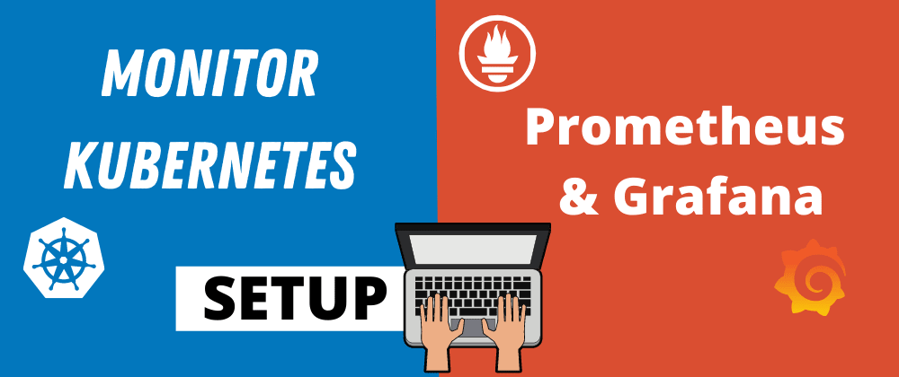
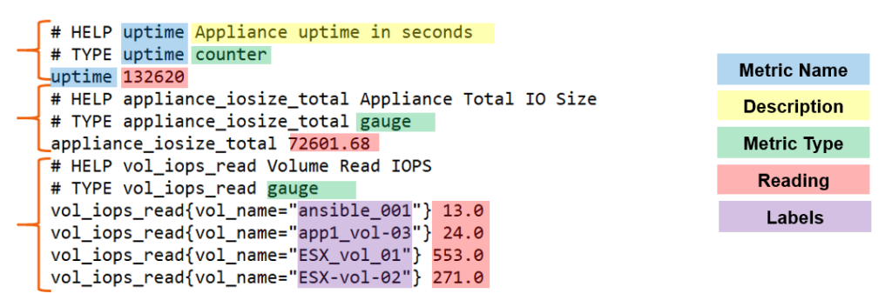
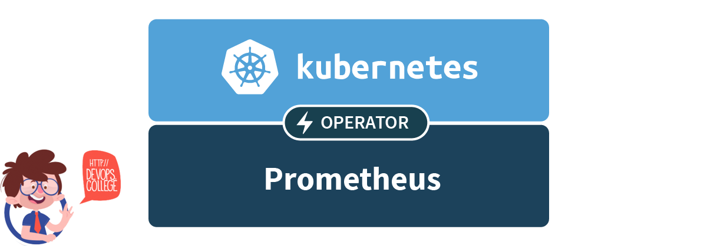
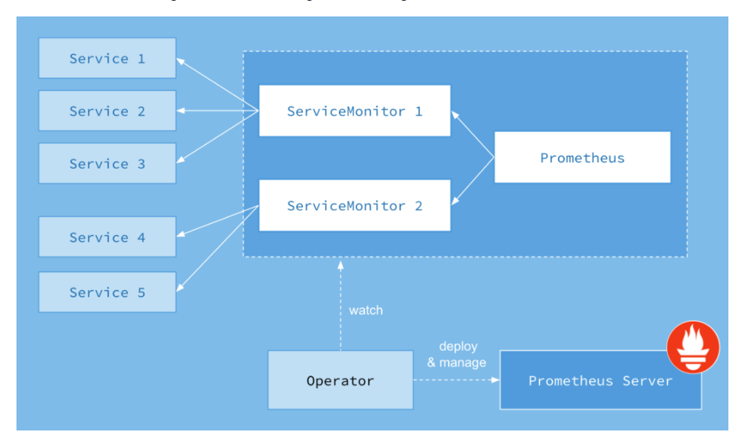
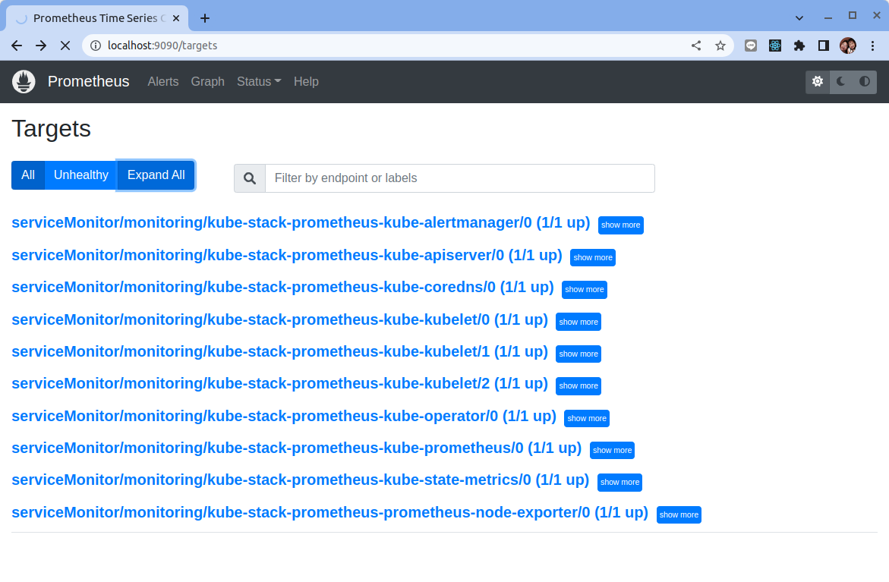
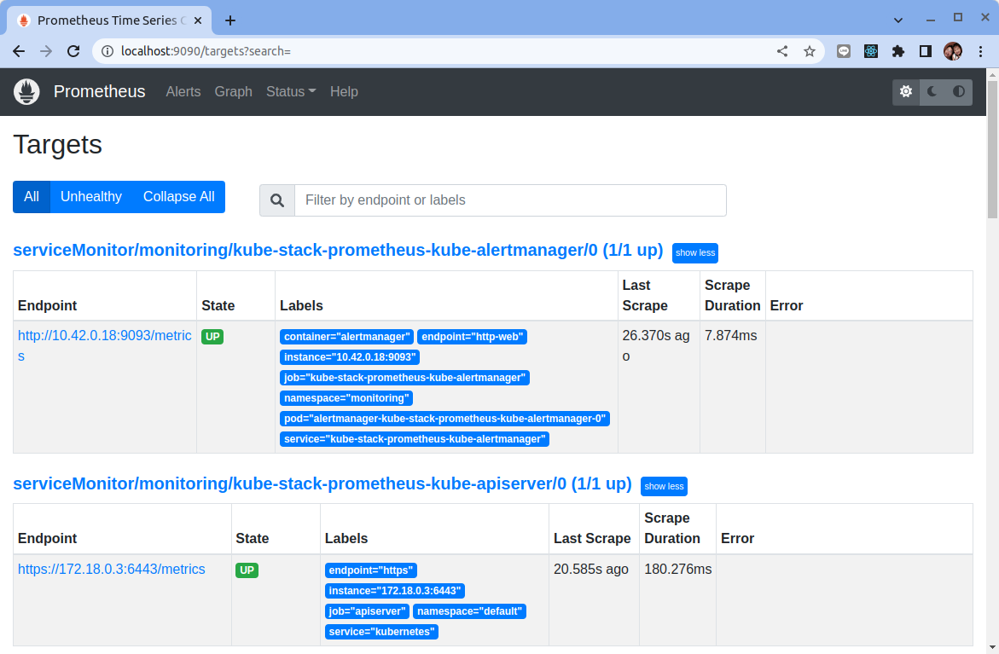
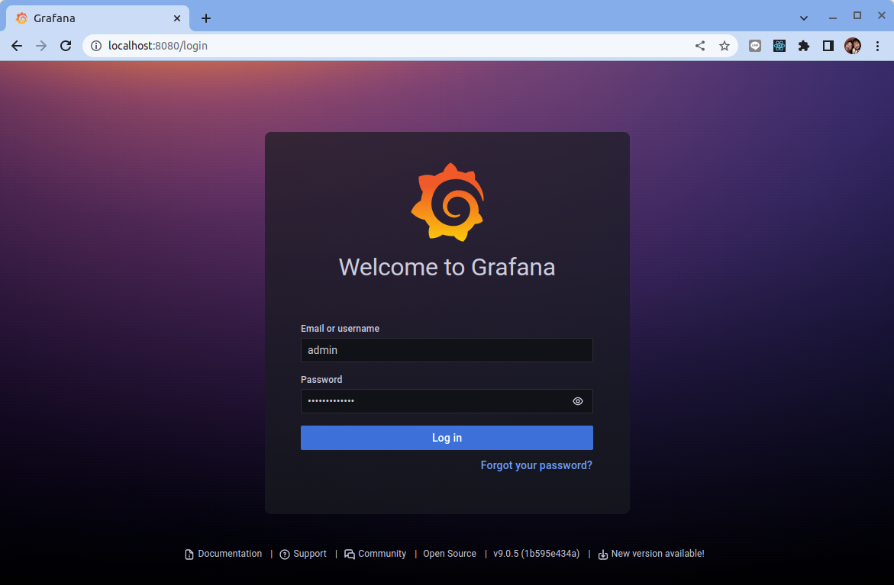
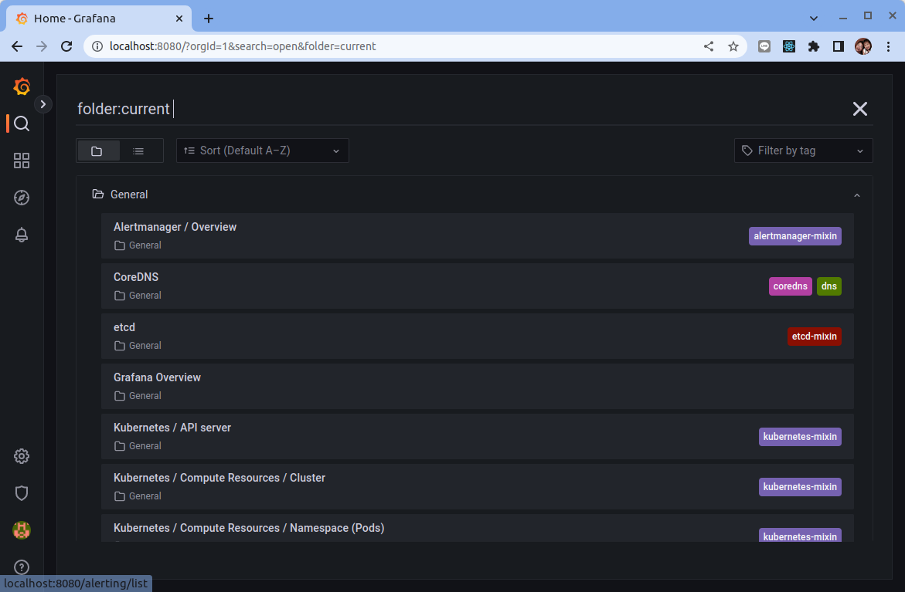
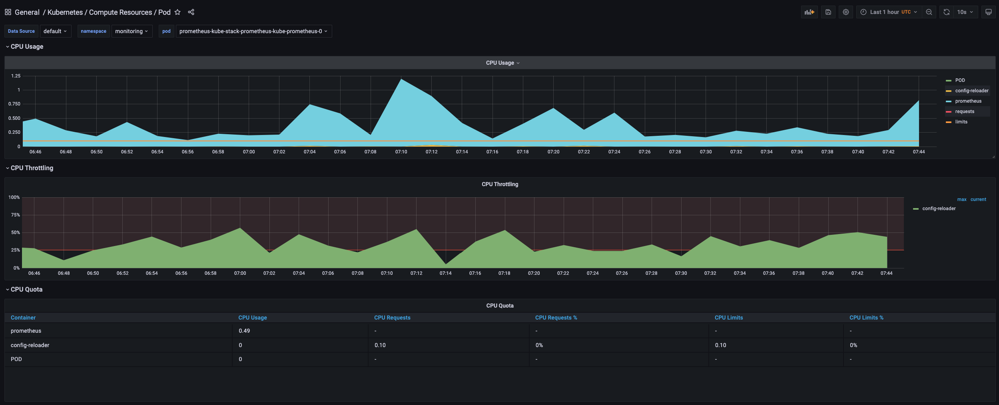

# 如何在 Kubernetes 上設置 Prometheus（Operator）和 Grafana 監控

原文: [How To Setup Prometheus (Operator) and Grafana Monitoring On Kubernetes](https://getbetterdevops.io/setup-prometheus-and-grafana-on-kubernetes/)




監控是 DevOps 最佳實踐的關鍵支柱。這提供了有關平台性能和健康狀況的重要信息。在 Kubernetes 和微服務等分佈式環境中，更是如此。

Kubernetes 的一大優勢是能夠擴展您的服務和應用程序。當您達到數千個應用程序時，手動監控它們或使用腳本是不可行的。您還需要採用可擴展的監控系統！這就是 Prometheus 和 Grafana 出現的地方。

Prometheus 將收集、存儲並允許您利用您的平台指標。另一方面，Grafana 將整合 Prometheus 並允許您創建漂亮的儀表板和圖表。

今天，我們將討論 Prometheus 是什麼以及在 Kubernetes 上部署它的最佳方式：使用 Prometheus Operator。我們將了解如何使用 Prometheus 和 Grafana 設置監控平台。

## Prometheus

Prometheus 是 2012 年在 SoundCloud 構建的用於事件監控和警報的免費開源應用程序。隨後許多公司和組織採用並貢獻了它。 2016 年，雲原生計算基金會（CNCF）在 Kubernetes 之後孵化了 Prometheus 項目。

### 概念

Prometheus 被認為是 Kubernetes 的默認監控解決方案，其靈感來自 Google 的 Borgman。它使用 HTTP 拉取請求從應用程序和基礎架構收集指標。目標是通過服務發現或靜態配置發現的。通過中間網關也支持推送時間序列的指標數據。

Prometheus 的指標具有以下格式：`<metric name>{<label name>=<label value>, ...} <reading_value>`



Prometheus 在時間序列數據庫 (TSDB) 中記錄實時指標——這帶來了維度數據模型、操作簡單性和可擴展的數據收集。它提供了 PromQL，一種靈活的查詢語言來利用這種維度。


架構圖顯示 Prometheus 是一個多組件監控系統。以下部分集成到 Prometheus 部署中：

- **Prometheus server**: 抓取並存儲時間序列數據。它還提供了一個用戶界面來查詢指標。
- **Client libraries**: 幫助應用程式for instrumenting application code.
- **Pushgateway**: 支持從　short-lived jobs　中收集指標
- **Exporters**: 不同服務的指標導出器
- **Alertmanager**: 觸發器處理實時警報

## 為什麼選擇 Prometheus Operator?



Kubernetes 提供了很多對象來部署您的應用程序：Pod、Deployment、Service、Ingress 等……這些是本地資源，因為它們是通用的，它們的行為不像最終的應用程序。 Kubernetes 允許您通過自定義資源定義 `Custom Resource Definition` (CRD) 創建自定義資源。

CRD 對象實現最終應用程序的行為。這允許更好的可維護性並減少部署工作。使用 [Prometheus Operator](https://github.com/prometheus-operator/prometheus-operator) 時，架構的每個組件都來自一個 CRD。這使得 Prometheus 設置比傳統安裝更簡單。

在經典的 Prometheus 安裝中，添加新的指標端點需要更新服務器配置。這允許將新端點註冊為收集指標的目標。 Prometheus Operator 使用 Monitor 對象（PodMonitor、ServiceMonitor）來動態發現端點和抓取指標。

!!! tip
    使用 Prometheus Operator 可以讓您在 Prometheus 安裝和可維護性上節省時間。它為您提供 Monitor 對象來動態收集指標，而無需更新 Prometheus 配置。



[kube-prometheus-stack](https://github.com/prometheus-community/helm-charts/tree/main/charts/kube-prometheus-stack) 是 Kubernetes 清單、Grafana 儀表板和 Prometheus 規則的集合。它通過使用 Operator 的 Prometheus 提供易於操作的端到端 Kubernetes 集群監控。

該集合可通過 Helm chart 來安裝和部署。您可以在單個命令行中部署監控堆棧。

### 創建監控命名空間

在 Kubernetes 中，命名空間提供了一種在單個集群中隔離資源組的機制。我們創建一個名為 monitoring 的命名空間來準備新的部署：

```bash
$ kubectl create namespace monitoring
```

### 使用 Helm 安裝 kube-prometheus-stack

添加 Prometheus 圖表存儲庫並更新本地緩存：

```bash
$ helm repo add prometheus-community https://prometheus-community.github.io/helm-charts
$ helm repo update 
```

使用 Helm 在命名空間監控中部署 kube-stack-prometheus chart：

```bash
$ helm upgrade --install --wait --create-namespace --namespace monitoring  kube-stack-prometheus prometheus-community/kube-prometheus-stack
```

CRD 現在安裝在命名空間中。您可以使用以下 kubectl 命令進行驗證：

```bash
$ kubectl get -n monitoring crds    

NAME                                        CREATED AT
alertmanagerconfigs.monitoring.coreos.com   2022-03-15T10:54:41Z
alertmanagers.monitoring.coreos.com         2022-03-15T10:54:42Z
podmonitors.monitoring.coreos.com           2022-03-15T10:54:42Z
probes.monitoring.coreos.com                2022-03-15T10:54:42Z
prometheuses.monitoring.coreos.com          2022-03-15T10:54:42Z
prometheusrules.monitoring.coreos.com       2022-03-15T10:54:42Z
servicemonitors.monitoring.coreos.com       2022-03-15T10:54:42Z
thanosrulers.monitoring.coreos.com          2022-03-15T10:54:42Z
```

這是我們現在在命名空間中運行的內容：

```bash
$ kubectl get pods -n monitoring            

NAME                                                       READY   STATUS    RESTARTS   AGE
alertmanager-kube-stack-prometheus-kube-alertmanager-0     2/2     Running   0          2m36s
kube-stack-prometheus-grafana-6994bd6c69-h6s9z             3/3     Running   0          13h
kube-stack-prometheus-kube-operator-86667b5cdf-cqndt       1/1     Running   0          13h
kube-stack-prometheus-kube-state-metrics-fc9878699-dpgh6   1/1     Running   0          13h
kube-stack-prometheus-prometheus-node-exporter-vrjsl       1/1     Running   0          13h
prometheus-kube-stack-prometheus-kube-prometheus-0         2/2     Running   0          13h
```

該 Helm chart 安裝了 Prometheus 組件和 Operator、Grafana 以及以下 exporters：

- [prometheus-node-exporter](https://github.com/prometheus/node_exporter) 暴露底層硬件和操作系統的相關指標
- [kube-state-metrics](https://github.com/kubernetes/kube-state-metrics) 監聽 Kubernetes API 服務器並生成有關對象狀態的指標

我們的 Prometheus 和 Grafana 監控堆棧已經準備就緒！

### 連接到 Prometheus Web 界面

Prometheus Web UI 可通過以下命令通過端口轉發訪問：

```bash
$ kubectl port-forward --namespace monitoring svc/kube-stack-prometheus-kube-prometheus 9090:9090 --address="0.0.0.0"
```

在 http://localhost:9090 上打開瀏覽器選項卡會顯示 Prometheus Web UI。我們可以檢索從不同指標 Exporters 所收集回來的指標：


轉到“Status>Targets”，您可以看到 Prometheus 服務器發現的所有指標端點：





### 連接到 Grafana

連接到 Grafana Web 界面的帳密存儲在 Kubernetes Secret 中並以 base64 編碼。我們使用以下兩個命令檢索用戶名/密碼：

```bash
$ kubectl get secret --namespace monitoring kube-stack-prometheus-grafana -o jsonpath='{.data.admin-user}' | base64 -d
$ kubectl get secret --namespace monitoring kube-stack-prometheus-grafana -o jsonpath='{.data.admin-password}' | base64 -d
```

我們使用以下命令創建到 Grafana 的端口轉發：

```bash
$ kubectl port-forward --namespace monitoring svc/kube-stack-prometheus-grafana 8080:80 --address="0.0.0.0"
```

打開瀏覽器並轉到 http://localhost:8080 並填寫前一個命令所取得的用戶名/密碼：



kube-stack-prometheus 在部署時也同時配置了 Grafana 儀表板：



在這裡，我們可以看到其中一個顯示 Kubernetes pod 的計算資源：



