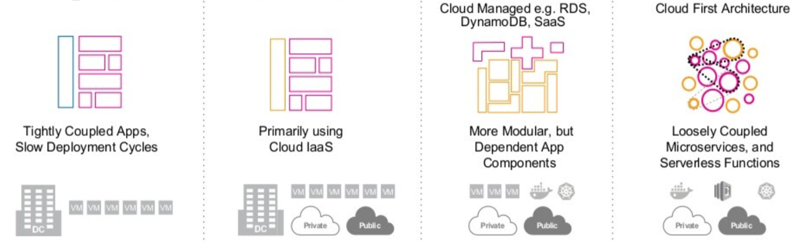
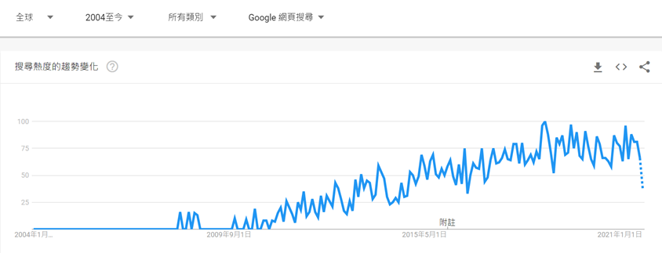
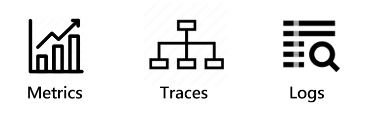

# [OpenTelemetry] 現代化監控使用 OpenTelemetry 實現 : 可觀測性(Observability)

原文: [[OpenTelemetry] 現代化監控使用 OpenTelemetry 實現 : 可觀測性(Observability)](https://marcus116.blogspot.com/2022/01/modern-monitoring-using-openTelemetry-with-Observability.html)

## 前言

最近在 suvery 監控相關議題時接觸到 OpenTelemetry 蒐集遙測數據的開源框架，覺得這議題挺有趣的因此整理變成系列文，這篇是研究 OpenTelemetry 的系列文第一篇， 這系列主要會分為四篇分別是:

- [現代化監控使用 OpenTelemetry 實現 : 可觀測性(Observability)](https://marcus116.blogspot.com/2022/01/modern-monitoring-using-openTelemetry-with-Observability.html)
- [現代化監控使用 OpenTelemetry 實現 : OpenTelemetry 開放遙測](https://marcus116.blogspot.com/2022/01/opentelemetry-opentelemetry.html)
- [現代化監控使用 OpenTelemetry 實現 : 在 .NET 如何使用 OpenTelemetry](https://marcus116.blogspot.com/2022/01/opentelemetry-in-asp-net.html.html)
- 現代化監控使用 OpenTelemetry 實現 : 反思與總結

若對於上述內容有問題或是不清楚的地方，歡迎提出來一起討論

## 企業面臨的挑戰

隨著科技技術不斷的創新，軟體架構與基礎建設演變速度也是變化相當快，如下圖所示可能(但不限)於以下幾個階段

- **第一階段**: 應用程式架構設計上較為簡單，在商業需求沒那麼複雜架構上不會針對其模組做太多的切割，程式會運行執行緒(Process)執行單一的請求，在進行測試與問題排除上較為簡單；在開發完畢之後會佈署在 VM 或是會 IDC 機房中提供給使用者來使用。
- **第二階段**: 隨著雲端技術的推出，企業開始嘗試將應用程式佈署到雲端的 Iaas 服務上，或是結合公有雲與私有雲的優勢，將企業中機密資料在私有雲進行處理，其他資訊在公有雲服務上進行運算，開發人員在應用程式的開發與整合上有更多與 Cloud 服務整合的機會，選擇 Cloud 上適合的服務使用。
- **第三階段**: 雲端技術逐漸成熟與穩定，更多的雲端基礎建設服務與新服務不斷的推出，在架構設計上越來越多人開始討論分散式系統架構的設計，也越來越多人考慮將資料庫從IDC機房遷移到 Cloud 雲端上，加上像是 RDS、DynamoDB、Redis 等雲端資料庫, 這些服務或組件讓大家在雲端開發與管理上更為方便。在架構上也更為彈性搭配著企業需求來使用；在基礎建設上也伴隨著容器化(dockerize)的技術成熟開始進入新的世代。
- **第四階段**: 過去幾年大家一直在討論軟體架構從單體到微服務 serverless、service meshes 等各種可能的組合，主要目的可能是在服務架構設計時如何降低服務之間的依賴關係；在越來越多企業使用虛擬容器技術 Docker 後發現管理 Docker 實務上是困難的，因此 Kubernetes(K8S) 開始盛行，幫助團隊在調度 Docker 上更為容易與靈活，

但與所有美好事物一樣都是有代價的；當服務越切越細時，分佈式系統帶來了眾多的挑戰。當開發的世界變得複雜，可能會帶來哪些影響呢 ? 可能會分為三個部分:

- **架構**: 從單體式架構 > SOA > 分散式架構 > 微服務 開發人員在開發上變得更繁瑣，要注意的事情變得更多。例如 : 服務彼此之間的溝通要如何進行 ? 在事件的紀錄上要如何處理 ? 當一個請求要經過多個服務的時候相對的延遲(Lateny)也會增加，服務的拆分與請求時間的部分該如何達到平衡 ?
- **測試**: 當系統架構變得複雜，測試人員或團隊在測試上勢必需要花更多時間來了解既有架構要如何進行測試。
- **監控**: 上線後的監控會是最大的挑戰，當你所在的產品服務是 7* 24 小時，系統架構切分很細或是很複雜時，當今天某個服務故障時要如何快速定位問題變的是重要的關鍵

## 案例: Facebook 當機事件

或許上面文章提到的部分有點抽象，我們來看一個真實的案例，2021/10/4 facebook、whatApp及 IG 大當機，整個案件根本原因是因為工程師在部署新功能時有錯，導致對外 DNS 服務異常，詳細可以看 [facebook 官方技術部落格](https://engineering.fb.com/2021/10/05/networking-traffic/outage-details/)或 [Cloudfare 的異常事故報告](https://blog.cloudflare.com/october-2021-facebook-outage/?fbclid=IwAR0srcfKHC5izjxKw4t4k7ot5NU2WLb8h_5Q6v-wfoERnhf5UH8asRAyPyc) 說明。

這裡簡單整理事件造成的影響:

- 修復時間 : 從問題開始到最後修復完成近花費 6 小時
- 影響人數 : 八千萬人無法使用
- 損失金額 : 10 億台幣
- 影響股價 : 問題發生後，股票下跌 4.89 %

最重要的可能是客戶滿意度，你可以想像一下今天剛好忙碌一天想滑一下手機看 IG、facebook 或是 whatApp 找朋友聊天時，但發現這些服務都沒有辦法使用心情會是如何 ? 使用者可能會跑去使用其他服務，facebook 官方在服務異常地當下也在 twitter 發文說明問題與處理的狀況，隨著時間一分一秒的過去，客戶逐漸地在流失到其他服務像是 twitter，廣告主投放的廣告也無法正常投放。

從上述問題來看，如何讓問題發生時能夠快速地被定位變得更加重要，在企業服務越切越細的世代，最快時間找到問題變得相當的關鍵。如果今天是發生在你的公司或是負責的系統發生異常時，你要如何快速的定位問題呢 ?

根據 Google 關鍵字報告搜尋 監控(Monitor) 關鍵字，可以發現在過去 20 年的時間大家對於應用程式的監控越來越重視，背後的涵義可能是在這變化這麼快、不確定性這麼高、架構越來越複雜的時代，是否有更好的方法或方式來進行監控，或者也可以反問，或許在雲原生(Cloud Native)時代的監控，應該具備甚麼樣的特性?

## 可觀測性(Observability)

分散式系統意味者分散式故障，當出現故障時，可能很難快速恢復服務，甚至不知道從哪裡開始。您如何解析龐大的依賴關係，取決於你對系統的了解與問題定位有很大的關聯。可觀測性簡單來說可以幫助開發人員或是 SRE 夥伴了解，什麼是慢的 ? 什麼是壞的 ? 以及需要做什麼來提高性能。

可觀測性三個重要的特性:

- **Metrice** 指標: 系統有狀況
- **Logs** 日誌: 問題是甚麼
- **Traces** 鏈路追踪: 哪裡出問題

過去 **監控** 可以解決的是 ==已知的已知== 問題，**可觀測性** 要解決的是 ==已知的未知的== 問題，那麼什麼是 ==已知的未知== 呢 ?

