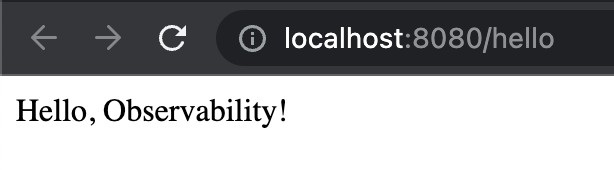
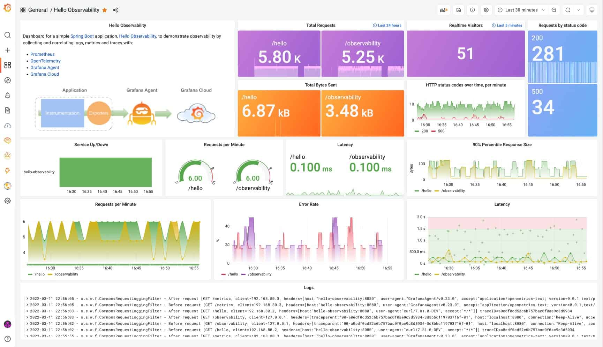

# 使用 GRAFANA 、Prometheus 和 OPENTELEMETRY 設置和觀察 Spring Boot 應用程序

原文: [SET UP AND OBSERVE A SPRING BOOT APPLICATION WITH GRAFANA CLOUD, PROMETHEUS, AND OPENTELEMETRY](https://aster.cloud/2022/07/26/set-up-and-observe-a-spring-boot-application-with-grafana-cloud-prometheus-and-opentelemetry/)

Spring Boot 是一個非常流行的微服務框架，它通過為 Java 開發人員提供一個平台來開始使用可自動配置的生產級 Spring 應用程序，從而顯著簡化了 Web 應用程序的開發。

在本文中，我們將詳細介紹如何觀察 Spring Boot 應用程序，方法是使用 Prometheus 和 OpenTelementry 對其進行檢測，並從 Grafana 中的應用程序收集和關聯日誌、指標和跟踪。

更具體地說，我們將：

1. 使用 OpenTelemetry 檢測一個簡單的 Spring Boot 應用程序 [Hello Observability](https://github.com/adamquan/hello-observability)，並使用 [Grafana Agent](https://grafana.com/docs/grafana-cloud/agent/?pg=blog&plcmt=body-txt) 將 `trace` 數據發送到 Grafana。
2. 自動記錄對應用程序的每個請求，並使用 Grafana Agent 將這些日誌發送到 Grafana。然後將日誌與來自應用程序的跟踪和指標相關聯。
3. 使用 Prometheus 來檢測應用程序，以便我們可以收集指標，並將指標與利用 Grafana exemplars 跟踪相關聯。

非常令人興奮！讓我先介紹一下非常簡單的 Spring Boot 應用程序 Hello Observability。

## Spring Boot 應用程序簡介

Hello Observability 應用程序非常簡單。它主要包含一個 Java 類 HelloObservabilityBootApp，其中包含兩個可以服務 HTTP 請求的方法。


Clone 存儲庫查看代碼，然後構建應用程序和應用程序容器：

```bash
$ git clone https://github.com/adamquan/hello-observability.git 
$ cd hello-observability/hello-observability 
$ ./mvnw package 
$ docker build -t hello-observability .
```

然後，您可以直接運行該應用程序並在此處訪問它：`http://localhost:8080/hello`。非常簡單的應用程序，確實！

```bash
$ java -jar target/*.jar
```



您也可以使用以下命令在 Docker 容器中運行它，並在此處訪問應用程序：`http://localhost:8080/hello`

```bash
$ docker run -d -p 8080:8080 --name hello-observability hello-observability
```

使用以下命令停止 docker 容器：

```bash
docker stop hello-observability
```

到目前為止，我們還沒有進行任何工具來收集日誌、指標和跟踪。為此，您必須使用 `docker-compose` 啟動所有服務。生成和收集日誌、指標和跟踪所需的所有配置均已配置。

現在讓我們在 Docker 中本地運行整個堆棧以查看它的運行情況。整個堆棧包含：

- The Hello Observability application
- A simple load runner
- Prometheus for metrics
- Grafana Loki for logs
- Grafana Tempo for traces
- Grafana Agent to collect logs, metrics, and traces
- Grafana

```bash
cd hello-observability/local 
docker-compose up
```

所有容器都啟動後，您可以在此處訪問應用程序：`http://localhost:8080/hello` 和 Grafana：`http://localhost:3000`。還預加載了一個名為 Hello Observability 的儀表板。



希望這能讓你興奮！在查看儀器詳細信息之前，我們將在接下來快速介紹 Grafana Cloud 和 Grafana Agent。

