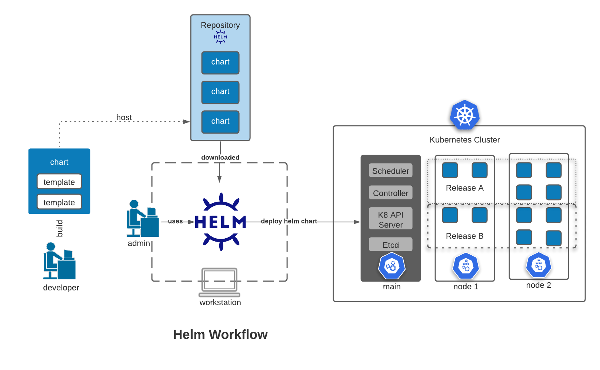
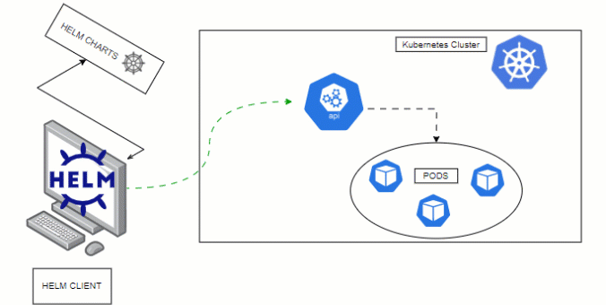
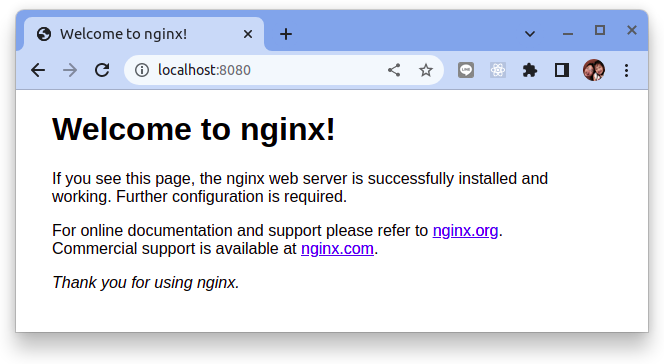

# K8S 應用部署之 helm 初探

原文: https://javamana.com/2022/128/202205081436039676.html



## Kubernetes 應用部署的挑戰

Kubernetes 是一個提供了基於容器的應用叢集管理解決方案，Kubernetes 為容器化應用提供了部署執行、資源排程、服務發現和動態伸縮等一系列完整功能。

Kubernetes 的核心設計理念是: 使用者定義要部署的應用程式的規則，而 Kubernetes 則負責按照定義的規則部署並執行應用程式。如果應用程式出現問題導致偏離了定義的規格，Kubernetes 負責對其進行自動修正。例如：定義的應用規則要求部署兩個例項（Pod），其中一個例項異常終止了，Kubernetes 會檢查到並重新啟動一個新的例項。

使用者通過使用 Kubernetes API 物件來描述應用程式規則，包括 Pod、Service、Volume、Namespace、ReplicaSet、Deployment、Job等等。一般這些資源物件的定義需要寫入一系列的 YAML 檔案中，然後通過 Kubernetes 命令列工具 Kubectl 調 Kubernetes API 進行部署。
 
以一個典型的三層應用 Wordpress 為例，該應用程式就涉及到多個 Kubernetes API 物件，而要描述這些 Kubernetes API 物件就可能要同時維護多個 YAML 檔案。


從上圖可以看到，在進行 Kubernetes 軟體部署時，我們面臨下述幾個問題：

- 如何管理、編輯和更新這些這些分散的 Kubernetes 應用配置檔案。
- 如何把一套相關的配置檔案作為一個應用進行管理。
- 如何分發和重用 Kubernetes 的應用配置。

## 為什麼需要 helm?


由於 Kubernetes 缺少對發布的應用版本管理和控制，使得部署的應用維護和更新等面臨諸多的挑戰，主要面臨以下問題：

- 如何將這些服務作為一個整體管理？
- 這些資源文件如何高效復用？
- 不支持應用級別的版本管理

## helm 介紹

Helm 是一個 Kubernetes 的包管理工具，就像 Linux下 的包管理器，如 yum/apt 等，可以很方便的將之前打包好的 yaml 文件部署到 kubernetes 上。

Helm 有3個重要概念：

- **helm**：一個命令行客戶端工具，主要用於 Kubernetes 應用 chart 的創建、打包、發布和管理。
- **Chart**：應用描述，一系列用於描述 k8s 資源相關文件的集合。
- **Release**：基於 Chart 的部署實體，一個 chart 被 Helm 運行後將會生成對應的一個 release；將在 k8s中 創建出真實運行的資源對象。


## helm 工作流程


## helm 安裝

使用 helm 很簡單，你只需要下載一個二進制客戶端包即可，helm 會通過 kubeconfig 配置（通常 `$HOME/.kube/config`）來連接 Kubernetes。

以下是通過脚本安装 helm 的命令，其他的安裝方式可參考[官網](https://helm.sh/docs/intro/install/)：

```bash
$ curl -fsSL -o get_helm.sh https://raw.githubusercontent.com/helm/helm/main/scripts/get-helm-3
$ chmod 700 get_helm.sh
$ ./get_helm.sh
```

## 使用 helm 管理應用生命週期

接下來我們會使用 helm 來管理一個應用的生命週期：

1. helm create 創建 Chart
2. helm install 部署
3. helm upgrade 更新
4. helm rollback 回滾
5. helm uninstall 卸載



---


### 步驟 1. helm create 創建 Chart

创建一個新的 chart：

```bash
helm create mychart
```

helm 會在現在的目錄下創建一個`mychart`的目錄, 它的結構如下:

```
mychart/
├── charts
├── Chart.yaml
├── templates
│   ├── deployment.yaml
│   ├── _helpers.tpl
│   ├── hpa.yaml
│   ├── ingress.yaml
│   ├── NOTES.txt
│   ├── serviceaccount.yaml
│   ├── service.yaml
│   └── tests
│       └── test-connection.yaml
└── values.yaml
```

- **Chart.yaml**：用於描述這個 Chart 的基本信息，包括名字、描述信息以及 版本等。
- **values.yaml**：用於存儲 templates 目錄中模板文件中用到變量的值。
- **charts**：目錄裡存放這個 chart 依賴的所有子 chart。
- **templates**： 目錄裡面存放所有 yaml 模板文件。
    - NOTES.txt ：用於介紹 Chart 幫助信息， helm install 部署後展示給用戶。例如：如何使用這個 Chart、列出缺省的設置等。
    - helpers.tpl：放置模板的地方，可以在整個 chart 中重複使用。

```yaml title="mychart/Chart.yaml"
apiVersion: v2
name: mychart
description: A Helm chart for Kubernetes
type: application
version: 0.1.
appVersion: "1.16.0"
```

```yaml title="mychart/templates/deployment.yaml"
apiVersion: apps/v1
kind: Deployment
metadata:
  name: {{ include "mychart.fullname" . }}
  labels:
    {{- include "mychart.labels" . | nindent 4 }}
spec:
  {{- if not .Values.autoscaling.enabled }}
  replicas: {{ .Values.replicaCount }}
  {{- end }}
  selector:
    matchLabels:
      {{- include "mychart.selectorLabels" . | nindent 6 }}
  template:
    metadata:
      {{- with .Values.podAnnotations }}
      annotations:
        {{- toYaml . | nindent 8 }}
      {{- end }}
      labels:
        {{- include "mychart.selectorLabels" . | nindent 8 }}
    spec:
      {{- with .Values.imagePullSecrets }}
      imagePullSecrets:
        {{- toYaml . | nindent 8 }}
      {{- end }}
      serviceAccountName: {{ include "mychart.serviceAccountName" . }}
      securityContext:
        {{- toYaml .Values.podSecurityContext | nindent 8 }}
      containers:
        - name: {{ .Chart.Name }}
          securityContext:
            {{- toYaml .Values.securityContext | nindent 12 }}
          image: "{{ .Values.image.repository }}:{{ .Values.image.tag | default .Chart.AppVersion }}"
          imagePullPolicy: {{ .Values.image.pullPolicy }}
          ports:
            - name: http
              containerPort: 80
              protocol: TCP
          livenessProbe:
            httpGet:
              path: /
              port: http
          readinessProbe:
            httpGet:
              path: /
              port: http
          resources:
            {{- toYaml .Values.resources | nindent 12 }}
      {{- with .Values.nodeSelector }}
      nodeSelector:
        {{- toYaml . | nindent 8 }}
      {{- end }}
      {{- with .Values.affinity }}
      affinity:
        {{- toYaml . | nindent 8 }}
      {{- end }}
      {{- with .Values.tolerations }}
      tolerations:
        {{- toYaml . | nindent 8 }}
      {{- end }}
```

```yaml title="mychart/templates/hpa.yaml"
{{- if .Values.autoscaling.enabled }}
apiVersion: autoscaling/v2beta1
kind: HorizontalPodAutoscaler
metadata:
  name: {{ include "mychart.fullname" . }}
  labels:
    {{- include "mychart.labels" . | nindent 4 }}
spec:
  scaleTargetRef:
    apiVersion: apps/v1
    kind: Deployment
    name: {{ include "mychart.fullname" . }}
  minReplicas: {{ .Values.autoscaling.minReplicas }}
  maxReplicas: {{ .Values.autoscaling.maxReplicas }}
  metrics:
    {{- if .Values.autoscaling.targetCPUUtilizationPercentage }}
    - type: Resource
      resource:
        name: cpu
        targetAverageUtilization: {{ .Values.autoscaling.targetCPUUtilizationPercentage }}
    {{- end }}
    {{- if .Values.autoscaling.targetMemoryUtilizationPercentage }}
    - type: Resource
      resource:
        name: memory
        targetAverageUtilization: {{ .Values.autoscaling.targetMemoryUtilizationPercentage }}
    {{- end }}
{{- end }}
```

```yaml title="mychart/templates/ingress.yaml"
{{- if .Values.ingress.enabled -}}
{{- $fullName := include "mychart.fullname" . -}}
{{- $svcPort := .Values.service.port -}}
{{- if and .Values.ingress.className (not (semverCompare ">=1.18-0" .Capabilities.KubeVersion.GitVersion)) }}
  {{- if not (hasKey .Values.ingress.annotations "kubernetes.io/ingress.class") }}
  {{- $_ := set .Values.ingress.annotations "kubernetes.io/ingress.class" .Values.ingress.className}}
  {{- end }}
{{- end }}
{{- if semverCompare ">=1.19-0" .Capabilities.KubeVersion.GitVersion -}}
apiVersion: networking.k8s.io/v1
{{- else if semverCompare ">=1.14-0" .Capabilities.KubeVersion.GitVersion -}}
apiVersion: networking.k8s.io/v1beta1
{{- else -}}
apiVersion: extensions/v1beta1
{{- end }}
kind: Ingress
metadata:
  name: {{ $fullName }}
  labels:
    {{- include "mychart.labels" . | nindent 4 }}
  {{- with .Values.ingress.annotations }}
  annotations:
    {{- toYaml . | nindent 4 }}
  {{- end }}
spec:
  {{- if and .Values.ingress.className (semverCompare ">=1.18-0" .Capabilities.KubeVersion.GitVersion) }}
  ingressClassName: {{ .Values.ingress.className }}
  {{- end }}
  {{- if .Values.ingress.tls }}
  tls:
    {{- range .Values.ingress.tls }}
    - hosts:
        {{- range .hosts }}
        - {{ . | quote }}
        {{- end }}
      secretName: {{ .secretName }}
    {{- end }}
  {{- end }}
  rules:
    {{- range .Values.ingress.hosts }}
    - host: {{ .host | quote }}
      http:
        paths:
          {{- range .paths }}
          - path: {{ .path }}
            {{- if and .pathType (semverCompare ">=1.18-0" $.Capabilities.KubeVersion.GitVersion) }}
            pathType: {{ .pathType }}
            {{- end }}
            backend:
              {{- if semverCompare ">=1.19-0" $.Capabilities.KubeVersion.GitVersion }}
              service:
                name: {{ $fullName }}
                port:
                  number: {{ $svcPort }}
              {{- else }}
              serviceName: {{ $fullName }}
              servicePort: {{ $svcPort }}
              {{- end }}
          {{- end }}
    {{- end }}
{{- end }}
```

```yaml title="mychart/templates/serviceaccount.yaml"
{{- if .Values.serviceAccount.create -}}
apiVersion: v1
kind: ServiceAccount
metadata:
  name: {{ include "mychart.serviceAccountName" . }}
  labels:
    {{- include "mychart.labels" . | nindent 4 }}
  {{- with .Values.serviceAccount.annotations }}
  annotations:
    {{- toYaml . | nindent 4 }}
  {{- end }}
{{- end }}
```

```yaml title="mychart/templates/service.yaml"
apiVersion: v1
kind: Service
metadata:
  name: {{ include "mychart.fullname" . }}
  labels:
    {{- include "mychart.labels" . | nindent 4 }}
spec:
  type: {{ .Values.service.type }}
  ports:
    - port: {{ .Values.service.port }}
      targetPort: http
      protocol: TCP
      name: http
  selector:
    {{- include "mychart.selectorLabels" . | nindent 4 }}
```


```yaml title="mychart/values.yaml"
# Default values for mychart.
# This is a YAML-formatted file.
# Declare variables to be passed into your templates.

replicaCount: 1

image:
  repository: nginx
  pullPolicy: IfNotPresent
  # Overrides the image tag whose default is the chart appVersion.
  tag: ""

imagePullSecrets: []
nameOverride: ""
fullnameOverride: ""

serviceAccount:
  # Specifies whether a service account should be created
  create: true
  # Annotations to add to the service account
  annotations: {}
  # The name of the service account to use.
  # If not set and create is true, a name is generated using the fullname template
  name: ""

podAnnotations: {}

podSecurityContext: {}
  # fsGroup: 2000

securityContext: {}
  # capabilities:
  #   drop:
  #   - ALL
  # readOnlyRootFilesystem: true
  # runAsNonRoot: true
  # runAsUser: 1000

service:
  type: ClusterIP
  port: 80

ingress:
  enabled: false
  className: ""
  annotations: {}
    # kubernetes.io/ingress.class: nginx
    # kubernetes.io/tls-acme: "true"
  hosts:
    - host: chart-example.local
      paths:
        - path: /
          pathType: ImplementationSpecific
  tls: []
  #  - secretName: chart-example-tls
  #    hosts:
  #      - chart-example.local

resources: {}
  # We usually recommend not to specify default resources and to leave this as a conscious
  # choice for the user. This also increases chances charts run on environments with little
  # resources, such as Minikube. If you do want to specify resources, uncomment the following
  # lines, adjust them as necessary, and remove the curly braces after 'resources:'.
  # limits:
  #   cpu: 100m
  #   memory: 128Mi
  # requests:
  #   cpu: 100m
  #   memory: 128Mi

autoscaling:
  enabled: false
  minReplicas: 1
  maxReplicas: 100
  targetCPUUtilizationPercentage: 80
  # targetMemoryUtilizationPercentage: 80

nodeSelector: {}

tolerations: []

affinity: {}
```

### 步驟 2. helm install 部署

進入這個 chart 的目錄:

```bash
cd mychart
```

部署這個 chart:

```bash
helm install web mychart/
```

命令結果如下所示:

```
NAME: web
LAST DEPLOYED: Sat Aug  6 19:33:08 2022
NAMESPACE: default
STATUS: deployed
REVISION: 1
NOTES:
1. Get the application URL by running these commands:
  export POD_NAME=$(kubectl get pods --namespace default -l "app.kubernetes.io/name=mychart,app.kubernetes.io/instance=web" -o jsonpath="{.items[0].metadata.name}")
  export CONTAINER_PORT=$(kubectl get pod --namespace default $POD_NAME -o jsonpath="{.spec.containers[0].ports[0].containerPort}")
  echo "Visit http://127.0.0.1:8080 to use your application"
  kubectl --namespace default port-forward $POD_NAME 8080:$CONTAINER_PORT
```

命令查看可以看到已經部署成功:

```bash
helm list
```

命令結果如下所示:

```
NAME	NAMESPACE	REVISION	UPDATED                                	STATUS  	CHART        	APP VERSION
web 	default  	1       	2022-08-06 19:33:08.884653922 +0800 CST	deployed	mychart-0.1.0	1.16.0
```

檢查 kubernetes 應用被佈署的狀態:

```bash hl_lines="4"
$ kubectl get all

NAME                               READY   STATUS    RESTARTS   AGE
pod/web-mychart-5f94885968-wbwth   1/1     Running   0          4m38s

NAME                  TYPE        CLUSTER-IP      EXTERNAL-IP   PORT(S)   AGE
service/kubernetes    ClusterIP   10.43.0.1       <none>        443/TCP   9h
service/web-mychart   ClusterIP   10.43.244.237   <none>        80/TCP    4m38s

NAME                          READY   UP-TO-DATE   AVAILABLE   AGE
deployment.apps/web-mychart   1/1     1            1           4m38s

NAME                                     DESIRED   CURRENT   READY   AGE
replicaset.apps/web-mychart-5f94885968   1         1         1       4m38s
```

讓我們使用 `kubectl port-forward` 來檢查被佈署的應用:

```
kubectl port-forward service/web-mychart 8080:80 --address='0.0.0.0'
```

端口轉發命令的語法如下。

```bash
kubectl port-forward svc/[service-name] -n [namespace] [external-port]:[internal-port] --address='0.0.0.0'
```



### 步驟 3. helm upgrade 更新

helm 除了支持參數值參數傳遞，還支持動態傳輸，如下:

```bash
helm install web mychart/ --set replicaCount=2
```

由於在 **步驟#1** 我們己經進行了第一次的佈署，下列的命令可查詢佈署歷史:

```bash
$ helm history web
REVISION	UPDATED                 	STATUS  	CHART        	APP VERSION	DESCRIPTION     
1       	Sat Aug  6 19:33:08 2022	deployed	mychart-0.1.0	1.16.0     	Install complete
```

讓我們使用參數傳遞的手法來更新己佈署的應用:

```bash
helm upgrade web mychart/ --set replicaCount=2
```

命令結果如下:

```
Release "web" has been upgraded. Happy Helming!
NAME: web
LAST DEPLOYED: Sat Aug  6 20:11:31 2022
NAMESPACE: default
STATUS: deployed
REVISION: 2
NOTES:
1. Get the application URL by running these commands:
  export POD_NAME=$(kubectl get pods --namespace default -l "app.kubernetes.io/name=mychart,app.kubernetes.io/instance=web" -o jsonpath="{.items[0].metadata.name}")
  export CONTAINER_PORT=$(kubectl get pod --namespace default $POD_NAME -o jsonpath="{.spec.containers[0].ports[0].containerPort}")
  echo "Visit http://127.0.0.1:8080 to use your application"
  kubectl --namespace default port-forward $POD_NAME 8080:$CONTAINER_PORT
```

檢查應用被佈署的狀態:

```bash hl_lines="4 5"
$ kubectl get all

NAME                               READY   STATUS    RESTARTS   AGE
pod/web-mychart-5f94885968-wbwth   1/1     Running   0          40m
pod/web-mychart-5f94885968-x7mpp   1/1     Running   0          112s

NAME                  TYPE        CLUSTER-IP      EXTERNAL-IP   PORT(S)   AGE
service/kubernetes    ClusterIP   10.43.0.1       <none>        443/TCP   10h
service/web-mychart   ClusterIP   10.43.244.237   <none>        80/TCP    40m

NAME                          READY   UP-TO-DATE   AVAILABLE   AGE
deployment.apps/web-mychart   2/2     2            2           40m

NAME                                     DESIRED   CURRENT   READY   AGE
replicaset.apps/web-mychart-5f94885968   2         2         2       40m
```

可發現現在有 **2** Pods 被佈署起來。

### 步驟 4. helm rollback 回滾

現在 `web` 這個 release 己經有了多個版本的佈署記錄了。
```
$ helm history web

REVISION	UPDATED                 	STATUS    	CHART        	APP VERSION	DESCRIPTION     
1       	Sat Aug  6 19:33:08 2022	superseded	mychart-0.1.0	1.16.0     	Install complete
2       	Sat Aug  6 20:11:31 2022	deployed  	mychart-0.1.0	1.16.0     	Upgrade complete
```

要進行版本回滾可使用下列命令:

回滾到上一個版本：

```
helm rollback web
```

回滚到指定版本：

```
helm rollback web 1
```

命令結果如下:

```
Rollback was a success! Happy Helming!
```

### 步驟 5. helm uninstall 卸載

和回滾一樣，helm uninstall 卸載也是 **應用** 等級的，不需要一個服務刪除:

```bash
helm uninstall web
```

命令結果如下:

```
release "web" uninstalled
```

檢查結果:

```
$ helm list
NAME	NAMESPACE	REVISION	UPDATED	STATUS	CHART	APP VERSION

$ kubectl get all
NAME                 TYPE        CLUSTER-IP   EXTERNAL-IP   PORT(S)   AGE
service/kubernetes   ClusterIP   10.43.0.1    <none>        443/TCP   10h
```

## helm 渲染 yaml

有些時候當使用 helm 與 chart 來安裝應用進到 Kubernetes 時，當出現一些問題需要進行除錯的時候，我們會需要取得 helm 最後宣告進 kubernetes 集群時的 manifest (yaml) 檔案。

經由下列的命令可驅動 helm 來渲染出相關的 yaml 檔案:

```bash
helm template web-demo mychart/
```

檢查結果:

```
---
# Source: mychart/templates/serviceaccount.yaml
apiVersion: v1
kind: ServiceAccount
metadata:
  name: web-demo-mychart
  labels:
    helm.sh/chart: mychart-0.1.0
    app.kubernetes.io/name: mychart
    app.kubernetes.io/instance: web-demo
    app.kubernetes.io/version: "1.16.0"
    app.kubernetes.io/managed-by: Helm
---
# Source: mychart/templates/service.yaml
apiVersion: v1
kind: Service
metadata:
  name: web-demo-mychart
  labels:
    helm.sh/chart: mychart-0.1.0
    app.kubernetes.io/name: mychart
    app.kubernetes.io/instance: web-demo
    app.kubernetes.io/version: "1.16.0"
    app.kubernetes.io/managed-by: Helm
spec:
  type: ClusterIP
  ports:
    - port: 80
      targetPort: http
      protocol: TCP
      name: http
  selector:
    app.kubernetes.io/name: mychart
    app.kubernetes.io/instance: web-demo
---
# Source: mychart/templates/deployment.yaml
apiVersion: apps/v1
kind: Deployment
metadata:
  name: web-demo-mychart
  labels:
    helm.sh/chart: mychart-0.1.0
    app.kubernetes.io/name: mychart
    app.kubernetes.io/instance: web-demo
    app.kubernetes.io/version: "1.16.0"
    app.kubernetes.io/managed-by: Helm
spec:
  replicas: 1
  selector:
    matchLabels:
      app.kubernetes.io/name: mychart
      app.kubernetes.io/instance: web-demo
  template:
    metadata:
      labels:
        app.kubernetes.io/name: mychart
        app.kubernetes.io/instance: web-demo
    spec:
      serviceAccountName: web-demo-mychart
      securityContext:
        {}
      containers:
        - name: mychart
          securityContext:
            {}
          image: "nginx:1.16.0"
          imagePullPolicy: IfNotPresent
          ports:
            - name: http
              containerPort: 80
              protocol: TCP
          livenessProbe:
            httpGet:
              path: /
              port: http
          readinessProbe:
            httpGet:
              path: /
              port: http
          resources:
            {}
---
# Source: mychart/templates/tests/test-connection.yaml
apiVersion: v1
kind: Pod
metadata:
  name: "web-demo-mychart-test-connection"
  labels:
    helm.sh/chart: mychart-0.1.0
    app.kubernetes.io/name: mychart
    app.kubernetes.io/instance: web-demo
    app.kubernetes.io/version: "1.16.0"
    app.kubernetes.io/managed-by: Helm
  annotations:
    "helm.sh/hook": test
spec:
  containers:
    - name: wget
      image: busybox
      command: ['wget']
      args: ['web-demo-mychart:80']
  restartPolicy: Never
```
