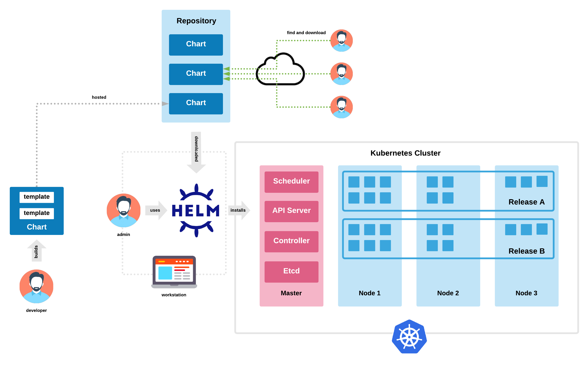
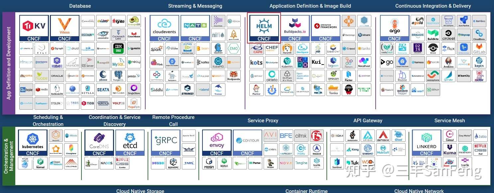
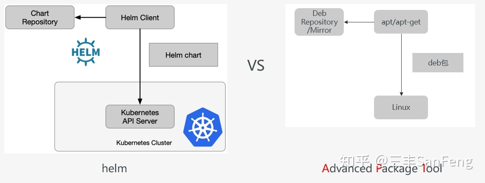
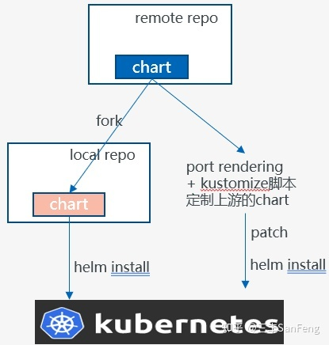
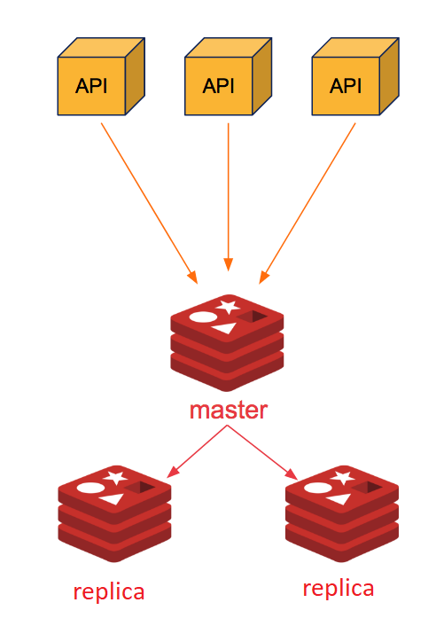
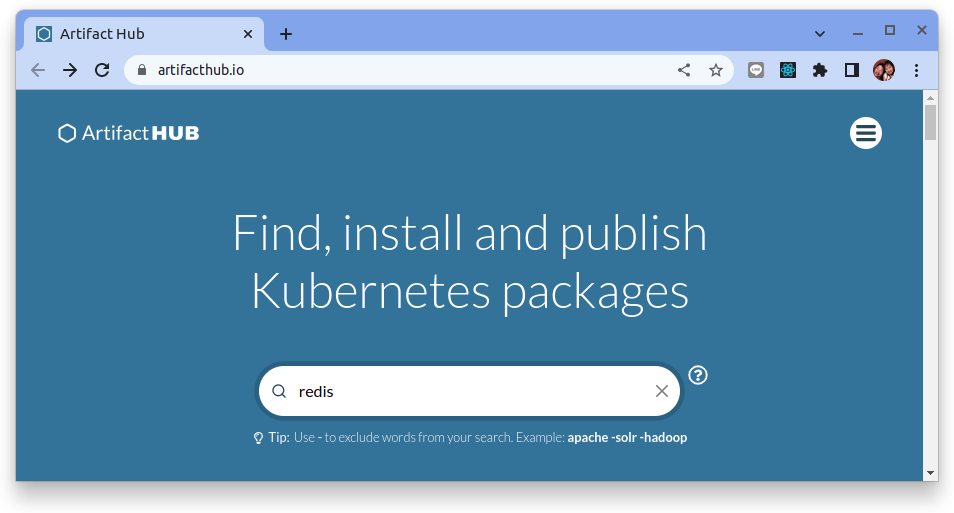
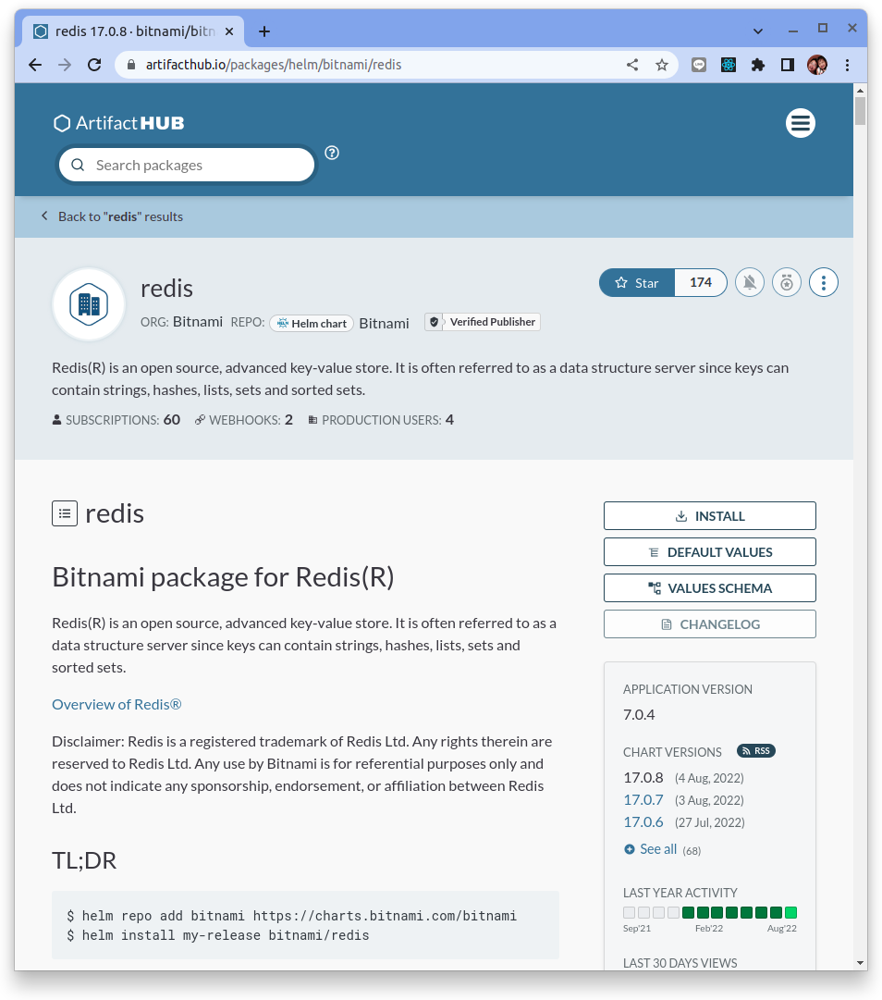

# helm 入門教學

原文: https://zhuanlan.zhihu.com/p/350328164



## 引言

**helm 是 k8s 的包管理工具**，使用 helm，可以使用更為簡化和系統化的方式 **對k8s應用進行部署、升級**。

helm 是 CNCF 已畢業的項目，社群也是相當活躍的，在 https://artifacthub.io/ 上，能找到很多現成的 helm chart，稍作修改就能用到生產環境中，非常方便。

本文會介紹 helm 的核心概念，並用一個例子幫助大家更直觀的認識 helm，大家可以跟著這個例子操作一遍，相信對理解 helm 會有非常大的作用。

教程源碼: [cloud-native-tutorial](https://github.com/zkf1317/cloud-native-tutorial)


## 什麼是 helm

### 初識 helm

helm 在希臘語中的意思是： **舵；駕駛盤**。據說是 helm 創始人 mutt butcher 翻遍了航海手冊找出來的，目的是為了找一個和 kubernetes 主題相匹配的詞語。

官網地址：https://helm.sh/

官方給出的解釋是：**Helm is the best way to find, share, and use software built for Kubernetes**. 意思是 helm 是 kubernetes 中查找、分享、構建應用的最佳方式。

這種說法當然不算誇張，Helm 其實是一個 **Kubernetes 應用的包管理工具**，用來管理 **chart**（一種預先配置好的安裝包資源），有點類似於 Ubuntu 的 **APT** 和 CentOS 中的 **YUM**。因此，helm 的出現解決了 k8s 應用管理能力缺失的問題。

另外 helm 也是 dev 和 ops 的橋樑，運維人員在使用 helm 的時候，一方面不需要理解大量在 chart 中的各種 k8s 元素，只需要配置少量的環境變量即可安裝；另一方面，helm 也給初級運維人員提供了學習的機會，他們可以在 chart 中學習並理解各種 k8s 元素，從而能夠更快的掌握 k8s。

下面列舉了 helm 的一些關鍵信息:

- 2019 年11 月13 日，Helm 3 發布；
- 2020 年04 月30 日，從 CNCF 中畢業；
- 目前 github 上接近有 1.9w 個 Star；
- 最新版本：3.5.0；
- 主要作者：Mutt Butcher，目前在 Microsoft，主要關注 DevOps 領域。



### helm 與 apt 對比

在我們接觸一個新事物的時候，最好的學習方式就是和我們熟悉的事務來做類比，能夠幫助我們快速的掌握其中的核心概念。

由於 Mutt Butcher 在設計 helm 的時候，大量參考了 apt 和 homebrew 的設計，這裡我們用 apt 來做對比，幫助大家更好的理解 helm。



從下表中可以看到，helm 和 apt 之間概念的對比，相信熟悉 apt 的同學能夠很快的對 helm 有一個初步的認識。

| | helm | apt |
|---|---|---|
|安裝包|chart|deb|
|存儲庫|helm repository|apt repository/mirror|
|操作系統|kubernetes|linux distribution|
|包依賴|helm dependency|deb dependency|
|包管理工具|helm client|apt/apt-get/apt-cache/apt-config|

## helm 總覽

對 helm 有了一個初步的印象之後，我們來對 helm 做一個總覽，包括 helm 的的核心概念、運行流程、常用命令、chart 做一個概要性的了解，這樣的話，對我們後續深入 helm 的學習和實踐起一個綱領的作業，避免只見樹木、不見森林。

### helm 三大概念

- **chart**：chart 就是 helm package，包含了一個 k8s app 應用運行起來的所有要素，比如 service, deployment, configmap, serviceaccount, rbac, 等，這些要素都是以template 文件的形式存在，再結合 values 文件，最終渲染出能夠被 k8s 執行的 yaml 文件；

- **repository**：倉庫是 charts 的集合，方便進行分享和分發。下面是官網倉庫的地址，大家可以進去看看，感受一下；
    - https://artifacthub.io/

- **release**：release 是 helm chart 在 kubernetes 的一個運行實例，你可以用不同的 release name 多次安裝同一個 chart，比如：當集群中需要多個 redis 實例，你可以使用不同的配置文件安裝 redis chart。

### helm 運行流程

下面這張圖我建議大家多看幾遍，可以說掌握了這張圖，就掌握了helm的核心。

從下圖可以看到，helm 的核心運行流程分為以下幾步：

- 從 chart 倉庫中獲取 chart
- 使用者配置自己的 values 文件，根據自己的運行環境對 values 進行修改
- 默認 values 文件和使用者 values 文件會進行一個 merge，形成最終的 values 文件
- 使用最終的 values 文件，渲染 chart 的 template，形成可以被 kubernetes 執行的 yaml
- 調用 kube apply 提交 yaml 到 kubernetes

在這裡，需要注意 chart 開發者和使用者的界限，正是由於在跨越這個界限的時候，從需要理解大量的配置到只需要理解少量的配置，使得 operation 的工作變得簡便，這也是 helm 核心的設計哲學。看完整個文章，即使你什麼都沒記住，只記住了這張圖，你也會有很大的收穫了。


---


### helm 常用命令

利用 helm 來安裝應用至 kubernetes 的時候，你可以使用第三方開發的 chart，也可以自己開發 chart，以下是兩種情況下使用的常見命令。更為詳細的命令，可以安裝好 helm 之後，使用`helm help` 來查看，或查看官方文檔。

```
Usage:
  helm [command]

Available Commands:
  completion  generate autocompletion scripts for the specified shell
  create      create a new chart with the given name
  dependency  manage a chart's dependencies
  env         helm client environment information
  get         download extended information of a named release
  help        Help about any command
  history     fetch release history
  install     install a chart
  lint        examine a chart for possible issues
  list        list releases
  package     package a chart directory into a chart archive
  plugin      install, list, or uninstall Helm plugins
  pull        download a chart from a repository and (optionally) unpack it in local directory
  push        push a chart to remote
  registry    login to or logout from a registry
  repo        add, list, remove, update, and index chart repositories
  rollback    roll back a release to a previous revision
  search      search for a keyword in charts
  show        show information of a chart
  status      display the status of the named release
  template    locally render templates
  test        run tests for a release
  uninstall   uninstall a release
  upgrade     upgrade a release
  verify      verify that a chart at the given path has been signed and is valid
  version     print the client version information
```

#### 使用第三方開發的 chart

部署前:

- repo: add, list, remove, update, and index chart repositories
- search: search for a keyword in charts

部署后:

- install: install a chart
- list: list releases
- status: display the status of the named release
- upgrade: upgrade a release
- rollback: roll back a release to a previous revision
- uninstall: uninstall a release

#### 自己開發 chart:

- lint: examine a chart for possible issues
- package: package a chart directory into a chart archive
- push: push helm chart to chartmuseum
- chart push: push helm chart to OCI repository

### chart

chart 可以說是 helm 裡面最重要的概念了，關於 chart 也有很多內容需要掌握，在這裡做一個列舉。

- **chart 開發**：主要是指利用模板技術開發一個 chart，會在後面做詳細介紹；
- **chart hooks**：在 chart 的生命週期中，提供一些 hooks，方便進行一些前置或後置操作
    - 在 chart 安裝前，創建應用需要的 Secret
    - 在 chart 安裝前，備份數據庫
    - 在 chart 卸載後，做一些清理工作
- **chart test**：當你 install 了一個 chart 後，如何知道這個 release 是否運行正常呢？ chart test 提供了一種測試的方式，來驗證你的應用是否正常運行，比如：
    - 校驗 mysql 應用能夠正常連接並接受請求
    - 校驗 services 能夠正常做 load balance
- **library chart**：一種以 library 形式存在的 chart，可以 在application chart 之間進行共享避免重複邏輯；類似於編程語言中的 public library；
- **chart 校驗**：基於 PKI、GnuPG 等技術，對 helm package 進行簽名，保證傳輸或發布過程中的安全性；
- **OCI（Open Container Initiative，容器開放規範）支持**：helm 3引入（EXPERIMENTAL），能夠將 chart 推送到支持 OCI 的倉庫中，比如 harbor, nexus，等，比如，將 chart 保存到 harbor 中：
- **保存 chart**：`helm chart save kubeedge/some-harbor-repo/kubeedge-cloud-chart:1.0.0`
- **登錄 repo**：`helm registry login https://some-harbor-repo`
- **推送 chart**：`helm chart push some-harbor-repo/kubeedge-cloud-chart:1.0.0`
- **高級特性**:
    - post rendering: 提供在 helm install 之前對 manifests 進行操作、配置的一種機制；一般結合 kustomize 使用。比如：
    - 在 install 時插入 sidecar，從而為 deployment 增加功能
    - 不修改原 chart 的情況下，更改 manifests 的配置

這可能不是非常好理解，這裡舉一個例子，假設我需要對一個第三方的 chart 做少量的修改，以滿足我的部署要求，那麼我可以 fork 一份這個 chart，然後在上面做修改，但是這樣我需要一些額外的維護工作，當這個 chart 升級之後，我還需要做 merge 的工作，十分不便。

因此 post rendering 提供了一種機制，你只需要使用 post rendering+kustomize 編寫的一個腳本，就可以在 install 前，對原始 chart 的內容做一些定制化的修改，避免了額外的維護工作。如下圖所示。 （kustomize是一個開源的配置工具，可以方便的對現有的k8s app配置做一些定制化的修改，官網地址：https://kustomize.io/）



## helm 演示

下面我們一起用一個 demo 來對 helm 有一個更為直觀的了解。在這個demo中，我們的目標是部署一個 redis 集群，包括以下幾個步驟：

- 安裝 helm
- 使用 helm install 單節點 redis
- 使用 helm upgrade 升級到 master-replicas
- 使用 helm rollback，回滾到單節點模式




### 步驟1：安裝 helm（通過腳本）

以下是通過脚本安装 helm 的命令，其他的安裝方式可參考[官網](https://helm.sh/docs/intro/install/)：

```bash
$ curl -fsSL -o get_helm.sh https://raw.githubusercontent.com/helm/helm/main/scripts/get-helm-3
$ chmod 700 get_helm.sh
$ ./get_helm.sh
```

### 步驟2：添加倉庫並找到 redis chart

尋找可使用 Helm 來安裝進 Kubernetes 的應用，最好的方式是使用 [ArtifactHUB](https://artifacthub.io/)



在搜索欄中鍵入 `redis` 並從中選擇合適的打包好的應用。在演示中我們使用了 bitnami 打包好的 `redis` 來演示如何使用 helm。

- [bitnami redis](https://artifacthub.io/packages/helm/bitnami/redis)




**1. 添加倉庫**：

```bash
helm repo add bitnami https://charts.bitnami.com/bitnami
```

命令結果如下:

```
"bitnami" has been added to your repositories
```

**2. 查看已經添加的倉庫**

```bash
helm repo list
```

命令結果如下:

```
NAME   	URL                               
bitnami	https://charts.bitnami.com/bitnami
```

**3. 搜索倉庫有哪些 chart**：

```bash
helm search repo bitnami
```

命令結果如下:

```
$ helm search repo bitnami
NAME                                        	CHART VERSION	APP VERSION  	DESCRIPTION                                       
bitnami/airflow                             	13.0.2       	2.3.3        	Apache Airflow is a tool to express and execute...
bitnami/apache                              	9.1.16       	2.4.54       	Apache HTTP Server is an open-source HTTP serve...
bitnami/argo-cd                             	4.0.6        	2.4.8        	Argo CD is a continuous delivery tool for Kuber...
bitnami/argo-workflows                      	2.3.8        	3.3.8        	Argo Workflows is meant to orchestrate Kubernet...
bitnami/aspnet-core                         	3.4.18       	6.0.7        	ASP.NET Core is an open-source framework for we...
bitnami/cassandra                           	9.2.11       	4.0.5        	Apache Cassandra is an open source distributed ...
bitnami/cert-manager                        	0.7.7        	1.9.1        	Cert Manager is a Kubernetes add-on to automate...
bitnami/common                              	1.16.1       	1.16.0       	A Library Helm Chart for grouping common logic ...
...
...
```

**4. 更新倉庫列表到本地**：

```bash
helm repo update
```

命令結果如下:

```
Hang tight while we grab the latest from your chart repositories...
...Successfully got an update from the "bitnami" chart repository
Update Complete. ⎈Happy Helming!⎈
```

**5. 搜索 redis**：

```bash
helm search repo redis
```

命令結果如下:

```
NAME                 	CHART VERSION	APP VERSION	DESCRIPTION                                       
bitnami/redis        	17.0.8       	7.0.4      	Redis(R) is an open source, advanced key-value ...
bitnami/redis-cluster	8.1.3        	7.0.4      	Redis(R) is an open source, scalable, distribut...
```

**6. 查看 redis chart 詳情**：

```bash
helm show chart bitnami/redis
```

命令結果如下:

```
annotations:
  category: Database
apiVersion: v2
appVersion: 7.0.4
dependencies:
- name: common
  repository: https://charts.bitnami.com/bitnami
  tags:
  - bitnami-common
  version: 1.x.x
description: Redis(R) is an open source, advanced key-value store. It is often referred
  to as a data structure server since keys can contain strings, hashes, lists, sets
  and sorted sets.
home: https://github.com/bitnami/charts/tree/master/bitnami/redis
icon: https://bitnami.com/assets/stacks/redis/img/redis-stack-220x234.png
keywords:
- redis
- keyvalue
- database
maintainers:
- name: Bitnami
  url: https://github.com/bitnami/charts
- email: cedric@desaintmartin.fr
  name: desaintmartin
name: redis
sources:
- https://github.com/bitnami/containers/tree/main/bitnami/redis
version: 17.0.8
```

**7. 查看 redis values（values：相當於chart的配置文件）**：

```bash
helm show values bitnami/redis
```

命令結果如下:

```
## @section Global parameters
## Global Docker image parameters
## Please, note that this will override the image parameters, including dependencies, configured to use the global value
## Current available global Docker image parameters: imageRegistry, imagePullSecrets and storageClass
##

## @param global.imageRegistry Global Docker image registry
## @param global.imagePullSecrets Global Docker registry secret names as an array
## @param global.storageClass Global StorageClass for Persistent Volume(s)
## @param global.redis.password Global Redis&reg; password (overrides `auth.password`)
##
global:
  imageRegistry: ""
  ## E.g.
  ## imagePullSecrets:
  ##   - myRegistryKeySecretName
  ##
  imagePullSecrets: []
  storageClass: ""
  redis:
    password: ""

## @section Common parameters
##

## @param kubeVersion Override Kubernetes version
##
kubeVersion: ""
## @param nameOverride String to partially override common.names.fullname
##
nameOverride: ""
...
...
```

### 步骤3：install/upgrade/rollback/uninstall

建立單個 redis master 的配置文件，名為 `only-master.values`:

```yaml title="only-master.values"
## Redis architecture.
architecture: "standalone"

## Redis password (both master and slave)   
auth:
  password: "admin"
```

然后 `--dry-run` 一下，看看生成出来的 yaml 文件是否存在问题：

```bash
helm install redis-demo bitnami/redis -f ./only-master.values --dry-run
```

**如果沒有問題，則進行實際的安裝**:

```bash
helm install redis-demo bitnami/redis -f ./only-master.values
```

檢查安裝結果:

```bash
kubectl get pods
```

命令結果如下:

```
NAME                      READY   STATUS    RESTARTS   AGE
pod/redis-demo-master-0   1/1     Running   0          49s

NAME                          TYPE        CLUSTER-IP     EXTERNAL-IP   PORT(S)    AGE
service/kubernetes            ClusterIP   10.43.0.1      <none>        443/TCP    14m
service/redis-demo-headless   ClusterIP   None           <none>        6379/TCP   49s
service/redis-demo-master     ClusterIP   10.43.44.179   <none>        6379/TCP   49s

NAME                                 READY   AGE
statefulset.apps/redis-demo-master   1/1     49s
```

安裝成功之後，可以登錄 redis 進行操作，做進一步的校驗：

```bash
$ kubectl exec -it pod/redis-demo-master-0 -- /bin/bash

I have no name!@redis-demo-master-0:/$ redis-cli -h localhost -a admin

localhost:6379> set name dxlab
OK

localhost:6379> get name
"dxlab"

localhost:6379> info replication
# Replication
role:master
connected_slaves:0 # 可以看到這時候沒有slave連接
master_failover_state:no-failover
master_replid:0a6c5c20a0b1623802e4df933e5c91e380cb57dc
master_replid2:0000000000000000000000000000000000000000
master_repl_offset:0
second_repl_offset:-1
repl_backlog_active:0
repl_backlog_size:1048576
repl_backlog_first_byte_offset:0
repl_backlog_histlen:0
```

建立 master-replicas 配置文件，名为 `master-replicas.values`:

```yaml title="master-replicas.values"
## Redis architecture.
architecture: "replication"

## Redis password
auth:
  password: "admin"

## Number of Redis replicas to deploy
replica:
  replicaCount: 2
```

`--dry-run`一下，看看生成出來的 yaml 文件是否存在問題；

```bash
helm upgrade redis-demo bitnami/redis -f ./master-replicas.values --dry-run
```

**由於在系統中已經有 redis-demo 的 release，因此使用 upgrade 來進行升級**：

```bash
helm upgrade redis-demo bitnami/redis -f ./master-replicas.values
```

檢查安裝結果:

```bash
kubectl get pods
```

命令結果如下:

```
NAME                        READY   STATUS    RESTARTS   AGE
pod/redis-demo-master-0     1/1     Running   0          20m
pod/redis-demo-replicas-0   1/1     Running   0          20m
pod/redis-demo-replicas-1   0/1     Running   0          21s

NAME                          TYPE        CLUSTER-IP      EXTERNAL-IP   PORT(S)    AGE
service/kubernetes            ClusterIP   10.43.0.1       <none>        443/TCP    37m
service/redis-demo-headless   ClusterIP   None            <none>        6379/TCP   24m
service/redis-demo-master     ClusterIP   10.43.44.179    <none>        6379/TCP   24m
service/redis-demo-replicas   ClusterIP   10.43.204.190   <none>        6379/TCP   20m

NAME                                   READY   AGE
statefulset.apps/redis-demo-master     1/1     24m
statefulset.apps/redis-demo-replicas   1/2     20m
```

檢查從屬 replicas 是否安裝成功，以及是否同步成功：

```bash
$ kubectl exec -it pod/redis-demo-replicas-0 -- /bin/bash

I have no name!@redis-demo-replicas-0:/$ redis-cli -h localhost -a admin

localhost:6379> get name
"dxlab"

localhost:6379> info replication
# Replication
role:slave
master_host:redis-demo-master-0.redis-demo-headless.default.svc.cluster.local
master_port:6379
master_link_status:up
master_last_io_seconds_ago:4
master_sync_in_progress:0
slave_read_repl_offset:1904
slave_repl_offset:1904
slave_priority:100
slave_read_only:1
replica_announced:1
connected_slaves:0
master_failover_state:no-failover
master_replid:4763ace80c07c84f1925cda63252ba01d4efdc7e
master_replid2:0000000000000000000000000000000000000000
master_repl_offset:1904
second_repl_offset:-1
repl_backlog_active:1
repl_backlog_size:1048576
repl_backlog_first_byte_offset:15
repl_backlog_histlen:1890
```

從驗證的結果來看 Redis 的 replicas 的確也取得在之前 master 上設置的鍵值。

**最後，回滾至單主模式**:


查看歷史部署:

```bash
helm history redis-demo
```

命令結果如下:

```
REVISION	UPDATED                 	STATUS    	CHART       	APP VERSION	DESCRIPTION     
1       	Sat Aug  6 11:09:17 2022	superseded	redis-17.0.8	7.0.4      	Install complete
2       	Sat Aug  6 11:17:59 2022	deployed  	redis-17.0.8	7.0.4      	Upgrade complete
```

**回滾到的單master版本 (REVISION = 1)**：

```bash
helm rollback redis-demo 1
```

命令結果如下:

```
Rollback was a success! Happy Helming!
```

檢查回滾結果:

```bash
kubectl get pods
```

命令結果如下:

```
NAME                      READY   STATUS    RESTARTS   AGE
pod/redis-demo-master-0   1/1     Running   0          75s

NAME                          TYPE        CLUSTER-IP    EXTERNAL-IP   PORT(S)    AGE
service/kubernetes            ClusterIP   10.43.0.1     <none>        443/TCP    70m
service/redis-demo-headless   ClusterIP   None          <none>        6379/TCP   12m
service/redis-demo-master     ClusterIP   10.43.66.90   <none>        6379/TCP   12m

NAME                                 READY   AGE
statefulset.apps/redis-demo-master   1/1     12m
```

複本的 Pods 己經都不存在了。

**卸載 redis-demo**:

```bash
helm uninstall redis-demo 
```

命令結果如下:

```
release "redis-demo" uninstalled
```

## helm 渲染 yaml

有些時候當使用 helm 與 chart 來安裝應用進到 Kubernetes 時，當出現一些問題需要進行除錯的時候，我們會需要取得 helm 最後宣告進 kubernetes 集群時的 manifest (yaml) 檔案。

經由下列的命令可驅動 helm 來渲染出相關的 yaml 檔案:

```bash
helm template redis-demo bitnami/redis -f only-master.values
```

```yaml
---
# Source: redis/templates/serviceaccount.yaml
apiVersion: v1
kind: ServiceAccount
automountServiceAccountToken: true
metadata:
  name: redis-demo
  namespace: "default"
  labels:
    app.kubernetes.io/name: redis
    helm.sh/chart: redis-17.0.8
    app.kubernetes.io/instance: redis-demo
    app.kubernetes.io/managed-by: Helm
---
# Source: redis/templates/secret.yaml
apiVersion: v1
kind: Secret
metadata:
  name: redis-demo
  namespace: "default"
  labels:
    app.kubernetes.io/name: redis
    helm.sh/chart: redis-17.0.8
    app.kubernetes.io/instance: redis-demo
    app.kubernetes.io/managed-by: Helm
type: Opaque
data:
  redis-password: "YWRtaW4="
---
# Source: redis/templates/configmap.yaml
apiVersion: v1
kind: ConfigMap
metadata:
  name: redis-demo-configuration
  namespace: "default"
  labels:
    app.kubernetes.io/name: redis
    helm.sh/chart: redis-17.0.8
    app.kubernetes.io/instance: redis-demo
    app.kubernetes.io/managed-by: Helm
data:
  redis.conf: |-
    # User-supplied common configuration:
    # Enable AOF https://redis.io/topics/persistence#append-only-file
    appendonly yes
    # Disable RDB persistence, AOF persistence already enabled.
    save ""
    # End of common configuration
  master.conf: |-
    dir /data
    # User-supplied master configuration:
    rename-command FLUSHDB ""
    rename-command FLUSHALL ""
    # End of master configuration
  replica.conf: |-
    dir /data
    # User-supplied replica configuration:
    rename-command FLUSHDB ""
    rename-command FLUSHALL ""
    # End of replica configuration
---
# Source: redis/templates/health-configmap.yaml
apiVersion: v1
kind: ConfigMap
metadata:
  name: redis-demo-health
  namespace: "default"
  labels:
    app.kubernetes.io/name: redis
    helm.sh/chart: redis-17.0.8
    app.kubernetes.io/instance: redis-demo
    app.kubernetes.io/managed-by: Helm
data:
  ping_readiness_local.sh: |-
    #!/bin/bash

    [[ -f $REDIS_PASSWORD_FILE ]] && export REDIS_PASSWORD="$(< "${REDIS_PASSWORD_FILE}")"
    [[ -n "$REDIS_PASSWORD" ]] && export REDISCLI_AUTH="$REDIS_PASSWORD"
    response=$(
      timeout -s 3 $1 \
      redis-cli \
        -h localhost \
        -p $REDIS_PORT \
        ping
    )
    if [ "$?" -eq "124" ]; then
      echo "Timed out"
      exit 1
    fi
    if [ "$response" != "PONG" ]; then
      echo "$response"
      exit 1
    fi
  ping_liveness_local.sh: |-
    #!/bin/bash

    [[ -f $REDIS_PASSWORD_FILE ]] && export REDIS_PASSWORD="$(< "${REDIS_PASSWORD_FILE}")"
    [[ -n "$REDIS_PASSWORD" ]] && export REDISCLI_AUTH="$REDIS_PASSWORD"
    response=$(
      timeout -s 3 $1 \
      redis-cli \
        -h localhost \
        -p $REDIS_PORT \
        ping
    )
    if [ "$?" -eq "124" ]; then
      echo "Timed out"
      exit 1
    fi
    responseFirstWord=$(echo $response | head -n1 | awk '{print $1;}')
    if [ "$response" != "PONG" ] && [ "$responseFirstWord" != "LOADING" ] && [ "$responseFirstWord" != "MASTERDOWN" ]; then
      echo "$response"
      exit 1
    fi
  ping_readiness_master.sh: |-
    #!/bin/bash

    [[ -f $REDIS_MASTER_PASSWORD_FILE ]] && export REDIS_MASTER_PASSWORD="$(< "${REDIS_MASTER_PASSWORD_FILE}")"
    [[ -n "$REDIS_MASTER_PASSWORD" ]] && export REDISCLI_AUTH="$REDIS_MASTER_PASSWORD"
    response=$(
      timeout -s 3 $1 \
      redis-cli \
        -h $REDIS_MASTER_HOST \
        -p $REDIS_MASTER_PORT_NUMBER \
        ping
    )
    if [ "$?" -eq "124" ]; then
      echo "Timed out"
      exit 1
    fi
    if [ "$response" != "PONG" ]; then
      echo "$response"
      exit 1
    fi
  ping_liveness_master.sh: |-
    #!/bin/bash

    [[ -f $REDIS_MASTER_PASSWORD_FILE ]] && export REDIS_MASTER_PASSWORD="$(< "${REDIS_MASTER_PASSWORD_FILE}")"
    [[ -n "$REDIS_MASTER_PASSWORD" ]] && export REDISCLI_AUTH="$REDIS_MASTER_PASSWORD"
    response=$(
      timeout -s 3 $1 \
      redis-cli \
        -h $REDIS_MASTER_HOST \
        -p $REDIS_MASTER_PORT_NUMBER \
        ping
    )
    if [ "$?" -eq "124" ]; then
      echo "Timed out"
      exit 1
    fi
    responseFirstWord=$(echo $response | head -n1 | awk '{print $1;}')
    if [ "$response" != "PONG" ] && [ "$responseFirstWord" != "LOADING" ]; then
      echo "$response"
      exit 1
    fi
  ping_readiness_local_and_master.sh: |-
    script_dir="$(dirname "$0")"
    exit_status=0
    "$script_dir/ping_readiness_local.sh" $1 || exit_status=$?
    "$script_dir/ping_readiness_master.sh" $1 || exit_status=$?
    exit $exit_status
  ping_liveness_local_and_master.sh: |-
    script_dir="$(dirname "$0")"
    exit_status=0
    "$script_dir/ping_liveness_local.sh" $1 || exit_status=$?
    "$script_dir/ping_liveness_master.sh" $1 || exit_status=$?
    exit $exit_status
---
# Source: redis/templates/scripts-configmap.yaml
apiVersion: v1
kind: ConfigMap
metadata:
  name: redis-demo-scripts
  namespace: "default"
  labels:
    app.kubernetes.io/name: redis
    helm.sh/chart: redis-17.0.8
    app.kubernetes.io/instance: redis-demo
    app.kubernetes.io/managed-by: Helm
data:
  start-master.sh: |
    #!/bin/bash

    [[ -f $REDIS_PASSWORD_FILE ]] && export REDIS_PASSWORD="$(< "${REDIS_PASSWORD_FILE}")"
    if [[ ! -f /opt/bitnami/redis/etc/master.conf ]];then
        cp /opt/bitnami/redis/mounted-etc/master.conf /opt/bitnami/redis/etc/master.conf
    fi
    if [[ ! -f /opt/bitnami/redis/etc/redis.conf ]];then
        cp /opt/bitnami/redis/mounted-etc/redis.conf /opt/bitnami/redis/etc/redis.conf
    fi
    ARGS=("--port" "${REDIS_PORT}")
    ARGS+=("--requirepass" "${REDIS_PASSWORD}")
    ARGS+=("--masterauth" "${REDIS_PASSWORD}")
    ARGS+=("--include" "/opt/bitnami/redis/etc/redis.conf")
    ARGS+=("--include" "/opt/bitnami/redis/etc/master.conf")
    exec redis-server "${ARGS[@]}"
---
# Source: redis/templates/headless-svc.yaml
apiVersion: v1
kind: Service
metadata:
  name: redis-demo-headless
  namespace: "default"
  labels:
    app.kubernetes.io/name: redis
    helm.sh/chart: redis-17.0.8
    app.kubernetes.io/instance: redis-demo
    app.kubernetes.io/managed-by: Helm
  annotations:
    
spec:
  type: ClusterIP
  clusterIP: None
  ports:
    - name: tcp-redis
      port: 6379
      targetPort: redis
  selector:
    app.kubernetes.io/name: redis
    app.kubernetes.io/instance: redis-demo
---
# Source: redis/templates/master/service.yaml
apiVersion: v1
kind: Service
metadata:
  name: redis-demo-master
  namespace: "default"
  labels:
    app.kubernetes.io/name: redis
    helm.sh/chart: redis-17.0.8
    app.kubernetes.io/instance: redis-demo
    app.kubernetes.io/managed-by: Helm
    app.kubernetes.io/component: master
spec:
  type: ClusterIP
  internalTrafficPolicy: Cluster
  sessionAffinity: None
  ports:
    - name: tcp-redis
      port: 6379
      targetPort: redis
      nodePort: null
  selector:
    app.kubernetes.io/name: redis
    app.kubernetes.io/instance: redis-demo
    app.kubernetes.io/component: master
---
# Source: redis/templates/master/application.yaml
apiVersion: apps/v1
kind: StatefulSet
metadata:
  name: redis-demo-master
  namespace: "default"
  labels:
    app.kubernetes.io/name: redis
    helm.sh/chart: redis-17.0.8
    app.kubernetes.io/instance: redis-demo
    app.kubernetes.io/managed-by: Helm
    app.kubernetes.io/component: master
spec:
  replicas: 1
  selector:
    matchLabels:
      app.kubernetes.io/name: redis
      app.kubernetes.io/instance: redis-demo
      app.kubernetes.io/component: master
  serviceName: redis-demo-headless
  updateStrategy:
    rollingUpdate: {}
    type: RollingUpdate
  template:
    metadata:
      labels:
        app.kubernetes.io/name: redis
        helm.sh/chart: redis-17.0.8
        app.kubernetes.io/instance: redis-demo
        app.kubernetes.io/managed-by: Helm
        app.kubernetes.io/component: master
      annotations:
        checksum/configmap: 516392ae01a6fb95f4c434be19c4eb3f37ac9dc3e1f52fb302724b442ad467dd
        checksum/health: 28188307c9d7d0ed6376b91fce553bb4e28c9b5f34487c868556960d8fd64cd9
        checksum/scripts: 74e0abcaeec26e24a8a2f954723f19f50a1cc681886af9b79e262a208799a86f
        checksum/secret: 29f6ccaba3639fc35ad8707bfa8bc41a67dd0975dc1c6504f537142622079260
    spec:
      
      securityContext:
        fsGroup: 1001
      serviceAccountName: redis-demo
      affinity:
        podAffinity:
          
        podAntiAffinity:
          preferredDuringSchedulingIgnoredDuringExecution:
            - podAffinityTerm:
                labelSelector:
                  matchLabels:
                    app.kubernetes.io/name: redis
                    app.kubernetes.io/instance: redis-demo
                    app.kubernetes.io/component: master
                namespaces:
                  - "default"
                topologyKey: kubernetes.io/hostname
              weight: 1
        nodeAffinity:
          
      terminationGracePeriodSeconds: 30
      containers:
        - name: redis
          image: docker.io/bitnami/redis:7.0.4-debian-11-r9
          imagePullPolicy: "IfNotPresent"
          securityContext:
            runAsUser: 1001
          command:
            - /bin/bash
          args:
            - -c
            - /opt/bitnami/scripts/start-scripts/start-master.sh
          env:
            - name: BITNAMI_DEBUG
              value: "false"
            - name: REDIS_REPLICATION_MODE
              value: master
            - name: ALLOW_EMPTY_PASSWORD
              value: "no"
            - name: REDIS_PASSWORD
              valueFrom:
                secretKeyRef:
                  name: redis-demo
                  key: redis-password
            - name: REDIS_TLS_ENABLED
              value: "no"
            - name: REDIS_PORT
              value: "6379"
          ports:
            - name: redis
              containerPort: 6379
          livenessProbe:
            initialDelaySeconds: 20
            periodSeconds: 5
            # One second longer than command timeout should prevent generation of zombie processes.
            timeoutSeconds: 6
            successThreshold: 1
            failureThreshold: 5
            exec:
              command:
                - sh
                - -c
                - /health/ping_liveness_local.sh 5
          readinessProbe:
            initialDelaySeconds: 20
            periodSeconds: 5
            timeoutSeconds: 2
            successThreshold: 1
            failureThreshold: 5
            exec:
              command:
                - sh
                - -c
                - /health/ping_readiness_local.sh 1
          resources:
            limits: {}
            requests: {}
          volumeMounts:
            - name: start-scripts
              mountPath: /opt/bitnami/scripts/start-scripts
            - name: health
              mountPath: /health
            - name: redis-data
              mountPath: /data
              subPath: 
            - name: config
              mountPath: /opt/bitnami/redis/mounted-etc
            - name: redis-tmp-conf
              mountPath: /opt/bitnami/redis/etc/
            - name: tmp
              mountPath: /tmp
      volumes:
        - name: start-scripts
          configMap:
            name: redis-demo-scripts
            defaultMode: 0755
        - name: health
          configMap:
            name: redis-demo-health
            defaultMode: 0755
        - name: config
          configMap:
            name: redis-demo-configuration
        - name: redis-tmp-conf
          emptyDir: {}
        - name: tmp
          emptyDir: {}
  volumeClaimTemplates:
    - metadata:
        name: redis-data
        labels:
          app.kubernetes.io/name: redis
          app.kubernetes.io/instance: redis-demo
          app.kubernetes.io/component: master
      spec:
        accessModes:
          - "ReadWriteOnce"
        resources:
          requests:
            storage: "8Gi"
$ helm template redis-demo bitnami/redis -f only-master.values 
---
# Source: redis/templates/serviceaccount.yaml
apiVersion: v1
kind: ServiceAccount
automountServiceAccountToken: true
metadata:
  name: redis-demo
  namespace: "default"
  labels:
    app.kubernetes.io/name: redis
    helm.sh/chart: redis-17.0.8
    app.kubernetes.io/instance: redis-demo
    app.kubernetes.io/managed-by: Helm
---
# Source: redis/templates/secret.yaml
apiVersion: v1
kind: Secret
metadata:
  name: redis-demo
  namespace: "default"
  labels:
    app.kubernetes.io/name: redis
    helm.sh/chart: redis-17.0.8
    app.kubernetes.io/instance: redis-demo
    app.kubernetes.io/managed-by: Helm
type: Opaque
data:
  redis-password: "YWRtaW4="
---
# Source: redis/templates/configmap.yaml
apiVersion: v1
kind: ConfigMap
metadata:
  name: redis-demo-configuration
  namespace: "default"
  labels:
    app.kubernetes.io/name: redis
    helm.sh/chart: redis-17.0.8
    app.kubernetes.io/instance: redis-demo
    app.kubernetes.io/managed-by: Helm
data:
  redis.conf: |-
    # User-supplied common configuration:
    # Enable AOF https://redis.io/topics/persistence#append-only-file
    appendonly yes
    # Disable RDB persistence, AOF persistence already enabled.
    save ""
    # End of common configuration
  master.conf: |-
    dir /data
    # User-supplied master configuration:
    rename-command FLUSHDB ""
    rename-command FLUSHALL ""
    # End of master configuration
  replica.conf: |-
    dir /data
    # User-supplied replica configuration:
    rename-command FLUSHDB ""
    rename-command FLUSHALL ""
    # End of replica configuration
---
# Source: redis/templates/health-configmap.yaml
apiVersion: v1
kind: ConfigMap
metadata:
  name: redis-demo-health
  namespace: "default"
  labels:
    app.kubernetes.io/name: redis
    helm.sh/chart: redis-17.0.8
    app.kubernetes.io/instance: redis-demo
    app.kubernetes.io/managed-by: Helm
data:
  ping_readiness_local.sh: |-
    #!/bin/bash

    [[ -f $REDIS_PASSWORD_FILE ]] && export REDIS_PASSWORD="$(< "${REDIS_PASSWORD_FILE}")"
    [[ -n "$REDIS_PASSWORD" ]] && export REDISCLI_AUTH="$REDIS_PASSWORD"
    response=$(
      timeout -s 3 $1 \
      redis-cli \
        -h localhost \
        -p $REDIS_PORT \
        ping
    )
    if [ "$?" -eq "124" ]; then
      echo "Timed out"
      exit 1
    fi
    if [ "$response" != "PONG" ]; then
      echo "$response"
      exit 1
    fi
  ping_liveness_local.sh: |-
    #!/bin/bash

    [[ -f $REDIS_PASSWORD_FILE ]] && export REDIS_PASSWORD="$(< "${REDIS_PASSWORD_FILE}")"
    [[ -n "$REDIS_PASSWORD" ]] && export REDISCLI_AUTH="$REDIS_PASSWORD"
    response=$(
      timeout -s 3 $1 \
      redis-cli \
        -h localhost \
        -p $REDIS_PORT \
        ping
    )
    if [ "$?" -eq "124" ]; then
      echo "Timed out"
      exit 1
    fi
    responseFirstWord=$(echo $response | head -n1 | awk '{print $1;}')
    if [ "$response" != "PONG" ] && [ "$responseFirstWord" != "LOADING" ] && [ "$responseFirstWord" != "MASTERDOWN" ]; then
      echo "$response"
      exit 1
    fi
  ping_readiness_master.sh: |-
    #!/bin/bash

    [[ -f $REDIS_MASTER_PASSWORD_FILE ]] && export REDIS_MASTER_PASSWORD="$(< "${REDIS_MASTER_PASSWORD_FILE}")"
    [[ -n "$REDIS_MASTER_PASSWORD" ]] && export REDISCLI_AUTH="$REDIS_MASTER_PASSWORD"
    response=$(
      timeout -s 3 $1 \
      redis-cli \
        -h $REDIS_MASTER_HOST \
        -p $REDIS_MASTER_PORT_NUMBER \
        ping
    )
    if [ "$?" -eq "124" ]; then
      echo "Timed out"
      exit 1
    fi
    if [ "$response" != "PONG" ]; then
      echo "$response"
      exit 1
    fi
  ping_liveness_master.sh: |-
    #!/bin/bash

    [[ -f $REDIS_MASTER_PASSWORD_FILE ]] && export REDIS_MASTER_PASSWORD="$(< "${REDIS_MASTER_PASSWORD_FILE}")"
    [[ -n "$REDIS_MASTER_PASSWORD" ]] && export REDISCLI_AUTH="$REDIS_MASTER_PASSWORD"
    response=$(
      timeout -s 3 $1 \
      redis-cli \
        -h $REDIS_MASTER_HOST \
        -p $REDIS_MASTER_PORT_NUMBER \
        ping
    )
    if [ "$?" -eq "124" ]; then
      echo "Timed out"
      exit 1
    fi
    responseFirstWord=$(echo $response | head -n1 | awk '{print $1;}')
    if [ "$response" != "PONG" ] && [ "$responseFirstWord" != "LOADING" ]; then
      echo "$response"
      exit 1
    fi
  ping_readiness_local_and_master.sh: |-
    script_dir="$(dirname "$0")"
    exit_status=0
    "$script_dir/ping_readiness_local.sh" $1 || exit_status=$?
    "$script_dir/ping_readiness_master.sh" $1 || exit_status=$?
    exit $exit_status
  ping_liveness_local_and_master.sh: |-
    script_dir="$(dirname "$0")"
    exit_status=0
    "$script_dir/ping_liveness_local.sh" $1 || exit_status=$?
    "$script_dir/ping_liveness_master.sh" $1 || exit_status=$?
    exit $exit_status
---
# Source: redis/templates/scripts-configmap.yaml
apiVersion: v1
kind: ConfigMap
metadata:
  name: redis-demo-scripts
  namespace: "default"
  labels:
    app.kubernetes.io/name: redis
    helm.sh/chart: redis-17.0.8
    app.kubernetes.io/instance: redis-demo
    app.kubernetes.io/managed-by: Helm
data:
  start-master.sh: |
    #!/bin/bash

    [[ -f $REDIS_PASSWORD_FILE ]] && export REDIS_PASSWORD="$(< "${REDIS_PASSWORD_FILE}")"
    if [[ ! -f /opt/bitnami/redis/etc/master.conf ]];then
        cp /opt/bitnami/redis/mounted-etc/master.conf /opt/bitnami/redis/etc/master.conf
    fi
    if [[ ! -f /opt/bitnami/redis/etc/redis.conf ]];then
        cp /opt/bitnami/redis/mounted-etc/redis.conf /opt/bitnami/redis/etc/redis.conf
    fi
    ARGS=("--port" "${REDIS_PORT}")
    ARGS+=("--requirepass" "${REDIS_PASSWORD}")
    ARGS+=("--masterauth" "${REDIS_PASSWORD}")
    ARGS+=("--include" "/opt/bitnami/redis/etc/redis.conf")
    ARGS+=("--include" "/opt/bitnami/redis/etc/master.conf")
    exec redis-server "${ARGS[@]}"
---
# Source: redis/templates/headless-svc.yaml
apiVersion: v1
kind: Service
metadata:
  name: redis-demo-headless
  namespace: "default"
  labels:
    app.kubernetes.io/name: redis
    helm.sh/chart: redis-17.0.8
    app.kubernetes.io/instance: redis-demo
    app.kubernetes.io/managed-by: Helm
  annotations:
    
spec:
  type: ClusterIP
  clusterIP: None
  ports:
    - name: tcp-redis
      port: 6379
      targetPort: redis
  selector:
    app.kubernetes.io/name: redis
    app.kubernetes.io/instance: redis-demo
---
# Source: redis/templates/master/service.yaml
apiVersion: v1
kind: Service
metadata:
  name: redis-demo-master
  namespace: "default"
  labels:
    app.kubernetes.io/name: redis
    helm.sh/chart: redis-17.0.8
    app.kubernetes.io/instance: redis-demo
    app.kubernetes.io/managed-by: Helm
    app.kubernetes.io/component: master
spec:
  type: ClusterIP
  internalTrafficPolicy: Cluster
  sessionAffinity: None
  ports:
    - name: tcp-redis
      port: 6379
      targetPort: redis
      nodePort: null
  selector:
    app.kubernetes.io/name: redis
    app.kubernetes.io/instance: redis-demo
    app.kubernetes.io/component: master
---
# Source: redis/templates/master/application.yaml
apiVersion: apps/v1
kind: StatefulSet
metadata:
  name: redis-demo-master
  namespace: "default"
  labels:
    app.kubernetes.io/name: redis
    helm.sh/chart: redis-17.0.8
    app.kubernetes.io/instance: redis-demo
    app.kubernetes.io/managed-by: Helm
    app.kubernetes.io/component: master
spec:
  replicas: 1
  selector:
    matchLabels:
      app.kubernetes.io/name: redis
      app.kubernetes.io/instance: redis-demo
      app.kubernetes.io/component: master
  serviceName: redis-demo-headless
  updateStrategy:
    rollingUpdate: {}
    type: RollingUpdate
  template:
    metadata:
      labels:
        app.kubernetes.io/name: redis
        helm.sh/chart: redis-17.0.8
        app.kubernetes.io/instance: redis-demo
        app.kubernetes.io/managed-by: Helm
        app.kubernetes.io/component: master
      annotations:
        checksum/configmap: 516392ae01a6fb95f4c434be19c4eb3f37ac9dc3e1f52fb302724b442ad467dd
        checksum/health: 28188307c9d7d0ed6376b91fce553bb4e28c9b5f34487c868556960d8fd64cd9
        checksum/scripts: 74e0abcaeec26e24a8a2f954723f19f50a1cc681886af9b79e262a208799a86f
        checksum/secret: 29f6ccaba3639fc35ad8707bfa8bc41a67dd0975dc1c6504f537142622079260
    spec:
      
      securityContext:
        fsGroup: 1001
      serviceAccountName: redis-demo
      affinity:
        podAffinity:
          
        podAntiAffinity:
          preferredDuringSchedulingIgnoredDuringExecution:
            - podAffinityTerm:
                labelSelector:
                  matchLabels:
                    app.kubernetes.io/name: redis
                    app.kubernetes.io/instance: redis-demo
                    app.kubernetes.io/component: master
                namespaces:
                  - "default"
                topologyKey: kubernetes.io/hostname
              weight: 1
        nodeAffinity:
          
      terminationGracePeriodSeconds: 30
      containers:
        - name: redis
          image: docker.io/bitnami/redis:7.0.4-debian-11-r9
          imagePullPolicy: "IfNotPresent"
          securityContext:
            runAsUser: 1001
          command:
            - /bin/bash
          args:
            - -c
            - /opt/bitnami/scripts/start-scripts/start-master.sh
          env:
            - name: BITNAMI_DEBUG
              value: "false"
            - name: REDIS_REPLICATION_MODE
              value: master
            - name: ALLOW_EMPTY_PASSWORD
              value: "no"
            - name: REDIS_PASSWORD
              valueFrom:
                secretKeyRef:
                  name: redis-demo
                  key: redis-password
            - name: REDIS_TLS_ENABLED
              value: "no"
            - name: REDIS_PORT
              value: "6379"
          ports:
            - name: redis
              containerPort: 6379
          livenessProbe:
            initialDelaySeconds: 20
            periodSeconds: 5
            # One second longer than command timeout should prevent generation of zombie processes.
            timeoutSeconds: 6
            successThreshold: 1
            failureThreshold: 5
            exec:
              command:
                - sh
                - -c
                - /health/ping_liveness_local.sh 5
          readinessProbe:
            initialDelaySeconds: 20
            periodSeconds: 5
            timeoutSeconds: 2
            successThreshold: 1
            failureThreshold: 5
            exec:
              command:
                - sh
                - -c
                - /health/ping_readiness_local.sh 1
          resources:
            limits: {}
            requests: {}
          volumeMounts:
            - name: start-scripts
              mountPath: /opt/bitnami/scripts/start-scripts
            - name: health
              mountPath: /health
            - name: redis-data
              mountPath: /data
              subPath: 
            - name: config
              mountPath: /opt/bitnami/redis/mounted-etc
            - name: redis-tmp-conf
              mountPath: /opt/bitnami/redis/etc/
            - name: tmp
              mountPath: /tmp
      volumes:
        - name: start-scripts
          configMap:
            name: redis-demo-scripts
            defaultMode: 0755
        - name: health
          configMap:
            name: redis-demo-health
            defaultMode: 0755
        - name: config
          configMap:
            name: redis-demo-configuration
        - name: redis-tmp-conf
          emptyDir: {}
        - name: tmp
          emptyDir: {}
  volumeClaimTemplates:
    - metadata:
        name: redis-data
        labels:
          app.kubernetes.io/name: redis
          app.kubernetes.io/instance: redis-demo
          app.kubernetes.io/component: master
      spec:
        accessModes:
          - "ReadWriteOnce"
        resources:
          requests:
            storage: "8Gi"
```


