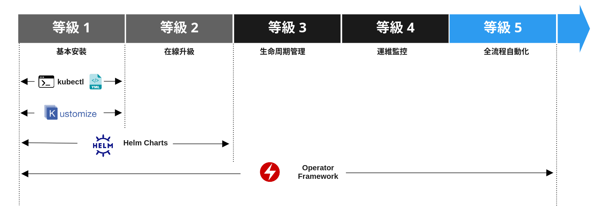
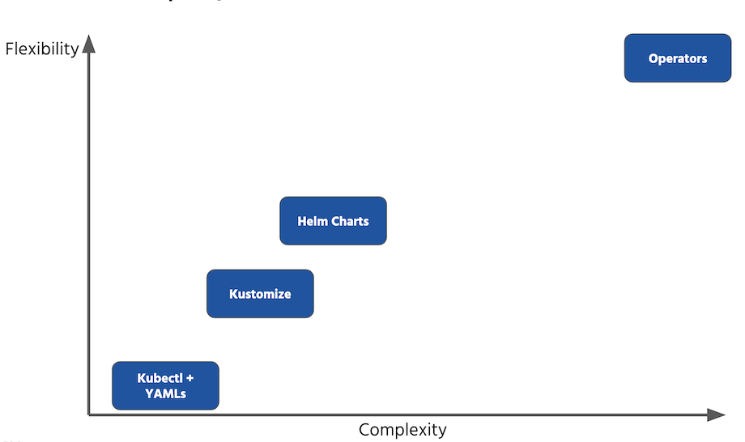

# 管理 Kubernetes 資源的四種方式

原文: [4 ways to manage Kubernetes resources](https://blog.cloudowski.com/articles/4-ways-to-manage-kubernetes-resources/)

雲原生應用日趨複雜，僅僅通過 Kubernetes 對象及 Yaml 很難清晰的描述一個複雜的應用程序，所以誕生 Kustomize, Helm 與 Operator。 

- **Kustomize** 是用於自定義 Kubernetes 配置的工具。
- **Helm** 主要實現是雲原生應用打包和版本管理等。 
- **Operator** 本質是一種調節器模式（Reconciler Pattern）的應用，主要實現雲原生應用管理，尤其是有狀態應用管理，協調應用的實際狀態達到預期狀態。

本文將介紹4種管理 Kubernetes 資源的方法和工具，每一種方法和工具都是為處於 Kubernetes 旅程不同階段的組織準備的。

## Kubectl，新的 ssh

當開始接觸 Linux 系統時，首先要了解的工具是 ssh。這是一個強大的軟件。你不僅可以登錄到你的服務器，複製文件，還可以創建 vpn，進行 SOCKS 代理和端口轉發規則的防火牆，等等。

但是，對於 Kubernetes，可以使用 kubectl，它是新的 ssh。如果你不直接使用 API 調用，那麼你可能會以某種形式使用它，並為它提供大量的 yaml 文件。這就是如今管理 Kubernetes 環境的樣子。

你用 Kubernetes 的資源定義創建了那些漂亮的、冗長的文本文件，然後將應用佈署進 Kubernetes 的集群中。

然而當你想要創建的不是一個而是數十個或數百個具有不同配置的應用的時候，事情就會變得愈來愈複雜。

## 簡單 vs 靈活

對於基本場景，kubectl 加上簡單的 yaml 文件就足夠了。然而，隨著環境的增長，資源和配置的數量也在增長。你可能會開始注意到創建應用程序的新實例、重新配置已經運行的應用程序、與社區或希望根據需要自定義應用程序的客戶共享應用程序所花費的時間更多。

目前，我發現以下是最常用的方法:

- 純 yaml 文件
- [Kustomize](https://kustomize.io/)
- [Helm Charts](https://helm.sh/)
- 自動化 Operator

它們都可以用來管理你在 Kubernetes 裡頭的資源，然而它們在許多方面也有所不同設計與定位。其中一個明顯的因素是複雜性，這也意味著需要花費很多精力來學習、使用和維護一個特定的方法。

另一方面，當你真正想要創建複雜的配置時，從長遠來看，這樣做可能會有好處。你可以在下圖中觀察到這種關係:

所以在 **靈活性** 和 **簡單性** 之間存在權衡。對一些人來說，簡單是可以取勝的，但對另一些人來說，這還遠遠不夠。讓我們仔細看看這四種方法，看看它們在哪些情況下最適合。

### 1、使用純 yaml 文件保持簡單

我總是告訴參加我的課程的人，通過學習 Kubernetes，他們可以成為 yaml程序員。這可能聽起來很傻，但實際上，Kubernetes 的基本用法歸根結底就是用 yaml 編寫一些對象的定義。當然，你必須知道兩件事: 

- 第一件是你想要創建什麼
- 第二件是關於 Kubernetes API 的知識，它是這些 yaml 文件的基礎。

在你學習瞭如何編寫 yaml 文件之後，你可以使用 kubectl 將其發送到 Kubernetes，這樣你的工作就完成了。沒有參數，沒有模板，也不知道如何改變它。如果你想創建應用程序或整個環境的附加實例，只需複制和粘貼即可。

當然，這裡會有一些重複，但這是為了簡單所付出的代價。此外，在一些情況下，這不是什麼大問題，大多數組織可能可以接受這個不完美的解決方案，至少在他們旅途不盡如人意的時候是可以的。

何時使用：

- 對於應用程序或環境的配置/實例少於 4 個的項目
- 對於小型創業公司
- 大公司開始他們的第一個 Kubernetes 項目（例如作為 PoC 的一部分）
- 學習 Kubernetes API 的個人

何時避免：

- 發布針對 Kubernetes 環境的產品或服務的組織和項目
- 在項目中，每個實例都有很大的差異，需要大量的調整

### 2、使用 Kustomize

Kustomize 是 Kubernetes 官方團體之一的一個項目。它定義了基於繼承的 Kubernetes 資源的概念，yaml 文件，沒錯——你逃不掉的。但是，這一次，使用 Kustomize，你可以對已經存在的資源集應用任何你想要的更改。

簡單地說，Kustomize 可以看作是一個 Kubernetes 特有的補丁工具。它讓你覆蓋所有部分的 yaml 文件與其他功能，包括以下：

- 更改容器鏡像的存儲庫、名稱和標記
- 直接從文件生成 ConfigMap 對象，並生成散列，確保部署在發生更改時觸發新的 rollout
- 使用 kustomize cli 動態修改配置（在 CI/CD 管道中非常有用）

從 1.14 版開始，它就內置在 kubectl 二進製文件中，這使它很容易開始。不幸的是，在獨立的 kustomize 項目中添加新特性的速度要快得多，而且它的發布週期與 kubectl 二進製文件的官方版本不同步。因此，我強烈建議使用它的獨立版本，而不是 kubectl 的內置功能。

根據其創建者的說法，它鼓勵你直接使用 Kubernetes API，而無需創建另一個人工抽象層。

何時使用：

- 對於不需要太多參數的少於 10 個配置/實例的項目
- 對於開始成長但仍在內部使用 Kubernetes 的初創公司（即不需要將清單作為其產品的一部分）
- 對於任何知道 Kubernetes API 的人來說，都可以直接使用它

何時避免：
- 如果你的環境或實例最多變化 30-50%，因為你只需通過添加補丁來重寫大部分清單
- 與普通 yamls 的情況相同

### 3、進階，強大的 Helm Charts

如果你還沒有見過 [Artifiact Hub](https://artifacthub.io/)，那麼我建議你去看看，並尋找你最喜歡的軟件，特別是如果它是一個流行的開源項目，我非常確定它在那裡。隨著 Helm 3 的發佈，它的大部分缺陷都得到了修復。實際上，最大的組件是不再需要的 Tiller 組件，這使其成為你部署的絕佳工具。因為它的模板系統太簡單了（我盡量避免使用“糟糕”這個詞，但它確實很簡單）。

大多數已經開始使用 Helm 部署服務的人常常開始為應用程序編寫自己的 chart，以及在 Kubernetes 上部署的幾乎所有東西。對於非常複雜的配置來說，這可能是一個好主意，但是在大多數情況下，這是多餘的。如果你沒有將Chart發佈到某個 Reistry Repository，而只是使用它們的模板特性，那麼使用 Kustomize 可能會更好的選擇。

然而，對於高級場景，Helm 是正確的選擇。它可以是你用來發布應用程序以供其他團隊將其部署到其環境中的單一工具。你的客戶也可以使用一個簡單的命令來部署你的應用程序的一個新版本。

- 以能夠處理所有這些情況和配置變量的方式編寫 Chart 模板
- 使用 CI/CD 管道、測試和發布來創建和維護整個發布過程

[Artifiact Hub](https://artifacthub.io/) 上的許多示例顯示如何將復雜的軟件打包到一個 Chart 中，從而使安裝過程變得非常簡單，並使定制變得更容易訪問，特別是對於不想深入了解太多細節的最終用戶。我自己也使用許多 Helm Charts 來安裝軟件，並將其視為 Kubernetes 生態系統中最重要的項目之一。

何時使用：

- 對於擁有超過 10 個配置/實例的大型項目，這些配置/實例有許多變量和參數
- 用於在 Internet 上發布以使其易於安裝的項目

何時避免：

- 如果你的應用程序不是那麼複雜，並且你不需要在任何地方發布它們
- 如果你不打算為發布過程維護 CI/CD，因為維護沒有管道的 Chart 是非常耗時的
- 如果你對 Kubernetes API 還沒有深入的了解

### 4、自動化機器人（Operator）為你服務

最後一個，最複雜的，也是最強大的。實際上，這是 CoreOS（現在的Red Hat）提出的一種設計模式，它只是利用 Kubernetes 的一些特性，比如自定義資源定義和內嵌在直接運行在 Kubernetes 上的軟件中的自定義邏輯，並利用其稱為 controller的 內部API。

它在 OpenShift 生態系統中得到了廣泛的應用，並且自從 OpenShift 4 發布以來，紅帽公司一直在推廣它，認為它是在 OpenShift 上創建服務的最佳方式。他們甚至提供了一個定制OpenShift web 界面的操作符。這就是我所說的抽象層！這裡的一切都由幾十個自定義操作符處理 yaml 來控制，因為整個邏輯都嵌入在這裡。

簡單地說，什麼是 Operator，我想說 Operator 是一個等價的雲服務，如亞馬遜 RDS，GCP 雲發布/訂閱或 Azure Cosmos 數據庫。你可以構建一個操作符來提供一種一致的、簡單的方法來安裝和維護（包括升級）你的應用程序，在任何 Kubernetes 平台上都可以使用其本機 API 以“即服務”的方式安裝和維護應用程序。

它不僅提供了最高級別的自動化，而且還允許包括複雜的邏輯，如內置監視、無縫升級、自修復和自動標度。同樣，你需要做的只是提供一個 yaml 格式的定義，其餘的將由操作符處理。

“它看起來太棒了！" 有人會說。許多人認為它應該而且將是交付應用程序的首選方式。我不同意這種說法。我認為，如果你是一個軟件供應商，為數百個客戶（甚至是內部客戶）提供你的應用程序，這就是該走的路。否則，編寫 Operator 可能過於復雜和耗時。特別是如果你想要遵循最佳實踐，使用 Golang 並提供一個簡單的升級路徑（它可能會變得棘手）。

我發現以下項目對 Operator 的開發和維護非常有幫助：

- [kubebuilder](https://github.com/kubernetes-sigs/kubebuilder)：第一個面向 Go 開發者的操作框架，最強大、最複雜的一個
- [kopf](https://github.com/zalando-incubator/kopf)：用於在 Python KUDO 中開發操作符的 kopf 框架——以聲明的方式編寫 Operator
- [operator-sdk](https://github.com/operator-framework/operator-sdk)：來自 CoreOS Red Hat 的框架，用於在 Go 和 Ansible 中編寫操作符
- [operator-lifecycle](https://github.com/operator-framework/operator-lifecycle-manager)：對於任何有興趣認真對待 Operator 及其 lifrecycle（安裝、維護、升級）的人來說，這是必須的。

何時使用：

- 如果你需要在 Kubernetes 上創建自己的服務（例如，你的產品即服務）
- 如果你計劃為你的服務添加額外的功能（例如監視、自動縮放、自動癒合、分析）
- 如果你是為 Kubernetes 平台提供軟件的軟件供應商
- 如果你想開發安裝在 OpenShift 上的軟件，並成為 OpenShift 生態系統的一部分（例如，在他們的“應用市場”上發布你的軟件——operatorhu.io）

何時避免：
- 對於簡單的應用程序
- 對於其他應用時，舵輪圖用一些半複雜的模板就可以了
- 當不需要額外的自動化時，或者可以通過現有組件的簡單配置來實現

## 總結

我所描述的每一種方法和工具都是為處於 Kubernetes 旅程不同階段的組織準備的。對於標準用例，簡單的 yamls 可能就足夠了，隨著更多的應用，Kustomize 可以極大地增強這種方法。

當事情變得嚴重和應用程序變得更複雜時，Helm Chart 在復雜性和靈活性之間提供了一個完美的平衡。對於在 Kubernetes 中以類似於雲服務的方式交付應用程序的供應商，以及那些計劃使用OpenShift 為企業客戶提供應用程序的供應商，我可以推薦 Operator。

