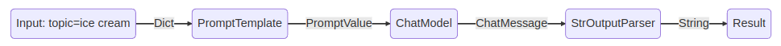
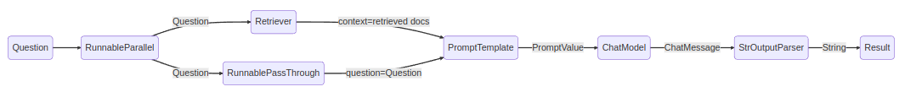

# 開始使用

LCEL 可以輕鬆地從基本元件建立複雜的鏈，並支援開箱即用的功能，例如串流、平行性和日誌記錄。

## Basic example: prompt + model + output parser

最基本和常見的用例是將提示模板和模型連結在一起。為了看看這是如何運作的，讓我們創建一個接受主題並產生笑話的鏈：

```python
from langchain_core.output_parsers import StrOutputParser
from langchain_core.prompts import ChatPromptTemplate
from langchain_openai import ChatOpenAI

# 構建 prompt
prompt = ChatPromptTemplate.from_template("tell me a short joke about {topic}")

# 構建 llm 模型實例
model = ChatOpenAI(model="gpt-4")

# 構建輸出解析器
output_parser = StrOutputParser()

# 組合不同元件成為 chain
chain = prompt | model | output_parser

# 執行 chain
chain.invoke({"topic": "ice cream"})
```

結果:

```bash
Why don't ice creams ever get invited to parties?\n\nBecause they always drip when things heat up!
```

請注意這行程式碼，我們使用 LCEL 將不同的元件拼湊成一個鏈：

```python
chain = prompt | model | output_parser
```

`|` 符號類似於 Unix 管道運算符，它將不同的組件連結在一起，{==將一個組件的輸出作為下一個組件的輸入==}。

在此鏈中，使用者輸入傳遞到 prompt，然後 prompt 輸出傳遞到 model，然後 model 輸出傳遞到 output_parser。讓我們分別看一下每個組件，以真正了解發生了什麼。

### 1. Prompt

`prompt` 是一個 `BasePromptTemplate`，這意味著它接受模板變數的 dict 並產生 `PromptValue`。 `PromptValue` 是完整提示的包裝器，可以傳遞給 `LLM`（將字串作為輸入）或 `ChatModel`（將一系列訊息作為輸入）。它可以使用任一語言模型類型，因為它定義了用於產生 `BaseMessage` 和產生字串的邏輯。

```python
prompt_value = prompt.invoke({"topic": "ice cream"})


print(prompt_value)
```

結果:

```bash
ChatPromptValue(messages=[HumanMessage(content='tell me a short joke about ice cream')])
```

用 BaseMessage 的型態來呈現:

```python
print(prompt_value.to_messages())
```

結果:

```bash
[HumanMessage(content='tell me a short joke about ice cream')]
```

用 string 的型態來呈現:

```python
print(prompt_value.to_string())
```

結果:

```bash
Human: tell me a short joke about ice cream
```

### 2. Model

然後將 `PromptValue` 傳遞給 `model`。在本例中，我們的模型是 `ChatModel`，這意味著它將輸出 `BaseMessage`。

```python
message = model.invoke(prompt_value)

print(message)
```

結果:

```bash
AIMessage(content="Why don't ice creams ever get invited to parties?\n\nBecause they always bring a melt down!")
```

如果我們的模型是 LLM，它將輸出一個字串。

```python
from langchain_openai.llms import OpenAI

llm = OpenAI(model="gpt-3.5-turbo-instruct")

llm.invoke(prompt_value)
```

結果:

```bash
'\n\nRobot: Why did the ice cream truck break down? Because it had a meltdown!'
```

### 3. Output parser

最後，我們將 `model` 輸出傳遞給 `output_parser`，它是一個 `BaseOutputParser`，這意味著它接受 `string` 或 `BaseMessage` 作為輸入。 `StrOutputParser` 特別簡單地將任何輸入轉換為字串。

```python
result = output_parser.invoke(message)

print(result)
```

結果:

```bash
Why did the ice cream go to therapy? \n\nBecause it had too many toppings and couldn't find its cone-fidence!
```

### 4. Entire Pipeline

請依照以下步驟操作：

1. 我們將所需使用者輸入傳遞為 `{"topic": "ice Cream"}`
2. `prompt` 組件接受使用者輸入，然後在使用 `topic` 輸入構造 `PromptValue`。 
3. `model` 組件採用產生的提示，並傳遞到 OpenAI LLM 模型進行評估。模型產生的輸出是 `ChatMessage` 物件。
4. 最後，`output_parser` 元件接收 `ChatMessage`，並將其轉換為 Python 字串，該字串從 `invoke` 方法傳回。



!!! tip
    請注意，如果您對任何組件的輸出感到好奇，您始終可以測試鏈的較小版本，例如 `prompt` 或 `prompt | model` 以查看中間結果：

    ```python
    input = {"topic": "ice cream"}

    prompt.invoke(input)
    # > ChatPromptValue(messages=[HumanMessage(content='tell me a short joke about ice cream')])

    (prompt | model).invoke(input)
    # > AIMessage(content="Why did the ice cream go to therapy?\nBecause it had too many toppings and couldn't cone-trol itself!")
    ```

## RAG Search Example

對於我們的下一個範例，我們希望運行檢索增強生成鏈以在回答問題時添加一些上下文。

```python
# Requires:
# pip install langchain docarray tiktoken

from langchain_community.vectorstores import DocArrayInMemorySearch
from langchain_core.output_parsers import StrOutputParser
from langchain_core.prompts import ChatPromptTemplate
from langchain_core.runnables import RunnableParallel, RunnablePassthrough
from langchain_openai.chat_models import ChatOpenAI
from langchain_openai.embeddings import OpenAIEmbeddings

# 構建 vectorstore 實例
vectorstore = DocArrayInMemorySearch.from_texts(
    ["harrison worked at kensho", "bears like to eat honey"],
    embedding=OpenAIEmbeddings(),
)

# 取得 retriever 實例
retriever = vectorstore.as_retriever()

# 設計 template
template = """Answer the question based only on the following context:
{context}

Question: {question}
"""

# 構建 ChatPromptTemplate 實例
prompt = ChatPromptTemplate.from_template(template)

# 構建 ChatOpenAI 模型實例
model = ChatOpenAI()

# 構建 StrOutputParser 實例
output_parser = StrOutputParser()

# 使用 RunnableParallet 來把 input 同時流向多個元件
setup_and_retrieval = RunnableParallel(
    {"context": retriever, "question": RunnablePassthrough()}
)

# 組建完整的 chain
chain = setup_and_retrieval | prompt | model | output_parser

# 執行 chain
chain.invoke("where did harrison work?")
```

在這種情況下，組成的 chain 是：

```python
chain = setup_and_retrieval | prompt | model | output_parser
```

為了解釋這一點，我們首先可以看到上面的提示範本將 `context` 和 `question` 作為要在提示中替換的值。在建立提示範本之前，我們希望檢索與搜尋相關的文件並將它們作為上下文的一部分包含在內。

首先我們使用 DocArrayInMemorySearch 來取得 retriever 實例，它可以根據查詢檢索文件。這也是一個可運行的元件，可以與其他元件連結在一起，但您也可以嘗試單獨運行它：

```python
retriever.invoke("where did harrison work?")
```

然後，我們使用 `RunnableParallel 透過使用檢索到的文件列表以及原始用戶問題來準備提示中的預期輸入，使用檢索器進行文檔搜索，並使用 RunnablePassthrough 傳遞用戶的問題：

```python
setup_and_retrieval = RunnableParallel(
    {"context": retriever, "question": RunnablePassthrough()}
)
```

回顧一下，完整的 chain 是：

```python
setup_and_retrieval = RunnableParallel(
    {"context": retriever, "question": RunnablePassthrough()}
)

chain = setup_and_retrieval | prompt | model | output_parser
```

流程為：

1. 第一步建立一個包含兩個 entry 的 `RunnableParallel` 物件。第一個 entry 是 `context` 將包括檢索器所取得的文件結果。第二個 entry 是 `question` 將包含使用者的原始問題。為了傳遞問題，我們使用 `RunnablePassthrough` 來複製此 entry。

2. 將上述步驟中的字典作為 `prompt` 元件的輸入。它採用作為 `question` 的使用者輸入以及作為 `context` 的檢索到的文檔來建構提示並輸出 `PromptValue`。

3. `model` 組件使用　`PromptValue` 作為輸入，並傳遞到 OpenAI LLM 模型進行評估。模型產生的輸出是 `ChatMessage` 物件。

4. 最後，`output_parser` 元件接收 `ChatMessage`，並將其轉換為 Python 字串，該字串從 `invoke` 方法傳回。



