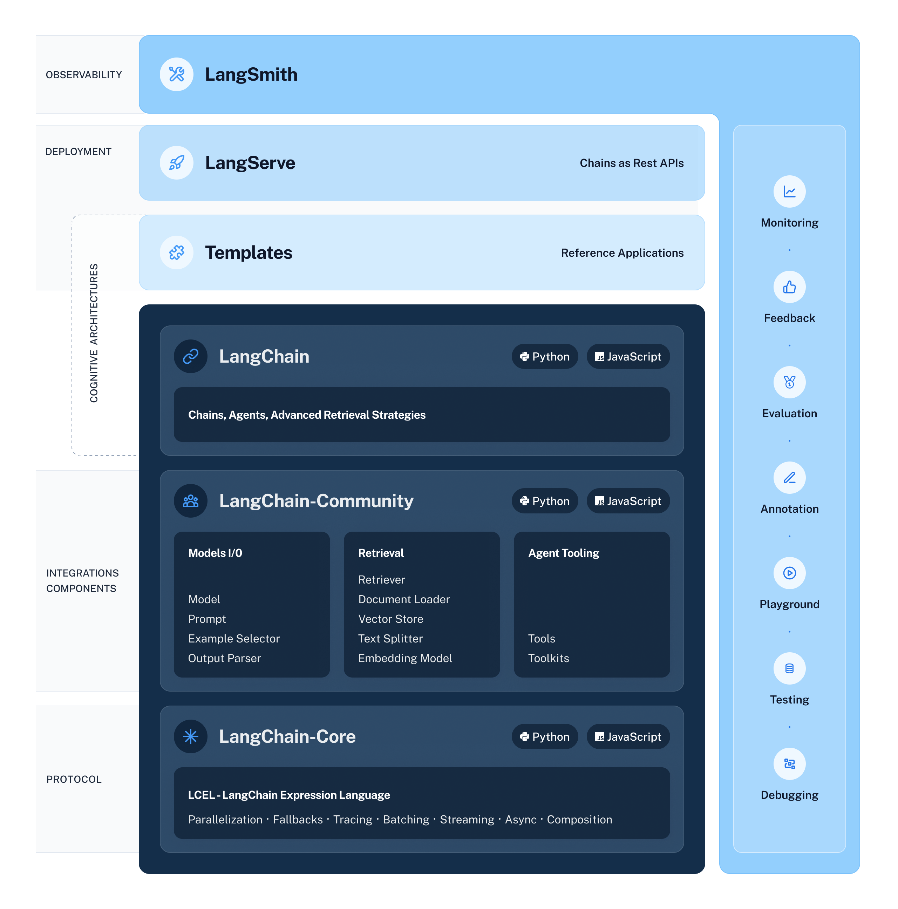

# LangChain Expression Language (LCEL)

LangChain 表達式語言（LCEL）是一種輕鬆地將鏈組合在一起的聲明性方式。 LCEL 從第一天起就被設計為支援將 prototypes 轉換到生產，無需更改程式碼，從最簡單的 "prompt + LLM" 鏈到最複雜的鏈（我們已經看到人們在生產中成功運行了100 個步驟的 LCEL 鏈）。

下面列出一些您可能想要使用 LCEL 的原因:

**串流輪出支援** 當您使用 LCEL 建立鏈時，您可以獲得最佳的首次 token 時間（直到第一個輸出區塊出現之前所經過的時間）。

**非同步支援** 使用 LCEL 建立的任何鏈都可以使用同步 API 和非同步 API（例如，在 LangServe 伺服器中）進行呼叫。這使得能夠在原型和生產中使用相同的程式碼，具有出色的效能，並且能夠在同一台伺服器中處理許多並發請求。

**優化併行執行** 只要您的 LCEL 鏈具有可以併行執行的步驟（例如，如果您從多個檢索器取得文件），我們就會在同步和非同步介面中自動執行此操作，以盡可能減少延遲。

**重試和回退** 可為 LCEL 鏈的任何部分配置重試和回退。這是讓您的鏈條在運行上更加可靠的好方法。

**訪問中間結果** 對於更複雜的鏈，即使在產生最終輸出之前訪問中間步驟的結果通常也非常有用。這可以用來讓最終用戶知道正在發生的事情，甚至只是為了調試您的鏈。您可以串流傳輸中間結果，並且它在每個 LangServe 伺服器上都可用。

**輸入和輸出 schemas** 輸入和輸出 schema 為每個 LCEL 鏈提供從鏈結構推斷的 Pydantic 和 JSONSchema 模式。這可用於驗證輸入和輸出，並且是 LangServe 的組成部分。

**無縫 LangSmith 追蹤集成** 隨著您的鏈條變得越來越複雜，了解每一步到底發生了什麼變得越來越重要。借助 LCEL，所有步驟都會自動記錄到 LangSmith，以實現最大程度的可觀察性和可調試性。

**無縫 LangServe 部署集成** 任何使用 LCEL 建立的鏈都可以使用 LangServe 輕鬆部署。

