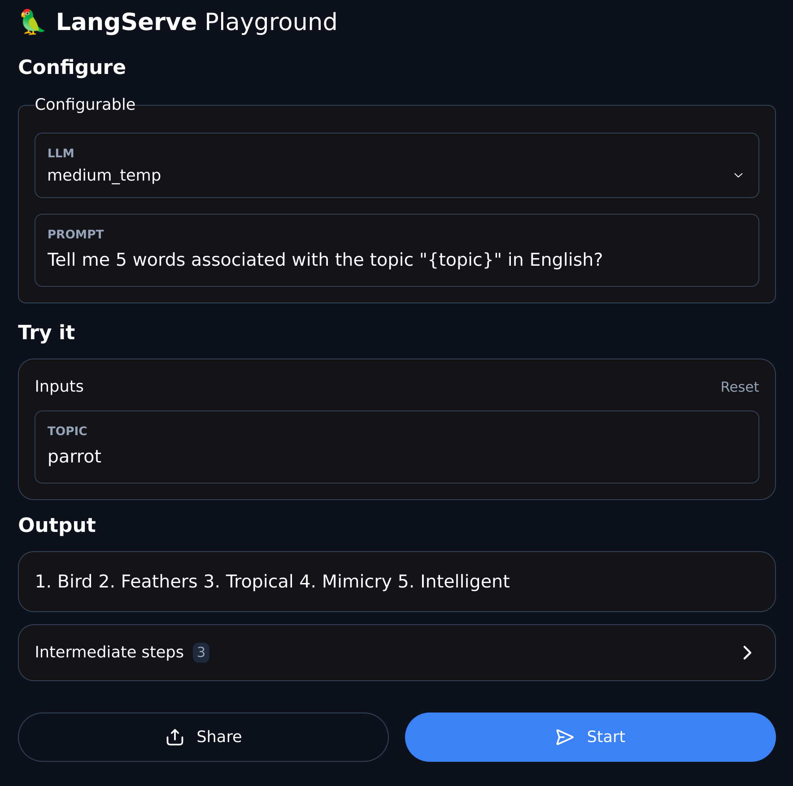
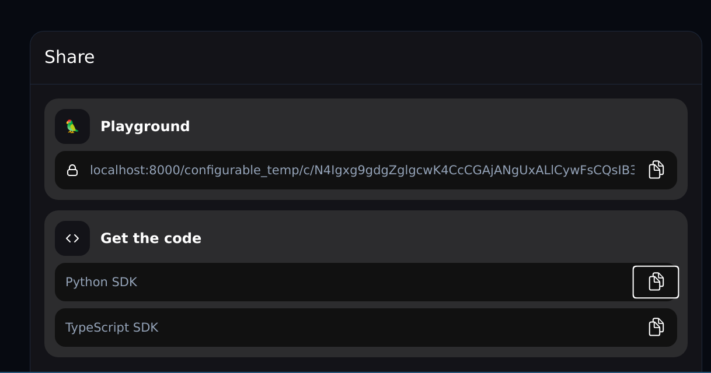
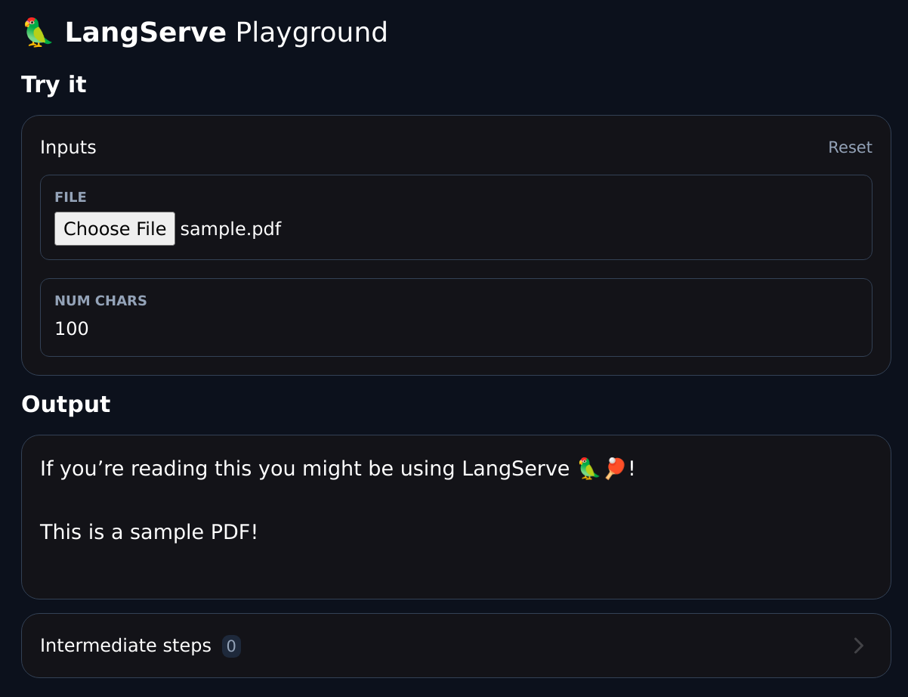
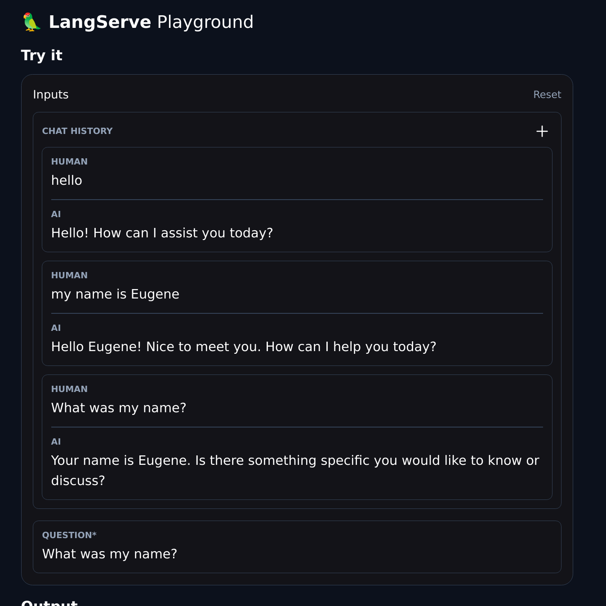

# 🦜️🏓 LangServe

## 概述

LangServe 協助開發人員將 LangChain 的 [runnables 與 chains](https://python.langchain.com/docs/expression_language/) 部署為 REST API。

LangServe 整合了 [FastAPI](https://fastapi.tiangolo.com/)，並使用 [pydantic](https://docs.pydantic.dev/latest/) 進行資料驗證。

此外，它還提供了一個可用於呼叫部署在伺服器上的可運行程式的用戶端。 [LangChain.js](https://js.langchain.com/docs/ecosystem/langserve) 中提供了 JavaScript 用戶端。

## 功能

- 輸入和輸出 schema 會自動從 LangChain 物件推斷出來，並在每個 API 呼叫上強制執行，並提供豐富的錯誤訊息
- 包含 JSONSchema 和 Swagger 的 API 文件頁面
- 高效的 `/invoke/`、`/batch/` 和 `/stream/` 端點，支援單一伺服器上的許多並發請求
- `/stream_log/` 端點，用於串流傳輸鏈/代理中的所有（或部分）中間步驟
- 自 0.0.40 起新增，支援 `astream_events`，以便更輕鬆地進行串流傳輸，而無需解析 `stream_log` 的輸出。
- Playground 頁面位於 `/playground/` ，具有串流輸出和中間步驟
- 內建（可選）追蹤 LangSmith，只需新增您的 API 金鑰
- 使用經過實戰考驗的開源 Python 庫（例如 FastAPI、Pydantic、uvloop 和 asyncio）構建的。
- 可使用[LangChain.js](https://js.langchain.com/docs/ecosystem/langserve)客戶端 SDK 呼叫 LangServe 伺服器，就像它是在本地運行的 Runnable 一樣（或直接呼叫 HTTP API）

## 限制

- 對於源自伺服器的事件尚不支援客戶端回調
- 使用 Pydantic V2 時不會產生 OpenAPI 文件。 Fast API 不支援混合 pydantic v1 和 v2 命名空間。有關更多詳細信息，請參閱下面的部分。

## 安裝

對於客戶端和伺服器:

```bash
pip install "langserve[all]"
```

或 `pip install "langserve[client]"` 對於客戶端程式碼，`pip install "langserve[server]"` 對於伺服器程式碼。

## LangChain CLI 🛠️

使用 LangChain CLI 快速 bootstrap `LangServe` project。

要使用 langchain CLI，請確保您安裝了最新版本的 `langchain-cli`。您可以使用 `pip install -U langchain-cli` 安裝它。

## 設定專案

注意：LangServe 使用 [poetry](https://python-poetry.org/) 進行依賴管理。請關注 [poetry](https://python-poetry.org/) 文檔以了解更多資訊。

**1. Create new app using langchain cli command**

```bash
langchain app new my-app
```

**2. Define the runnable in add_routes. Go to `server.py` and edit**

```python
add_routes(app. NotImplemented)
```

**3. Use poetry to add 3rd party packages (e.g., `langchain-openai` etc).**

```bash
poetry add [package-name] // e.g `poetry add langchain-openai`
```

**4. Set up relevant env variables.**

```bash
export OPENAI_API_KEY="sk-..."
```

**5. Serve your app**

```bash
poetry run langchain serve --port=8100
```

## Examples

使用 [LangChain Templates](https://github.com/langchain-ai/langchain/blob/master/templates/README.md) 快速啟動您的 LangServe 實例。

如需更多範例，請參閱範本索引或範例目錄。

|描述	|連結|
|---------------|-----|
|**LLMs** Minimal example that reserves OpenAI and Anthropic chat models. Uses async, supports batching and streaming.|[server](https://github.com/langchain-ai/langserve/tree/main/examples/llm/server.py), [client](https://github.com/langchain-ai/langserve/blob/main/examples/llm/client.ipynb)|
|**Retriever** Simple server that exposes a retriever as a runnable.|[server](https://github.com/langchain-ai/langserve/tree/main/examples/retrieval/server.py), [client](https://github.com/langchain-ai/langserve/tree/main/examples/retrieval/client.ipynb)|
|**Conversational Retriever** A Conversational Retriever exposed via LangServe|[server](https://github.com/langchain-ai/langserve/tree/main/examples/conversational_retrieval_chain/server.py), [client](https://github.com/langchain-ai/langserve/tree/main/examples/conversational_retrieval_chain/client.ipynb)|
|**Agent** without **conversation history** based on [OpenAI tools](https://python.langchain.com/docs/modules/agents/agent_types/openai_functions_agent)|[server](https://github.com/langchain-ai/langserve/tree/main/examples/agent/server.py), [client](https://github.com/langchain-ai/langserve/tree/main/examples/agent/client.ipynb)|
|**Agent** with **conversation history** based on [OpenAI tools](https://python.langchain.com/docs/modules/agents/agent_types/openai_functions_agent)|[server](https://github.com/langchain-ai/langserve/blob/main/examples/agent_with_history/server.py), [client](https://github.com/langchain-ai/langserve/blob/main/examples/agent_with_history/client.ipynb)|
|[RunnableWithMessageHistory](https://python.langchain.com/docs/expression_language/how_to/message_history) to implement chat persisted on backend, keyed off a `session_id` supplied by client.|[server](https://github.com/langchain-ai/langserve/tree/main/examples/chat_with_persistence/server.py), [client](https://github.com/langchain-ai/langserve/tree/main/examples/chat_with_persistence/client.ipynb)|
|[RunnableWithMessageHistory](https://python.langchain.com/docs/expression_language/how_to/message_history) to implement chat persisted on backend, keyed off a `conversation_id` supplied by client, and `user_id` (see Auth for implementing `user_id` properly).|[server](https://github.com/langchain-ai/langserve/tree/main/examples/chat_with_persistence_and_user/server.py), [client](https://github.com/langchain-ai/langserve/tree/main/examples/chat_with_persistence_and_user/client.ipynb)|
|[Configurable Runnable](https://python.langchain.com/docs/expression_language/how_to/configure) to create a retriever that supports run time configuration of the index name.|[server](https://github.com/langchain-ai/langserve/tree/main/examples/configurable_retrieval/server.py), [client](https://github.com/langchain-ai/langserve/tree/main/examples/configurable_retrieval/client.ipynb)|
|[Configurable Runnable](https://python.langchain.com/docs/expression_language/how_to/configure) that shows configurable fields and configurable alternatives.|[server](https://github.com/langchain-ai/langserve/tree/main/examples/configurable_chain/server.py), [client](https://github.com/langchain-ai/langserve/tree/main/examples/configurable_chain/client.ipynb)|
|**APIHandler** Shows how to use `APIHandler` instead of `add_routes`. This provides more flexibility for developers to define endpoints. Works well with all FastAPI patterns, but takes a bit more effort.|[server](https://github.com/langchain-ai/langserve/tree/main/examples/api_handler_examples/server.py)|
|**LCEL Example** Example that uses LCEL to manipulate a dictionary input.|[server](https://github.com/langchain-ai/langserve/tree/main/examples/passthrough_dict/server.py), [client](https://github.com/langchain-ai/langserve/tree/main/examples/passthrough_dict/client.ipynb)|
|**Auth** with `add_routes`: Simple authentication that can be applied across all endpoints associated with app. (Not useful on its own for implementing per user logic.)|[server](https://github.com/langchain-ai/langserve/tree/main/examples/auth/global_deps/server.py)|
|**Auth** with `add_routes`: Simple authentication mechanism based on path dependencies. (No useful on its own for implementing per user logic.)|[server](https://github.com/langchain-ai/langserve/tree/main/examples/auth/path_dependencies/server.py)|
|**Auth** with `add_routes`: Implement per user logic and auth for endpoints that use per request config modifier. (**Note**: At the moment, does not integrate with OpenAPI docs.)|[server](https://github.com/langchain-ai/langserve/tree/main/examples/auth/per_req_config_modifier/server.py), [client](https://github.com/langchain-ai/langserve/tree/main/examples/auth/per_req_config_modifier/client.ipynb)|
|**Auth** with `APIHandler`: Implement per user logic and auth that shows how to search only within user owned documents.|[server](https://github.com/langchain-ai/langserve/tree/main/examples/auth/api_handler/server.py), [client](https://github.com/langchain-ai/langserve/tree/main/examples/auth/api_handler/client.ipynb)|
|**Widgets** Different widgets that can be used with playground (file upload and chat)|[server](https://github.com/langchain-ai/langserve/tree/main/examples/widgets/chat/tuples/server.py)|
|**Widgets** File upload widget used for LangServe playground.|[server](https://github.com/langchain-ai/langserve/tree/main/examples/file_processing/server.py), [client](https://github.com/langchain-ai/langserve/tree/main/examples/file_processing/client.ipynb)|

## Sample Application

### Server

這是一個部署 OpenAI 聊天模型和 Anthropic 模型講述某個主題的笑話的 chain 的伺服器。

```python
#!/usr/bin/env python
from fastapi import FastAPI
from langchain.prompts import ChatPromptTemplate
from langchain.chat_models import ChatAnthropic, ChatOpenAI
from langserve import add_routes

app = FastAPI(
    title="LangChain Server",
    version="1.0",
    description="A simple api server using Langchain's Runnable interfaces",
)

add_routes(
    app,
    ChatOpenAI(),
    path="/openai",
)

add_routes(
    app,
    ChatAnthropic(),
    path="/anthropic",
)

model = ChatAnthropic()

prompt = ChatPromptTemplate.from_template("tell me a joke about {topic}")

add_routes(
    app,
    prompt | model,
    path="/joke",
)

if __name__ == "__main__":
    import uvicorn

    uvicorn.run(app, host="localhost", port=8000)
```

如果您打算從瀏覽器呼叫端點，您還需要設定 **CORS 標頭**。您可以使用 FastAPI 的內建中介軟體來實現：

```python
from fastapi.middleware.cors import CORSMiddleware

# Set all CORS enabled origins
app.add_middleware(
    CORSMiddleware,
    allow_origins=["*"],
    allow_credentials=True,
    allow_methods=["*"],
    allow_headers=["*"],
    expose_headers=["*"],
)
```

## API 文件

如果您已經部署了上面的伺服器，您可以使用以下命令查看生成的 OpenAPI 文件：

!!! info
    ⚠️ 如果使用 `pydantic v2`，langserve 將不會為 invoke、batch、stream、stream_log 產生 api 文件。有關更多詳細信息，請參閱下面的 [Pydantic](https://python.langchain.com/docs/langserve#pydantic) 部分。

```bash
curl localhost:8000/docs
```

確保添加 `/docs` 後綴。

!!! info
    ⚠️ 索引頁面 `/` 不是設計定義的，因此 `curl localhost:8000` 或造訪 URL 將傳回 404。如果您想要 `/` 處的內容，請定義一個端點 `@app.get("/")`。

### Client

**Python SDK**

```python
from langchain.schema import SystemMessage, HumanMessage
from langchain.prompts import ChatPromptTemplate
from langchain.schema.runnable import RunnableMap
from langserve import RemoteRunnable

openai = RemoteRunnable("http://localhost:8000/openai/")
anthropic = RemoteRunnable("http://localhost:8000/anthropic/")
joke_chain = RemoteRunnable("http://localhost:8000/joke/")

joke_chain.invoke({"topic": "parrots"})

# or async
await joke_chain.ainvoke({"topic": "parrots"})

prompt = [
    SystemMessage(content='Act like either a cat or a parrot.'),
    HumanMessage(content='Hello!')
]

# Supports astream
async for msg in anthropic.astream(prompt):
    print(msg, end="", flush=True)

prompt = ChatPromptTemplate.from_messages(
    [("system", "Tell me a long story about {topic}")]
)

# Can define custom chains
chain = prompt | RunnableMap({
    "openai": openai,
    "anthropic": anthropic,
})

chain.batch([{"topic": "parrots"}, {"topic": "cats"}])
```

**TypeScript**

需要 `LangChain.js` 版本 0.0.166 或更高版本:

```javascript
import { RemoteRunnable } from "@langchain/core/runnables/remote";

const chain = new RemoteRunnable({
    url: `http://localhost:8000/joke/`,
});
const result = await chain.invoke({
    topic: "cats",
});
```

**Python 使用 `requests`**

```python
import requests

response = requests.post(
    "http://localhost:8000/joke/invoke",
    json={'input': {'topic': 'cats'}}
)
response.json()
```

**curl**

```bash
curl --location --request POST 'http://localhost:8000/joke/invoke' \
    --header 'Content-Type: application/json' \
    --data-raw '{
        "input": {
            "topic": "cats"
        }
    }'
```

## Endpoints

下面的程式碼：

```python
...
add_routes(
    app,
    runnable,
    path="/my_runnable",
)
```

會將這些端點新增至伺服器給外面呼叫:

- `POST /my_runnable/invoke` - invoke the runnable on a single input
- `POST /my_runnable/batch` - invoke the runnable on a batch of inputs
- `POST /my_runnable/stream` - invoke on a single input and stream the output
- `POST /my_runnable/stream_log` - invoke on a single input and stream the output, including output of intermediate steps as it's generated
- `POST /my_runnable/astream_events` - invoke on a single input and stream events as they are generated, including from intermediate steps.
- `GET /my_runnable/input_schema` - json schema for input to the runnable
- `GET /my_runnable/output_schema` - json schema for output of the runnable
- `GET /my_runnable/config_schema` - json schema for config of the runnable

這些端點與 [LangChain 表達式語言介面](https://python.langchain.com/docs/expression_language/interface)相符 - 請參考此文件以取得更多詳細資訊。

## Playground

您可以在 `/my_runnable/playground/` 找到您的 runnable 的 Playground 頁面。這公開了一個簡單的 UI，用於配置和呼叫具有流輸出和中間步驟的可運行物件。



### Widgets

Playground 支援 widgets，可用於使用不同的輸入來測試您的可運行程式。有關更多詳細信息，請參閱下面的 widgets 部分。

### Sharing

此外，對於可配置的可運行對象，playground 將允許您配置可運行對象並共用配置連結：



## Chat playground

LangServe 也支援以聊天為中心的 Playground，可以選擇在 `/my_runnable/playground/` 下使用。與一般的 Playground 不同，僅支援某些類型的可運行物件 - 可運行物件的輸入模式必須是具有以下任一內容的 `dict`：

- 單一鍵，且該鍵的值必須是聊天訊息清單。
- 兩個鍵，一個的值是訊息列表，另一個代表最新的訊息。

我們建議您使用第一種格式。

可運行物件也必須傳回 `AIMessage` 或字串。

要啟用它，您必須在新增路線時設定 `playground_type ="chat"`。底下是一個例子：

```python
# Declare a chain
prompt = ChatPromptTemplate.from_messages(
    [
        ("system", "You are a helpful, professional assistant named Cob."),
        MessagesPlaceholder(variable_name="messages"),
    ]
)

chain = prompt | ChatAnthropic(model="claude-2")


class InputChat(BaseModel):
    """Input for the chat endpoint."""

    messages: List[Union[HumanMessage, AIMessage, SystemMessage]] = Field(
        ...,
        description="The chat messages representing the current conversation.",
    )


add_routes(
    app,
    chain.with_types(input_type=InputChat),
    enable_feedback_endpoint=True,
    enable_public_trace_link_endpoint=True,
    playground_type="chat",
)
```

## Legacy Chains

LangServe 可與 Runnable（透過 LangChain 表達式語言構造）和 legacy chain（繼承自 `Chain` 類別）一起使用。然而，legacy chain　的一些輸入 schema 可能不完整/不正確，導致錯誤。這可以透過更新 LangChain 中這些鏈的 `input_schema` 屬性來解決。如果您遇到任何錯誤，請在此儲存庫上提出問題，我們將盡力解決它。

## Pydantic

LangServe 提供對 Pydantic 2 的支持，但有一些限制。

1. 當使用 Pydantic V2 時，langserve 不會為 invoke/batch/stream/stream_log 產生 OpenAPI 文件。 Fast API 不支援 [混合 pydantic v1 和 v2 命名空間]。
2. LangChain 在 Pydantic v2 中使用 v1 命名空間。請閱讀以下指南以確保與 LangChain 的兼容性

## 進階

### 身份認證

如果您需要向伺服器新增身份驗證，請閱讀 Fast API 有關依賴項和安全性的文件。

以下範例展示如何使用 FastAPI 連線驗證邏輯 LangServe 端點。

**使用 `add_routes`**

如果您使用的是 `add_routes` 來進行身份認證，請參閱此處的[範例](https://github.com/langchain-ai/langserve/tree/main/examples/auth)。

|描述	|連結|
|---------------|-----|
|**Auth** with `add_routes`: Simple authentication that can be applied across all endpoints associated with app. (Not useful on its own for implementing per user logic.)|[server](https://github.com/langchain-ai/langserve/tree/main/examples/auth/global_deps/server.py)|
|**Auth** with `add_routes`: Simple authentication mechanism based on path dependencies. (No useful on its own for implementing per user logic.)|[server](https://github.com/langchain-ai/langserve/tree/main/examples/auth/path_dependencies/server.py)|
|**Auth** with `add_routes`: Implement per user logic and auth for endpoints that use per request config modifier. (**Note**: At the moment, does not integrate with OpenAPI docs.)|[server](https://github.com/langchain-ai/langserve/tree/main/examples/auth/per_req_config_modifier/server.py), [client](https://github.com/langchain-ai/langserve/tree/main/examples/auth/per_req_config_modifier/client.ipynb)|

或者，您可以使用 FastAPI 的 middleware。

使用全域依賴項和路徑依賴項的優點是 OpenAPI 文件頁面將正確支援身份驗證，但這些不足以實現每個使用者的邏輯（例如，製作只能在使用者擁有的文件中搜尋的應用程式）。

如果您需要實作每個使用者邏輯，您可以使用 `per_req_config_modifier` 或 `APIHandler` 來實作此邏輯。

**Per User**

如果您需要依賴使用者的授權或邏輯，請在使用 `add_routes` 時指定 `per_req_config_modifier`。使用可呼叫對象接收原始 `Request` 對象，並可從中提取相關資訊以用於身份驗證和授權目的。


**Using APIHandler**

如果您熟悉 FastAPI 和 python，則可以使用 LangServe 的 [APIHandler]。

|描述	|連結|
|---------------|-----|
|**Auth** with `APIHandler`: Implement per user logic and auth that shows how to search only within user owned documents.|[server](https://github.com/langchain-ai/langserve/tree/main/examples/auth/api_handler/server.py), [client](https://github.com/langchain-ai/langserve/tree/main/examples/auth/api_handler/client.ipynb)|
|**APIHandler** Shows how to use APIHandler instead of `add_routes`. This provides more flexibility for developers to define endpoints. Works well with all FastAPI patterns, but takes a bit more effort.|[server](https://github.com/langchain-ai/langserve/tree/main/examples/api_handler_examples/server.py), [client](https://github.com/langchain-ai/langserve/tree/main/examples/api_handler_examples/client.ipynb)|

這需要再多寫一些程式碼，但可以讓您完全控制端點定義，因此您可以執行身份驗證所需的任何自訂邏輯。

### Files

LLM 應用程式經常處理文件。可以採用不同的架構來實現文件處理:

1. 檔案可以透過專用端點上傳到伺服器並使用單獨的端點進行處理
2. 文件可以透過值（文件位元組）或引用（例如，文件內容的 s3 url）上傳
3. 處理端點可以是阻塞的或非阻塞的
4. 如果需要大量處理，可以將處理卸載到專用進程池

您應該確定適合您的應用程式的架構。

目前，要將文件按值上傳到可運行文件，請對文件使用 `base64` 編碼（尚不支援 `multipart/form-data`）。

下面的[範例](https://github.com/langchain-ai/langserve/tree/main/examples/file_processing)展示如何使用 Base64 編碼將檔案傳送到遠端可運行程式。

### Custom Input and Output Types

Input 和 Output 類型在所有 runnable 上定義。

您可以透過 `input_schema` 和 `output_schema` 屬性存取它們。

`LangServe` 使用這些類型進行驗證和記錄。

如果要覆寫預設的推斷類型，可以使用 `with_types` 方法。

這是一個演示這個想法的範例:

```python
from typing import Any

from fastapi import FastAPI
from langchain.schema.runnable import RunnableLambda

app = FastAPI()


def func(x: Any) -> int:
    """Mistyped function that should accept an int but accepts anything."""
    return x + 1


runnable = RunnableLambda(func).with_types(
    input_type=int,
)

add_routes(app, runnable)
```

### Custom User Types

如果您希望資料反序列化為 `pydantic` 模型而不是等效的 `dict` 表示，請繼承自 `CustomUserType`。

目前，此類型僅適用於伺服器端，並用於指定所需的解碼行為。如果繼承此類型，伺服器會將解碼後的類型保留為 `pydantic` 模型，而不是將其轉換為字典。

```python
from fastapi import FastAPI
from langchain.schema.runnable import RunnableLambda

from langserve import add_routes
from langserve.schema import CustomUserType

app = FastAPI()


class Foo(CustomUserType):
    bar: int


def func(foo: Foo) -> int:
    """Sample function that expects a Foo type which is a pydantic model"""
    assert isinstance(foo, Foo)
    return foo.bar


# Note that the input and output type are automatically inferred!
# You do not need to specify them.
# runnable = RunnableLambda(func).with_types( # <-- Not needed in this case
#     input_type=Foo,
#     output_type=int,
#
add_routes(app, RunnableLambda(func), path="/foo")
```

### Playground Widgets

Playground 允許您從後端為可運行物件定義自訂小工具。

這裡有一些例子：

|描述	|連結|
|---------------|-----|
|**Widgets** Different widgets that can be used with playground (file upload and chat)|[server](https://github.com/langchain-ai/langserve/tree/main/examples/widgets/chat/tuples/server.py), [client](https://github.com/langchain-ai/langserve/tree/main/examples/widgets/client.ipynb)|
|**Widgets** File upload widget used for LangServe playground.|[server](https://github.com/langchain-ai/langserve/tree/main/examples/file_processing/server.py), [client](https://github.com/langchain-ai/langserve/tree/main/examples/file_processing/client.ipynb)|

**Schema**

- widget 在欄位層級指定，並作為輸入類型的 JSON 架構的一部分提供
- widget 必須包含一個名為 `type` 的鍵，其值是眾所周知的 widget 列表之一
- 其他 widget 鍵將與描述 JSON 物件中的路徑的值關聯

```python
type JsonPath = number | string | (number | string)[];
type NameSpacedPath = { title: string; path: JsonPath }; // Using title to mimick json schema, but can use namespace
type OneOfPath = { oneOf: JsonPath[] };

type Widget = {
    type: string // Some well known type (e.g., base64file, chat etc.)
    [key: string]: JsonPath | NameSpacedPath | OneOfPath;
};
```

### Available Widgets

用戶現在只能手動指定兩種 widget:

1. File Upload Widget
2. Chat History Widget

請參閱下面有關這些 widget 的更多資訊。

Playground UI 上的所有其他小工具都是由 UI 根據 Runnable 的配置架構自動建立和管理的。當您建立可配置的可運行物件時，playground 應該會建立適當的小工具供您控制行為。

#### File Upload Widget

允許在 UI Playground 中為 Base64 編碼字串上傳的檔案建立檔案上傳輸入。這是完整的範例。

```python
try:
    from pydantic.v1 import Field
except ImportError:
    from pydantic import Field

from langserve import CustomUserType


# ATTENTION: Inherit from CustomUserType instead of BaseModel otherwise
#            the server will decode it into a dict instead of a pydantic model.
class FileProcessingRequest(CustomUserType):
    """Request including a base64 encoded file."""

    # The extra field is used to specify a widget for the playground UI.
    file: str = Field(..., extra={"widget": {"type": "base64file"}})
    num_chars: int = 100
```



#### Chat Widget

查看[範例](https://github.com/langchain-ai/langserve/tree/main/examples/widgets/chat/tuples/server.py)。

若要定義 chat widget，請確保傳遞 `"type":"chat"`。

- `input` 是請求中包含新輸入訊息的欄位的 `JSONPath`。
- `output` 是具有新輸出訊息的回應中欄位的 `JSONPath`。
- 如果應原樣使用整個輸入或輸出（例如，如果輸出是聊天訊息清單），則不要指定這些欄位。

```python
class ChatHistory(CustomUserType):
    chat_history: List[Tuple[str, str]] = Field(
        ...,
        examples=[[("human input", "ai response")]],
        extra={"widget": {"type": "chat", "input": "question", "output": "answer"}},
    )
    question: str


def _format_to_messages(input: ChatHistory) -> List[BaseMessage]:
    """Format the input to a list of messages."""
    history = input.chat_history
    user_input = input.question

    messages = []

    for human, ai in history:
        messages.append(HumanMessage(content=human))
        messages.append(AIMessage(content=ai))
    messages.append(HumanMessage(content=user_input))
    return messages


model = ChatOpenAI()
chat_model = RunnableParallel({"answer": (RunnableLambda(_format_to_messages) | model)})
add_routes(
    app,
    chat_model.with_types(input_type=ChatHistory),
    config_keys=["configurable"],
    path="/chat",
)
```



您也可以直接指定訊息清單作為參數，如下列程式碼段所示:

```python
prompt = ChatPromptTemplate.from_messages(
    [
        ("system", "You are a helpful assisstant named Cob."),
        MessagesPlaceholder(variable_name="messages"),
    ]
)

chain = prompt | ChatAnthropic(model="claude-2")


class MessageListInput(BaseModel):
    """Input for the chat endpoint."""
    messages: List[Union[HumanMessage, AIMessage]] = Field(
        ...,
        description="The chat messages representing the current conversation.",
        extra={"widget": {"type": "chat", "input": "messages"}},
    )


add_routes(
    app,
    chain.with_types(input_type=MessageListInput),
    path="/chat",
)
```

有關範例，請參閱此[範例文件](https://github.com/langchain-ai/langserve/tree/main/examples/widgets/chat/message_list/server.py)。

## Enabling / Disabling Endpoints

您可以 enable/disable 特定 route 的哪些端點。


Enable: 下面的程式碼將僅啟用 `invoke`、`batch` 和對應的 `config_hash` 端點變體。

```python
add_routes(app, chain, enabled_endpoints=["invoke", "batch", "config_hashes"], path="/mychain")
```

Disable: 下面的程式碼將禁用 chain 的 playground

```python
add_routes(app, chain, disabled_endpoints=["playground"], path="/mychain")
```

