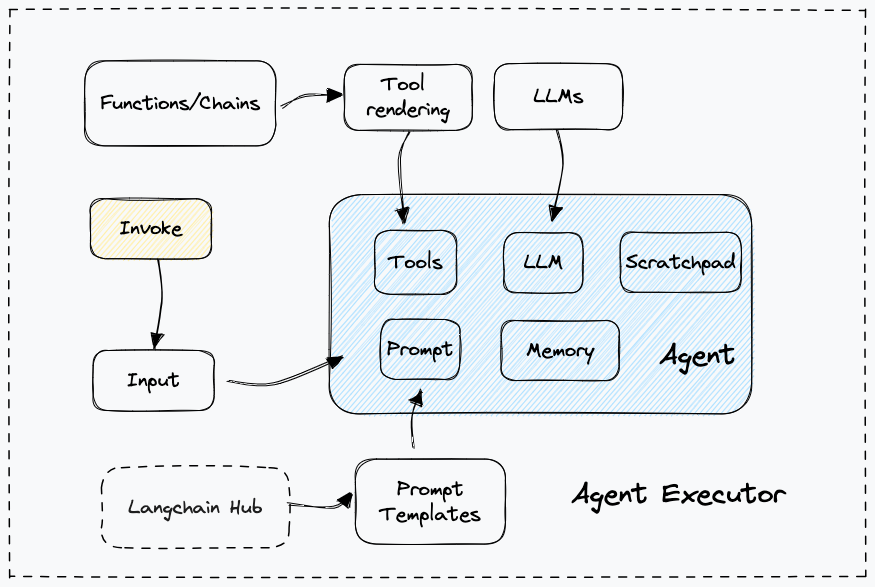

# Concepts

Agent 的核心思想是使用語言模型來選擇要採取的一系列操作/動件。在 chain 中，一系列操作被硬編碼（在程式碼中）。在 agent 中，語言模型被用作推理引擎來決定要採取哪些操作以及按什麼順序。



這裡有幾個關鍵組件:

## Schema

LangChain 有幾個抽象來讓與 agent 的合作變得容易。

### AgentAction

這是一個 data class，表示代理應採取的操作。它有一個 `tool` 屬性（這是應該呼叫的工具的名稱）和一個 `tool_input` 屬性（該工具的輸入）

### AgentFinish

這表示代理準備好回傳給使用者時的最終結果。它包含一個 `return_values` 鍵值映射，其中包含最終的代理輸出。通常，這包含一個輸出鍵，其中包含一個代理回應的字串。

### Intermediate Steps

這些代表先前的代理操作以及當前代理運行的相應輸出。這些對於傳遞到未來的迭代非常重要，因此代理人知道它已經完成了哪些工作。它的型別為 `List[Tuple[AgentAction, Any]]`。請注意，觀察目前保留為 `Any` 類型，以實現最大程度的靈活性。實際上，這通常是一個 **字串**。

## Agent

這是負責決定下一步採取什麼步驟的 chain。這通常由語言模型、提示和輸出解析器提供支援。

不同的智能體有不同的推理提示風格、不同的編碼輸入方式、不同的解析輸出方式。有關內建代理的完整列表，請參閱代理類型。如果您需要進一步控制，您還可以輕鬆建立自訂代理程式。

### Agent Inputs

代理的輸入是鍵值映射(key-value mapping)。只有一個必需的鍵值：`intermediate_steps`，它對應於如上所述的中間步驟。

一般來說，`PromptTemplate` 負責將這些對轉換為最適合傳遞到 LLM 的格式。

### Agent Outputs

輸出是要執行的下一個動作或要傳送給使用者的最終回應（`AgentActions` 或 `AgentFinish`）。具體來說，可以輸入為 `Union[AgentAction, List[AgentAction], AgentFinish]`。

輸出解析器(output parser)負責取得原始 LLM 輸出並將其轉換為這三種類型之一。

## AgentExecutor

代理執行器(agent executor)是代理的運行 runtime。這實際上是呼叫代理，執行它選擇的操作，將操作輸出傳回代理，然後重複。在偽代碼中，這大致如下所示：

```python
next_action = agent.get_action(...)

while next_action != AgentFinish:
    observation = run(next_action)
    next_action = agent.get_action(..., next_action, observation)

return next_action
```

雖然這看起來很簡單，但在該運行 runtime 會為您處理一些複雜的問題，包括：

1. 處理代理選擇不存在的工具的情況
2. 處理工具錯誤的情況
3. 處理代理程式產生無法解析為工具呼叫的輸出的情況
4. 所有等級（代理決策、工具呼叫）的日誌記錄和可觀察性到標準輸出和/或 LangSmith。

## Tools

工具是代理可以呼叫的功能。工具抽象由兩個元件組成：

1. 工具的輸入架構。這告訴 LLM 調用該工具需要哪些參數。如果沒有這個，它將不知道正確的輸入是什麼。這些參數應該被合理地命名和描述。
2. 要運行的函數。這通常只是呼叫一個 Python 函數。

### Considerations

圍繞工具有兩個重要的設計考量：

1. 讓 agent 能夠使用正確的工具
2. 以對 agent 最有幫助的方式描述工具

如果你不考慮這兩點，你將無法建立一個有效的代理。如果您不讓代理商存取一組正確的工具，它將永遠無法實現您賦予它的目標。如果你沒有很好地描述工具，代理將不知道如何正確使用它們。

LangChain 提供了一系列廣泛的內建工具，而且還可以輕鬆定義您自己的工具（包括自訂描述）。有關內建工具的完整列表，請參閱[工具整合部分](https://python.langchain.com/docs/integrations/tools/)

## Toolkits

對於許多常見任務，代理將需要一組相關工具。為此，LangChain 提供了工具包的概念——完成特定目標所需的約 3-5 個工具組。例如，GitHub工具包有用於搜尋GitHub問題的工具、用於讀取檔案的工具、用於評論的工具等。

LangChain 提供了廣泛的入門工具包。有關內建工具包的完整列表，請參閱[工具包整合部分](https://python.langchain.com/docs/integrations/toolkits/)


