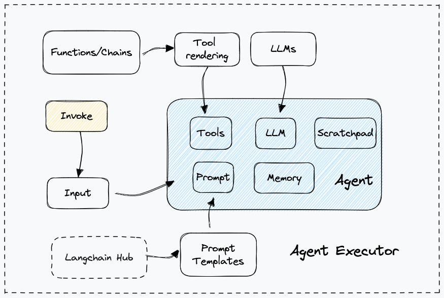

# Quickstart

為了更好地理解 agent framework，讓我們建立一個具有兩種工具的代理：一種用於線上查找，另一種用於查找我們載入到索引中的特定資料。



## 定義工具

我們首先需要創建我們想要使用的工具。我們將使用兩個工具：Tavily（用於線上搜尋），然後是我們將建立的本地索引的檢索器。

### Tavily

在 LangChain 中有一個內建的工具，可以方便地使用 Tavily 搜尋引擎作為工具。請注意，這需要一個 API 金鑰 - 他們有一個免費套餐，但如果您沒有或不想建立一個，您可以隨時忽略此步驟。

建立 API 金鑰後，您需要將其匯出為環境變數：

```bash
export TAVILY_API_KEY="..."
```

```python
from langchain_community.tools.tavily_search import TavilySearchResults

search = TavilySearchResults()

search.invoke("what is the weather in SF")
```

執行結果:

```bash
[{'url': 'https://www.metoffice.gov.uk/weather/forecast/9q8yym8kr',
  'content': 'Thu 11 Jan Thu 11 Jan Seven day forecast for San Francisco  San Francisco (United States of America) weather Find a forecast  Sat 6 Jan Sat 6 Jan Sun 7 Jan Sun 7 Jan Mon 8 Jan Mon 8 Jan Tue 9 Jan Tue 9 Jan Wed 10 Jan Wed 10 Jan Thu 11 Jan  Find a forecast Please choose your location from the nearest places to : Forecast days Today Today Sat 6 Jan Sat 6 JanSan Francisco 7 day weather forecast including weather warnings, temperature, rain, wind, visibility, humidity and UV ... (11 January 2024) Time 00:00 01:00 02:00 03:00 04:00 05:00 06:00 07:00 08:00 09:00 10:00 11:00 12:00 ... Oakland Int. 11.5 miles; San Francisco International 11.5 miles; Corte Madera 12.3 miles; Redwood City 23.4 miles;'},
 {'url': 'https://www.latimes.com/travel/story/2024-01-11/east-brother-light-station-lighthouse-california',
  'content': "May 18, 2023  Jan. 4, 2024 Subscribe for unlimited accessSite Map Follow Us MORE FROM THE L.A. TIMES  Jan. 8, 2024 Travel & Experiences This must be Elysian Valley (a.k.a. Frogtown) Jan. 5, 2024 Food  June 30, 2023The East Brother Light Station in the San Francisco Bay is not a destination for everyone. ... Jan. 11, 2024 3 AM PT ... Champagne and hors d'oeuvres are served in late afternoon — outdoors if ..."}]
```

### Retriever

我們還將根據我們自己的一些數據創建一個知識檢索器(retriever)。

```python
from langchain.text_splitter import RecursiveCharacterTextSplitter
from langchain_community.document_loaders import WebBaseLoader
from langchain_community.vectorstores import FAISS
from langchain_openai import OpenAIEmbeddings

loader = WebBaseLoader("https://docs.smith.langchain.com/overview")

docs = loader.load()

documents = RecursiveCharacterTextSplitter(
    chunk_size=1000, chunk_overlap=200
).split_documents(docs)

vector = FAISS.from_documents(documents, OpenAIEmbeddings())

retriever = vector.as_retriever()
```


現在我們已經構建了我們將進行檢索的索引，我們可以輕鬆地將其變成一個工具（讓代理程式可正確使用它所需的格式）

```python
from langchain.tools.retriever import create_retriever_tool

retriever_tool = create_retriever_tool(
    retriever,
    "langsmith_search",
    "Search for information about LangSmith. For any questions about LangSmith, you must use this tool!",
)
```

### Tool

現在我們已經創建了兩者，我們可以建立將在下游使用的工具清單。

```python
tools = [search, retriever_tool]
```

## 創建 Agent

現在我們已經定義了工具，我們可以建立代理(agent)。我們將使用 OpenAI Functions agent - 有關此類代理以及其他選項的更多信息，請參閱[本指南](https://python.langchain.com/docs/modules/agents/agent_types)。

首先，我們選擇我們想要指導代理人的 LLM。

```python
from langchain_openai import ChatOpenAI

llm = ChatOpenAI(model="gpt-3.5-turbo", temperature=0)
```

接下來，我們選擇要用來指導代理人的提示。

如果您想查看此提示的內容並有權訪問 LangSmith，您可以訪問：

- https://smith.langchain.com/hub/hwchase17/openai-functions-agent

```python
from langchain import hub

# Get the prompt to use - you can modify this!
prompt = hub.pull("hwchase17/openai-functions-agent")


print(prompt.messages)
```

結果:

```bash
[
    SystemMessagePromptTemplate(prompt=PromptTemplate(input_variables=[], template='You are a helpful assistant')),
    MessagesPlaceholder(variable_name='chat_history', optional=True),
    HumanMessagePromptTemplate(prompt=PromptTemplate(input_variables=['input'], template='{input}')),
    MessagesPlaceholder(variable_name='agent_scratchpad')]
```

現在，我們可以使用 LLM、提示字元和工具來初始化代理程式。代理負責接收輸入並決定採取什麼操作。至關重要的是，代理程式不執行這些操作 - 這是由 `AgentExecutor` 完成的（下一步）。有關如何思考這些組件的更多信息，請參閱我們的[概念指南](https://python.langchain.com/docs/modules/agents/concepts)。

```python
from langchain.agents import create_openai_functions_agent

agent = create_openai_functions_agent(llm, tools, prompt)
```

最後，我們將 agent（大腦）與 AgentExecutor 內部的工具（它將重複調用代理並執行工具）結合起來。有關如何思考這些組件的更多信息，請參閱我們的概念指南

```python
from langchain.agents import AgentExecutor

agent_executor = AgentExecutor(agent=agent, tools=tools, verbose=True)
```

## 運行 Agent

我們現在可以針對一些查詢運行代理程式！請注意，目前這些都是無狀態查詢（它不會記住先前的互動）。

```python
agent_executor.invoke({"input": "hi!"})
```

結果:

```bash
> Entering new AgentExecutor chain...
Hello! How can I assist you today?

> Finished chain.

{'input': 'hi!', 'output': 'Hello! How can I assist you today?'}
```

```python
agent_executor.invoke({"input": "how can langsmith help with testing?"})
```

結果:

```bash


> Entering new AgentExecutor chain...

Invoking: `langsmith_search` with `{'query': 'LangSmith testing'}`


[Document(page_content='LangSmith Overview and User Guide | 🦜️🛠️ LangSmith', metadata={'source': 'https://docs.smith.langchain.com/overview', 'title': 'LangSmith Overview and User Guide | 🦜️🛠️ LangSmith', 'description': 'Building reliable LLM applications can be challenging. LangChain simplifies the initial setup, but there is still work needed to bring the performance of prompts, chains and agents up the level where they are reliable enough to be used in production.', 'language': 'en'}), Document(page_content='Skip to main content🦜️🛠️ LangSmith DocsPython DocsJS/TS DocsSearchGo to AppLangSmithOverviewTracingTesting & EvaluationOrganizationsHubLangSmith CookbookOverviewOn this pageLangSmith Overview and User GuideBuilding reliable LLM applications can be challenging. LangChain simplifies the initial setup, but there is still work needed to bring the performance of prompts, chains and agents up the level where they are reliable enough to be used in production.Over the past two months, we at LangChain have been building and using LangSmith with the goal of bridging this gap. This is our tactical user guide to outline effective ways to use LangSmith and maximize its benefits.On by default\u200bAt LangChain, all of us have LangSmith’s tracing running in the background by default. On the Python side, this is achieved by setting environment variables, which we establish whenever we launch a virtual environment or open our bash shell and leave them set. The same principle applies to most JavaScript', metadata={'source': 'https://docs.smith.langchain.com/overview', 'title': 'LangSmith Overview and User Guide | 🦜️🛠️ LangSmith', 'description': 'Building reliable LLM applications can be challenging. LangChain simplifies the initial setup, but there is still work needed to bring the performance of prompts, chains and agents up the level where they are reliable enough to be used in production.', 'language': 'en'}), Document(page_content='You can also quickly edit examples and add them to datasets to expand the surface area of your evaluation sets or to fine-tune a model for improved quality or reduced costs.Monitoring\u200bAfter all this, your app might finally ready to go in production. LangSmith can also be used to monitor your application in much the same way that you used for debugging. You can log all traces, visualize latency and token usage statistics, and troubleshoot specific issues as they arise. Each run can also be assigned string tags or key-value metadata, allowing you to attach correlation ids or AB test variants, and filter runs accordingly.We’ve also made it possible to associate feedback programmatically with runs. This means that if your application has a thumbs up/down button on it, you can use that to log feedback back to LangSmith. This can be used to track performance over time and pinpoint under performing data points, which you can subsequently add to a dataset for future testing — mirroring the', metadata={'source': 'https://docs.smith.langchain.com/overview', 'title': 'LangSmith Overview and User Guide | 🦜️🛠️ LangSmith', 'description': 'Building reliable LLM applications can be challenging. LangChain simplifies the initial setup, but there is still work needed to bring the performance of prompts, chains and agents up the level where they are reliable enough to be used in production.', 'language': 'en'}), Document(page_content='inputs, and see what happens. At some point though, our application is performing\nwell and we want to be more rigorous about testing changes. We can use a dataset\nthat we’ve constructed along the way (see above). Alternatively, we could spend some\ntime constructing a small dataset by hand. For these situations, LangSmith simplifies', metadata={'source': 'https://docs.smith.langchain.com/overview', 'title': 'LangSmith Overview and User Guide | 🦜️🛠️ LangSmith', 'description': 'Building reliable LLM applications can be challenging. LangChain simplifies the initial setup, but there is still work needed to bring the performance of prompts, chains and agents up the level where they are reliable enough to be used in production.', 'language': 'en'})]LangSmith can help with testing in several ways. Here are some ways LangSmith can assist with testing:

1. Tracing: LangSmith provides tracing capabilities that can be used to monitor and debug your application during testing. You can log all traces, visualize latency and token usage statistics, and troubleshoot specific issues as they arise.

2. Evaluation: LangSmith allows you to quickly edit examples and add them to datasets to expand the surface area of your evaluation sets. This can help you test and fine-tune your models for improved quality or reduced costs.

3. Monitoring: Once your application is ready for production, LangSmith can be used to monitor your application. You can log feedback programmatically with runs, track performance over time, and pinpoint underperforming data points. This information can be used to improve your application and add to datasets for future testing.

4. Rigorous Testing: When your application is performing well and you want to be more rigorous about testing changes, LangSmith can simplify the process. You can use existing datasets or construct small datasets by hand to test different scenarios and evaluate the performance of your application.

For more detailed information on how to use LangSmith for testing, you can refer to the [LangSmith Overview and User Guide](https://docs.smith.langchain.com/overview).

> Finished chain.

{'input': 'how can langsmith help with testing?',
 'output': 'LangSmith can help with testing in several ways. Here are some ways LangSmith can assist with testing:\n\n1. Tracing: LangSmith provides tracing capabilities that can be used to monitor and debug your application during testing. You can log all traces, visualize latency and token usage statistics, and troubleshoot specific issues as they arise.\n\n2. Evaluation: LangSmith allows you to quickly edit examples and add them to datasets to expand the surface area of your evaluation sets. This can help you test and fine-tune your models for improved quality or reduced costs.\n\n3. Monitoring: Once your application is ready for production, LangSmith can be used to monitor your application. You can log feedback programmatically with runs, track performance over time, and pinpoint underperforming data points. This information can be used to improve your application and add to datasets for future testing.\n\n4. Rigorous Testing: When your application is performing well and you want to be more rigorous about testing changes, LangSmith can simplify the process. You can use existing datasets or construct small datasets by hand to test different scenarios and evaluate the performance of your application.\n\nFor more detailed information on how to use LangSmith for testing, you can refer to the [LangSmith Overview and User Guide](https://docs.smith.langchain.com/overview).'}
```


```python
agent_executor.invoke({"input": "whats the weather in sf?"})
```

結果:

```bash


> Entering new AgentExecutor chain...

Invoking: `tavily_search_results_json` with `{'query': 'weather in San Francisco'}`


[{'url': 'https://www.whereandwhen.net/when/north-america/california/san-francisco-ca/january/', 'content': 'Best time to go to San Francisco? Weather in San Francisco in january 2024  How was the weather last january? Here is the day by day recorded weather in San Francisco in january 2023:  Seasonal average climate and temperature of San Francisco in january  8% 46% 29% 12% 8% Evolution of daily average temperature and precipitation in San Francisco in januaryWeather in San Francisco in january 2024. The weather in San Francisco in january comes from statistical datas on the past years. You can view the weather statistics the entire month, but also by using the tabs for the beginning, the middle and the end of the month. ... 11-01-2023 50°F to 54°F. 12-01-2023 50°F to 59°F. 13-01-2023 54°F to ...'}, {'url': 'https://www.latimes.com/travel/story/2024-01-11/east-brother-light-station-lighthouse-california', 'content': "May 18, 2023  Jan. 4, 2024 Subscribe for unlimited accessSite Map Follow Us MORE FROM THE L.A. TIMES  Jan. 8, 2024 Travel & Experiences This must be Elysian Valley (a.k.a. Frogtown) Jan. 5, 2024 Food  June 30, 2023The East Brother Light Station in the San Francisco Bay is not a destination for everyone. ... Jan. 11, 2024 3 AM PT ... Champagne and hors d'oeuvres are served in late afternoon — outdoors if ..."}]I'm sorry, I couldn't find the current weather in San Francisco. However, you can check the weather in San Francisco by visiting a reliable weather website or using a weather app on your phone.

> Finished chain.

{'input': 'whats the weather in sf?',
 'output': "I'm sorry, I couldn't find the current weather in San Francisco. However, you can check the weather in San Francisco by visiting a reliable weather website or using a weather app on your phone."}
```

## 添加到記憶中

如前所述，該 agent 是無狀態的。這意味著它不記得先前的互動。為了給它記憶，我們需要傳遞以前的 `chat_history`。注意：由於我們使用的提示，它需要被稱為 `chat_history`。如果我們使用不同的提示，我們可以更改變數名稱

```python
# Here we pass in an empty list of messages for chat_history because it is the first message in the chat
agent_executor.invoke({"input": "hi! my name is bob", "chat_history": []})
```

結果:

```bash
> Entering new AgentExecutor chain...
Hello Bob! How can I assist you today?

> Finished chain.

{'input': 'hi! my name is bob',
 'chat_history': [],
 'output': 'Hello Bob! How can I assist you today?'}
```

把之前的對話保存在 `chat_history` 變數中:

```python
from langchain_core.messages import AIMessage, HumanMessage

agent_executor.invoke(
    {
        "chat_history": [
            HumanMessage(content="hi! my name is bob"),
            AIMessage(content="Hello Bob! How can I assist you today?"),
        ],
        "input": "what's my name?",
    }
)
```

結果:

```bash


> Entering new AgentExecutor chain...
Your name is Bob.

> Finished chain.

{'chat_history': [HumanMessage(content='hi! my name is bob'),
  AIMessage(content='Hello Bob! How can I assist you today?')],
 'input': "what's my name?",
 'output': 'Your name is Bob.'}
```

如果我們想自動追蹤這些訊息，我們可以將其包裝在 `RunnableWithMessageHistory` 中。有關如何使用它的更多信息，請參閱本指南

```python
from langchain_community.chat_message_histories import ChatMessageHistory
from langchain_core.runnables.history import RunnableWithMessageHistory

message_history = ChatMessageHistory()

agent_with_chat_history = RunnableWithMessageHistory(
    agent_executor,
    # This is needed because in most real world scenarios, a session id is needed
    # It isn't really used here because we are using a simple in memory ChatMessageHistory
    lambda session_id: message_history,
    input_messages_key="input",
    history_messages_key="chat_history",
)

agent_with_chat_history.invoke(
    {"input": "hi! I'm bob"},
    # This is needed because in most real world scenarios, a session id is needed
    # It isn't really used here because we are using a simple in memory ChatMessageHistory
    config={"configurable": {"session_id": "<foo>"}},
)
```

結果:

```bash


> Entering new AgentExecutor chain...
Your name is Bob.

> Finished chain.

{'input': "what's my name?",
 'chat_history': [HumanMessage(content="hi! I'm bob"),
  AIMessage(content='Hello Bob! How can I assist you today?')],
 'output': 'Your name is Bob.'}
```

## 結論

在本快速入門中，我們介紹如何建立一個簡單的代理程式。代理是一個複雜的話題，有很多東西要學習！返回代理主頁面，查找有關概念指南、不同類型代理、如何建立自訂工具等的更多資源！
