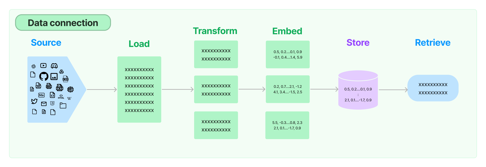

# Document transformers

!!! info
    查看 [Integrations](https://python.langchain.com/docs/integrations/document_transformers/) 以取得 langchain 內建的 document transformer 與第三方工具整合的文件。



載入文件後，您通常會想要對其進行轉換以更好地適合您的應用程式。最簡單的例子是，您可能想要將長文件分割成更小的區塊，以適合模型的上下文視窗(context window)。 LangChain 有許多內建的文件轉換器，可以輕鬆拆分、組合、過濾和以其他方式操作文件。

## 文字分割器

當您想要處理長文本時，有必要將該文字分割成區塊。這聽起來很簡單，但這裡存在著許多潛在的複雜性。理想情況下，您希望將語義相關的文字片段保留在一起。 「語意相關」的意思可能取決於文本的類型。本文展示了實現此目的的幾種方法。

在較高層面上，文本分割器的工作原理如下：

1. 將文字分割成小的、具有語意意義的區塊（通常是句子）。
2. 開始將這些小塊組合成一個更大的塊，直到達到一定的大小（透過某些函數測量）。
3. 一旦達到該大小，請將該區塊設為自己的文字片段，然後開始建立具有一些重疊的新文字區塊（以保持區塊之間的上下文）。

這意味著您可以沿著兩個不同的設計軸線來自訂文字分割器：

1. 文字如何分割
2. 如何測量塊(chunk)大小

### 開始使用文字分割器

預設推薦的文字分割器是 [RecursiveCharacterTextSplitter](./text_splitters/recursive_text_splitter.md)。此文字拆分器採用字元清單。它嘗試根據第一個字符的分割來創建塊，但如果任何塊太大，它就會移動到下一個字符，依此類推。預設情況下，它嘗試分割的字元是 `["\n\n", "\n", " ", ""]`

除了控制可以分割的字元之外，您還可以控制其他一些事情：

- `length_function`：如何計算區塊的長度。預設僅計算字元數，但在這裡傳遞令牌計數器很常見。
- `chunk_size`：區塊的最大大小（透過長度函數測量）。
- `chunk_overlap`：區塊之間的最大重疊。最好有一些重疊來保持區塊之間的連續性（例如，做一個滑動視窗）。
- `add_start_index`：是否在元資料中包含原始文件中每個區塊的起始位置。

使用範例:

```python
# This is a long document we can split up.
with open('../../state_of_the_union.txt') as f:
    state_of_the_union = f.read()

from langchain.text_splitter import RecursiveCharacterTextSplitter

text_splitter = RecursiveCharacterTextSplitter(
    # Set a really small chunk size, just to show.
    chunk_size = 100,
    chunk_overlap  = 20,
    length_function = len,
    add_start_index = True,
)

texts = text_splitter.create_documents([state_of_the_union])
print(texts[0])
print(texts[1])
```

結果:

```python
    page_content='Madam Speaker, Madam Vice President, our First Lady and Second Gentleman. Members of Congress and' metadata={'start_index': 0}
    page_content='of Congress and the Cabinet. Justices of the Supreme Court. My fellow Americans.' metadata={'start_index': 82}
```

## 其他轉換

過濾冗餘文件、翻譯文件、提取元資料等等也是常見的文件轉換操作。

我們可以對文件執行許多轉換，而不僅僅是分割文字。透過 `EmbeddingsRedundantFilter`，我們可以識別相似的文檔並過濾掉冗餘。透過 `doctran` 等集成，我們可以執行諸如將文件從一種語言翻譯為另一種語言、提取所需屬性並將其添加到元資料以及將對話對話轉換為 Q/A 格式的文件集等操作。

