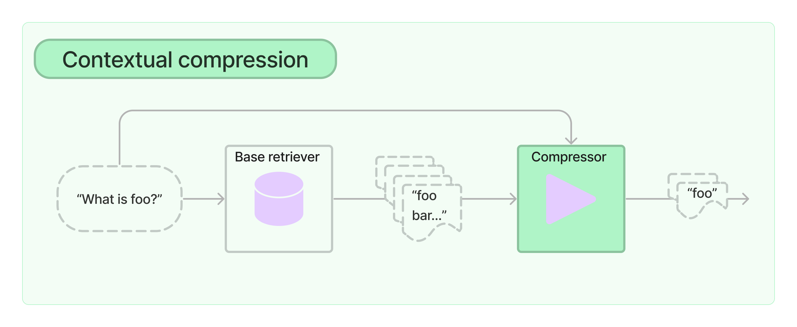

# Contextual compression

檢索的一項挑戰是，通常您不知道當您將資料引入系統時，文檔儲存系統將面臨哪些特定查詢。這意味著與查詢最相關的資訊可能被隱藏在包含大量不相關文字的文件中。透過您的申請傳遞完整的文件可能會導致更昂貴的 LLM 呼叫和更差的回應。

上下文壓縮(contextual compression)旨在解決這個問題。這個想法很簡單：您可以使用給定查詢的上下文來壓縮它們，以便只返回相關信息，而不是立即按原樣返回檢索到的文檔。這裡的「壓縮」既指壓縮單一文件的內容，也指批次過濾文件。

要使用上下文壓縮檢索器，您需要：

- 一個 base retriever
- 一個 Document Compressor

上下文壓縮檢索器將查詢傳遞給基礎檢索器(base retriever)，取得初始文件並將它們傳遞給文件壓縮器(Document Compressor)。文件壓縮器會取得文件清單並透過減少文件內容或完全刪除文件來縮短它。



## 開始使用

---

```python
# Helper function for printing docs

def pretty_print_docs(docs):
    print(f"\n{'-' * 100}\n".join([f"Document {i+1}:\n\n" + d.page_content for i, d in enumerate(docs)]))
```

### 使用普通向量儲存檢索器

讓我們先初始化一個簡單的向量儲存檢索器並儲存 2023 年國情咨文演講（以區塊的形式）。我們可以看到，給定一個範例問題，我們的檢索器會傳回一兩個相關文件和一些不相關的文件。甚至相關文件中也有很多不相關的資訊。

```python
from langchain.text_splitter import CharacterTextSplitter
from langchain.embeddings import OpenAIEmbeddings
from langchain.document_loaders import TextLoader
from langchain.vectorstores import FAISS

documents = TextLoader('../../../state_of_the_union.txt').load()

text_splitter = CharacterTextSplitter(chunk_size=1000, chunk_overlap=0)

texts = text_splitter.split_documents(documents)

retriever = FAISS.from_documents(texts, OpenAIEmbeddings()).as_retriever()

docs = retriever.get_relevant_documents("What did the president say about Ketanji Brown Jackson")

pretty_print_docs(docs)
```

結果:

```
    Document 1:
    
    Tonight. I call on the Senate to: Pass the Freedom to Vote Act. Pass the John Lewis Voting Rights Act. And while you’re at it, pass the Disclose Act so Americans can know who is funding our elections. 
    
    Tonight, I’d like to honor someone who has dedicated his life to serve this country: Justice Stephen Breyer—an Army veteran, Constitutional scholar, and retiring Justice of the United States Supreme Court. Justice Breyer, thank you for your service. 
    
    One of the most serious constitutional responsibilities a President has is nominating someone to serve on the United States Supreme Court. 
    
    And I did that 4 days ago, when I nominated Circuit Court of Appeals Judge Ketanji Brown Jackson. One of our nation’s top legal minds, who will continue Justice Breyer’s legacy of excellence.
    ----------------------------------------------------------------------------------------------------
    Document 2:
    
    A former top litigator in private practice. A former federal public defender. And from a family of public school educators and police officers. A consensus builder. Since she’s been nominated, she’s received a broad range of support—from the Fraternal Order of Police to former judges appointed by Democrats and Republicans. 
    
    And if we are to advance liberty and justice, we need to secure the Border and fix the immigration system. 
    
    We can do both. At our border, we’ve installed new technology like cutting-edge scanners to better detect drug smuggling.  
    
    We’ve set up joint patrols with Mexico and Guatemala to catch more human traffickers.  
    
    We’re putting in place dedicated immigration judges so families fleeing persecution and violence can have their cases heard faster. 
    
    We’re securing commitments and supporting partners in South and Central America to host more refugees and secure their own borders.
    ----------------------------------------------------------------------------------------------------
    Document 3:
    
    And for our LGBTQ+ Americans, let’s finally get the bipartisan Equality Act to my desk. The onslaught of state laws targeting transgender Americans and their families is wrong. 
    
    As I said last year, especially to our younger transgender Americans, I will always have your back as your President, so you can be yourself and reach your God-given potential. 
    
    While it often appears that we never agree, that isn’t true. I signed 80 bipartisan bills into law last year. From preventing government shutdowns to protecting Asian-Americans from still-too-common hate crimes to reforming military justice. 
    
    And soon, we’ll strengthen the Violence Against Women Act that I first wrote three decades ago. It is important for us to show the nation that we can come together and do big things. 
    
    So tonight I’m offering a Unity Agenda for the Nation. Four big things we can do together.  
    
    First, beat the opioid epidemic.
    ----------------------------------------------------------------------------------------------------
    Document 4:
    
    Tonight, I’m announcing a crackdown on these companies overcharging American businesses and consumers. 
    
    And as Wall Street firms take over more nursing homes, quality in those homes has gone down and costs have gone up.  
    
    That ends on my watch. 
    
    Medicare is going to set higher standards for nursing homes and make sure your loved ones get the care they deserve and expect. 
    
    We’ll also cut costs and keep the economy going strong by giving workers a fair shot, provide more training and apprenticeships, hire them based on their skills not degrees. 
    
    Let’s pass the Paycheck Fairness Act and paid leave.  
    
    Raise the minimum wage to $15 an hour and extend the Child Tax Credit, so no one has to raise a family in poverty. 
    
    Let’s increase Pell Grants and increase our historic support of HBCUs, and invest in what Jill—our First Lady who teaches full-time—calls America’s best-kept secret: community colleges.
```

### 使用 LLMChainExtractor 新增上下文壓縮

現在讓我們用 `ContextualCompressionRetriever` 包裝我們的基本檢索器。我們將新增一個 `LLMChainExtractor`，它將迭代最初返回的文檔，並從每個文檔中僅提取與查詢相關的內容。

```python
from langchain.llms import OpenAI
from langchain.retrievers import ContextualCompressionRetriever
from langchain.retrievers.document_compressors import LLMChainExtractor

llm = OpenAI(temperature=0)

compressor = LLMChainExtractor.from_llm(llm)

compression_retriever = ContextualCompressionRetriever(base_compressor=compressor, base_retriever=retriever)

compressed_docs = compression_retriever.get_relevant_documents("What did the president say about Ketanji Jackson Brown")

pretty_print_docs(compressed_docs)
```

結果:

```
    Document 1:
    
    "One of the most serious constitutional responsibilities a President has is nominating someone to serve on the United States Supreme Court. 
    
    And I did that 4 days ago, when I nominated Circuit Court of Appeals Judge Ketanji Brown Jackson. One of our nation’s top legal minds, who will continue Justice Breyer’s legacy of excellence."
    ----------------------------------------------------------------------------------------------------
    Document 2:
    
    "A former top litigator in private practice. A former federal public defender. And from a family of public school educators and police officers. A consensus builder. Since she’s been nominated, she’s received a broad range of support—from the Fraternal Order of Police to former judges appointed by Democrats and Republicans."
```

## 內建的 Compressors: filters

---

### `LLMChainFilter`

`LLMChainFilter` 是稍微簡單但更強大的壓縮器，它使用 LLM 鏈來決定過濾掉最初檢索的文檔中的哪些以及返回哪些文檔，而無需操作文檔內容。

```python
from langchain.retrievers.document_compressors import LLMChainFilter

_filter = LLMChainFilter.from_llm(llm)

compression_retriever = ContextualCompressionRetriever(base_compressor=_filter, base_retriever=retriever)

compressed_docs = compression_retriever.get_relevant_documents("What did the president say about Ketanji Jackson Brown")

pretty_print_docs(compressed_docs)
```

結果:

```
    Document 1:
    
    Tonight. I call on the Senate to: Pass the Freedom to Vote Act. Pass the John Lewis Voting Rights Act. And while you’re at it, pass the Disclose Act so Americans can know who is funding our elections. 
    
    Tonight, I’d like to honor someone who has dedicated his life to serve this country: Justice Stephen Breyer—an Army veteran, Constitutional scholar, and retiring Justice of the United States Supreme Court. Justice Breyer, thank you for your service. 
    
    One of the most serious constitutional responsibilities a President has is nominating someone to serve on the United States Supreme Court. 
    
    And I did that 4 days ago, when I nominated Circuit Court of Appeals Judge Ketanji Brown Jackson. One of our nation’s top legal minds, who will continue Justice Breyer’s legacy of excellence.
```

### `EmbeddingsFilter`

對每個檢索到的文件進行額外的 LLM 呼叫既昂貴又緩慢。 `EmbeddingsFilter` 透過嵌入文件和查詢並只傳回那些與查詢具有足夠相似嵌入的文件來提供更便宜且更快的選項。

```python
from langchain.embeddings import OpenAIEmbeddings
from langchain.retrievers.document_compressors import EmbeddingsFilter

embeddings = OpenAIEmbeddings()

embeddings_filter = EmbeddingsFilter(embeddings=embeddings, similarity_threshold=0.76)

compression_retriever = ContextualCompressionRetriever(base_compressor=embeddings_filter, base_retriever=retriever)

compressed_docs = compression_retriever.get_relevant_documents("What did the president say about Ketanji Jackson Brown")

pretty_print_docs(compressed_docs)
```

結果:

```
    Document 1:
    
    Tonight. I call on the Senate to: Pass the Freedom to Vote Act. Pass the John Lewis Voting Rights Act. And while you’re at it, pass the Disclose Act so Americans can know who is funding our elections. 
    
    Tonight, I’d like to honor someone who has dedicated his life to serve this country: Justice Stephen Breyer—an Army veteran, Constitutional scholar, and retiring Justice of the United States Supreme Court. Justice Breyer, thank you for your service. 
    
    One of the most serious constitutional responsibilities a President has is nominating someone to serve on the United States Supreme Court. 
    
    And I did that 4 days ago, when I nominated Circuit Court of Appeals Judge Ketanji Brown Jackson. One of our nation’s top legal minds, who will continue Justice Breyer’s legacy of excellence.
    ----------------------------------------------------------------------------------------------------
    Document 2:
    
    A former top litigator in private practice. A former federal public defender. And from a family of public school educators and police officers. A consensus builder. Since she’s been nominated, she’s received a broad range of support—from the Fraternal Order of Police to former judges appointed by Democrats and Republicans. 
    
    And if we are to advance liberty and justice, we need to secure the Border and fix the immigration system. 
    
    We can do both. At our border, we’ve installed new technology like cutting-edge scanners to better detect drug smuggling.  
    
    We’ve set up joint patrols with Mexico and Guatemala to catch more human traffickers.  
    
    We’re putting in place dedicated immigration judges so families fleeing persecution and violence can have their cases heard faster. 
    
    We’re securing commitments and supporting partners in South and Central America to host more refugees and secure their own borders.
    ----------------------------------------------------------------------------------------------------
    Document 3:
    
    And for our LGBTQ+ Americans, let’s finally get the bipartisan Equality Act to my desk. The onslaught of state laws targeting transgender Americans and their families is wrong. 
    
    As I said last year, especially to our younger transgender Americans, I will always have your back as your President, so you can be yourself and reach your God-given potential. 
    
    While it often appears that we never agree, that isn’t true. I signed 80 bipartisan bills into law last year. From preventing government shutdowns to protecting Asian-Americans from still-too-common hate crimes to reforming military justice. 
    
    And soon, we’ll strengthen the Violence Against Women Act that I first wrote three decades ago. It is important for us to show the nation that we can come together and do big things. 
    
    So tonight I’m offering a Unity Agenda for the Nation. Four big things we can do together.  
    
    First, beat the opioid epidemic.
```

## Stringing 壓縮器與 Document transformer

使用 `DocumentCompressorPipeline` 我們也可以輕鬆地依序組合多個壓縮器。除了壓縮器之外，我們還可以將 `BaseDocumentTransformers` 新增到管道中，它不執行任何上下文壓縮，而只是對一組文件執行一些轉換。例如，`TextSplitters` 可以用作文件轉換器，將文件分割成更小的部分，而 `EmbeddingsRedundantFilter` 可以用於根據文件之間嵌入的相似性來過濾掉冗餘文件。

下面我們建立一個壓縮器管道，首先將文檔分割成更小的區塊，然後刪除冗餘文檔，然後根據與查詢的相關性進行過濾。

```python
from langchain.document_transformers import EmbeddingsRedundantFilter
from langchain.retrievers.document_compressors import DocumentCompressorPipeline
from langchain.text_splitter import CharacterTextSplitter

splitter = CharacterTextSplitter(chunk_size=300, chunk_overlap=0, separator=". ")

redundant_filter = EmbeddingsRedundantFilter(embeddings=embeddings)

relevant_filter = EmbeddingsFilter(embeddings=embeddings, similarity_threshold=0.76)

pipeline_compressor = DocumentCompressorPipeline(
    transformers=[splitter, redundant_filter, relevant_filter]
)

compression_retriever = ContextualCompressionRetriever(base_compressor=pipeline_compressor, base_retriever=retriever)

compressed_docs = compression_retriever.get_relevant_documents("What did the president say about Ketanji Jackson Brown")

pretty_print_docs(compressed_docs)
```

結果:

```
    Document 1:
    
    One of the most serious constitutional responsibilities a President has is nominating someone to serve on the United States Supreme Court. 
    
    And I did that 4 days ago, when I nominated Circuit Court of Appeals Judge Ketanji Brown Jackson
    ----------------------------------------------------------------------------------------------------
    Document 2:
    
    As I said last year, especially to our younger transgender Americans, I will always have your back as your President, so you can be yourself and reach your God-given potential. 
    
    While it often appears that we never agree, that isn’t true. I signed 80 bipartisan bills into law last year
    ----------------------------------------------------------------------------------------------------
    Document 3:
    
    A former top litigator in private practice. A former federal public defender. And from a family of public school educators and police officers. A consensus builder
```