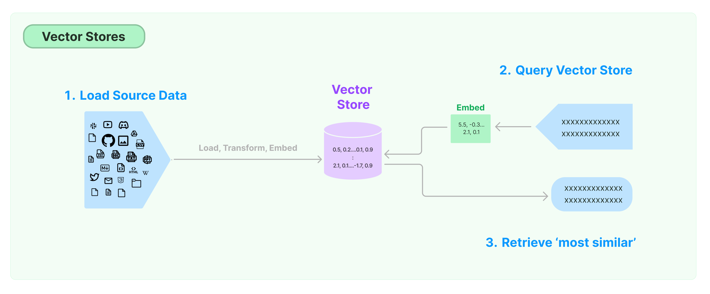

# Vector stores

!!! info
    查看 [Integrations](https://python.langchain.com/docs/integrations/vectorstores/) 以取得 langchain 的 vector stores 與第三方工具整合的文件。

儲存和搜尋非結構化資料的最常見方法之一是嵌入它並儲存產生的嵌入向量(embedded vectors)，然後在查詢時嵌入非結構化查詢並檢索與嵌入查詢「最相似」的嵌入向量。向量儲存負責儲存嵌入資料並為您執行向量搜尋。




## 開始使用

---

本演練展示了與向量儲存相關的基本功能。使用向量儲存的關鍵部分是建立要放入其中的向量，這通常是透過嵌入來創建的。因此，建議您在深入研究之前熟悉[text embedding model](https://python.langchain.com/docs/modules/data_connection/text_embedding/)介面。

有許多很棒的向量儲存選項，以下是一些免費、開源且完全在本機上運行的選項。除此之外也可查詞許多出色的[託管產品](https://python.langchain.com/docs/integrations/vectorstores/)。

=== "Chroma"

    本演練使用 chroma 向量資料庫，該資料庫作為套件在本機電腦上運行。

    ```bash
    pip install chromadb
    ```

    我們想要使用 OpenAIEmbeddings，因此我們必須取得 OpenAI API 金鑰。

    ```python
    import os
    import getpass

    os.environ['OPENAI_API_KEY'] = getpass.getpass('OpenAI API Key:')

    from langchain.document_loaders import TextLoader
    from langchain.embeddings.openai import OpenAIEmbeddings
    from langchain.text_splitter import CharacterTextSplitter
    from langchain.vectorstores import Chroma

    # Load the document, split it into chunks, embed each chunk and load it into the vector store.
    raw_documents = TextLoader('../../../state_of_the_union.txt').load()
    text_splitter = CharacterTextSplitter(chunk_size=1000, chunk_overlap=0)
    documents = text_splitter.split_documents(raw_documents)
    db = Chroma.from_documents(documents, OpenAIEmbeddings())
    ```

=== "FAISS"

    本演練使用 `FAISS` 向量資料庫，該資料庫利用 Facebook AI 相似性搜尋 (FAISS) 函式庫。

    ```bash
    pip install faiss-cpu
    ```

    我們想要使用 OpenAIEmbeddings，因此我們必須取得 OpenAI API 金鑰。

    ```python
    import os
    import getpass

    os.environ['OPENAI_API_KEY'] = getpass.getpass('OpenAI API Key:')

    from langchain.document_loaders import TextLoader
    from langchain.embeddings.openai import OpenAIEmbeddings
    from langchain.text_splitter import CharacterTextSplitter
    from langchain.vectorstores import FAISS

    # Load the document, split it into chunks, embed each chunk and load it into the vector store.
    raw_documents = TextLoader('../../../state_of_the_union.txt').load()
    text_splitter = CharacterTextSplitter(chunk_size=1000, chunk_overlap=0)
    documents = text_splitter.split_documents(raw_documents)
    db = FAISS.from_documents(documents, OpenAIEmbeddings())
    ```

=== "Lance"

    本演練展示如何使用與基於 `Lance` 資料格式的 `LanceDB` 向量資料庫相關的功能。

    ```bash
    pip install lancedb
    ```

    我們想要使用 `OpenAIEmbeddings`，因此我們必須取得 OpenAI API 金鑰。

    ```python
    import os
    import getpass

    os.environ['OPENAI_API_KEY'] = getpass.getpass('OpenAI API Key:')

    from langchain.document_loaders import TextLoader
    from langchain.embeddings.openai import OpenAIEmbeddings
    from langchain.text_splitter import CharacterTextSplitter
    from langchain.vectorstores import LanceDB

    import lancedb

    db = lancedb.connect("/tmp/lancedb")
    table = db.create_table(
        "my_table",
        data=[
            {
                "vector": embeddings.embed_query("Hello World"),
                "text": "Hello World",
                "id": "1",
            }
        ],
        mode="overwrite",
    )

    # Load the document, split it into chunks, embed each chunk and load it into the vector store.
    raw_documents = TextLoader('../../../state_of_the_union.txt').load()
    text_splitter = CharacterTextSplitter(chunk_size=1000, chunk_overlap=0)
    documents = text_splitter.split_documents(raw_documents)
    db = LanceDB.from_documents(documents, OpenAIEmbeddings(), connection=table)
    ```


### 相似性搜尋

```python
query = "What did the president say about Ketanji Brown Jackson"

docs = db.similarity_search(query)

print(docs[0].page_content)
```

結果:

```
    Tonight. I call on the Senate to: Pass the Freedom to Vote Act. Pass the John Lewis Voting Rights Act. And while you’re at it, pass the Disclose Act so Americans can know who is funding our elections.

    Tonight, I’d like to honor someone who has dedicated his life to serve this country: Justice Stephen Breyer—an Army veteran, Constitutional scholar, and retiring Justice of the United States Supreme Court. Justice Breyer, thank you for your service.

    One of the most serious constitutional responsibilities a President has is nominating someone to serve on the United States Supreme Court.

    And I did that 4 days ago, when I nominated Circuit Court of Appeals Judge Ketanji Brown Jackson. One of our nation’s top legal minds, who will continue Justice Breyer’s legacy of excellence.
```

### 透過向量進行相似性搜尋

還可以使用相似度搜索與給定嵌入向量相似的文件進行搜索，該向量接受嵌入向量作為參數而不是字串。

```python
embedding_vector = OpenAIEmbeddings().embed_query(query)

docs = db.similarity_search_by_vector(embedding_vector)

print(docs[0].page_content)
```

查詢相同，所以結果也相同。


結果:

```
    Tonight. I call on the Senate to: Pass the Freedom to Vote Act. Pass the John Lewis Voting Rights Act. And while you’re at it, pass the Disclose Act so Americans can know who is funding our elections.

    Tonight, I’d like to honor someone who has dedicated his life to serve this country: Justice Stephen Breyer—an Army veteran, Constitutional scholar, and retiring Justice of the United States Supreme Court. Justice Breyer, thank you for your service.

    One of the most serious constitutional responsibilities a President has is nominating someone to serve on the United States Supreme Court.

    And I did that 4 days ago, when I nominated Circuit Court of Appeals Judge Ketanji Brown Jackson. One of our nation’s top legal minds, who will continue Justice Breyer’s legacy of excellence.
```

## 非同步操作

---

向量儲存通常作為需要一些 IO 操作的單獨服務運行，因此它們可能會被非同步調用。這會帶來效能優勢，因為您不必浪費時間等待外部服務的回應。如果您使用非同步框架（例如 [FastAPI](https://fastapi.tiangolo.com/)），這一點也可能很重要。

LangChain 支援向量儲存的非同步操作。所有方法都可以使用其非同步對應方法進行調用，前綴 `a` 表示 `async`。

`Qdrant` 是一個向量存儲，它支援所有非同步操作，因此將在本演練中使用它。

```python
pip install qdrant-client

from langchain.vectorstores import Qdrant
```

### 相似性搜尋

```python
query = "What did the president say about Ketanji Brown Jackson"

docs = await db.asimilarity_search(query)

print(docs[0].page_content)
```

結果:

```
    Tonight. I call on the Senate to: Pass the Freedom to Vote Act. Pass the John Lewis Voting Rights Act. And while you’re at it, pass the Disclose Act so Americans can know who is funding our elections.

    Tonight, I’d like to honor someone who has dedicated his life to serve this country: Justice Stephen Breyer—an Army veteran, Constitutional scholar, and retiring Justice of the United States Supreme Court. Justice Breyer, thank you for your service.

    One of the most serious constitutional responsibilities a President has is nominating someone to serve on the United States Supreme Court.

    And I did that 4 days ago, when I nominated Circuit Court of Appeals Judge Ketanji Brown Jackson. One of our nation’s top legal minds, who will continue Justice Breyer’s legacy of excellence.
```

### 透過向量進行相似性搜尋

```python
embedding_vector = embeddings.embed_query(query)

docs = await db.asimilarity_search_by_vector(embedding_vector)
```

## 最大邊際相關性搜尋 (MMR)

---

最大邊際相關性優化了所選文件之間查詢的相似性和多樣性。非同步 API 也支援它。

```python
query = "What did the president say about Ketanji Brown Jackson"

found_docs = await qdrant.amax_marginal_relevance_search(query, k=2, fetch_k=10)

for i, doc in enumerate(found_docs):
    print(f"{i + 1}.", doc.page_content, "\n")
```

結果:

```
1. Tonight. I call on the Senate to: Pass the Freedom to Vote Act. Pass the John Lewis Voting Rights Act. And while you’re at it, pass the Disclose Act so Americans can know who is funding our elections.

Tonight, I’d like to honor someone who has dedicated his life to serve this country: Justice Stephen Breyer—an Army veteran, Constitutional scholar, and retiring Justice of the United States Supreme Court. Justice Breyer, thank you for your service.

One of the most serious constitutional responsibilities a President has is nominating someone to serve on the United States Supreme Court.

And I did that 4 days ago, when I nominated Circuit Court of Appeals Judge Ketanji Brown Jackson. One of our nation’s top legal minds, who will continue Justice Breyer’s legacy of excellence.

2. We can’t change how divided we’ve been. But we can change how we move forward—on COVID-19 and other issues we must face together.

I recently visited the New York City Police Department days after the funerals of Officer Wilbert Mora and his partner, Officer Jason Rivera.

They were responding to a 9-1-1 call when a man shot and killed them with a stolen gun.

Officer Mora was 27 years old.

Officer Rivera was 22.

Both Dominican Americans who’d grown up on the same streets they later chose to patrol as police officers.

I spoke with their families and told them that we are forever in debt for their sacrifice, and we will carry on their mission to restore the trust and safety every community deserves.

I’ve worked on these issues a long time.

I know what works: Investing in crime preventionand community police officers who’ll walk the beat, who’ll know the neighborhood, and who can restore trust and safety.
```