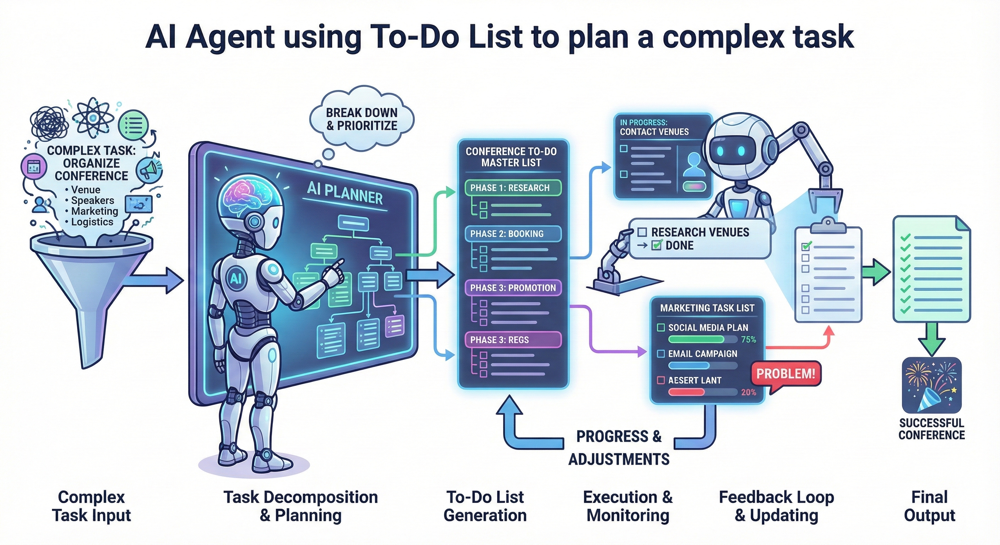
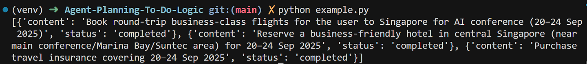

# Agent 如何使用 TODO 來規劃任務

原文: [How Agents Plan Tasks with To-Do Lists
](https://towardsdatascience.com/how-agents-plan-tasks-with-to-do-lists/)

> 理解 LangChain 中 agent 規劃與任務管理背後的過程

規劃是我們每個人都會自然而然地經常做的事情。在個人生活中，我們經常列出待辦事項清單來安排假期、瑣事以及其他各種事項。

在工作中，我們依靠任務追蹤器和專案計劃來確保團隊目標一致。對於開發人員來說，在程式碼中加入 TODO 註解作為未來修改的提醒也十分常見。

不出所料，LLM agent 也能從清晰的待辦事項清單中受益，從而更好地進行規劃。

待辦事項清單可以幫助代理更有效地規劃和追蹤複雜的任務，因此對於需要可見進度的多工具協作和長期運行的操作來說，它們尤其有用。

OpenAI Codex, Cline 和 Claude Code 等編碼代理就是這一概念的典型例子。

他們將複雜的請求分解成一系列執行步驟，將其組織成一個包含依賴關係的待辦事項清單，並隨著任務的完成或新資訊的出現即時更新計劃。




這種清晰性使 agent 能夠處理冗長的操作序列，協調不同工具之間的交互，並以易於理解的方式追蹤進度。

在本文中，我們將深入探討 agent 如何利用待辦事項清單功能，分析規劃流程的底層組成部分，並示範如何使用 LangChain 實現此流程。

## Agnet 規劃任務的範例

讓我們來看一個範例場景，以便更好地理解我們的操作步驟。

我們將設定一個 agent 來規劃旅行行程並執行預訂任務。該代理可以使用以下三種工具：

- `buy_travel_insurance`: 購買旅遊保險
- `book_flight`: 依行程預訂航班
- `book_hotel`: 根據行程安排預訂住宿

> 在這個例子中，這些工具是模擬的，並沒有執行真正的預訂；它們被包含在內是為了說明代理的計劃邏輯以及它是如何使用待辦事項清單的。

以下是在 LangChain 中實現我們的規劃代理程式的程式碼：

```python
agent_prompt = """
You are a executive assistant who plans and executes setup of travel trips.
If any details are missing, no need to ask user, just make realistic assumptions directly.
After entire plan is completed, succinctly explain rationale for sequence of actions of the plan.
"""

agent = create_agent(
    system_prompt=agent_prompt,
    model="openai:gpt-5.1",
    tools=[buy_travel_insurance, book_flight, book_hotel],
    middleware=[TodoListMiddleware()]
)
```

我們輸入使用者查詢，然後查看代理規劃產生的待辦事項清單：

```python
user_input = "Book business trip to Singapore between 20 and 24 Sep 2025 for an AI conference"
response = agent.invoke({"messages": [HumanMessage(user_input)]})

# Show the to-do list generated by the planning agent
print(response["todos"])
```



透過待辦事項清單進行結構化筆記，agent 能夠在上下文視窗之外保持持久記憶。這種策略提高了智能體管理和保留相關上下文資訊的能力。

程式碼設定很簡單：`create_agent` 函數建立 LLM 代理實例，我們傳入系統提示符，選擇模，並連結工具。

值得注意的是傳遞給中間件參數的 `TodoListMiddleware()` 物件。

### LangChain 中間件是什麼？

顧名思義，中間​​件是一個中間層，可讓您在 LLM 呼叫前後執行自訂程式碼。

您可以將中間件視為一個可編程層，它允許我們注入程式碼來監控、調整或擴展代理的行為。

它使我們能夠在不改變代理核心邏輯的情況下控制和了解其行為。它可以用於轉換提示和輸出、管理重試或提前退出，以及應用安全措施（例如，防護機制、PII 檢查）。

`TodoListMiddleware` 是 Langchain 內建中間件，專門為代理提供待辦事項清單管理功能。接下來，我們將探討 `TodoListMiddleware` 的底層運作原理。

## TODO 能力的關鍵組成

TODO 的待辦事項清單管理能力可歸結為以下四個關鍵要素：

- To-do task item
- List of to-do items
- A tool that writes and updates the to-do list
- To-do system prompt update

`TodoListMiddleware` 將這些元素整合在一起，從而實現代理程式的待辦事項清單功能。

讓我們仔細看看每個元件以及它們在待辦事項[中間件程式碼](https://github.com/langchain-ai/langchain/blob/master/libs/langchain_v1/langchain/agents/middleware/todo.py)中的實作方式。

### To-do task item

待辦事項(to-do item)是待辦事項清單中的最小單元，代表一項任務。它由兩個字段組成：

- 任務描述
- 當前狀態。

在 LangChain 中，這被建模為 Todo 類型，並使用 TypedDict 定義：

```python
class Todo(TypedDict):
    """A single todo item with content and status."""

    content: str
    """The content/description of the todo item."""

    status: Literal["pending", "in_progress", "completed"]
    """The current status of the todo item."""
```

內容欄位(`content`)表示代理接下來需要執行的任務的描述，而狀態欄位(`status`)追蹤任務是尚未開始（`pending`）、正在處理（`in_progress`）還是已完成（`completed`）。

以下是待辦事項範例：

```json
{
   "content": "Compare flight options from Singapore to Tokyo",
   "status": "completed"
},
```


### List of to-do items

現在我們已經定義了待辦事項的結構，接下來我們將探討如何儲存和追蹤一組待辦事項，使其成為整體計劃的一部分。

我們定義了一個狀態物件（`PlanningState`），用於將計劃捕獲為待辦事項列表，該列表會隨著任務的執行而更新：

```python hl_lines="4"
class PlanningState(AgentState[Any]):
    """State schema for the todo middleware."""

    todos: Annotated[NotRequired[list[Todo]], OmitFromInput]
    """List of todo items for tracking task progress."""
```

待辦事項欄位是可選的（非必要），這意味著在首次初始化時可能不存在（即，代理程式的計劃中可能還沒有任何任務）。

`OmitFromInput` 表示待辦事項由中間件內部管理，不應直接作為使用者輸入提供。

!!! tip
    狀態(state)是 agent 的短期記憶，它記錄著最近的對話和關鍵訊息，以便 agent 能夠根據先前的上下文和資訊採取適當的行動。

    在這種情況下，待辦事項清單會保留在狀態中，供 agent 在整個會話期間參考並持續更新任務。

以下是待辦事項清單的範例：

```python
todos: list[Todo] = [
    {
        "content": "Research visa requirements for Singapore passport holders visiting Japan",
        "status": "completed"
    },
    {
        "content": "Compare flight options from Singapore to Tokyo",
        "status": "in_progress"
    },
    {
        "content": "Book flights and hotels once itinerary is finalized",
        "status": "pending"
    }
]
```

### Tool to write and update to-dos

待辦事項清單的基本架構已經建立，現在我們需要一個工具供 LLM 代理程式在任務執行過程中管理和更新該清單。

以下是定義該工具（`write_todos`）的標準方法：

```python
@tool(description=WRITE_TODOS_TOOL_DESCRIPTION)
def write_todos(
    todos: list[Todo], tool_call_id: Annotated[str, InjectedToolCallId]
) -> Command[Any]:
    """Create and manage a structured task list for your current work session."""
    return Command(
        update={
            "todos": todos,
            "messages": [ToolMessage(f"Updated todo list to {todos}", tool_call_id=tool_call_id)],
        }
    )

```

`write_todos` 工具傳回一個命令(`Command`)，該命令指示代理更新其待辦事項清單並附加一條記錄變更的訊息。

雖然 `write_todos` 的結構很簡單，但其奧妙在於工具的描述（`WRITE_TODOS_TOOL_DESCRIPTION`）。

```python
WRITE_TODOS_TOOL_DESCRIPTION = """Use this tool to create and manage a structured task list for your current work session. This helps you track progress, organize complex tasks, and demonstrate thoroughness to the user.

Only use this tool if you think it will be helpful in staying organized. If the user's request is trivial and takes less than 3 steps, it is better to NOT use this tool and just do the task directly.

## When to Use This Tool
Use this tool in these scenarios:

1. Complex multi-step tasks - When a task requires 3 or more distinct steps or actions
2. Non-trivial and complex tasks - Tasks that require careful planning or multiple operations
3. User explicitly requests todo list - When the user directly asks you to use the todo list
4. User provides multiple tasks - When users provide a list of things to be done (numbered or comma-separated)
5. The plan may need future revisions or updates based on results from the first few steps

## How to Use This Tool
1. When you start working on a task - Mark it as in_progress BEFORE beginning work.
2. After completing a task - Mark it as completed and add any new follow-up tasks discovered during implementation.
3. You can also update future tasks, such as deleting them if they are no longer necessary, or adding new tasks that are necessary. Don't change previously completed tasks.
4. You can make several updates to the todo list at once. For example, when you complete a task, you can mark the next task you need to start as in_progress.

## When NOT to Use This Tool
It is important to skip using this tool when:
1. There is only a single, straightforward task
2. The task is trivial and tracking it provides no benefit
3. The task can be completed in less than 3 trivial steps
4. The task is purely conversational or informational

## Task States and Management

1. **Task States**: Use these states to track progress:
   - pending: Task not yet started
   - in_progress: Currently working on (you can have multiple tasks in_progress at a time if they are not related to each other and can be run in parallel)
   - completed: Task finished successfully

2. **Task Management**:
   - Update task status in real-time as you work
   - Mark tasks complete IMMEDIATELY after finishing (don't batch completions)
   - Complete current tasks before starting new ones
   - Remove tasks that are no longer relevant from the list entirely
   - IMPORTANT: When you write this todo list, you should mark your first task (or tasks) as in_progress immediately!.
   - IMPORTANT: Unless all tasks are completed, you should always have at least one task in_progress to show the user that you are working on something.

3. **Task Completion Requirements**:
   - ONLY mark a task as completed when you have FULLY accomplished it
   - If you encounter errors, blockers, or cannot finish, keep the task as in_progress
   - When blocked, create a new task describing what needs to be resolved
   - Never mark a task as completed if:
     - There are unresolved issues or errors
     - Work is partial or incomplete
     - You encountered blockers that prevent completion
     - You couldn't find necessary resources or dependencies
     - Quality standards haven't been met

4. **Task Breakdown**:
   - Create specific, actionable items
   - Break complex tasks into smaller, manageable steps
   - Use clear, descriptive task names

Being proactive with task management demonstrates attentiveness and ensures you complete all requirements successfully
Remember: If you only need to make a few tool calls to complete a task, and it is clear what you need to do, it is better to just do the task directly and NOT call this tool at all."""  # noqa: E501
```

**中文版本:**

```python
WRITE_TODOS_TOOL_DESCRIPTION = """使用此工具建立和管理目前工作會話的結構化任務清單。這有助於您追蹤進度、組織複雜任務，並向使用者展示您的工作細緻周全。

只有當您認為此工具有助於保持工作條理清晰時才使用它。如果使用者的請求非常簡單，只需不到 3 個步驟即可完成，則最好不要使用此工具，直接執行任務。

## 何時使用此工具

在以下情況下使用此工具：

1. 複雜的多步驟任務 - 當任務需要 3 個或更多不同的步驟或操作時
2. 重要的複雜任務 - 需要仔細規劃或多個操作的任務
3. 使用者明確要求使用待辦事項清單 - 當使用者直接要求您使用待辦事項清單時
4. 使用者提供多個任務 - 當使用者提供待辦事項清單（編號或逗號分隔）時
5. 根據前幾個步驟的結果，計劃可能需要在後續進行修訂或更新

## 如何使用此工具

1. 開始處理任務時 - 請在開始工作前將其標記為「in_progress」。
2. 完成任務後 - 將其標記為“completed”，並新增執行過程中發現的任何後續任務。
3. 您也可以更新未來的任務，例如刪除不再需要的任務，或新增必要的新任務。請勿更改已完成的任務。
4. 您可以一次對待待辦事項清單進行多項更新。例如，完成一項任務後，您可以將下一個需要開始的任務標記為「in_progress」。


## 何時不應使用此工具

以下情況請勿使用此工具：

1. 只有一個簡單直接的任務
2. 任務瑣碎，追蹤它沒有任何意義
3. 任務只需不到 3 個簡單的步驟即可完成
4. 任務純粹是對話或訊息傳遞

## 任務狀態與管理

1. **任務狀態**：使用以下狀態追蹤進度：

- pending：任務尚未開始
- in_progress：目前正在進行中（如果多個任務彼此無關且可以並行運行，則可以同時處於 in_progress 狀態）
- completed：任務已成功完成

2. **任務管理**：

- 工作時即時更新任務狀態
- 任務完成後立即標記為已完成（不要批量完成）
- 完成目前任務後再開始新任務
- 從清單中徹底刪除不再相關的任務
- 重要提示：建立此待辦事項清單時，應立即將第一個（或多個）任務標記為進行中！
- 重要提示：除非所有任務都已完成，否則應始終保留至少一個進行中的任務，以向使用者表明您正在處理某些工作。

3. **任務完成要求**：

- 只有當您完全完成任務時，才將其標記為已完成
- 如果您遇到錯誤、障礙或無法完成任務，請將任務狀態保持為“進行中”
- 如果任務受阻，請建立一個新任務，描述需要解決的問題
- 若出現以下情況，切勿將任務標記為已完成：
    - 存在未解決的問題或錯誤
    - 工作未完成或未完全完成
    - 您遇到了阻礙任務完成的障礙
    - 您找不到必要的資源或依賴項
    - 未達品質標準

4. **任務分解**：

- 建立具體、可執行的任務項
- 將複雜任務分解為更小、更易於管理的步驟
- 使用清晰、描述性的任務名稱

積極主動地進行任務管理，既能展現您的細緻周到，又能確保您順利完成所有要求。

記住：如果完成一項任務只需要呼叫幾個工具，而且您很清楚自己需要做什麼，那麼最好直接執行任務，完全不要呼叫該工具。"""
```

我們可以看到，該描述結構嚴謹、條理清晰，明確定義了工具的使用時機和方式、任務狀態以及管理規則。

它還提供了清晰的指導原則，用於追蹤複雜任務、將其分解為清晰的步驟並進行系統化的更新。

### System prompt update

設定待辦事項功能的最後一個步驟是更新代理程式的系統提示字元。

具體做法是將 `WRITE_TODOS_SYSTEM_PROMPT` 注入主提示字元中，明確告知代理人 `write_todos` 工具的存在。

它指導代理人何時以及為何使用該工具，為複雜的多步驟任務提供背景信息，並概述維護和更新待辦事項清單的最佳實踐：

```python
WRITE_TODOS_SYSTEM_PROMPT = """## `write_todos`

You have access to the `write_todos` tool to help you manage and plan complex objectives.
Use this tool for complex objectives to ensure that you are tracking each necessary step and giving the user visibility into your progress.
This tool is very helpful for planning complex objectives, and for breaking down these larger complex objectives into smaller steps.

It is critical that you mark todos as completed as soon as you are done with a step. Do not batch up multiple steps before marking them as completed.
For simple objectives that only require a few steps, it is better to just complete the objective directly and NOT use this tool.
Writing todos takes time and tokens, use it when it is helpful for managing complex many-step problems! But not for simple few-step requests.

## Important To-Do List Usage Notes to Remember
- The `write_todos` tool should never be called multiple times in parallel.
- Don't be afraid to revise the To-Do list as you go. New information may reveal new tasks that need to be done, or old tasks that are irrelevant."""  # noqa: E501
```

**中文版本:**

```python
WRITE_TODOS_SYSTEM_PROMPT = """## `write_todos`

您可以使用 `write_todos` 工具來管理和規劃複雜的目標。
使用此工具規劃複雜目標，確保您追蹤每個必要步驟，並讓使用者了解您的進度。
此工具對於規劃複雜目標以及將這些大型複雜目標分解為較小的步驟非常有用。

完成步驟後，務必立即將待辦事項標記為已完成。不要將多個步驟合併在一起再標記為已完成。
對於只需幾個步驟的簡單目標，最好直接完成目標，而不是使用此工具。
編寫待辦事項需要時間和代幣，僅在需要管理複雜的多步驟問題時才使用它！但對於簡單的幾步任務，不建議使用。

## 待辦事項清單使用注意事項

- 切勿同時多次呼叫 `write_todos` 工具。
- 不要害怕隨時修改待辦事項清單。新的資訊可能會揭示需要完成的新任務，或發現一些無關緊要的舊任務。"""  # noqa: E501
```

### Putting it together in a Middleware

最後，所有四個關鍵元件都整合到一個名為 `TodoListMiddleware` 的類別中，該類別將待辦事項功能打包成一個連貫的代理流程：

- 定義 `PlanningState` 以追蹤待辦事項清單中的任務
- 動態建立 `write_todos` 工具，用於更新清單並使其可供 LLM 訪問
- 注入 `WRITE_TODOS_SYSTEM_PROMPT` 以指導 agent 的規劃和推理

`WRITE_TODOS_SYSTEM_PROMPT` 透過中間件的 `wrap_model_call`（和 `awrap_model_call`）方法注入，該方法會將 `WRITE_TODOS_SYSTEM_PROMPT` 附加到 agent 系統訊息中，以便每次調用模型時使用，如下所示：

```python
def wrap_model_call(
        self,
        request: ModelRequest,
        handler: Callable[[ModelRequest], ModelResponse],
    ) -> ModelCallResult:
        """Update the system message to include the todo system prompt."""
        if request.system_message is not None:
            new_system_content = [
                *request.system_message.content_blocks,
                {"type": "text", "text": f"\n\n{self.system_prompt}"},
            ]
        else:
            new_system_content = [{"type": "text", "text": self.system_prompt}]
        new_system_message = SystemMessage(
            content=cast("list[str | dict[str, str]]", new_system_content)
        )
        return handler(request.override(system_message=new_system_message))
view raw
```

## Wrapping it up

與人類一樣，agent 也使用待辦事項清單來分解複雜問題、保持條理清晰並即時調整，從而更有效率、更準確地解決問題。

透過 LangChain 的中間件實現，我們也能更深入地了解 agent 如何建構、追蹤和執行計畫任務。

請查看此 [GitHub 倉庫](https://github.com/kennethleungty/Agent-Planning-To-Do-Logic)以取得程式碼實作。