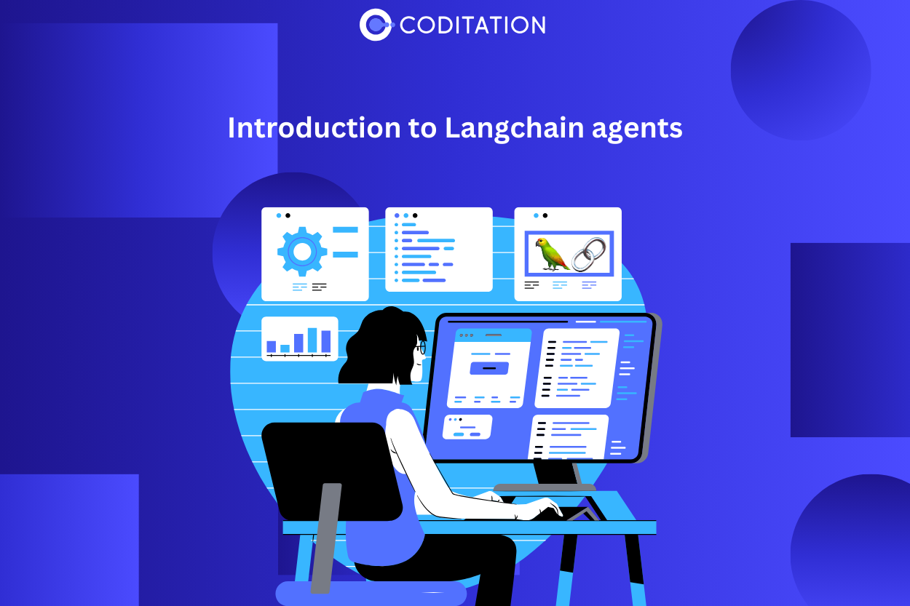

# Langchain Agent 簡介

參考: [Introduction to Langchain Agents](https://www.coditation.com/blog/introduction-to-langchain-agents)

在本文中，探索 LangChain Agent 程式（由大型語言模型支援的框架）的潛力，以創建在自然語言處理、文字生成等方面表現出色的智慧應用程式。



LangChain 是一個開源框架，旨在開發利用大型語言模型 (LLM) 的應用程式。該框架提供了用於構建鏈的標準化介面、與各種工具的大量整合以及針對常見應用程式量身定制的預先建置端到端鏈。
‍LangChain 代理(Agent) 程式是 LangChain 框架內與現實世界互動的專門元件。這些代理程式專門設計用於執行明確定義的任務，例如回答問題、生成文字、翻譯語言和總結文本。它們充當自動化任務和參與現實世界場景的工具。


## LangChain Agent 運作原理

LangChain 利用大型語言模型（LLM）的能力來處理自然語言輸入並產生對應的輸出。這些 LLM 接受了包含文本和代碼的海量資料集的廣泛訓練，使他們能夠出色地完成各種任務，包括理解查詢、文本生成和語言翻譯。

## 架構

LangChain Agent 的基本架構如下：

1. **Input Reception**: Agent 接收來自使用者的自然語言輸入。
2. **Processing with LLM**: Agent 利用 LLM 來處理輸入並製定行動計劃。
3. **Plan Execution**: Agent 執行行動計劃，這可能涉及與其他工具或服務的互動。
4. **Output Delivery**: 最後，Agent 將執行計劃的輸出傳回使用者。


LangChain Agent 的關鍵元件包括 Agent 本身、外部 tool 和 toolkit:

1. **Agent**: 是整個 Agent 架構的核心，負責處理輸入、產生行動計畫並執行。
2. **Tools**: Agent 利用這些外部資源來完成任務。它們涵蓋了從使用其它 LLM 到調用不同的 Web API 的各種範圍。
3. **Toolkits**: 工具包由專門為特定功能組裝的工具組組成。例如用於問答、文字生成和自然語言處理的工具包。

透過了解 LangChain 及其基於 Agent 的架構，使用者可以利用其潛力來創建能夠熟練處理和生成自然語言文字的智慧型應用程式。

## 入門

Agent 程式結合使用 LLM（或 LLM 鏈）和工具包來執行一系列預先定義的步驟來實現目標。在這個例子中，我們將使用 Wikipedia、DuckDuckGo 和 Arxiv 工具建立一個簡單的 agent 來撰寫論文。 [參考: langchain tools](https://python.langchain.com/docs/integrations/tools/) 有一長串可用的工具，agent 可以使用它們與外界互動。

### 1. 安裝

對於這個範例，我們需要安裝 Langchain 和上面提到的工具，假設你的機器上有 Python3.8 環境。

```bash
pip install arxiv wikipedia duckduckgo-search langchain openai
```

### 2. 導入必要的套件

```python
from langchain.tools import Tool, DuckDuckGoSearchRun, ArxivQueryRun, WikipediaQueryRun
from langchain.utilities import WikipediaAPIWrapper
from langchain.agents import initialize_agent
from langchain.agents import AgentType
from langchain.chat_models import ChatOpenAI
from langchain.chains import LLMChain
from langchain.prompts import PromptTemplate
```

### 3. 設定工具

```python
search = DuckDuckGoSearchRun()  

arxiv = ArxivQueryRun()  

wiki = WikipediaQueryRun(api_wrapper=WikipediaAPIWrapper())
```

這會初始化 `DuckDuckGo` 搜尋工具以及 LangChain 提供的 `Arxiv` 和維基百科工具。這些工具將幫助我們建立我們的論文代理。 `DuckDuckGo` 工具可讓您使用 `DuckDuckGo` 搜尋網路並檢索結果，`Arxiv` 工具將可存取 `Arxiv.org` 中的出版物，而 `Wikipedia` 工具將搜尋 `Wikipedia` 文章。

### 4. 設定論文工具

```python
llm = ChatOpenAI(temperature=0, openai_api_key=<openai_api_key>)

prompt_template = "Write an essay for the topic provided by the user with the help of following content: {content}"  

essay = LLMChain(  
    llm=llm,  
    prompt=PromptTemplate.from_template(prompt_template)  
)
```

本節使用 LangChain 的 ChatOpenAI 模型設定一個論文工具。我們定義一個用於撰寫論文的提示模板，使用模型和提示建立一條鏈，然後定義工具。

```python
Tool.from_function(  
	func=essay.run,  
	name="Essay",  
	description="useful when you need to write an essay"  
)
```

在這裡，我們使用 `Tool.from_function` 方法建立一個新工具。

### 5. 初始化 Agent

```python
tools = [  
    Tool(  
	    name="Search",  
	    func=search.run,  
	    description="useful for when you need to answer questions about current events."  
	),  
	Tool(  
	    name="Arxiv",  
	    func=arxiv.run,  
	    description="useful when you need an answer about encyclopedic general knowledge"  
	),  
	Tool(  
	    name="Wikipedia",  
	    func=wiki.run,  
	    description="useful when you need an answer about encyclopedic general knowledge"  
	),  
	Tool.from_function(  
	    func=essay.run,  
	    name="Essay",  
	    description="useful when you need to write an essay"  
	),
]

agent = initialize_agent(tools, llm, agent=AgentType.OPENAI_FUNCTIONS, verbose=True)
```

在這裡，我們使用我們定義的工具初始化 agent。該 agent 能夠針對用戶提供的主題撰寫一篇文章，該 agent 將從網路、維基百科或 Arxiv 文章中收集必要的資訊。

### 6. 運行 Agent

```python
prompt = "Write an essay in 1000 words for the topic {input}, use the tools to retrieve the necessary information"

input = "Essay on Global Warming – Causes and Solutions"  
  
print(agent.run(prompt.format(input=input)))
```

最後，我們為 agent 定義一個提示並運行它。該 agent 將在網路、Arxiv 文章和維基百科中搜尋有關全球暖化的信息，獲取內容，然後就此撰寫文章。

## 結論

綜上所述，langchain 的 agent 具有以下幾個明顯的優勢:

- **User friendly**: LangChain agents 有意設計為易於理解和訪問，即使對於缺乏複雜語言模型豐富經驗的開發人員也是如此。
- **Versatility**: LangChain agent 的適應性使其能夠在各種場景和需求中找到應用場景。
- **Enhanced capabilities**: 透過利用語言模型的力量，LangChain agent 提供自然語言理解和生成等功能，使用戶能夠存取這些功能。

隨著語言模型的不斷進步，LangChain 變得更強大和靈活的潛力也隨之增加。這項進展有可能徹底改變我們與電腦的互動並重塑內容創建過程。展望未來，LangChain agents 的使用方式有許多令人興奮的方式：

- **真實的聊天機器人**: 可以使用 LangChain agent 來創建不僅更真實而且更具吸引力的聊天機器人，從而實現更動態的互動。
- **教育工具**: LangChain agent 有潛力成為教育工具的基礎，透過提供個人化和互動式學習內容來增強學生的學習體驗。
- **行銷協助**: 企業可以利用 LangChain agent 開發行銷工具，有效觸及並吸引目標受眾，進而轉變行銷策略。

