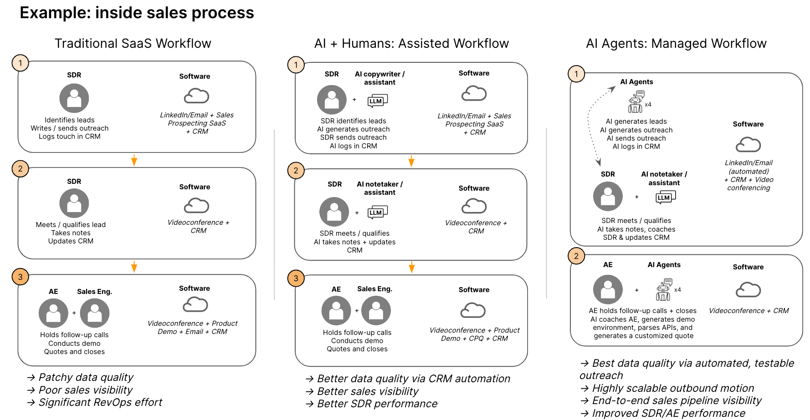

# LLM agents: 下一個軟體平台轉變

原文: [LLM agents: the next platform shift in B2B software](https://www.mosaicventures.com/patterns/llm-agents-the-next-platform-shift-in-b2b-software)

過去二十年裡，B2B 軟體一直處於持續成長的軌道，這得益於 2000 年代中期 AWS 和超大規模企業的崛起。自 2010 年以來，應用軟體在標準普爾500指數中的佔比已從約7%增長至約20%，企業的「數位轉型」正在順利進行。雲端基礎架構使 B2B 應用程式的部署和維護變得更加容易，從而刺激了向 SaaS 的轉變。

雖然我們仍處於向雲端過渡的階段，但下一個平台轉變可能已經到來：向所有人開放高性能的預訓練模型。我們最近分享了生成式人工智慧應用程式的投資框架：其中許多是下一代 B2B 軟體產品，它們使用 LLM 以以前不可能的方式解釋或產生工作產品。我們認為人工智慧原生 B2B 軟體的崛起是一種長期趨勢，這也將對 SaaS 公司的運作方式產生另一階段影響。

LLM 以兩種基本方式增強軟體產品—它們能夠：

1. 更能理解和處理非結構化資料
2. 更具可擴展性的方法來生成內容和產品

LLM 第一個值得注意的 B2B 應用是人類用戶的助手(assistant),例如用於代碼的 Copilot，但我們認為人工智慧代理(agent)將在價值創造方面帶來最大的進步。雖然助手(assistant)可以提高單一員工的效率，但基於代理(agent)的應用程式理論上可以扮演整個團隊或職能部門的角色。

## AI agents: 無限可擴展的工作人員

當結合 BabyAGI、AutoGPT 和 ChatArena 等新興代理框架時，LLM 的能力會得到增強。{==這些框架將工作流程分解為一系列獨立的角色，每個角色都由人工智慧代理處理，這些角色被賦予明確的目標並協同工作以自動執行複雜的任務。==}

最初，這將採取人類與人工智慧協作的形式。以 call-center 為例。傳統上，一線代理負責分類，並將客戶引導至更專業的部門。在短期內，軟體代理程式可能會執行這些步驟中的第一步，然後交給人類（或幫助人類更有效地工作）。更進一步來說，完全基於代理或自治的系統將不需要任何交接。

早期基於代理的 LLM 應用程式正在以越來越多的自主權來處理複雜的任務，包括自動化複雜的採購談判（參見 [Keelvar](https://www.mosaicventures.com/patterns/why-we-invested-in-keelvar)）、解決硬數據科學問題以及複製基本股票交易公司的功能。雖然還處於早期階段，但不難想像最終狀態是大部分組織都完全自治。我們最好的猜測是，從中期來看，我們將看到企業職能部門由人工智慧代理(agent)和人類用戶組成，這與多人視訊遊戲、呼叫中心和越來越多的人機合作中常見的人機合作類似。

我們相信 LLM 將開啟自主、高度靈活軟體的新時代。到目前為止，工作流程軟體一直是預先定義：它嚴格規定了業務必須遵守的流程。現在，情況不同了。人工智慧代理可以想像出公司的流程，並且可以動態更改軟體的配置（Qatalog 首創的願景）。大量客製化軟體的實施合作夥伴被人工智慧代理取代的世界比我們想像的更近了。

這種靈活性的代價是，再加上最近開發人員效率的提高，軟體公司的護城河變得前所未有的淺。目前尚不清楚人工智慧軟體公司的護城河是什麼，但我們最好的猜測是垂直化、存取專有資料集和品牌。

## ‍AI agents 的 Second-order effects

人工智慧原生軟體具有明確定義的輸入(well defined inputs)，但它的輸出確是伴隨著機率輸出(probabilistic outputs)，這與為特定任務構建的 B2B 軟體有很大不同。 AI原生軟體的核心是由第三方模型提供者管理的一個或多個「黑盒子」LLM，這減少降低了應用開發團隊對最終產品的控制力。 SaaS 公司需要適應，因為他們的產品的行為是隨機且變動的，而不是確定性的。產品經理的角色將會改變；驗證輸出；觀察異常情況；確保一致的使用者體驗。

人工智慧團隊的角色也可能顯著擴大。這些團隊通常負責產品推薦引擎或搜尋功能等明確定義的功能，但現在 ML 與使用者體驗的連結更加緊密，LLM 被用作使用者介面、關鍵功能，有時也用作編排層。人工智慧在軟體公司中重要性的增加也意味著對模型驗證、治理和控制的更加重視。

最後，SaaS 業務的成本結構將會改變。開放取用 LLM 作為服務提供，對 SaaS 業務來說意味著額外的直接成本。因此，我們接觸過的早期 LLM 申請者高度意識到他們的“LLM token 燃燒”，並小心地優化他們的模型使用，以維持類似 SaaS 的毛利率。與企業採用的多雲策略的出現類似，企業正在使用不同規模的多種模型，在效能與成本之間進行權衡。這種變動成本是採用基於使用情況定價的另一個原因。另一個解決方案是透過品質控製或路由模型來中介使用者與 LLM 交互。

除了上述二階效應之外，還有新的問題需要回答：

- 軟體公司的價值傳統上與黏性和鎖定相關。這通常來自於採用新工具和學習新流程的人類團隊。人工智慧原生軟體是否會因為護城河更少、切換阻力更低而縮小整個市場？
- 如果我們從合約經常性收入轉向基於價值或基於消費的定價，這是否會導致軟體公司的收入更加不穩定？
- 這對勞動力有何影響？如何訓練團隊與人工智慧代理一起工作，以便他們比以往更有效率？
- 人工智慧代理將對服務密集型商業模式、系統整合商和顧問產生什麼影響？

很多事情都不確定，但我們相信 LLM 將從根本上改變 B2B 軟體。即將推出的 LLM 和基於代理(agent)的應用程式將帶來生產力的提高，這將使全新的 B2B 產品成為可能，從而改變許多軟體用戶的日常生活。

正如雲端定義了過去二十年一樣，LLM 可能會成為未來 20 年軟體的定義平台轉變。