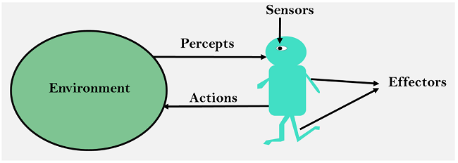

# 什麼是 AI 代理？

人工智慧 （AI） 迅速發展，隨之而來的是 AI 代理的概念。這些智慧代理在各個領域都發揮著關鍵作用，從虛擬客戶服務代理到數據收集。在本文中，我們將深入探討 AI 代理的複雜性，並探討它們在複雜環境中的相關性。

## 什麼是 AI 代理？

**AI 代理** 是旨在感知其 **環境** 並採取 **行動** 以實現 **特定目標** 的實體。這些代理可以是基於軟體的實體，也可以是基於物理實體的，並且通常使用人工智慧技術構建。它們通過感測器感知環境，使用演算法或模型處理資訊，然後使用執行器或其他方式採取行動。‍

AI 代理的範圍可以從遵循預定義規則的簡單系統到根據其經驗學習和適應的複雜自主實體。它們被用於各個領域，包括機器人、遊戲、虛擬助手、自動駕駛汽車等。這些智慧體可以是反應性的（直接對刺激做出反應）、深思熟慮的（計劃和做出決策），甚至具有學習能力（根據數據和經驗調整他們的行為）。

### 使用自然語言處理創建 Rational Agent

自然語言處理（NLP）是人工智慧的一個領域，專注於使用自然語言進行人與計算機之間的交互。它涉及開發演算法和模型，使計算機能夠理解、解釋和生成人類語言。NLP 對於各種 AI 應用程式至關重要，包括 chatbots、語言翻譯、情感分析和文本摘要。

機器學習模型，包括深度學習，在 NLP 中起著至關重要的作用。它們可以學習語言數據中的模式和關係，使 AI 代理能夠概括和理解新的、看不見的語言。這些模型在大量的文本數據語料庫上進行訓練，使它們能夠以類似人類的流暢度和準確性理解和生成語言。

## AI 代理的元件

以下元件協同工作，使 AI 代理能夠在其環境中有效運行。這些元素對於開發能夠在各種應用中自主執行任務的智慧代理至關重要。

### 代理大腦

代理大腦是 AI 代理的核心。它定義了代理如何將其收集的數據映射到操作。換句話說，代理大腦允許 AI 根據它收集的資訊確定它應該採取什麼行動。這就是智慧體的“智慧”所在，因為它涉及 **推理** 和選擇 **行動** 以實現其 **目標**。

### 感知

感知是 AI 代理從其環境中接收的感官輸入。它們提供有關代理運行的可觀察環境的當前狀態的資訊。例如，如果 AI 代理是客戶服務聊天機器人，則感知可以包括： 

- 使用者消息
- 使用者配置檔資訊
- 使用者位置
- 聊天記錄
- 語言首選項
- 時間和日期
- 用戶首選項
- 使用者情感識別

### 驅動器

執行器本質上是智慧體的「肌肉」，執行智慧體功能做出的決策。這些操作可以是廣泛的任務，從駕駛自動駕駛汽車到在聊天機器人的螢幕上輸入文本。

一些常見的執行器包括： 

- **文字回應生成器**：此執行器負責生成基於文本的回應並將其發送給使用者。它獲取聊天機器人基於文本的回復，並通過聊天介面將其傳遞給使用者。
- **服務集成 API**：聊天機器人可能需要整合一個系統，例如公司的 CRM 系統，以存取客戶資料、創建支援票證或檢查訂單狀態。這些集成涉及作為執行器的 API 數據用，允許聊天機器人與外部系統交互並根據需要檢索或更新資訊。
- **通知和警報**：通知執行器可以向使用者的設備發送電子郵件通知、簡訊或推送通知，以提醒他們即將到來的約會、訂單狀態更改、促銷或其他相關更新。這些執行器有助於讓使用者了解情況並參與其中。

### 知識庫

知識庫是 AI 代理存儲其有關環境的初始知識的位置。這些知識通常是在培訓期間預定義的或學習的。它是代理決策過程的基礎。例如，自動駕駛汽車可能有一個知識庫，其中包含有關道路規則的資訊，而客戶服務的 自主代理 可以訪問有關公司產品的詳細資訊。

### 反饋

隨著時間的推移，反饋對於 AI 代理的改進至關重要。這種反饋可以來自兩個來源：批評者或環境本身。批評者可以是人類操作員，也可以是另一個評估代理性能的人工智慧系統。或者，環境可以以代理操作產生的結果的形式提供反饋。這種反饋迴圈使智慧體能夠適應，從經驗中學習，並在未來做出更好的決策。 

## AI 代理的類型

- **簡單反射代理**：這些代理基於一組預定義的條件操作規則運行。他們對當前的感知做出反應，不考慮先前感知的歷史。它們適用於複雜性有限且功能範圍狹窄的任務。
- **基於模型的 Reflex 代理**：基於模型的代理具有更高級的方法。他們維護環境的內部模型，並根據模型的理解做出決策。這使他們能夠處理更複雜的任務。
- **基於效用的代理**：基於效用的代理通過考慮每個可能操作的預期效用來做出決策。它們通常用於必須權衡不同選項並選擇具有最高預期效用的選項的情況。
- **學習代理**：這些代理設計用於在未知環境中運行。他們從自己的經驗中學習，並隨著時間的推移調整自己的行動。深度學習和神經網路通常用於學習代理的開發。
- **意圖代理**：這些代理通過維持對環境、慾望和意圖的信念來模擬類似人類的行為。他們可以相應地推理和計劃他們的行動，使他們適用於複雜的系統。
- **基於邏輯的智慧體**：基於邏輯的智慧體使用演繹推理來做出決策，通常是在邏輯規則上。它們非常適合需要複雜邏輯推理的任務。

## AI 代理的潛在應用

AI 代理在眾多行業中具有廣泛的應用，可實現各種功能和進步：

- **自動駕駛汽車**： 人工智慧代理為自動駕駛汽車和無人機提供動力，使它們能夠在沒有人為干預的情況下感知環境、做出決策並安全導航。
- **虛擬助手**： Siri、Alexa 和 Google Assistant 等代理使用 AI 來理解自然語言、協助完成任務、提供資訊和控制智慧設備。
- **遊戲**： 遊戲中的 AI 代理模擬類似人類的行為，增強玩家體驗，並在單人或多人遊戲環境中提供具有挑戰性的對手。
- **醫療保健**： 人工智慧代理協助診斷、個人化醫療、藥物發現和患者監測，改善治療結果和運營效率。
- **財務**：AI 代理分析大量財務數據，用於欺詐檢測、交易、風險評估和個人化財務建議。
- **客戶服務**： Chatbots 虛擬代理處理客戶查詢、提供支援、指導購買和提供各個行業的資訊。
- **智慧家居和物聯網**： 人工智慧代理控制和優化智慧家居設備，根據偏好和環境條件調整設置。
- **機器人**： 機器人中的人工智慧代理使它們能夠執行製造、物流、醫療保健等方面的任務，適應動態環境。
- **推薦系統**： AI 代理為流媒體服務、電子商務和內容平臺中的推薦引擎提供支援，為使用者提供個人化建議。
- **網路安全**： AI 代理有助於威脅檢測、異常識別和安全管理，防禦網路攻擊並確保系統完整性。
- **教育**：人工智慧代理協助個人化學習，適應個別學生的需求，並提供輔導和教育支援。
- **供應鏈和物流**： AI 代理優化路線、管理庫存、預測需求並提高物流運營的整體效率。

這些應用展示了人工智慧代理在徹底改變行業、提高效率和實現跨各個領域的創新解決方案方面的多樣性和影響力。

## AI代理技術的未來發展

人工智慧代理處於人工智慧的最前沿，在塑造我們在日常生活中與技術互動的方式方面發揮著關鍵作用。憑藉其做出明智決策、適應動態環境和隨著時間的推移學習的能力，人工智慧代理是下一代智慧系統背後的動力源，將改善我們的日常生活。

隨著技術的不斷進步，人工智慧代理變得越來越複雜和強大。它們有可能徹底改變我們與智慧系統的交互方式。 GPT 架構 等 AI 代理框架提供了強大的工具，用於為各種應用程式構建和自定義 AI 代理。