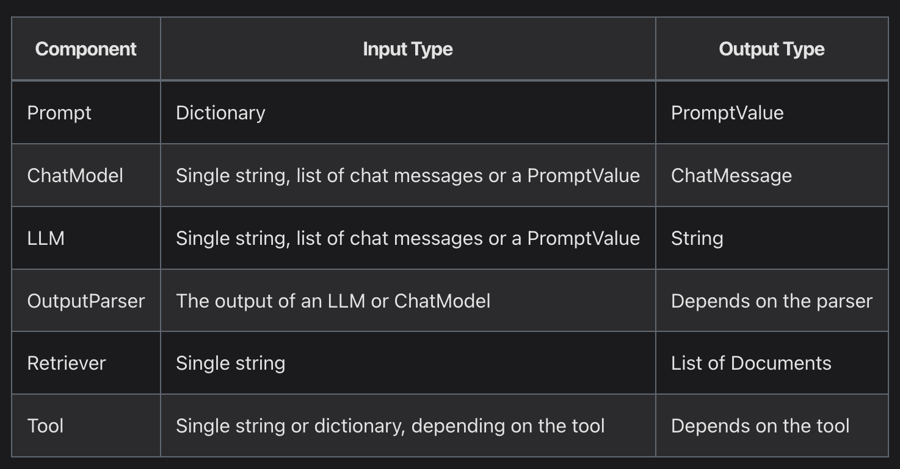
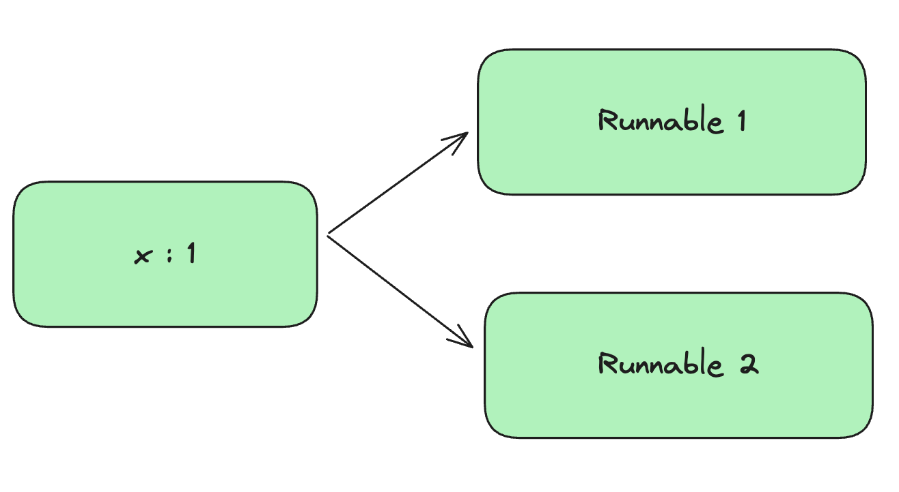

# LCEL (LangChain Expression Language) 篇，一定要認識的 LangChain 核心

原文: [認識的 LangChain 核心](https://myapollo.com.tw/blog/langchain-expression-language/)

[LangChain 怎麼玩？入門教學篇](./tutorial-get-started.md) 雖然有提到 LCEL(LangChain Expression Language), 不過並沒有深入理解到底什麼是 LCEL 。

LCEL 是 LangChain 的核心，如果要能夠設計出更複雜的 LangChain 應用，甚至是將 LangChain 應用轉為 API 對外服務，那麼 LCEL 是一定要認識/理解的。

## 本文環境

- Linux (Ubuntu)
- Python 3
- LangChain
- OpenAI 帳號

```bash
pip install langchain langchain-openai python-dotenv
```

## LCEL (LangChain Expression Language) 

到底什麼是 LCEL? 以下 LangChain 對 LCEL 的功用說明：

> LCEL makes it easy to build complex chains from basic components, and supports out of the box functionality such as streaming, parallelism, and logging.

LCEL 可以讓我們用各種基本元件，就能輕易的開發複雜的 chain 應用，而且可以支援：

- Streaming: 一有結果就先回傳，不用等所有的結果都產生完才回傳
- Parallelism: 同時接受多個輸入，並同時產生多個輸出
- logging
- 其他功能

> To make it as easy as possible to create custom chains, we’ve implemented a [Runnable](https://api.python.langchain.com/en/stable/runnables/langchain_core.runnables.base.Runnable.html#langchain_core.runnables.base.Runnable) protocol.

更切確來說， LCEL 有 2 個重要的目的。

**統一的協定(Protocol)**

> 1. A unified interface: Every LCEL object implements the Runnable interface, which defines a common set of invocation methods (invoke, batch, stream, ainvoke, …). This makes it possible for chains of LCEL objects to also automatically support these invocations. That is, every chain of LCEL objects is itself an LCEL object.

LangChain 制定的協定(protocol)，每個元件例如(`Prompt`, `ChatModel`, `LLM`, `OutputParser`, `Retriever`, `Tool` 這些都是 LangChain 基本元件)都必須實作 1 個稱為 **Runnable** 的協定，這個協定至少包含以下方法（這些方法很重要，如果要將 Chain 應用變成 API 開放給他人使用，也可能需要實作以下方法）:

- `invoke` (支援單一輸入、單一輸出）
- `batch` (支援多個輸入、多個輸出）
- `stream` (支援有部分結果就輸出的模式)
- `ainvoke` (async 版本的 invoke)
- `abatch` (async 版本的 batch)
- `astream` (async 版本的 stream)

更詳細定義可以看 ["Runnable"](https://api.python.langchain.com/en/stable/runnables/langchain_core.runnables.base.Runnable.html#langchain_core.runnables.base.Runnable) 官方文件。

幾個重要的元件如下圖：



**提供組合原型(Composition primitives)，讓 Chain 的開發變得簡易**

> 2. Composition primitives: LCEL provides a number of primitives that make it easy to compose chains, parallelize components, add fallbacks, dynamically configure chain internal, and more.

LCEL 提供元件組合的功能，也就是本系列文章中經常使用到的 `|` 運算子，例如：

```python
prompt | llm
```

組合出來的 Chain 原型(primitives)分為 2 種：

- `RunnableSequence`
- `RunnableParallel`

### RunnableSequence

`RunnableSequence` 會依序執行每個 `Runnable`, 例如 `prompt | llm | output` 裡的 `prompt`, `llm`, `output` 都是 `Runnable`, 它們透過 `|` 運算子串起來之後，就是 `RunnableSequence`，執行上是依序執行，例如下列程式碼範例，可以體驗到何謂 `RunnableSequence`:

```python
from langchain_openai import ChatOpenAI
from langchain_core.prompts import ChatPromptTemplate
from langchain_core.output_parsers import StrOutputParser

# 構建一個 llm 模型實例
llm = ChatOpenAI(model="gpt-3.5-turbo")

# 構建一個 ChatPromptTempate 物件
prompt = ChatPromptTemplate.from_messages([
    ("user", "{input}"),
])

# 構建一個 output_parser 實例
output_parser = StrOutputParser()

# 呼叫第一個元件
prompt_output = prompt.invoke({"input": 'Hi there'})

# 把前一個元件的 output 作為呼叫元件的 input
llm_output = llm.invoke(prompt_output)

# 把前一個元件的 output 作為呼叫元件的 input
answer = output_parser.invoke(llm_output)

# 打印結果
print(answer)
```

上述的執行過程也可使用下面 LCEL 的手法:

```python
# 使用 LCEL 語法串連三個元件
chain = prompt | llm | output_pserser

# 觸發 chain 的執行
answer = chain.invok({"input": 'Hi there'})
```

### RunnableParallel 

`RunnableParallel` 則是可以同時執行不同的 Runnable 元件, 它的範例可以用 LangChain 的 `RunnableLambda` 來體驗：

!!! info
    `RunnableLambda` 可以把一個 python 的 function 轉換成一個 langchain 的 Runnable 元件

```python
from langchain_core.runnables import RunnableLambda, RunnableParallel

# 自定義第一個 function
def add_one(x: int) -> int:
    return x+1

# 自定義第二個 function
def add_two(x: int) -> int:
    return x+2

# 轉換第一個 function 成 Runnable 元件
runnable_1=RunnableLambda(add_one)

# 轉換第二個 function 成 Runnable 元件
runnable_2=RunnableLambda(add_two)

# RunnableParallel 主要是把同一個 input 傳遞給多個 Runnable 元件來同時執行
parallel = RunnableParallel(
    {"runnable_1": runnable_1, "runnable_2": runnable_2}
)

# 使用 LCEL 語法串連一個 Runnable (input 是一個變數 x), 并串接到後面的 RunnableParallel
chain = RunnableLambda(lambda x: x) | parallel

# 觸發 chain 的執行
result = chain.invoke(1)

# 打印結果
print(result)
```

上述範例程式執行結果如下，可以看到結果同時包含 2 個 Runnable 的輸出：

```console
{'runnable_1': 2, 'runnable_2': 3}
```

在此說明一下，前述範例中的 `{"runnable_1": runnable_1, "runnable_2": runnable_2}` 部分就是 `RunnableParallel` ，當我們執行 `chain.invoke(1)` 時， parallel 中的 2 個 Runnable 都會各自執行，並輸出其結果，化為圖片的話如下所示：



所以要將多個 Runnable 來併行執行的話, 可以用 `RunnableParallel` 類別來定義，或者也可以用一個字典(dict)來表示：

```python hl_lines="13"
from langchain_core.runnables import RunnableLambda

# 自定義第一個 function
def add_one(x: int) -> int:
    return x+1

# 自定義第二個 function
def add_two(x: int) -> int:
    return x+2

# 轉換第一個 function 成 Runnable 元件
runnable_1=RunnableLambda(add_one)

# 轉換第二個 function 成 Runnable 元件
runnable_2=RunnableLambda(add_two)

# 用一個字典(dict)來表示　RunnableParallel, 主要是把同一個 input 傳遞給多個 Runnable 元件來同時執行
parallel = {"runnable_1": runnable_1, "runnable_2": runnable_2}

# 使用 LCEL 語法串連一個 Runnable (input 是一個變數 x), 并串接到後面的 RunnableParallel
chain = RunnableLambda(lambda x: x) | parallel

# 觸發 chain 的執行
result = chain.invoke(1)

# 打印結果
print(result)
```

有了 `RunnableParallel`, 你就可以做到用它組合多個語言模型同時執行！但那不在本章要介紹的範疇內。

## RunnableBranch

目前為止，我們已經接觸 `Runnable`, `RunnableSequence`, `RunnableParallel`, `RunnableLambda`, 接著讓我介詔一個變化型稱為 `RunnableBranch` 。

`RunnableBranch` 可以讓我們動態決定要走哪個分支執行下 1 個 `Runnable`, 例如你可以透過使用者不同的輸入，而採用不同的語言模型，例如：

```python
from langchain_community.llms import Ollama
from langchain_openai import ChatOpenAI
from langchain_core.runnables import RunnableLambda
from langchain_core.output_parsers import StrOutputParser
from langchain_core.prompts import ChatPromptTemplate

# 構建第一個 llm 模型實例
llm_openai = ChatOpenAI(model="gpt-3.5-turbo")

# 構建第二個 llm 模型實例
llm_ollama = Ollama(model='llama2')

prompt = ChatPromptTemplate.from_messages([
    ("user", "{input}"),
])

# 構建第一個 chain 來作為預設要執行的 chain
default_chain = prompt | llm_openai

# 構建第一個 chain 來作為要執行 input 中有 python 關鍵字的 chain
python_chain = prompt | llm_ollama

#　定義一個 function 來作為判斷要跑那一條 chain 的邏輯
def route(x):
    if 'python' in x['input']:
        return python_chain

    return default_chain

# 用　RunnableLambda　轉換上述的 function 成為 Runnable 元件
chain = RunnableLambda(route)

# 觸發 chain 的執行
print(chain.invoke({"input": "python is the best"}))
```

LangChain 官網推薦使用 `RunnableLambda` 做完判斷之後，回傳新的 `Runnable` 就能夠做到 `RunnableBranch` 的效果。

如果你想要直接使用 `RunnableBranch` 的話，可以參考 [RunnableBranch 文件](https://api.python.langchain.com/en/latest/runnables/langchain_core.runnables.branch.RunnableBranch.html)。

## RunnablePassthrough

> Runnable to passthrough inputs unchanged or with additional keys.

如果你想{==對輸入做些加工的話，或者對前者 Runnable 輸出的結果做修改的話==}，例如修改使用者 prompt 加入關鍵詞，則可以使用 `RunnablePassthrough`。

下列是修改使用者 prompt 的範例：

```python
from langchain_core.runnables import RunnablePassthrough
from langchain_core.prompts import ChatPromptTemplate

# 構建一個 prompt 實例
prompt = ChatPromptTemplate.from_messages([
    ("user", "{input}"),
])

# 修改使用者的 input 加入關鍵詞之後, 再串接 prompt 元件
chain = RunnablePassthrough.assign(input=lambda x: x['input'] + ' this is important to me.') | prompt

# 觸發 chain 的執行
print(chain.invoke({"input": "python is the best."}))
```

上述範例執行結果如下，可以看到我們成功修改使用者的輸入：

```bash
messages=[HumanMessage(content='python is the best. this is important to me.')]
```

## 什麼要認識/使用 LCEL?

LCEL 透過前述章節所提到的設計，讓 chain 的實作變得簡潔、簡單，如果沒有 LCEL 的話，整個 chain 將會變得異常複雜，為此 LangChain 也提供幾個有 LCEL, 沒有 LCEL 的對照，詳細可以閱讀 [Why use LCEL](https://python.langchain.com/docs/expression_language/why) 一文。

## 輸入/輸出 (Input & Output Schema)

從各個範例可以得知每個 `Runnable` 都有輸入與輸出，可是要怎麼知道它到底需要輸入什麼結構的資料，以及它會輸出什麼結構的資料呢？

這時可以查看 `Runnable` 的輸入與輸出的 `schema`, 這些 `schema` 被存在 `input_schema` 與 `output_schema` 2 個屬性中，只要是 `Runnable` 都可以查看其輸入與輸出結構。

舉下列為例：

```python
from langchain_core.prompts import ChatPromptTemplate

prompt = ChatPromptTemplate.from_messages([
    ("user", "{input}"),
])
```

如果想查看 prompt 的輸入是什麼，可以使用：

```python
print(prompt.input_schema.schema())
```

上述執行結果如下，從結果可以看到它的輸入必須是 1 個 object, 且該 object 含有 1 型別為字串的屬性(properties) input :

```bash
{'title': 'PromptInput', 'type': 'object', 'properties': {'input': {'title': 'Input', 'type': 'string'}}}
```

如果想知道其輸出爲何，則可以使用：

```python
print(prompt.output_schema.schema())
```

甚至連 chain 也可以查看其輸入與輸出結構，因為 chain 也屬於 Runnable :

```python
from langchain_openai import ChatOpenAI
from langchain_core.prompts import ChatPromptTemplate


# 構建一個 llm 模型實例
llm = ChatOpenAI(model="gpt-3.5-turbo")

# 構建一個 prompt 實例
prompt = ChatPromptTemplate.from_messages([
    ("user", "{input}"),
])

# 使用 LCEL 來組合成 chain
chain = prompt | llm

# 打印整個 chain 的 input_schema
print(chain.input_schema.schema())
```

## 列印 Chain 的樣子

除了 input / output schema 的資訊， LangChain 也有提供 1 個方便的函式可以查看 chain 的長相，該方法為 `<chain>.get_graph().print_ascii()` 。

舉下列範例為例：

```python
from langchain_openai import ChatOpenAI
from langchain_core.prompts import ChatPromptTemplate


# 構建一個 llm 模型實例
llm = ChatOpenAI(model="gpt-3.5-turbo")

# 構建一個 prompt 實例
prompt = ChatPromptTemplate.from_messages([
    ("user", "{input}"),
])

# 使用 LCEL 來組合成 chain
chain = prompt | llm

# 使用 ascii 打印整個 chain 的結構
chain.get_graph().print_ascii()
```

上述範例輸出為：

```bash
    +-------------+    
    | PromptInput |    
    +-------------+    
           *           
           *           
           *           
+--------------------+ 
| ChatPromptTemplate | 
+--------------------+ 
           *           
           *           
           *           
    +------------+     
    | ChatOpenAI |     
    +------------+     
           *           
           *           
           *           
 +------------------+  
 | ChatOpenAIOutput |  
 +------------------+ 
```

這張圖的資訊對複雜的 chain 進行除錯來說相當實用。

至此，你已經對 LCEL 有一層深入的理解！

## 總結

認識 LCEL 是相當重要的一件事，畢竟 LangChain 有很多概念需要理解 LCEL, 甚至有些範例程式使用的命名就是 LCEL 中的術語，其中就包括下一篇文章要介紹的 LangServe, LangServe 可以讓開發者把 chain 透過 FastAPI 開放給他人使用，如此一來，開發者就能解除在本機上開發/使用 LangChain 應用的限制，能夠讓他人不需要自行架設語言模型應用，也能夠透過 API 使用語言模型應用。
