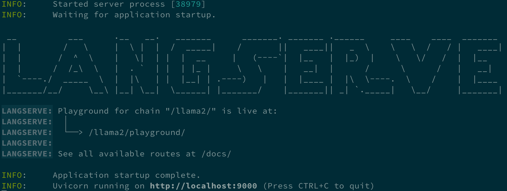
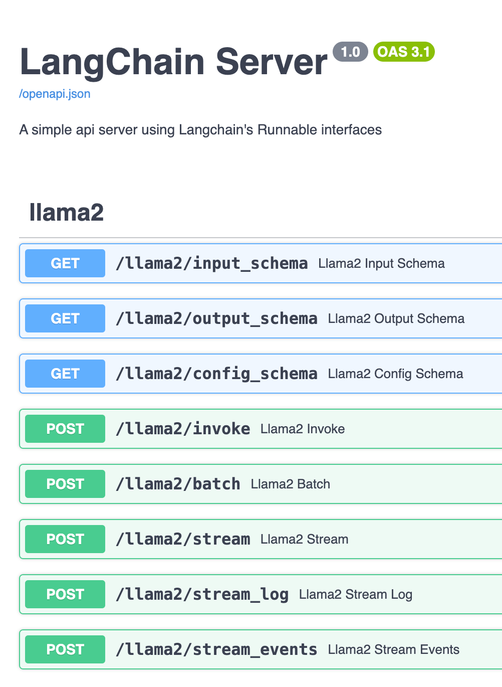
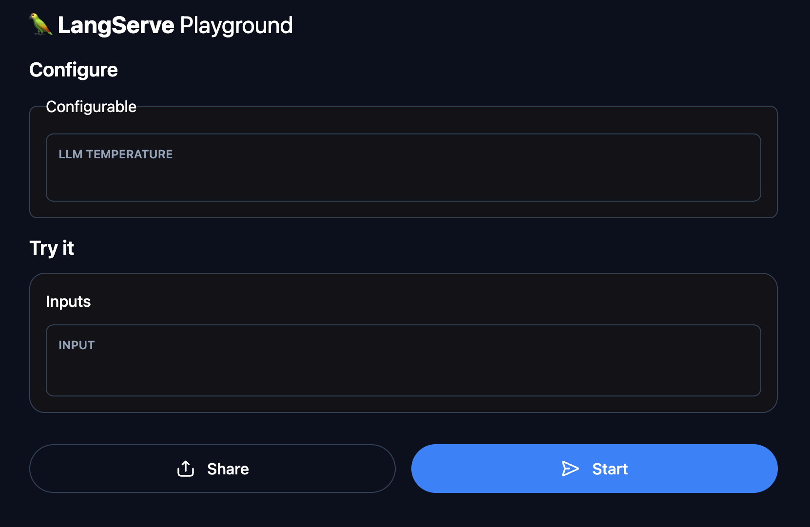

# 用 LangServe 架個 API 伺服器

原文: [LangChain 怎麼玩？用 LangServe 架個 API 伺服器吧！](https://myapollo.com.tw/blog/langchain-langserve/)

打造語言模型相關應用，總不能要求使用者都要透過網路下載/更新語言模型，畢竟每個使用者的硬體條件不一，包含 CPU / GPU / 記憶體 / 硬碟容量都可能需要滿足一定條件，才能夠執行語言模型，而且語言模型作為競爭力核心，無法輕易開放他人下載使用，也是一種商業考量。

綜觀而言，將語言模型的功能透過 API 方式開放，是 1 個相當合理的選項，不僅使用者不需要滿足硬體條件，又可以保護開發者的商業競爭力。

LangChain 自然也有提供將語言模型轉回 API 服務的能力，該功能/套件稱為 LangServe 。

本文將教學如何使用 [LangServe](https://python.langchain.com/docs/langserve/) 將語言模型轉為 API 服務！

如果不清楚給如何開始設置相關環境, 請先練習 [使用 LangServe 為 LangChain 應用程式建立 REST API](../langserve/build-rest-apis.md)。

## 本文環境

- Linux (Ubuntu)
- Python 3
- LangChain
- LangServe
- Ollama
- Faiss cpu
- pydantic 1.10.15

```bash
pip install langchain faiss-cpu "langserve[all]" pydantic==1.10.15
```

本文需要 Ollama 指令與 Meta 公司提供的 `llama2` 模型(model)，`ollama` 指令請至 [Ollama 官方頁面](https://ollama.ai/download)下載安裝，安裝完成之後即可執行指令安裝 `llama2` 模型，其安裝指令如下：

```bash
ollama pull llama2
```

!!! info
    p.s. 執行上述模型需要至少 8GB 記憶體， 3.8G 硬碟空間

目前 LangServe 自動產生 OpenAPI 文件的功能需要使用 `pydantic v1`, 因此本文使用 pydantic 1.10.15 版本。

## LangServe

LangServe 是 LangChain 所提供的 1 個套件，提供能將 Chain 或者 Runnable 變成 REST API 的功能，它所提供的 REST API 功能其實是使用 `FastAPI` 與 `pydantic` 實作，所以需要懂得如何使用 `FastAPI` 與 `pydantic`, 不過 LangChain 也提供不少範例可以參考，如有需要可以找看看有沒有用途相似的範例，再從該範例開始著手修改也行。

以下將揭示如何將 LangChain 應用透過 LangServe 轉為 REST API 服務。

## LangServe Server - add_routes()

LangServe 作為 LangChain 框架的一部分，其實它也將易用性做得很好，最簡單的情況下只要使用 `add_routes()` 函式，就能輕鬆將 Chain 或 Runnable 轉為 REST API 。

`add_routes()` 的基本用法如下：

```python
add_routes(
    app,     # FastAPI APP instance
    chain,   # chain or runnable
    path="<path>",  # any path you want to bind
)
```

以下是 1 個最簡單的 LangServe REST API 服務，該服務使用 LLaMa 模型提供服務，並將 chain 綁定在 `/llama2` 網址底下， LangServe 會負責產生 `/llama2/<endpoint>` 各種 API：

```python
from fastapi import FastAPI

from langchain_core.prompts import ChatPromptTemplate
from langchain_community.llms import Ollama

from langserve import add_routes


llm = Ollama(model='llama2')

prompt = ChatPromptTemplate.from_messages([
    ('system', 'You are a powerful assistant.'),
    ('user', '{input}'),
])


app = FastAPI(
    title="LangChain Server",
    version="1.0",
    description="A simple api server using Langchain's Runnable interfaces",
)

add_routes(
    app,
    prompt | llm,
    path="/llama2",
)


if __name__ == "__main__":
    import uvicorn

    uvicorn.run(app, host="localhost", port=9000)
```

執行上述範例成功的話，會出現以下畫面：



該畫面告訴我們， REST API 伺服器正在運作，可以存取 `http://localhost:9000/docs` 取得 API 說明文件，這份文件是由 FastAPI 整合 OpenAPI 格式所產生的，有了這份文件，任何人都知道要如何發送要求(request)與 REST API 伺服器互動， API 說明文件如下所示：



從畫面中可以看到 `add_routes()` 其實做了相當多事，會把各式各樣的 API 自動加到 FastAPI 的 REST API 伺服器裡，其中包括很眼熟的 API 命名 ，例如：

- POST `/<path>/invoke`
- POST `/<path>/batch`
- POST `/<path>/stream`

沒錯，其實這些命名都來自 `Runnable`, 透過統一的 `Runnable` 協定，就連 REST API 也能透過實作 `Runnable` 協定輕鬆整合 `chain` 或者 `Runnable`! 而且對開發者而言，也能輕易理解 REST API 的基本框架。

上述除了 `/docs` 之外， LangServe 也提供 playground 讓我們可以透過網頁介面與應用進行互動，其網址在 `http://localhost:9000/llama2/playground/` ，其畫面如下：


就連 `Configurable` 也都可以在介面上自動顯示，例如下列程式碼：

```python
from fastapi import FastAPI

from langchain_core.prompts import ChatPromptTemplate
from langchain_community.llms import Ollama
from langchain_core.runnables import ConfigurableField

from langserve import add_routes


llm = Ollama(model='llama2').configurable_fields(
    temperature=ConfigurableField(
        id="temperature",
        name="LLM Temperature",
        description="The temperature of the LLM",
    ),
)

prompt = ChatPromptTemplate.from_messages([
    ('system', 'You are a powerful assistant.'),
    ('user', '{input}'),
])

app = FastAPI(
    title="LangChain Server",
    version="1.0",
    description="A simple api server using Langchain's Runnable interfaces",
)

chain = prompt | llm

add_routes(
    app,
    chain,
    path="/llama2",
)


if __name__ == "__main__":
    import uvicorn

    uvicorn.run(app, host="localhost", port=9000)

```

上述範例執行成功之後，可以在 Playground 看到相對應的 configurable, 讓我們可以動態設定語言模型的 temperature:



LangServe 就是如此易用！

## LangServe Client - RemoteRunnable

LangServe 除了 REST API server 之外，也提供 client 的實作，我們可以透過 `RemoteRunnable` 輕鬆把 LangServe 的 REST API sever 直接轉成 Runnable, 整體使用上就跟以前的範例一樣：

```python
from langchain.prompts import ChatPromptTemplate
from langserve import RemoteRunnable

llama2 = RemoteRunnable("http://localhost:9000/llama2/")

response = llama2.invoke({"input": "Hi there"})

print(response)
```

是否相當方便直覺？更詳細用法可以參考 [RemoteRunnable](https://github.com/langchain-ai/langserve/blob/b6ec1e86bd31950dba7118ab0f23f987c4906765/langserve/client.py#L258) 的程式碼。

## LangServe 如何做使用者認證？

預設情況下 LangServe 是沒有任何使用者認證機制的，但是它依然提供修改的彈性，讓我們可以輕易的加入認證機制或其他流程，這些彈性其實多半與 LangChain 怎麼玩？ 動態修改運作中的 [Chain 設定 / configure chain internals at runtime 文章](configure-chain-at-runtime.md)內提到的功能相關。

!!! info
    p.s. 千萬別把沒做任何認證機制的 LangServe REST API server 架設在開放公眾存取的網路上

以下教學模擬以 API key 作為認證機制，將認證防護機制加入 LangServe 的 API 。

關於如何加上認證機制，其實也可以參考 LangServe 所提供的範例。本文作為教學文章，因此在程式碼範例力求簡單、容易理解，所以部分內容以簡化方式呈現，實際仍應以各自需求進行修改。

## 從簡單的 FastAPI header 認證開始

首先，以下是 1 個簡單的 FastAPI server, 該 server 僅有 1 個 API 。

該 API 會從 HTTP headers 中取的 Authorization 標頭的值，並且檢查其值是否為合法的 API 金鑰作為認證機制:

```python
from fastapi import FastAPI, Header, HTTPException
from typing import Optional


app = FastAPI(
    title="LangChain Server",
    version="1.0",
    description="A simple api server using Langchain's Runnable interfaces",
)


def get_user_from_api_key(api_key: str) -> Optional[dict]:
    if api_key == "valid_api_key":
        return {"user_id": "useridx", "user_name": "John"}
    return None


@app.get("/user")
async def get_user(authorization: Optional[str] = Header(None)):
    if authorization is None:
        raise HTTPException(status_code=401, detail="Authorization header missing")

    # assuming the token is provided as a Bearer token
    api_key = authorization.split(" ")[1] if len(authorization.split(" ")) == 2 else None
    if api_key is None:
        raise HTTPException(status_code=401, detail="Invalid Authorization header format")

    user_data = get_user_from_api_key(api_key)
    if user_data is None:
        raise HTTPException(status_code=403, detail="Invalid API Key")

    return {"user_name": user_data["user_name"]}


if __name__ == '__main__':
    import uvicorn

    uvicorn.run(app, host="localhost", port=9000)
```

上述 API server 可以用以下 `curl` 指令進行測試，運作正常的話，將會回應 user_name 與 user_id :

```bash
$ curl -H "Authorization: Bearer valid_api_key" http://127.0.0.1:9000/user

{"user_id": "useridx", "user_name":"John"}
```

接下來，我們從上述範例開始，為 LangServe 加入 API 認證。

首先，我們已經知道如何檢查 API key 並取得相對應的使用者資料了，接下來試圖把這個過程加進 LangServe, 重點在於要讓 LangServe 也能夠檢查 `Authorization` 標頭以及它的值，如果它有任何問題就該像前述範例一樣拋出 HTTPException 例外錯誤。

而 LangServe 的 `add_routes()` 函式有提供 1 個參數稱為 **dependencies**, 可以讓我們用 FastAPI 的 dependency injection 功能，把認證的邏輯加到 API 之中，我們要做的就是參考 FastAPI 的範例，將前述範例的認證流程加到 `add_routes()` 的 `dependencies` 參數中，例如：

```python
from fastapi import Depends

add_routes(
    app,
    chain,
    path="/llama2",
    dependencies=[
        Depends(verify_api_key),
    ],
)
```

以下是 LangServe 改完之後的結果：

```python
from fastapi import Depends, FastAPI, Header, HTTPException
from typing import Optional


from langchain_core.prompts import ChatPromptTemplate
from langchain_community.llms import Ollama
from langchain_core.runnables import ConfigurableField

from langserve import add_routes


llm = Ollama(model='llama2').configurable_fields(
    temperature=ConfigurableField(
        id="temperature",
        name="LLM Temperature",
        description="The temperature of the LLM",
    ),
)

prompt = ChatPromptTemplate.from_messages([
    ('system', 'You are a powerful assistant.'),
    ('user', '{input}'),
])

app = FastAPI(
    title="LangChain Server",
    version="1.0",
    description="A simple api server using Langchain's Runnable interfaces",
)

chain = prompt | llm

# 構建一個 function 來檢查 api_key
async def verify_api_key(authorization: Optional[str] = Header(None)):
    if authorization is None:
        raise HTTPException(status_code=401, detail="Authorization header missing")

    # assuming the token is provided as a Bearer token
    api_key = authorization.split(" ")[1] if len(authorization.split(" ")) == 2 else None
    if api_key is None:
        raise HTTPException(status_code=401, detail="Invalid Authorization header format")

    if api_key != "valid_api_key":
        raise HTTPException(status_code=403, detail="Invalid API Key")

    return {"user_name": "John"}


# 使用 dependencies 來驗證
add_routes(
    app,
    chain,
    path="/llama2",
    dependencies=[Depends(verify_api_key)],
)


if __name__ == "__main__":
    import uvicorn

    uvicorn.run(app, host="localhost", port=9000)
```

上述範例執行之後，只要試著存取 `http://localhost:9000/llama2/playground/` 就會出現以下回應：

```bash
{"detail":"Authorization header missing"}
```

是的，它告訴我們需要 `Authorization` 標頭才行，如果想測試通過驗證的話，可以使用以下 `curl` 指令進行測試：

```bash
curl -H 'Authorization: Bearer valid_api_key' \
     -d '{"input": {"input": "hi"}}' \
     http://localhost:9000/llama2/invoke
```

以上是如何加入認證的大概步驟。

如果要做到更精細的控制，可以進一步修改 `dependencies` 的部分，例如加入哪些路徑需要認證、哪些方法需要認證等等。

## 如何取得使用者 Id

我們已經知道加入認證機制的流程。

不過對於許多應用來說， chain 需要能夠處理不同使用者的設定、資料，例如前一篇教學文所提到的，透過 `user_id` 載入不同使用者的對話紀錄，從而使得 chain 具有記憶上下文的能力。

以下是能夠透過 API key 取得 user_id 進而取得對話紀錄(chat history)的 LangServe 程式碼範例，眼尖的人應該可以發現半數以上的內容與先前提過的範例（包含前一篇教學文章）都相同，但多了 `per_request_config_modifier()` 函式與 `add_routes()` 裡的 `per_req_config_modifier` 參數，稍後說明以下範例中的重點部分：

```python
from typing import Any, Dict, Optional

from fastapi import Depends, FastAPI, Header, HTTPException, Request
from langchain_community.chat_message_histories import ChatMessageHistory
from langchain_community.llms import Ollama
from langchain_core.chat_history import BaseChatMessageHistory
from langchain_core.prompts import ChatPromptTemplate, MessagesPlaceholder
from langchain_core.runnables import ConfigurableFieldSpec
from langchain_core.runnables.history import RunnableWithMessageHistory
from langserve import add_routes

chat001 = ChatMessageHistory()
chat001.add_user_message('My name is Amo.')

store = {
    'amo': chat001,
}

def get_chat_history(user_id: str) -> BaseChatMessageHistory:
    if user_id not in store:
        store[user_id] = ChatMessageHistory()
    return store[user_id]


llm = Ollama(model='llama2')

prompt = ChatPromptTemplate.from_messages([
    ('system', 'You are a good assistant.'),
    MessagesPlaceholder(variable_name='chat_history'),
    ('user', '{input}'),
])

chain = prompt | llm

with_message_history = RunnableWithMessageHistory(
    chain,
    get_chat_history,
    input_messages_key="input",
    history_messages_key="chat_history",
    history_factory_config=[
        ConfigurableFieldSpec(
            id="user_id",
            annotation=str,
            name="User Id",
            description="Unique identifier for the user.",
            default="",
            is_shared=True,
        ),
    ],
)

app = FastAPI(
    title="LangChain Server",
    version="1.0",
    description="A simple api server using Langchain's Runnable interfaces",
)

def per_request_config_modifier(
    config: Dict[str, Any], request: Request
) -> Dict[str, Any]:
    """Update the config"""
    config = config.copy()
    configurable = config.get("configurable", {})
    user_id = getattr(request.state, 'user_id', None)

    if user_id is None:
        raise HTTPException(
            status_code=400,
            detail="No user id found. Please set a state named 'user_id'.",
        )

    configurable["user_id"] = user_id
    config["configurable"] = configurable

    return config


async def verify_api_key(request: Request, authorization: Optional[str] = Header(None)):
    if authorization is None:
        raise HTTPException(status_code=401, detail="Authorization header missing")

    # assuming the token is provided as a Bearer token
    api_key = authorization.split(" ")[1] if len(authorization.split(" ")) == 2 else None

    if api_key is None:
        raise HTTPException(status_code=401, detail="Invalid Authorization header format")

    if api_key != "valid_api_key":
        raise HTTPException(status_code=403, detail="Invalid API Key")

    request.state.user_id = 'amo'  # You can modify the logic here


add_routes(
    app,
    with_message_history,
    per_req_config_modifier=per_request_config_modifier,
    path="/llama2",
    dependencies=[Depends(verify_api_key)],
)


if __name__ == "__main__":
    import uvicorn

    uvicorn.run(app, host="localhost", port=9000)
```

上述範例可以用以下指令測試，我們試圖透過 API 詢問語言模型關於名字的問題，正常的話，它可以從對話紀錄中找出名字並回答我們：

```bash
$ curl -H 'Authorization: Bearer valid_api_key' \
    -d '{"input": {"input": "what is my name?"}}' \
    http://localhost:9000/llama2/invoke
```

從回應中可以看到語言模型取得對話紀錄，並正確回答我們的問題：

```bash
{"output":"Of course, Amo! Your name is Amo. 😊","callback_events":[],"metadata":{"run_id":"059eaa9e-604f-457f-bd4b-f195a6d90fc7"}}
```

接著解釋程式碼中的重點部分。

首先， verify_api_key() 函式中多了 1 行：

```python
request.state.user_id = 'amo'
```

這 1 行可以把 `user_id` 寫入 FastAPI 的 Request 的 `state` 中，如此一來後續存取 Request 的物件都能夠讀取到 `user_id` 的值，如果是在更實際的情況，此處會讀取資料庫取得 `user_id`。

接著，我們談談 `add_routes()` 的 `per_req_config_modifier` 參數。

`per_req_config_modifier` 參數可以讓我們設定 1 個函式(function), 每 1 次有 request 進到 chain 之前，都可以執行我們設定的函式，對 chain 的設定進行修改，例如取得對話紀錄(chat history)需要的 `user_id` 就相當適合使用。

`per_req_config_modifier` 參數的函式接受 2 個參數，回傳 1 個 dictionary ：

```python
def per_request_config_modifier(
    config: Dict[str, Any], request: Request
) -> Dict[str, Any]:
    ...
```

傳入 `config` 即是呼叫 `<Runnable>.with_config(config)` 之前的 config 值，而 `request` 則是 FastAPI 的 Request, 因此我們可以從 `request.state` 中取得 `user_id`, 並把該 `user_id` 寫入 `config` 中，如此一來， chain 就能夠得到 `user_id` 並載入相對應的對話紀錄：

```python
def per_request_config_modifier(
    config: Dict[str, Any], request: Request
) -> Dict[str, Any]:
    """Update the config"""
    config = config.copy()
    configurable = config.get("configurable", {})
    user_id = getattr(request.state, 'user_id', None)
    if user_id is None:
        raise HTTPException(
            status_code=400,
            detail="No user id found. Please set a state named 'user_id'.",
        )
    configurable["user_id"] = user_id
    config["configurable"] = configurable
    return config
```

上述函式做的事情，簡化之後如下：

```python
config = {'configurable': {}}
config['configurable']['user_id'] = request.state.user_id
```

更簡單一點的解釋是，`per_request_config_modifier` 可以讓我們在 `<Runnable>.with_config(config)` 執行之前，先攔截了 `config` 的值並且修改它。

這就是如何讀取/設定 `user_id` 的方法，不過此範例並沒有提到如何儲存對話紀錄，一般來說還會將對話紀錄儲存到後端資料庫中，如此一來語言模型才會持續有新的對話紀錄可以載入， LangServe 其實也已經整合多個解決方案，例如將對話紀錄存在檔案系統，可以參考此 [GitHub 連結](https://github.com/langchain-ai/langserve/blob/main/examples/chat_with_persistence_and_user/server.py)。

## 客製 LangServe API

除了 `add_routes()` 方法之外， LangServe 也提供客製 API 的彈性，該方法主要使用 LangServe 的 `APIHandler` ，使用方法跟 `add_routes()` 十分雷同，在此不多加贅述。

直接看我們將上一個範例改成使用 `APIHandler` 的結果：

```python
from typing import Any, Dict, Optional

from fastapi import Depends, FastAPI, Header, HTTPException, Request, Response
from langchain_community.chat_message_histories import ChatMessageHistory
from langchain_community.llms import Ollama
from langchain_core.chat_history import BaseChatMessageHistory
from langchain_core.prompts import ChatPromptTemplate, MessagesPlaceholder
from langchain_core.runnables import ConfigurableFieldSpec
from langchain_core.runnables.history import RunnableWithMessageHistory
from langserve import APIHandler

chat001 = ChatMessageHistory()
chat001.add_user_message('My name is Amo.')

store = {
    'amo': chat001,
}

def get_chat_history(user_id: str) -> BaseChatMessageHistory:
    if user_id not in store:
        store[user_id] = ChatMessageHistory()
    return store[user_id]


llm = Ollama(model='llama2')

prompt = ChatPromptTemplate.from_messages([
    ('system', 'You are a good assistant.'),
    MessagesPlaceholder(variable_name='chat_history'),
    ('user', '{input}'),
])

chain = prompt | llm

with_message_history = RunnableWithMessageHistory(
    chain,
    get_chat_history,
    input_messages_key="input",
    history_messages_key="chat_history",
    history_factory_config=[
        ConfigurableFieldSpec(
            id="user_id",
            annotation=str,
            name="User Id",
            description="Unique identifier for the user.",
            default="",
            is_shared=True,
        ),
    ],
)


app = FastAPI(
    title="LangChain Server",
    version="1.0",
    description="A simple api server using Langchain's Runnable interfaces",
)

def per_request_config_modifier(
    config: Dict[str, Any], request: Request
) -> Dict[str, Any]:
    """Update the config"""
    config = config.copy()
    configurable = config.get("configurable", {})
    user_id = getattr(request.state, 'user_id', None)
    if user_id is None:
        raise HTTPException(
            status_code=400,
            detail="No user id found. Please set a state named 'user_id'.",
        )
    configurable["user_id"] = user_id
    config["configurable"] = configurable
    return config


async def verify_api_key(request: Request, authorization: Optional[str] = Header(None)):
    if authorization is None:
        raise HTTPException(status_code=401, detail="Authorization header missing")

    # assuming the token is provided as a Bearer token
    api_key = authorization.split(" ")[1] if len(authorization.split(" ")) == 2 else None
    if api_key is None:
        raise HTTPException(status_code=401, detail="Invalid Authorization header format")

    if api_key != "valid_api_key":
        raise HTTPException(status_code=403, detail="Invalid API Key")

    request.state.user_id = 'amo'  # You can modify the logic here


api_handler = APIHandler(
    with_message_history,
    per_req_config_modifier=per_request_config_modifier,
    path="/my_runnable",
)


@app.post("/my_runnable/invoke", dependencies=[Depends(verify_api_key)])
async def invoke(request: Request) -> Response:
    return await api_handler.invoke(request)


if __name__ == "__main__":
    import uvicorn

    uvicorn.run(app, host="localhost", port=9000)
```

最重要的部分在於：

```python
api_handler = APIHandler(
    with_message_history,
    per_req_config_modifier=per_request_config_modifier,
    path="/my_runnable",
)

@app.post("/my_runnable/invoke", dependencies=[Depends(verify_api_key)])
async def invoke(request: Request) -> Response:
    return await api_handler.invoke(request)
```

我們將 `add_routes()` 換成使用 `APIHandler()`, `APIHandler()` 同樣接受 `Runnable` 與 `per_req_config_modifier`, `path` 等參數，這些參數與 `add_routes()` 的同名參數作用相同：

```python
api_handler = APIHandler(
    with_message_history,
    per_req_config_modifier=per_request_config_modifier,
    path="/my_runnable",
)
```

相較於 `add_routes()` 直接將 API handlers bind 在 FastAPI 的 app instance 上， `APIHander()` 僅回傳 API handler, 該 handler 具有 `invoke()`, `batch()` 等方法可以使用，我們自行可以決定如何使用。

最後，我們在 FastAPI 的 `app` instance 上新增 1 個 endpoint `/my_runnable/invoke` ，該 API 需要使用 **Authorization** 標頭進行認證，如認證通過就會把 FastAPI request 放入 `api_handler.invoke(request)` 執行，回傳其回應結果。

以上就是使用 `APIHandler()` 客製 LangServe API 的方式介紹。

## 總結

LangServe 其實是相當好用的套件，不過官方文件其實多半以提供範例為主，如果是新手肯定會難以迅速理解，究其原因是我們需要對 LCEL 與 FastAPI 有相當程度的了解才行，一旦對 LCEL 與 FastAPI 上手之後，就也能夠理解 LangServe 到底要如何使用了！