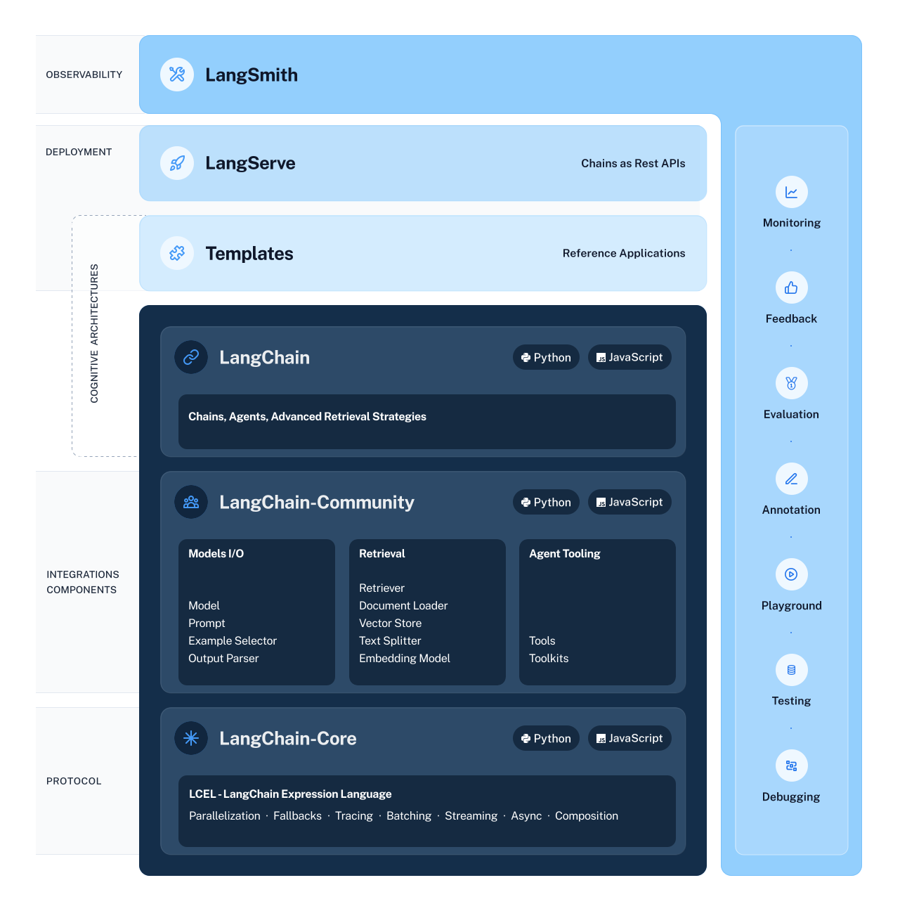

# 入門教學篇

原文: [LangChain 怎麼玩？入門教學篇](https://myapollo.com.tw/blog/langchain-tutorial-get-started/)

AI 時代，打不贏就加入它！

所以個人認為學會 LangChain 之類的框架，在未來可能會是每個程式設計師不可或缺的技術，也就是說除了寫程式之外，你可能還需要用 LangChain 之類的框架做出適合自己的工具，幫助提升效率與生產力，藉此增加自身的職場優勢。

本文將介紹 LangChain 結合 openai 語言模型如何使用的入門教學。

## 本文環境

- Linux (Ubuntu)
- Python 3
- LangChain

```
pip install langchain langchain-openai python-dotenv
```

## LangChain 簡介

[LangChain](https://www.langchain.com/) 是 1 套專門用來開發語言模型(Language Model)相關應用的框架(framework), 簡單來說可以讓開發者整合不同的語言模型，開發像 ChatGPT, 聊天機器人、數位助理等等應用程式。

相信很多人對 LangChain 這個名字感到疑惑。

先介紹 Lang 的部分， Lang 代表 Language Model, 也是呼應 LangChain 專門用以開發語言模型相關應用的用途。

Chain 的部分則是 LangChain 的功能，它將大語言模型的應用視為 1 個 Chain, 舉 ChatGPT 聊天應用為例，它至少需要結合提示詞(prompt)與 1 個大語言模型，過程很像是把提示詞丟給大語言模型處理，例如：

```
提示詞："你是資深 Python 工程師，請幫我寫出 1 個 Python Hello World 範例"
```

這樣的組合行為在 LangChain 被抽象化為 1 個 Chain, 程式碼片段如下：

```python
from langchain_openai import ChatOpenAI
from langchain_core.prompts import ChatPromptTemplate

llm = ChatOpenAI(openai_api_key="...略...")
prompt = ChatPromptTemplate.from_messages([
    ("system", "你是資深 Python 工程師"),
    ("user", "請幫我寫出 1 個 Python Hello World 範例")
])

chain = prompt | llm
```

上述範例中的 `prompt | llm` 就是 1 個最簡單的 Chain, 所以開發 LangChain 應用其實多半是在組合/處理 Chain 的工作，讓 Chain 能夠藉由語言模型的力量提供服務。噢，這個組合方式稱為 [LCEL, LangChain Expression Language](https://python.langchain.com/docs/expression_language/get_started)。

目前 LangChain 包含多個部份：

1. LangChain Libraries LangChain 相關的功能與 API 等等，支援 Python 與 JavaScript
2. [LangChain Templates](https://python.langchain.com/docs/templates) 一些常見的 LangChain 樣板(templates)集合，讓開發者可以套用，省去重新開發的成本
3. [LangServe](https://python.langchain.com/docs/langserve) 可以將 LangChain 的 chain 開發成 REST API 的部件
4. [LangSmith](https://smith.langchain.com/) 可以讓開發者對語言模型進行測試、評估、除錯、監控等行為的 1 個平台



本文將會著重在 LangChain Libraries 的部分。

## 牛刀小試 — 問候、聊天

對 LangChain 有基本認識之後，接著進行第 1 個範例，讓我們跟語言模型聊天吧！

以下是第 1 個範例，該程式碼以簡單一句問候 `Hi, how are you today?` 與語言模型 OpenAI 進行互動：

```python
from langchain_openai import ChatOpenAI

# 取得 llm 實例
llm = ChatOpenAI()

# 執行
print(chain.invoke("Hi, how are you today?"))
```

上述程式執行之後，很高機率會回應類似以下結果：

```console
content="Hello! I'm just a computer program, so I don't have feelings, but I'm here and ready to help you with anything you need. How can I assist you today?" response_metadata={'finish_reason': 'stop', 'logprobs': None}
```

意思是「我是 AI, 我沒有任何情緒與感覺，我無法與人類般體驗世界。不過，我還是能夠回答你的任何問題與提供幫助，歡迎問我任何問題。」

簡單的幾行程式碼，就能夠與語言模型進行互動，足見 LangChain 很容易使用。

這程式碼主要是 `from langchain_openai import ChatOpenAI` 模組，並使用 langchain 標準元件的共同介面的 `invoke()` 方法，傳入我們想與之互動的字串，最後將結果列印出來。


## 變成 Chain 吧！

學習 LangChain 最重要的就是將語言模型的操作變成 Chain 。

Chain 的組合需要使用 `|` 運算子，跟 Linux 指令的管道(pipe)符號很像，都是將前 1 個指令執行的結果透過管道傳給下 1 個指令作為 input 的作用。

因此最簡單的 Chain 是以下形式：

```python
chain = prompt | llm
```

接下來，我們將第 1 個範例轉為 Chain 形式：


```python
from langchain_openai import ChatOpenAI
from langchain_core.prompts import ChatPromptTemplate

# 構建一個 ChatPromptTempate 物件
prompt = ChatPromptTemplate.from_messages([
    ("user", "{user_msg}"),
])

# 構建一個 llm 模型實例
llm = ChatOpenAI(model="gpt-3.5-turbo")

# 組合成一個 chain
chain = prompt | llm

# 觸發 chain 的執行
print(chain.invoke({"user_msg": "Hi, how are you today?"}))
```

上述範例與第 1 個範例最大的不同，是我們使用 `langchain_core.prompts` 模組中的 `ChatPromptTemplate` 定義 `prompt`, 這組 `prompt` 只接受 1 個使用者輸入的參數 `{user_msg}` (`user_msg` 可以隨喜好命名，此處是 Python `format string` 的用法，如果不了解的話請參考 制霸 Python `f-string` 各種格式使用方法)，接著我們將 `prompt` 與 `llm` 透過 `|` 運算子組合成 chain ，最後透過 chain 的 `invoke` 方法，將 `user_msg` 參數代入。

上述範例的執行結果如下，眼尖的人應該會發現結果并不是一個簡單的字串，而是有一定的數據結構 `content="......" response_metadata={'finish_reason': 'stop', 'logprobs': None}`

很多時候，我們可能需要對語言模型的輸出做額外的格式處理，例如只擷取 `content="..."`裡的內容或者轉為其他格式等等，這個也能夠透過在 Chain 的尾端加入處理輸出的方式達成：

```python
chain = prompt | llm | <處理輸出的程式>
```

`<處理輸出的程式>` 在 LangChain 稱為 `output parser`, 同時 LangChain 也有內建 1 個 class 稱為 `StrOutputParser` 可以使用(更多模組請參考 [langchain_core.output_parsers](https://api.python.langchain.com/en/latest/core_api_reference.html#module-langchain_core.output_parsers) )，因此可以透過繼承的方式做客製化的輸出處理，讓我們把上述的範例加上 `output parser`：

```python
from langchain_openai import ChatOpenAI
from langchain_core.prompts import ChatPromptTemplate
from langchain_core.output_parsers import StrOutputParser

# 構建一個 ChatPromptTempate 物件
prompt = ChatPromptTemplate.from_messages([
    ("user", "{user_msg}"),
])

# 構建一個 llm 模型實例
llm = ChatOpenAI(model="gpt-3.5-turbo")

# 構建一個 output_parser 實例
output_parser = StrOutputParser()

# 組合成一個 chain
chain = prompt | llm | output_parser

# 觸發 chain 的執行
print(chain.invoke({"user_msg": "Hi, how are you today?"}))
```

上述的執行結果會發現最後的結果是一個很單純的字串:

```console
Hello! I'm just a computer program, so I don't have feelings, but I'm here and ready to assist you. How can I help you today?
```

目前為止，大家應該能夠稍微體會到 LangChain 的力量。

## 賦予語言模型系統指令

學會 Chain 的用法之後，就可以為語言模型做些加值應用，例如賦予它系統指令，例如請它扮演 1 個具有 SEO 知識的專業寫手，幫助我們寫一些文章。

要賦予它系統指令，就需要在 prompt 著手，加上系統指令，系統指令的格式為：

```python
("system", "系統指令")
```

以剛剛的 SEO 專業寫手為例，系統指令可以寫成：

```python
("system", "You are a content manager with extensive SEO knowledge. Your task is to write an article based on a given title.")
```

接著，將系統指令放到 prompt 中：

```python
from langchain_openai import ChatOpenAI
from langchain_core.prompts import ChatPromptTemplate
from langchain_core.output_parsers import StrOutputParser

from dotenv import load_dotenv
import pprint as pp

# 載入環境變數
load_dotenv()

# 構建一個 ChatPromptTempate 物件
prompt = ChatPromptTemplate.from_messages([
    ("system", "You are a content manager with extensive SEO knowledge. Your task is to write an article based on a given title."),
    ("user", "{user_msg}"),
])

# 構建一個 llm 模型實例
llm = ChatOpenAI(model="gpt-3.5-turbo")

# 構建一個 output_parser 實例
output_parser = StrOutputParser()

# 組合成一個 chain
chain = prompt | llm | output_parser

# 觸發 chain 的執行
print(chain.invoke({"user_msg": "How does software change the world?"}))
```

上述範例執行結果會產生 1 篇英文文章。

至此，你已經學會使用系統指令，可以開始打造適合自己的工具了！

## 總結

截至目前為止，本文的內容讓大家認識 LangChain 的大致樣貌，並且學會如何使用 LangChain 以及組合出 Chain 跟使用系統指令，各位現在應該都有能力能夠做出僅供自己使用的 AI 工具。

礙於篇幅太長容易消化不良，所以本系列文章將拆成多篇進行！後續將介紹更多、更完整的 AI 應用與 LangChain 功能！
