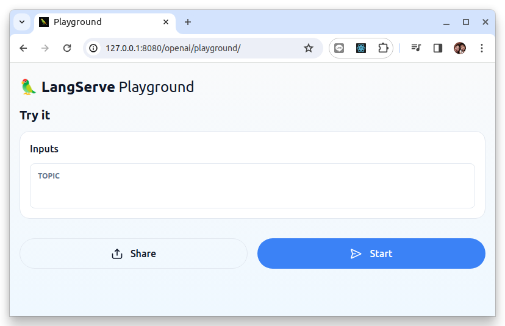

# 使用 LangServe 為 LangChain 應用程式建立 REST API

原文: [Using LangServe to build REST APIs for LangChain Applications](https://www.koyeb.com/tutorials/using-langserve-to-build-rest-apis-for-langchain-applications)

## 介紹

[LangChain](https://www.langchain.com/) 是一個強大的框架，用於使用 AI 語言模型建立應用程式。它透過簡化提示範本、配置查詢上下文以及將離散流程連結在一起以形成複雜的管道，簡化了與本地或遠端 LLM 互動的過程。

[LangServe](https://www.langchain.com/langserve) 是一個 LangChain 項目，可協助您透過 REST API 建置和交付這些應用程式。在底層，它使用 [FastAPI](https://fastapi.tiangolo.com/) 來建立路由和建置 Web 服務，並利用 [Pydantic](https://docs.pydantic.dev/latest/) 來處理資料驗證。

在本文，我們將示範如何使用 LangChain 和 LangServe 建立應用程式。該應用程式將提供 REST API，用戶可以在其中提交查詢。它將這些資訊以及上下文資訊傳遞給 OpenAI 以產生回應。

## 環境準備

本文的 Python 虛擬環境是使用 miniconda 來建立 (也可使用其它的Python 虛擬環境工具來替代)。

參考: [Miniconda](https://docs.anaconda.com/free/miniconda/index.html)

下列的命令列將幫助您快速設定最新的 Miniconda 安裝程式。

=== "Linux"

    下列的四個命令會快速、安靜地安裝最新的 64 位元版本的安裝程序，然後進行自行清理。若要為 Linux 安裝不同版本或架構的 Miniconda，請在 `wget` 命令中變更 `.sh` 安裝程式的名稱。

    ```bash
    mkdir -p ~/miniconda3
    wget https://repo.anaconda.com/miniconda/Miniconda3-latest-Linux-x86_64.sh -O ~/miniconda3/miniconda.sh
    bash ~/miniconda3/miniconda.sh -b -u -p ~/miniconda3
    rm -rf ~/miniconda3/miniconda.sh
    ```

    安裝後，初始化新安裝的 Miniconda。以下命令針對 `bash` 和 `zsh shell` 進行初始化:

    ```bash
    ~/miniconda3/bin/conda init bash
    ~/miniconda3/bin/conda init zsh
    ```

=== "Windows"

    下列的三個命令快速、安靜地安裝最新的 64 位元版本的安裝程序，然後自行清理。若要安裝適用於 Windows 的 Miniconda 的不同版本或體系結構，請在 `curl` 指令中變更 `.exe` 安裝程式的名稱。

    ```bash
    curl https://repo.anaconda.com/miniconda/Miniconda3-latest-Windows-x86_64.exe -o miniconda.exe
    start /wait "" miniconda.exe /S
    del miniconda.exe
    ```

安裝完成後，開啟 "Anaconda Prompt (miniconda3)"程式即可使用 Miniconda3。對於 Powershell 版本，請使用 "Anaconda Powershell Prompt (miniconda3)"。

## 步驟

要完成本指南並部署 LangServe 應用程序，您需要執行以下步驟：

1. 設定 Project 目錄
2. 建立應用程式目錄結構並安裝依賴項
3. 建立 LangServe 應用程式
4. 測試應用程式
5. 調整 Dockerfile


### 1.設定 Project 目錄

首先，建立並移動到一個專案目錄，該目錄將保存我們將要建立的應用程式:

```bash
mkdir example-langserve
cd example-langserve
```

在專案目錄裡面，建立一個名為 `.env` 的檔案。在內部，透過將 `OPENAI_API_KEY` 環境變數設定為您的 OpenAI API 金鑰:

``` title=".env"
OPENAI_API_KEY="<YOUR_OPENAI_API_KEY>"
```

我們的應用程式將從該檔案中讀取 API 金鑰，以驗證其對 OpenAI 服務的請求。

接下來，為專案創建並啟動新的 Python 虛擬環境。這會將我們專案的依賴項與系統包隔離，以避免衝突並提供更好的可重複性：

```bash
conda create -n example-langserve python=3.11
conda activate example-langserve
```

!!! info
    請注意, langserve 需要 Python >= 3.11 版本

您的虛擬環境現在應該已啟動。

**匯出Python 虛擬環境到 Conda**

```bash
conda env export | grep -v "^prefix: " > environment.yml
```

### 2.建立應用程式目錄結構並安裝依賴項

現在我們正在虛擬環境中工作，我們可以開始安裝應用程式將使用的套件並設定專案目錄。

標準 Python 安裝預設包含 pip 套件管理器。然而，LangServe 專案預設使用 [poetry](https://python-poetry.org/)。因此，我們將分兩個階段安裝依賴項。

首先，安裝 `langchain-cli` 軟體包來取得 `langchain` 命令列工具。我們也將藉此機會安裝 `poetry` 並確保 `pip` 是最新的:

```bash
pip install -U pip langchain-cli poetry
```

接下來，使用新安裝的 `langchain` 指令，在目前目錄中初始化一個 LangChain 專案:

```bash
langchain app new .
```

!!!info
    注意：請務必包含 `.` 以定位目前目錄。

系統將詢問您是否要安裝任何軟體包。儘管有這樣的措辭，但這個提示實際上指的是 LangChain 模板而不是 Python 套件。按 ENTER 鍵繼續而不新增任何範本。

使用新的專案文件，您的目錄現在應該類似於以下內容：

```bash
.
├── app
│   ├── __init__.py
│   ├── __pycache__
│   │   ├── __init__.cpython-311.pyc
│   │   └── server.cpython-311.pyc
│   └── server.py
├── Dockerfile
├── packages
│   └── README.md
├── pyproject.toml
└── README.md

```

`pyproject.toml` 檔案是 `langchain` 指令和 `poetry` 都用來記錄依賴關係資訊和設定專案元資料的主要檔案。因為這現在使目錄成為有效的 `poetry` 項目，所以我們可以使用 `poetry` 來安裝其餘的依賴項:

- `langserve[all]`: LangServe 庫的伺服器和客戶端元件。
- `langchain-openai`: 該軟體包包含 LangChain 的 OpenAI 整合。
- `python-dotenv`: 可用於讀取環境變數和 `.env` 檔案的套件。

```bash
poetry add "langserve[all]" langchain-openai python-dotenv
```

我們的專案目錄現在擁有我們開始工作所需的所有依賴項和專案文件。

### 3.建立 LangServe 應用程式

若要建立基本的 LangServe 應用程序，請在文字編輯器中開啟 `app/server.py` 檔案。在裡面，將現有內容替換為以下程式碼:

```python title="app/server.py"
# app/server.py
from fastapi import FastAPI
from fastapi.responses import RedirectResponse
from langserve import add_routes
from langchain_openai import ChatOpenAI
from langchain_core.prompts import ChatPromptTemplate
import os
from dotenv import load_dotenv

# 載入環境變數
load_dotenv()

# 構建一個 FaseAPI() 的實例
app = FastAPI()

# 使用 langchain LCEL 語法來構建 GenAI 邏輯

## 1. 構建一個 llm 模型實例
model = ChatOpenAI(model="gpt-3.5-turbo")

## 2. 構建一個 ChatPromptTempate 物件
prompt = ChatPromptTemplate.from_template("Give me a summary about {topic} in a paragraph or less.")

## 3. 用 LCEL 語法組成一個 chain
chain = prompt | model

@app.get("/")
async def redirect_root_to_docs():
    return RedirectResponse("/docs")


# 增加一個 end_point 來把上述的 chain 以 REST API 的型式發佈出來
add_routes(app, chain, path="/openai")

# 後端 REST API 服務的進入點
if __name__ == "__main__":
    import uvicorn

    uvicorn.run(app, host="0.0.0.0", port=8000)
```

讓我們花點時間回顧一下這個應用程式的用途。

程式碼首先從我們安裝的套件中導入所有必需的類別、函數。然後，它初始化一個 `FastAPI()` 實例，該實例將用作應用程式的主要應用程式物件。

接下來，我們初始化 `ChatOpenAI` 和 `ChatPromptTemplate` 類別的實例，並將它們分別指派給模型和提示變數。對於 `ChatOpenAI` 實例，我們使用 `python-dotenv` 中的設定物件從 `.env` 檔案載入設定成環境變數來取得 OpenAI API 金鑰。對於 `ChatPromptTemplate`，我們設定提示以詢問給定主題的摘要。然後我們將這兩個連結在一個  `chain` 變數中。

我們新增了一條 route 來為 `/openai` 的 chain 提供服務。之後，我們使用 `uvicorn` 在使用連接埠 8000 的所有介面上提供應用程式服務。

### 4.測試應用程式

我們可以透過在主專案目錄中鍵入以下內容來測試應用程式是否按預期運作：

```bash
langchain serve
```

結果:

```bash
NFO:     Uvicorn running on http://127.0.0.1:8000 (Press CTRL+C to quit)
INFO:     Started reloader process [417398] using StatReload
INFO:     Started server process [417402]
INFO:     Waiting for application startup.

 __          ___      .__   __.   _______      _______. _______ .______     ____    ____  _______
|  |        /   \     |  \ |  |  /  _____|    /       ||   ____||   _  \    \   \  /   / |   ____|
|  |       /  ^  \    |   \|  | |  |  __     |   (----`|  |__   |  |_)  |    \   \/   /  |  |__
|  |      /  /_\  \   |  . `  | |  | |_ |     \   \    |   __|  |      /      \      /   |   __|
|  `----./  _____  \  |  |\   | |  |__| | .----)   |   |  |____ |  |\  \----.  \    /    |  |____
|_______/__/     \__\ |__| \__|  \______| |_______/    |_______|| _| `._____|   \__/     |_______|

LANGSERVE: Playground for chain "/openai/" is live at:
LANGSERVE:  │
LANGSERVE:  └──> /openai/playground/
LANGSERVE:
LANGSERVE: See all available routes at /docs/

INFO:     Application startup complete.
```

這將啟動應用程式伺服器。

**OpenApi Docs**

在網頁瀏覽器中導覽至 `127.0.0.1:8000/docs` 以查看 Langserve 自動生成的 OpenApi 格式的 API 文件。


使用 `curl` 來測試:

```bash
curl -X POST http://localhost:8000/openai/invoke -d '{"input":{"topic":"wistron"}}'
```

結果:

```bash
{
  "output": {
    "content": "Wistron Corporation is a Taiwanese multinational corporation that specializes in the design and manufacturing of electronic products, including smartphones, notebooks, tablets, and servers. With a focus on innovation and sustainability, Wistron has established itself as a leading player in the technology industry, serving customers worldwide. The company is known for its commitment to quality, customer satisfaction, and social responsibility, making it a trusted partner for many global brands.",
    "additional_kwargs": {},
    "response_metadata": {
      "token_usage": {
        "completion_tokens": 84,
        "prompt_tokens": 21,
        "total_tokens": 105
      },
      "model_name": "gpt-3.5-turbo",
      "system_fingerprint": "fp_b28b39ffa8",
      "finish_reason": "stop",
      "logprobs": null
    },
    "type": "ai",
    "name": null,
    "id": null,
    "example": false
  },
  "callback_events": [],
  "metadata": {
    "run_id": "fc83bba2-b58b-4db4-9eac-92a303a226a2"
  }
}
```

**Playground**

在網頁瀏覽器中導覽至 `127.0.0.1:8000/openai/playground` 以查看提示頁面。



您可以透過輸入問題或主題來測試一切是否正常運作。舉例來說, 輸入 "wistron" 在 TOPIC 的欄位:


完成測試後，按 `CTRL-C` 停止伺服器。

### 5.調整 Dockerfile

在專案目錄裡面，我們建立一個名為 `.env` 的檔案。我們需要修改 Dockerfile 來將 `.env` 檔案複製進 Docker 映像中。

```docker hl_lines="17"
FROM python:3.11-slim

RUN pip install poetry==1.6.1

RUN poetry config virtualenvs.create false

WORKDIR /code

COPY ./pyproject.toml ./README.md ./poetry.lock* ./

COPY ./package[s] ./packages

RUN poetry install  --no-interaction --no-ansi --no-root

COPY ./app ./app

COPY ./.env ./.env

RUN poetry install --no-interaction --no-ansi

EXPOSE 8080

CMD exec uvicorn app.server:app --host 0.0.0.0 --port 8080
```

要部署 langserve 項目，首先建置 docker 映像:

```bash
docker build . -t example-langserve:latest
```

然後運行映像:

```bash
docker run -p 8080:8080  example-langserve:latest
```

這將使用 Docker 來啟動 Langserve 應用程式伺服器。在網頁瀏覽器中導覽至 `127.0.0.1:8080/openai/playground` 以查看提示頁面。您可以透過輸入問題或主題來測試一切是否正常運作。


### 6.匯出 Conda 環境配置 (optional)

將環境匯出到 Conda（在 Linux 或 macOS 中）:

```bash
conda env export | grep -v "^prefix: " > environment.yml
```

### 7.重新構建環境

大多數的開發團隊都會把專案的源碼使用 git 來保存到 github 或 gitlab 的 repo 中。

當有其它的成員加入到團隊中來協同開發時，則只需要 clone git repo後, 並使用下列命令來初始化環境:

```bash
conda env create -f environment.yml
poetry install
```

## 總結

LangServe 其實是相當好用的套件，不過官方文件其實多半以提供範例為主，如果是新手肯定會難以迅速理解，究其原因是我們需要對 **LCEL** 與 **FastAPI** 有相當程度的了解才行，一旦對 `LCEL` 與 `FastAPI` 上手之後，就也能夠理解 LangServe 到底要如何使用了！