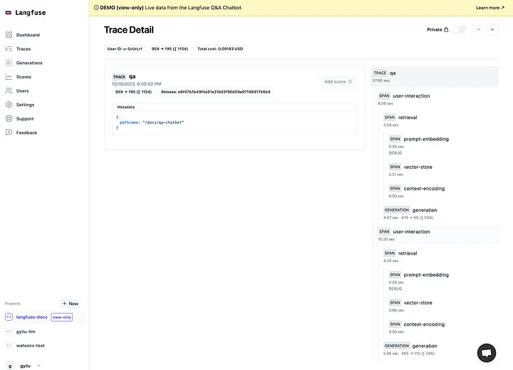

# LLM Observability 深入探索

原文: [LLM Observability Deep Dive](https://gyliu513.medium.com/llm-observability-deep-dive-df8b6e17c8f3)

LLM（大型語言模型）是一種人工智慧 (AI)，經過大量文字和程式碼資料集的訓練。這使他們能夠執行廣泛的任務，包括生成文字、翻譯語言、編寫不同類型的創意內容以及以翔實的方式回答您的問題。

大多數 LLM 仍在持續演化迭代中，但它們已經被應用或整合於各種應用程序，例如客戶服務聊天機器人、搜尋引擎和創意寫作工具。隨著 LLM 變得更加複雜和廣泛使用，能夠監控和理解他們的行為變得越來越重要。開發者不想將 LLM 視為黑盒子，但他們想知道這個黑盒子中發生了什麼。這就是 LLM 可觀察性的用武之地。

LLM 可觀察性是收集和分析有關 LLM 表現和行為的數據的實踐。這些數據可用於提高 LLM 的表現、檢測偏見、診斷問題並確保可靠且值得信賴的人工智慧結果。

讓我們用 Langchain 框架的生態系架構來了解 LLM Observability 的定位:

## Data Should be Observed

我們需要觀察的 LLM 可觀測性資料主要有五種類型：

- **Logs:** 日誌提供有關 LLM 輸入和輸出的詳細信息，例如向 LLM 提供的提示及其產生的回應。
- **Metrics:** 指標是 LLM 績效的定量衡量標準，例如準確性、延遲和吞吐量。這可以使客戶對不同的 LLM 進行一些評估，以便為他們的用例選擇最佳的 LLM。
- **LLM Traces:** Trace 追蹤各個 LLM 任務的執行情況。此資訊可用於識別效能瓶頸並診斷問題。
- **Tenant Tracking:** 我們生活在一個多租戶的世界，追蹤 LLM 的所有租戶始終很重要，包括他們的成本、對話等等。
- **Feedback:** 使用者回饋對於提高 LLM 的性能、可靠性和可信度至關重要。透過了解使用者如何與 LLM 互動以及他們的需求是什麼，開發人員可以進行更改以改善 LLM 及其使用者體驗。

## Key Benefits of LLM Observability

以下是 LLM 可觀測性優勢的簡短清單：

- **Improved performance:** 透過監控 LLM 在不同任務上的表現，組織可以確定模型可以改進的領域。例如，如果 LLM 正在努力為特定語言對產生準確的翻譯，組織可以在該語言對的更大資料集上重新訓練模型。
- **Bias detection:** LLM 可能存在偏見，反映了他們接受模型訓練的數據的偏見。 LLM 可觀察性可用於檢測這些偏差並採取措施減輕它們。例如，組織可以使用 LLM 可觀察性來識別哪些人群更有可能收到 LLM 的不準確或誤導性答案。
- **Issue diagnosis:** 如果 LLM 產生意外或不正確的結果，LLM 可觀察性可用於診斷問題。例如，如果 LLM 產生幻覺（即編造不真實的事情），組織可以使用 LLM 可觀察性來識別導致這種行為的因素。
- **Reliable and trustworthy AI outcomes:** LLM 的可觀察性對於確保 LLM 產生可靠且值得信賴的結果至關重要。透過監控和了解 LLM 的行為，組織可以識別和減輕潛在風險。
- **Enable your LLM Apps ready for production:** 正如我之前的部落格中提到的，透過 LLM 可觀察性/分析，它將有助於為 LLM 應用程式的落地鋪平道路。

## Emerging LLM Observability Tools Intro

有許多新興的不同工具可以幫助實現 LLM 可觀察性。

開源專案工具:

- [Langfuse](https://langfuse.com/)
- [llmonitor](https://llmonitor.com/)
- [Helicone](https://www.helicone.ai/dashboard)

商業工具:

- [LangSmith](https://docs.smith.langchain.com/)
- [PromptLayer](https://promptlayer.com/)
- [Dynatrace](https://www.dynatrace.com/)
- [Datadog](https://www.datadoghq.com/)

他們中的大多數都為 LLM 可觀察性提供類似的功能，如下所示：

- **Metrics Collection:**  這將包括準確性、延遲、使用情況、成本和吞吐量等指標。
- **Tracing:** LLM 應用程式使用越來越複雜的抽象（鏈、帶有工具的代理、高級提示）。這些 LLM 可觀察性工具中的嵌套追蹤有助於了解正在發生的情況並找到問題的根本原因。
- **Unified LLM Observability and Analytics Platform:** 與不同的 LLM Ops 平台集成，包括 [LangChain](https://python.langchain.com/docs/get_started/introduction)、[Flowise](https://flowiseai.com/)、[LiteLLM](https://litellm.ai/)、[Langflow](https://docs.langflow.org/)、[OpenAI](https://openai.com/) 等。

## Current LLM Observability Tools Comparison

!!! info
    如果你想為你的 LLM 應用程式啟用 LLM 可觀察性，你需要對你的 LLM 應用程式進行一些程式碼更改以適應不同的 LLM 可觀察性工具，這似乎是現在大多數 LLM 可觀察性工具的一個主要問題。

## Key Features for a Unified LLM Observability Platform

綜上所述，我們 LLM 可觀測性的最終目標是建立一個統一的 LLM 可觀測性平台，該平台可以涵蓋大多數 LLM 營運平台，包括 LangChain、LangFuse、Flowise、LiteLLM 等，一些關鍵功能如下。我試圖為上面列出的 LLM 可觀察性工具的每個關鍵功能發布一張圖片，以清晰地分享該功能的外觀。

### Analytics

分析使管理員能夠深入了解其成本和使用情況，這將有助於提高成本效益、效能和容量規劃，以及某些計費和報告目的。

### Tracing

追蹤允許管理員調試他們的人工智慧代理並識別問題。它還將有助於追蹤不同模型/代理的延遲、準確性等，這可以幫助客戶對不同模型/代理商進行一些評估。

### Logging

日誌記錄允許管理員記錄和檢查 LLM 請求和回應。透過日誌跟踪，開發人員可以更好地了解 LLM 的工作原理。這些資訊可用於改進 LLM 的設計和培訓，並為 LLM 開發新的應用程式。

### User Tracking

用戶追蹤可讓客戶識別您的用戶、追蹤他們的成本、對話等。它還可以幫助提高 LLM 的表現和能力。透過追蹤使用者如何與 LLM 互動，開發人員可以使 LLM 更加可靠、準確、公平和通用。

### User Feedback

使用者回饋可以透過多種方式收集，例如透過調查、訪談和使用者測試。為了全面了解 LLM 的優勢和劣勢，收集各種使用者的回饋非常重要。

一旦收集到使用者回饋，就可以透過多種方式改進 LLM。例如，回饋可用於識別和修復錯誤、改進訓練資料或開發新的訓練演算法。

### Multi-Tenancy

多租戶可以為 LLM 監控提供許多好處，包括成本效益、可擴展性、安全性和隱私、更好地利用資源，以及比較和對比不同 LLM 的性能、跟踪其使用情況以及識別和排除故障的能力 LLM 特定問題。

### Unified Observability Platform

開發者有很多框架選擇來建立他們的 LLM 應用程序，他們可以基於 Langchain、Langflow、Flowise、LiteLLM 等構建他們的 LLM 應用程式。這樣，我們需要建立一個統一的可觀察性平台來與不同的 LLM 編排平台集成。

