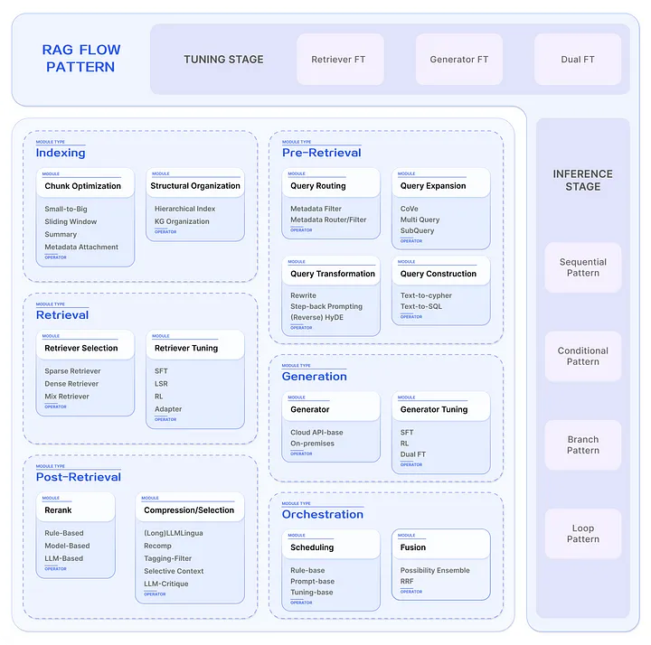
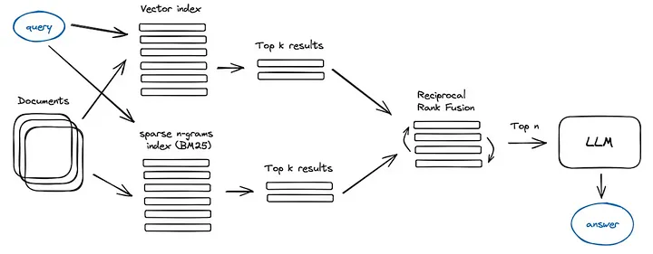

# RAG 進階模組劃分

原文:[小白学RAG：RAG进阶模块划分](https://www.modb.pro/db/1754037577913028608)

檢索增強生成（RAG）的概念作為實施 LLM 應用的方法引起了相當多的關注。我們撰寫了有關 RAG 的綜合調查，深入研究了從 Naive RAG 到 Advanced RAG 和 Modular RAG 的轉變。然而，該調查主要透過增強的視角（例如增強源/階段/過程）來審查 RAG 技術。

參考:

1. [Modular RAG and RAG Flow: Part Ⅰ](https://medium.com/@yufan1602/modular-rag-and-rag-flow-part-%E2%85%B0-e69b32dc13a3)
2. [Modular RAG and RAG Flow: Part II](https://medium.com/@yufan1602/modular-rag-and-rag-flow-part-ii-77b62bf8a5d3)

## 什麼是 RAG?

RAG 技術是一種檢索增強生成的方法，結合了大型語言模型和檢索系統的優勢，以提高生成內容的準確性、相關性和時效性。

相較於僅依賴大型語言模型的生成，RAG 技術可以從外部知識庫中檢索訊息，避免了模型的幻覺問題，並提升了對即時性要求較高問題的處理能力。與傳統的知識庫問答系統相比，RAG 技術更加靈活，可以處理非結構化的自然語言文本。

RAG 並非旨在取代現有的知識庫問答系統，而是作為一種補充，強調即時性和準確性，並且透過 **結合生成** 和 **檢索機制** 來提升自然語言處理任務的效果。

## RAG 模組化

模組化 RAG 呈現出高度可擴展的範式(pattern)，將 RAG 系統劃分為模組類型、模組和運算子三層結構。每種模組類型代表 RAG 系統中的一個核心流程，包含多個功能模組。

每個功能模組又包含多個具體的運算子。整個 RAG 系統變成了多個模組和對應運算子的排列組合，形成我們所說的 RAG 流程。在流程中，可以在每個模組類型中選擇不同的功能模組，在每個功能模組內部，又可以選擇一個或多個運算子。

RAG 模組化是指檢索增強生成技術的演進形式，其進展帶來了更多樣化和靈活的過程，具體體現在以下關鍵方面：

1. **增強數據獲取** RAG 已經超越了傳統的非結構化數據，現在包括半結構化和結構化數據，在預處理結構化數據方面更加關注，以改善檢索並減少模型對外部知識來源的依賴。
2. **整合技術** RAG 正在整合其他技術，包括微調、適配器模組和強化學習，以增強檢索能力。
3. **可適應的檢索過程** 檢索過程已發展到支援多輪檢索增強，利用檢索內容來指導生成，反之亦然。此外，自主判斷和 LLM 的使用增加了透過確定檢索的需求來回答問題的效率。

## 1. Indexing

索引是將文字分解為可管理的區塊的過程，在組織系統中是一個至關重要的步驟，面臨三個主要挑戰：

- **不完整的內容表示** 區塊的語義資訊受到分割方法的影響，在更長的上下文中會導致重要資訊的遺失或被淹沒。
- **不準確的區塊相似性搜尋** 隨著資料量的增加，檢索中的雜訊增加，導致頻繁與錯誤資料匹配，使檢索系統變得脆弱且不可靠。
- **引用軌跡不清晰** 檢索到的區塊可能來自任何文檔，缺乏引用軌跡，可能導致存在來自多個不同文檔的區塊，儘管在語義上相似，但包含的內容卻是完全不同的主題。

### Chunk Optimization

較大的區塊可以捕獲更多的上下文，但也產生更多的噪音，需要更長的處理時間和更高的成本。而較小的區塊可能無法完全傳輸所需的上下文，但它們的噪音稀薄。

#### Sliding Window檢查

平衡這些需求的簡單方法是使用重疊塊。透過使用滑動窗口，可以增強語義轉換。然而，它也存在局限性，包括對上下文大小的不精確控制、截斷單字或句子的風險以及缺乏語義考慮。

#### Small-to-Big

關鍵思想是將用於檢索的區塊與用於合成的區塊分開。使用較小的區塊可以提高檢索的準確性，而較大的區塊可以提供更多的上下文資訊。

具體來說，一種方法可能涉及檢索較小的區塊，然後引用父 ID 以傳回較大的區塊。或者，可以檢索單一句子，並傳回該句子周圍的文字視窗。

#### Summary

它類似於從小到大的概念，首先產生較大區塊的摘要，然後對摘要執行檢索。隨後，可以對較大的區塊進行二次檢索。

#### Metadata Attachment

可以使用元數據資訊來豐富區塊，例如頁碼、檔案名稱、作者、時間戳記、摘要或區塊可以回答的問題。隨後，可以根據該元資料過濾檢索，從而限制搜尋範圍。

### Structural Oraginzation

增強資訊檢索的一種有效方法是建立文件的層次結構。透過建構塊結構，RAG 系統可以加快相關資料的檢索和處理。

#### Hierarchical Index

在文件的層次結構中，節點以父子關係排列，區塊連結到它們。資料摘要儲存在每個節點上，有助於快速遍歷資料並協助 RAG 系統確定要提取哪些區塊。這種方法還可以減輕由塊提取問題引起的錯覺。

建構結構化索引的方法主要有：

1. **Structural awareness** 文件中的段落和句子分段
2. **Content awareness** PDF、HTML、Latex 中的固有結構
3. **Semantic awareness** 基於 NLP 技術的文本語意辨識和分割，例如利用 NLTK

參考: [大規模檢查 Arcus 的層次索引](https://www.arcus.co/blog/rag-at-planet-scale)。

#### KG Organization Docs

利用知識圖（KG）建構文件的層次結構有助於保持一致性。它描繪了不同概念和實體之間的聯繫，顯著減少了產生幻覺的可能性。

另一個優點是將資訊檢索過程轉化為 LLM 可以理解的指令，從而提高知識檢索的準確性，並使 LLM 能夠產生上下文連貫的回應，從而提高 RAG 系統的整體效率。

更詳細的資訊見 [Neo4j 實作](https://neo4j.com/developer-blog/advanced-rag-strategies-neo4j/)和 [LllmaIndex Neo4j 查詢引擎](https://docs.llamaindex.ai/en/stable/examples/index_structs/knowledge_graph/Neo4jKGIndexDemo.html)。

## 2. Pre-Retrieval

Naive RAG 的主要挑戰之一是它直接依賴使用者的原始查詢作為檢索的基礎。提出精確而清晰的問題很困難，不謹慎的查詢會導致檢索效率不佳。

此階段的主要挑戰包括：

- **Poorly worded queries** 問題本身很複雜，語言也沒有很好的組織。
- **Language complexity & ambiguity** 在處理專業詞彙或具有多種意義的模糊縮寫時，語言模型通常會遇到困難。例如，他們可能無法辨別 LLM 是指大語言模型還是法律背景下的法學碩士。

### Query Expansion

將單一查詢擴展到多個查詢可以豐富查詢的內容，提供進一步的上下文來解決任何缺乏特定細微差別的問題，從而確保產生的答案的最佳相關性。

#### Multi-Query

透過採用 promp engineering 透過 LLM 擴展查詢，這些查詢可以並行執行。查詢的擴展不是隨意的，而是經過精心設計的。此設計的兩個關鍵標準是查詢的多樣性和覆蓋範圍。

使用多個查詢的挑戰之一是可能會削弱使用者的原始意圖。為了緩解這種情況，我們可以指示模型在提示工程中為原始查詢分配更大的權重。

#### Sub-QueryRewrite

子問題規劃的過程代表了必要的子問題的生成，以便在組合時將原始問題結合起來並充分回答原始問題。原則上，加入相關上下文的過程類似查詢擴充。具體來說，可以使用 [least-to-most prompting](https://arxiv.org/abs/2205.10625) 的提示方法將一個複雜的問題分解為一系列較簡單的子問題。

#### CoVe

另一種查詢擴展方法涉及使用 Meta AI 提出的[驗證鏈（CoVe）](https://arxiv.org/abs/2309.11495)。擴展的查詢經過 LLM 的驗證，以達到減少幻覺的效果。經過驗證的擴展查詢通常表現出更高的可靠性。

參考: [A LangChain implementation of Chain of Verification (CoVe) to reduce hallucination in LLM](https://medium.com/@james.li/a-langchain-implementation-of-chain-of-verification-cove-to-reduce-hallucination-0a8fa2929b2a)

### Query Transformation

使用轉換後的查詢而不是使用者的原始查詢進行檢索和答案生成。

#### Rewrite

原始查詢並不總是最適合 LLM 檢索，尤其是在現實情境中。因此，我們可以提示 LLM 重寫查詢。除了使用 LLM 進行查詢重寫之外，還可以利用專門的較小語言模型，例如 [RRR（Rewrite-retrieve-read）](https://arxiv.org/abs/2305.14283)。

淘寶促銷系統中 Query Rewrite 方法的實施，即 [BEQUE：Query Rewriting for Retrieval-Augmented Large Language Models](https://arxiv.org/abs/2305.14283)，顯著提高了長尾查詢的召回率，從而帶動了 GMV 的上升。

#### HyDE

當回應查詢時，LLM 會建立假設文件（假設答案），而不是直接在向量資料庫中搜尋查詢及其計算向量。它側重於嵌入答案之間的相似性，而不是尋求問題或查詢的嵌入相似性。此外，它還包括 Reverse HyDE，它專注於從查詢到查詢的檢索。

<figure markdown="span">
  
  <figcaption>HyDE 和 Reverse HyDE 的核心思想都是在查詢和答案之間架起映射的橋樑。</figcaption>
</figure>

#### Step-back Prompting

使用 Google DeepMind 提出的 [Step-back Prompting](https://arxiv.org/abs/2310.06117) 方法，對原始查詢進行抽象，產生高階概念問題（step-back Question）。在 RAG 系統中， step-back question和原始查詢都用於檢索，並且這兩種結果都被用作語言模型答案生成的基礎。

參考:

- [A New Prompt Engineering Technique Has Been Introduced Called Step-Back Prompting](https://cobusgreyling.medium.com/a-new-prompt-engineering-technique-has-been-introduced-called-step-back-prompting-b00e8954cacb)
- [stepback-qa-prompting](https://python.langchain.com/docs/templates/stepback-qa-prompting)

### Query Routing

基於不同的查詢，路由到不同的 RAG 管道，適用於旨在適應不同場景的多功能 RAG 系統。

#### Metadata Router/ Filter

第一步涉及從查詢中提取關鍵字 (entity)，然後根據區塊中的關鍵字和元資料進行過濾以縮小搜尋範圍。

#### Semantic Router

另一種路由方法涉及利用查詢的語意資訊。具體方法請參考[語意路由器](https://github.com/aurelio-labs/semantic-router/)。當然，也可以採用混合路由方法，結合語意和基於元資料的方法來增強查詢路由。

### Query Construction

將使用者的查詢轉換為另一種查詢語言以存取替代資料來源。常見的方法包括：

- Text-to-Cypher
- Text-to-SQL

在許多場景中，結構化查詢語言（例如 SQL、Cypher）通常與語意資訊和元資料結合使用來建構更複雜的查詢。具體詳情請參考 Langchain 博客 [Query Construction](https://blog.langchain.dev/query-construction/)。

## 3. Retrieval

檢索過程在 RAG 中起著至關重要的作用。利用強大的 Pre-trained language models (PLMs) 可以有效表示潛在空間中的查詢和文本，從而促進問題和文件之間建立語義相似性以支援檢索。

需要考慮三個主要因素：

- 檢索效率
- 嵌入(embedding)品質
- 任務、數據和模型的協調

### Retriver Selection

自從 ChatGPT 發布以來，嵌入模型出現了瘋狂的發展。Hugging Face 的 MTEB 排行榜評估了 8 個任務中幾乎所有可用的嵌入模型——聚類、分類、Bittext Ming、Pair Classification、Reranking、Retrieval、語義文本相似度(STS) ）和摘要，涵蓋58個資料集此外，C-MTEB 專注於評估中國嵌入模型的能力，涵蓋 6 個任務和 35 個資料集。

查看 [MTEB/C-MTEB 排行榜](https://huggingface.co/spaces/mteb/leaderboard)。

#### Sparse Retriever

雖然稀疏編碼模型可能被認為是一種有些過時的技術，通常基於詞頻統計等統計方法，但由於其更高的編碼效率和穩定性，它們仍然佔有一定的地位。常見的係數編碼模型包括 **BM25** 和 **TF-IDF**。

#### Dense Retriever

基於神經網路的密集編碼模型包括以下幾種類型：

- 基於 BERT 架構建構的 Encoder-Decoder 語言模型，例如 ColBERT。
- 全面的多任務微調模型，如 BGE 和 Baichuan-Text-Embedding。
- 基於雲端 API 的模型，例如 OpenAI-Ada-002 和 Cohere Embedding。
- 新一代加速編碼框架 Dragon+，專為大規模資料應用而設計。

#### Mix/hybrid Retrieval

兩種嵌入方法捕捉不同的相關性特徵，並且可以透過利用互補的相關性資訊來相互受益。例如，稀疏檢索模型可用於為訓練密集檢索模型提供初始搜尋結果。此外，PLM 可用於學習術語權重以增強稀疏檢索。具體來說，它還表明稀疏檢索模型可以增強密集檢索模型的零樣本檢索能力，並協助密集檢索器處理包含稀有實體的查詢，從而提高穩健性。

### Retriever Fine-tuning

如果上下文可能與預訓練模型在嵌入空間中認為相似的內容不同，特別是在高度專業化的領域，如醫療保健、法律和其他富含專有術語的領域，調整嵌入模型可以解決這個問題。雖然這種調整需要額外的努力，但它可以顯著提高檢索效率和領域對齊。

#### SFT

您可以根據特定領域的資料建立自己的微調資料集，這項任務可以使用 LlamaIndex 快速完成。

#### LSR (LM-supervised Retriever)

與直接從資料集建立微調資料集相比，LSR 利用 LM 產生的結果作為監督訊號，在 RAG 過程中微調嵌入模型。

#### RL(Reinforcement learning)

受到 RLHF（Reinforcement Learning from Human Feedback）的啟發，利用基於 LM 的回饋透過強化學習來強化 Retriever。

#### Adapter

有時，微調整個檢索器的成本可能很高，尤其是在處理無法直接微調的基於 API 的檢索器時。在這種情況下，我們可以透過合併適配器模組並進行微調來緩解這種情況。添加適配器的另一個好處是能夠更好地與特定下游任務保持一致。

## 4. Post-Retrieval

檢索整個文件區塊並將其直接輸入到 LLM 的上下文環境中並不是最佳選擇。對文件進行後處理可以幫助 LLM 更好地利用上下文資訊。

主要挑戰包括：

- **Lost in the middle** 就像人類一樣，LLM 傾向於只記住長文本的開頭和結尾，而忘記中間部分。
- **Noise/anti-fact chunks** 檢索到的雜訊或事實上矛盾的文檔可能會影響最終的檢索產生。
- **Context Window** 儘管檢索了大量相關內容，但大型模型中上下文資訊長度的限制阻止了所有這些內容的包含。

### Rerank

在不改變其內容或長度的情況下對檢索到的文件區塊進行重新排序，以增強 LLM 更重要的文件區塊的可見性。具體而言：

#### Rule-base Rerank

根據某些規則，計算指標以對區塊進行重新排序。常見指標包括：

- Diversity
- Relevance
- MRR (Maximal Marginal Relevance, 1998)

MMR 背後的想法是減少冗餘並增加結果多樣性，它用於文字摘要。 MMR 根據查詢相關性和資訊新穎性的組合標準在最終關鍵短語清單中選擇短語。

#### Model-base Rerank

利用語言模型對文件區塊重新排序，選項包括：

- BERT 系列的編碼器-解碼器模型，例如 SpanBERT
- 專門的重新排名模型，例如 Cohere rerank 或 bge-raranker-large
- 通用大型語言模型，例如 GPT-4

### Compression and Selection

RAG 整合流程中的一個常見誤解是認為檢索盡可能多的相關文件並將它們連接起來形成冗長的檢索提示是有益的。然而，過多的上下文可能會引入更多的噪音，削弱 LLM 對關鍵資訊的感知，並導致「迷失在中間」等問題。解決此問題的常見方法是壓縮並選擇檢索到的內容。

#### （Long)LLMLingua

透過利用對齊和訓練的小語言模型，例如 GPT-2 Small 或 LLaMA-7B，可以實現從提示中檢測和刪除不重要的標記，將其轉換為人類難以理解但 LLM 可以很好理解的形式。這種方法提供了一種直接且實用的即時壓縮方法，無需對 LLM 進行額外培訓，同時平衡語言完整性和壓縮率。

#### Recomp

Recomp 引入了兩種類型的壓縮器：提取壓縮器從檢索到的文件中選擇相關句子，抽象壓縮器透過合併多個文件中的資訊來產生簡潔的摘要。當產生的摘要被添加到語言模型的輸入之前時，這兩個壓縮器都經過訓練，以提高語言模型在最終任務上的效能，同時確保摘要的簡潔性。在檢索到的文件與輸入無關或不向語言模型提供附加資訊的情況下，壓縮器可以傳回空字串，從而實現選擇性增強。

#### Selective Context

透過識別並去除輸入上下文中的冗餘內容，可以簡化輸入，從而提高語言模型的推理效率。選擇性上下文類似於「停用詞刪除」策略。在實踐中，選擇性上下文根據基本語言模型計算的自資訊來評估詞彙單元的資訊內容。透過保留具有更高自資訊的內容，該方法為語言模型處理提供了更簡潔、更有效率的文字表示，而不會影響其在不同應用程式中的表現。然而，它忽略了壓縮內容之間的相互依賴性以及目標語言模型和用於提示壓縮的小語言模型之間的一致性。

#### Tagging-Filter

Tagging 是一種相對直觀且直接的方法。具體來說，首先對文件進行 tagging，然後根據查詢的元資料進行過濾。

參考: [Tagging](https://python.langchain.com/docs/use_cases/tagging)

#### LLM-Critique

另一種簡單有效的方法是讓 LLM 在產生最終答案之前評估檢索到的內容。這使得 LLM 能夠透過 LLM 批判過濾掉相關性較差的文檔。例如，在查特勞（Chatlaw）中，法學碩士被提示對所引用的法律條款進行自我建議，以評估其相關性。

## 5. Generation

利用 LLM 根據使用者的查詢和檢索到的上下文資訊產生答案。

### Generator Selection

根據場景的不同，LLM 的選擇可以分為以下兩種類型：

#### Cloud API-base Generator

基於雲端 API 透過呼叫第三方 LLM 的 API，例如 OpenAI 的 ChatGPT、GPT-4 和 Anthropic Claude 等。

優點：

- 無伺服器壓力
- 高並行
- 能夠使用更強大的模型

缺點:

- 資料經過第三方，導致資料隱私問題
- 無法調整模型（在絕大多數情況下）

#### On-Premises Generator

本地部署的開源或自研的 LLM，例如 Llama 系列、GLM 等。優點和缺點與基於 Cloud API 的模型相反。本地部署的模型提供了更大的靈活性和更好的隱私保護，但需要更高的運算資源。

### Generator Fine-tuning

除了直接使用 LLM 外，根據場景和資料特徵進行有針對性的微調可以收到更好的效果。這也是使用本地設定的最大優勢之一。常見的微調方法有以下幾種：

#### SFT

當LLM缺乏特定領域的數據時，可以透過微調為 LLM 提供額外的知識。 Huggingface 的微調資料也可以用作初始步驟。

微調的另一個好處是能夠調整模型的輸入和輸出。例如，它可以使 LLM 適應特定的資料格式並按照指示產生特定風格的回應。

#### RL

透過強化學習將 LLM 的產出與人類或獵犬的偏好保持一致是一種潛在的方法。例如，手動註釋最終生成的答案，然後透過強化學習提供回饋。除了符合人類偏好之外，還可以符合微調模型和檢索器的偏好。

#### Distillation

當情況無法存取強大的專有模型或更大參數的開源模型時，一個簡單而有效的方法是提取更強大的模型（例如 GPT-4）。

#### Dual FT

微調產生器和檢索器以調整它們的偏好。典型的方法（例如 RA-DIT）使用 KL 散度來調整擷取器和產生器之間的評分函數。

## 6. Orchestration

Orchestration 是指用於控制 RAG 流程的模組。 RAG 不再遵循固定的流程，而是在關鍵點做出決策，並根據結果動態選擇下一步。這也是模組化 RAG 相比 Naive RAG 的關鍵特性之一。

### Scheduling

Judge 模組評估 RAG 流程中的關鍵點，確定是否需要檢索外部文件儲存庫、答案的滿意度以及進一步探索的必要性。它通常用於遞歸、迭代和自適應檢索。具體來說，主要包括以下兩個運算符：

#### Rule-base

下一步行動是根據預先定義的規則來決定的。通常，會對產生的答案進行評分，然後根據分數是否滿足預定義閾值來決定繼續或停止。常見閾值包括 token 的信賴水準。

#### Prompt-base

LLM 自主決定下一步。主要有兩種方法可以實現這一目標。第一個涉及提示 LLM 根據對話歷史進行反思或做出判斷，如 [ReACT 框架](https://js.langchain.com/docs/modules/agents/agent_types/react)中所示。這樣做的好處是無需微調模型。然而，判決的輸出格式取決於 LLM 對指示的遵守情況。一個提示基礎案例是 [FLARE](https://arxiv.org/pdf/2305.06983.pdf)。

#### Tuning-base

第二種方法需要 LLM 產生特定的 token 來觸發特定的操作，這種方法可以追溯到 Toolformer 並應用於 RAG 中，例如 [Self-RAG](https://github.com/AkariAsai/self-rag) 中。

### Fusion

這個概念源自於 [RAG Fusion](https://python.langchain.com/docs/templates/rag-fusion)。如上一節查詢擴充中所提到的，目前的 RAG 程序不再是單一管道。它通常需要透過多個分支來擴展檢索範圍或多樣性。因此，在擴展到多個分支後，需要依靠 Fusion 模組來合併多個答案。

#### Possibility Ensemble

融合方法是根據多個分支產生的不同 token 的權重值，綜合選擇最終的輸出。主要採用加權平均。請參閱 [REPLUG](https://arxiv.org/pdf/2301.12652.pdf)。

#### RRF (Reciprocal Rank Fusion )

RRF，是一種將多個搜尋結果清單的排名組合起來產生單一統一排名的技術。 RRF 與滑鐵盧大學 (CAN) 和 Google 合作開發，產生的結果比在任何單一分支下重新排序區塊更有效。

