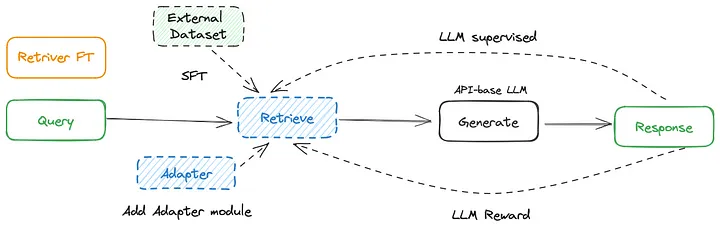
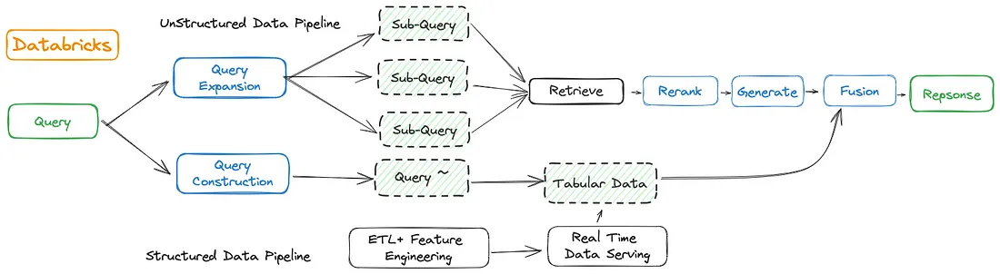

# 模組化 RAG 和 RAG 流程: Part 2

原文: [Modular RAG and RAG Flow: Part 2](https://medium.com/@yufan1602/modular-rag-and-rag-flow-part-ii-77b62bf8a5d3)

如何設計自己的 RAG 流程？

在第一部分中，我們主要討論了模組化 RAG（Module Type - Module - Operator）的三層結構，並簡要提到了 RAG Flow 的概念。

定義了 Module 和 Operator 後，它們可以幫助我們從流程的角度來看各種 RAG 方法。每個 RAG 可以安排一組 Operator。

<figure markdown="span">
  
  <figcaption>Framework of Modular RAG</figcaption>
</figure>

那麼，在模組化 RAG 的範式下，我們該如何設計我們的 RAG 系統呢？

在本文中，我們將深入研究典型的 RAG Flow 模式、具體的 RAG Flow 實作以及最佳產業案例。

## 典型的 RAG 流程模式與實施

首先，讓我們探討 RAG 流程的主要模式，以及每個範本下的特定流程，說明如何編排不同的模組和運算子。

在 RAG 流程的背景下，我們將描述微調階段的三個不同流程和推理階段的四個流程。

## Tuning Stage

> Retriever Fine-tuning, Generator Fine-tuning, and Dual Fine-tuning.

### Retriever FT

在 RAG Flow 中，微調檢索器(微調 embedding 模型)的常用方法包括：

- **Direct fine-tuning of the retriever** 建立用於檢索和微調密集檢索器的專用資料集。例如，使用開源檢索資料集或根據特定領域的資料建立資料集。
- **Adding trainable Adapter modules** 有時，直接微調基於 API 的嵌入模型（例如 OpenAI Ada-002 和 Cohere）是不可行的。合併適配器模組可以增強資料的表示。此外，適配器模組有助於更好地與下游任務對齊，無論是針對特定任務（例如 PCRA）還是通用目的（例如 AAR）。
- **LM-supervised Retrieval (LSR)** 根據 LLM 產生的結果微調檢索器。
- **LLM Reward RL** 仍然使用 LLM 輸出結果作為監控訊號。採用強化學習將檢索器與生成器對齊。整個檢索過程被分解為產生馬可夫鏈的形式。

<figure markdown="span">
  
  <figcaption>Typical RAG Flow Pattern for Retriever FT</figcaption>
</figure>

### Generator FT

在 RAG Flow 中微調產生器(微調 LLM 模型)的主要方法包括：

- **Direct fine-tuning** 透過外部資料集進行微調可以為生成器補充額外的知識。另一個好處是能夠自訂輸入和輸出格式。透過設定Q&A格式，LLM可以理解特定的資料格式並依照指令輸出。
- **GPT-4 distillation** 在使用開源模型本地部署時，一個簡單有效的方法是使用 GPT-4 批次建構微調數據，以增強開源模型的能力。
- **Reinforcement Learning from LLM/Human Feedback** 基於最終生成答案的回饋的強化學習。除了使用人類評估之外，GPT-4 還可以充當評估法官。

<figure markdown="span">
  
  <figcaption>Typical RAG Flow Pattern for Generator FT</figcaption>
</figure>

### Dual FT

在 RAG 系統中，同時微調檢索器和產生器是 RAG 系統的獨特功能。需要注意的是，系統微調的重點是檢索器和生成器之間的協調。分別對檢索器和產生器微調屬於前兩者的組合，而不是 Dual FT 的一部分。

<figure markdown="span">
  
  <figcaption>Typical RAG Flow Pattern for Dual FT</figcaption>
</figure>

一個示例性的實作是 [RA-DIT](https://arxiv.org/abs/2310.01352)，它對 LLM 和檢索器進行微調。 LM-ft 元件更新 LLM，以最大化給定檢索增強指令的正確答案的可能性，而 R-ft 元件更新檢索器，以最小化檢索器分數分佈和 LLM 偏好之間的 KL 散度。

該框架採用本地 Llama 作為生成器，並採用最先進的基於雙編碼器的密集檢索器 DRAGON+ 作為檢索器。

[REPLUG](https://arxiv.org/abs/2301.12652) 之後，RA-DIT 根據語言模型提示檢索相關文字區塊。每個檢索到的區塊都被添加到提示之前，並且多個區塊的預測被並行計算並透過加權可能性進行整合以產生最終輸出。

<figure markdown="span">
  
  <figcaption>RAG Flow in RA-DIT</figcaption>
</figure>

## Inference Stage

在推理階段，我們提煉出了四種典型的 RAG Flow 模式。

### Sequential

RAG Flow 的 sequential 結構將 RAG 的模組和運算子組織在線性管道中，如下圖所示。如果它同時包含 Pre-Retrieval 和 Post-Retrieval 模組類型，則代表典型的 Advanced RAG 範例；否則，它體現了典型的 Naive RAG 範式。

<figure markdown="span">
  
  <figcaption>Sequential RAG Flow Pattern</figcaption>
</figure>

目前使用最廣泛的 RAG Pipeline 是 Sequential，它通常包括檢索前的 Query Rewrite 或 HyDE 以及檢索後的 Rerank 運算符，例如 [QAnything](https://github.com/netease-youdao/QAnything) 的情況。

<figure markdown="span">  
    
  <figcaption>Sequential RAG Flow Pattern</figcaption>
</figure>

重寫-檢索-讀取（RRR）也是典型的順序結構。查詢重寫模組是一個較小的可訓練語言模型，在強化學習的背景下，重寫器的最佳化被形式化為馬可夫決策過程，LLM 的最終輸出作為獎勵。檢索器使用稀疏編碼模型 BM25。

<figure markdown="span">  
    
  <figcaption>Sequential RAG Flow Pattern</figcaption>
</figure>

### Conditional

具有條件結構的 RAG Flow 涉及根據不同的條件選擇不同的 RAG 路徑。通常，這是透過路由模組完成的，該模組根據查詢關鍵字或語義確定路由。

根據問題類型選擇不同的路線，針對特定場景引導不同的流程。例如，當使用者詢問嚴肅問題、政治問題或娛樂話題時，對大型模型答案的容忍度會有所不同。不同的路由分支通常在檢索來源、檢索流程、配置、型號、提示等方面有所不同。

<figure markdown="span">  
    
  <figcaption>Sequential RAG Flow Pattern</figcaption>
</figure>

Conditional RAG 的經典實作是[語意路由器(Semantic Router)](https://github.com/aurelio-labs/semantic-router)。

### Branching

具有分支結構的 RAG Flow 與條件方法的不同之處在於，它涉及多個並行分支，而不是條件方法中從多個選項中選擇一個分支。從結構上來說，可以分為兩類：

- **Pre-Retrieval Branching (Multi-Query, Parallel Retrieval)** 這涉及到將原始查詢擴展為多個子查詢，然後對每個子查詢進行單獨的檢索。檢索後，該方法允許根據子問題和相應的檢索內容立即產生答案。或者，它可能涉及僅使用擴展的檢索內容並將其合併到統一的上下文中以進行生成。

- **Post-Retrieval Branching (Single Query, Parallel Generation)** 此方法維護原始查詢並檢索多個文件區塊。隨後，它同時使用原始查詢和每個文件區塊進行生成，最後將生成的結果合併在一起。

<figure markdown="span">  
    
  <figcaption>Branching RAG Flow Pattern</figcaption>
</figure>

REPLUG 體現了經典的檢索後分支結構，其中為每個分支預測每個標記的機率。透過加權可能性集成，將不同的分支聚合起來，最終的生成結果用於透過回饋來微調檢索器（稱為 Contriever）。

<figure markdown="span">  
    
  <figcaption>RAG Flow in REPLUG</figcaption>
</figure>

### Loop

具有循環結構的 RAG 流程是模組化 RAG 的重要特徵，涉及相互依賴的檢索和推理步驟。它通常包括用於流程控制的判斷模組。這可以進一步分類為迭代、遞歸和自適應（主動）檢索方法。

<figure markdown="span">  
    
  <figcaption>Loop RAG Flow Pattern</figcaption>
</figure>

#### Iterative Retrieval

有時，單次檢索和生成可能無法有效解決需要廣泛知識的複雜問題。因此，可以在 RAG 中使用迭代方法，通常涉及固定次數的迭代來進行檢索。

迭代檢索的一個範例是 [ITER-RETGEN](https://arxiv.org/abs/2305.15294)，它迭代檢索增強生成和產生增強檢索。檢索增強產生根據所有檢索到的知識輸出對任務輸入的回應。在每次迭代中，ITER-RETGEN 利用前一次迭代的模型輸出作為特定上下文來幫助檢索更多相關知識。循環的終止由預先定義的迭代次數決定。

<figure markdown="span">  
    
  <figcaption>RAG Flow in ITER-RETGEN</figcaption>
</figure>

#### Recursive Retrieval

與迭代檢索相比，遞歸檢索的顯著特徵是對前一步的明顯依賴以及檢索的不斷深化。通常，有一個終止機製作為遞歸檢索的退出條件。在RAG系統中，遞歸檢索通常涉及查詢轉換，每次檢索都依賴新重寫的查詢。

<figure markdown="span">  
    
  <figcaption>RAG Flow in ToC</figcaption>
</figure>

遞歸檢索的典型實現，例如 ToC，涉及遞歸執行 RAC（遞歸增強澄清），以從最初的模糊問題 (AQ) 逐漸將子節點插入澄清樹。在每個擴充步驟中，都會根據目前查詢執行段落重新排序，以產生明確的問題 (DQ)。樹的探索在達到最大有效節點數或最大深度時結束。一旦建立了澄清樹，ToC 就會收集所有有效節點並產生一個全面的長文本答案來解決 AQ。

#### Adaptive(Active) Retrieval

隨著 RAG 的進步，已經逐漸從被動檢索轉向自適應檢索（也稱為主動檢索）的出現，這在一定程度上歸功於 LLM 強大的能力。這與 LLM Agent 共享一個核心概念。

RAG 系統可以主動確定檢索的時機，並決定何時結束整個過程並產生最終結果。根據判斷標準，可以進一步分為基於 Prompt 的方法和基於 Tuning 的方法。

- **Prompt-base** 基於提示的方法涉及使用提示工程來控制流程來指導 LLM。一個典型的實作例子是 FLARE。其核心概念是語言模型應該僅在缺乏必要知識時進行檢索，以避免增強型語言模型中不必要或不適當的檢索。FLARE 迭代產生下一個臨時句子並檢查是否有低機率標記。如果找到，系統會檢索相關文件並重新產生句子。

<figure markdown="span">  
    
  <figcaption>RAG Flow in FLARE</figcaption>
</figure>

- **Tuning-base** 基於調優的方法涉及微調 LLM 以產生特殊令牌，從而觸發檢索或產生。這個概念可以追溯到 Toolformer，其中特定內容的生成輔助呼叫工具。在 RAG 系統中，這種方法用於控制檢索和產生步驟。一個典型的案例就是 Self-RAG。具體來說：

    1. 給定一個輸入提示和前面的生成結果，首先預測特殊標記「Retrieve」是否有助於透過段落檢索增強持續生成。
    2. 如果需要檢索，模型會產生：一個批評令牌，用於評估檢索到的段落的相關性、下一個反應片段，以及一個批評標記，用於評估該段落是否支持反應片段中的信息。
    3. 最後，批評令牌評估回應的整體效用，並選擇最佳結果作為最終輸出。

<figure markdown="span">  
    
  <figcaption>RAG Flow in Self-RAG</figcaption>
</figure>

## 最佳業界案例

在前面的章節中，我們深入研究了各種研究論文，其顯著特點是強調解決具體細節和錯綜複雜的問題。另一方面，RAG 作為一項在工業領域大放異彩的技術脫穎而出，使 LLM 能夠應用於廣泛的任務場景。本章將從 RAG Flow 的角度闡述業界領先的幾種 RAG 實踐，深入探討如何在實際應用場景中有效組合和建構 RAG 的流程。

### OpenAI

OpenAI ＤemoDay 演示中的見解並不能完全代表 OpenAI 的實際操作但是值得大家參考。

為了提高 RAG 的成功率，OpenAI 團隊從 45% 的準確率開始，嘗試了各種方法，確定最終採用哪些方法進行生產。他們探索了假設文件嵌入（HyDE）、微調嵌入等方法，但結果並不令人滿意。透過試驗不同大小的資訊區塊並嵌入不同的內容部分，他們能夠將準確率提高到 65%。透過重新排序和針對不同類型問題量身定制的方法，他們進一步將準確率提高到了 85%。最終，透過結合即時工程、查詢擴展等方法，他們實現了 98% 的準確率。

<figure markdown="span">  
    
  <figcaption>OpenAI RAG Flow</figcaption>
</figure>

該團隊強調了模型微調和 RAG 整合的強大潛力，特別是在不使用複雜技術、僅透過簡單的模型微調和快速工程的情況下接近行業領先水平。

參考: [The Origin OpenAI Demo](https://www.youtube.com/watch?v=ahnGLM-RC1Y)

### Baichuan

基於各種來源的公開信息，可用數據有限，作者對某些細節做出了一些推測性假設。看原文（中文）

百川從 Meta 的 CoVe 中汲取靈感，設計了一種方法，將複雜的提示解構為多個獨立且並行的可檢索的搜尋友好查詢。這使得大型模型能夠對每個子查詢進行有針對性的知識庫搜索，從而提供更準確和詳細的答案並減少虛假輸出。此外，他們也利用專有的 TSF（進一步思考）來推論和挖掘使用者輸入背後更深層的潛在問題，從而更準確、更全面地理解使用者意圖。雖然TSF的技術細節尚未公開，但推測是Step-back提示方法的增強。

在檢索步驟中，百川智慧開發了百川-文字-嵌入向量模型，該模型針對包含超過 1.5 兆個 token 的高品質中文資料進行了預訓練。他們透過專有的損失函數解決了對比學習中批量大小依賴性的問題。這個向量模型已經超越了C-MTEB。

此外，他們還引入了稀疏檢索和重排序模型（未公開），形成了將向量檢索與稀疏檢索並行結合的混合檢索方法，將召回率顯著提高到95%。

此外，他們引入了自我批評，使大型模型能夠根據提示、相關性和實用性對檢索到的內容進行反思，並進行二次審查以選擇最匹配和高品質的候選內容。

<figure markdown="span">  
    
  <figcaption>OpenAI RAG Flow</figcaption>
</figure>

鑑於整個百川 RAG 流程中分支眾多且缺乏具體披露，有理由推測重新排序和選擇需要對所有材料進行重新排序和篩選，無論是從其他分支檢索還是生成。

### Databricks

Databricks 作為大數據領域領先的服務供應商，在 RAG 設計上一直保持著鮮明的特色和優勢。

當使用者輸入問題時，系統會從預處理的文字向量索引中檢索相關訊息，並結合提示工程來產生回應。上半部分，即非結構化資料管道，遵循主流的 RAG 方法，沒有表現出任何特殊的獨特性。

<figure markdown="span">  
    
  <figcaption>Databricks RAG Flow</figcaption>
</figure>

下半部是結構化資料管道，代表 Databricks 的特徵工程流程，也是 Databricks RAG 實作中最重要的方面。憑藉其在大數據方面的專業知識，Databricks 從其高精度資料儲存中進行額外檢索，充分利用其在即時資料服務方面的優勢。可見，Databricks在GenAI時代的策略是賦能具有廣闊市場需求的RAG應用，將其強大的Delta Lake處理能力與生成式AI技術相結合，構建集成解決方案，並將這種統一服務推廣給客戶。

## 結論

本文描述了微調階段的三種模式、推理階段的四種模式，以及七篇論文和三個產業最佳實踐中的具體流程實現。

正如我們在第 1 部分中提到的，RAG 範式的總結和抽像在這個技術快速發展的時代至關重要。必須超越具體實現，從更高的維度理解當前的技術特徵和趨勢，才能掌握未來的發展方向。

