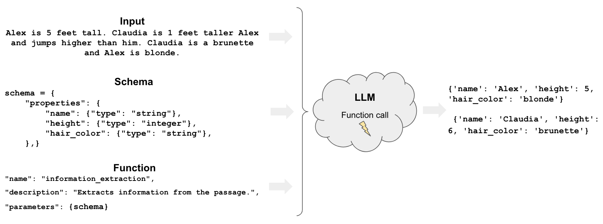
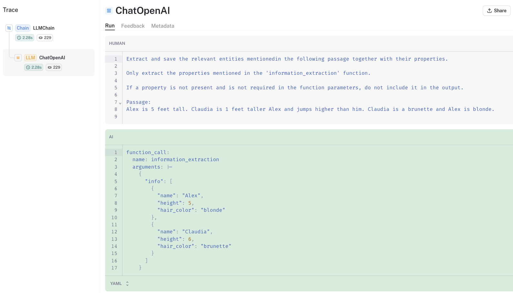
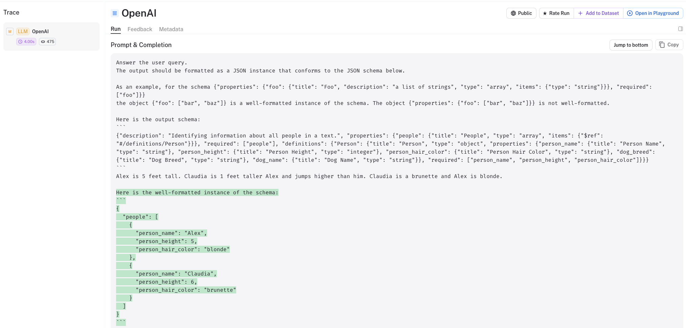
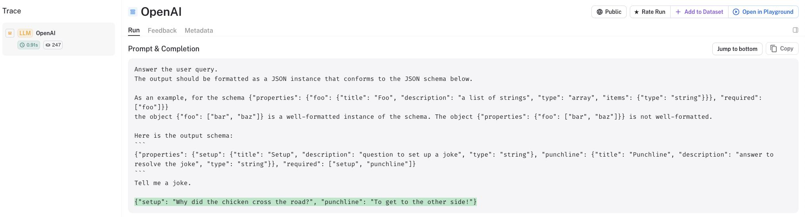

# Extraction

- [Open in Colab](https://colab.research.google.com/github/langchain-ai/langchain/blob/master/docs/extras/use_cases/extraction.ipynb)

## 案例

---

從原始的 LLM 生成的結果來獲得結構化的輸出是很困難的。

例如，假設您需要使用特定 schema 格式化的模型輸出：

- 提取結構化行(row)以新增進資料庫裡
- 提取 API 參數
- 提取用戶查詢的不同部分（例如，語義搜尋與關鍵字搜尋）




## 概述

---

要從 LLM 的結果來萃取結構化資訊有兩種主要方法：

- `Functions`: 有些 LLM 可以呼叫[函數](https://openai.com/blog/function-calling-and-other-api-updates)從 LLM 回應中擷取任意實體。
- `Parsing`: [Output parsers](https://python.langchain.com/docs/modules/model_io/output_parsers/) 是建構 LLM 回應的類別。

只有一些 LLM 支援 `Functions`（例如 OpenAI），並且它們比解析器更通用。

解析器(Parsers)精確地提取所提供模式中所列舉的內容（例如，一個人的特定屬性）。

`Functions` 可以推斷出所提供 schema 之外的事物（例如，您沒有詢問的人的屬性）。

## 快速體驗

---

OpenAI 函數是開始使用資訊萃取(extraction)的一種方法。

定義一個 schema，指定我們想要從 LLM 輸出中提取的屬性。

然後，我們可以使用 `create_extraction_chain` 透過 OpenAI 函數呼叫來提取所需的 schema 的結構化資訊。

```bash
pip install langchain openai 

# Set env var OPENAI_API_KEY or load from a .env file:
# import dotenv
# dotenv.load_dotenv()
```

**使用範例:**

```python
from langchain.chat_models import ChatOpenAI
from langchain.chains import create_extraction_chain

# 定義 Schema
schema = {
    "properties": {
        "name": {"type": "string"},
        "height": {"type": "integer"},
        "hair_color": {"type": "string"},
    },
    "required": ["name", "height"],
}

# 輸入 
inp = """Alex is 5 feet tall. Claudia is 1 feet taller Alex and jumps higher than him. Claudia is a brunette and Alex is blonde."""

# 執行資訊萃取鏈
llm = ChatOpenAI(temperature=0, model="gpt-3.5-turbo")

chain = create_extraction_chain(schema, llm)

chain.run(inp)
```

**API Reference:**

- [ChatOpenAI](https://api.python.langchain.com/en/latest/chat_models/langchain.chat_models.openai.ChatOpenAI.html)
- [create_extraction_chain](https://api.python.langchain.com/en/latest/chains/langchain.chains.openai_functions.extraction.create_extraction_chain.html)

結果:

```
    [{'name': 'Alex', 'height': 5, 'hair_color': 'blonde'},
     {'name': 'Claudia', 'height': 6, 'hair_color': 'brunette'}]
```

## 選項 1：OpenAI functions

### 深入探究

讓我們深入研究一下呼叫 `create_extraction_chain` 時發生了什麼。

LangSmith 追蹤顯示我們對輸入字串 inp 呼叫了函數 `information_extraction`。



這個 [`information_extraction` 函數](https://github.com/langchain-ai/langchain/blob/master/libs/langchain/langchain/chains/openai_functions/extraction.py)定義並傳回一個字典物件。

我們可以在模型輸出中看到字典：

```json
 {
      "info": [
        {
          "name": "Alex",
          "height": 5,
          "hair_color": "blonde"
        },
        {
          "name": "Claudia",
          "height": 6,
          "hair_color": "brunette"
        }
      ]
    }
```

然後 `create_extraction_chain` 使用 [JsonKeyOutputFunctionsParser](https://github.com/langchain-ai/langchain/blob/f81e613086d211327b67b0fb591fd4d5f9a85860/libs/langchain/langchain/chains/openai_functions/extraction.py#L62) 為我們解析原始 LLM 輸出。

這會產生上面鏈傳回的 JSON 物件列表：

```json
[{'name': 'Alex', 'height': 5, 'hair_color': 'blonde'},
 {'name': 'Claudia', 'height': 6, 'hair_color': 'brunette'}]
```

### 多種實體類型

我們可以進一步擴展這一點。

假設我們想區分狗和人。

我們可以為每個屬性加上 `person_` 和 `dog_` 前綴

```python
schema = {
    "properties": {
        "person_name": {"type": "string"},
        "person_height": {"type": "integer"},
        "person_hair_color": {"type": "string"},
        "dog_name": {"type": "string"},
        "dog_breed": {"type": "string"},
    },
    "required": ["person_name", "person_height"],
}

chain = create_extraction_chain(schema, llm)

inp = """Alex is 5 feet tall. Claudia is 1 feet taller Alex and jumps higher than him. Claudia is a brunette and Alex is blonde.
Alex's dog Frosty is a labrador and likes to play hide and seek."""

chain.run(inp)
```

結果:

```python
    [{'person_name': 'Alex',
      'person_height': 5,
      'person_hair_color': 'blonde',
      'dog_name': 'Frosty',
      'dog_breed': 'labrador'},
     {'person_name': 'Claudia',
      'person_height': 6,
      'person_hair_color': 'brunette'}]
```

### 不相關的實體

如果我們使用 `required: []`，我們允許模型僅傳回單一實體（人或狗）的人屬性或狗屬性。

```python
schema = {
    "properties": {
        "person_name": {"type": "string"},
        "person_height": {"type": "integer"},
        "person_hair_color": {"type": "string"},
        "dog_name": {"type": "string"},
        "dog_breed": {"type": "string"},
    },
    "required": [],
}

chain = create_extraction_chain(schema, llm)

inp = """Alex is 5 feet tall. Claudia is 1 feet taller Alex and jumps higher than him. Claudia is a brunette and Alex is blonde.
Willow is a German Shepherd that likes to play with other dogs and can always be found playing with Milo, a border collie that lives close by."""

chain.run(inp)
```

結果:

```python
    [{'person_name': 'Alex', 'person_height': 5, 'person_hair_color': 'blonde'},
     {'person_name': 'Claudia',
      'person_height': 6,
      'person_hair_color': 'brunette'},
     {'dog_name': 'Willow', 'dog_breed': 'German Shepherd'},
     {'dog_name': 'Milo', 'dog_breed': 'border collie'}]
```

### 額外的信息

函數的強大（相對於單獨使用 parsers）在於執行語意提取的能力。

特別是，我們可以請求 schema 中未明確枚舉的內容。

假設我們想要有關狗的未指定的附加資訊。我們可以使用新增一個佔位符來進行非結構化提取，`dog_extra_info`。

```python
schema = {
    "properties": {
        "person_name": {"type": "string"},
        "person_height": {"type": "integer"},
        "person_hair_color": {"type": "string"},
        "dog_name": {"type": "string"},
        "dog_breed": {"type": "string"},
        "dog_extra_info": {"type": "string"},
    },
}

chain = create_extraction_chain(schema, llm)

chain.run(inp)
```

結果:

```python
    [{'person_name': 'Alex', 'person_height': 5, 'person_hair_color': 'blonde'},
     {'person_name': 'Claudia',
      'person_height': 6,
      'person_hair_color': 'brunette'},
     {'dog_name': 'Willow',
      'dog_breed': 'German Shepherd',
      'dog_extra_info': 'likes to play with other dogs'},
     {'dog_name': 'Milo',
      'dog_breed': 'border collie',
      'dog_extra_info': 'lives close by'}]
```

這為我們提供了有關狗的更多資訊。

### Pydantic

[Pydantic](https://pypi.org/project/pydantic/) 是一個 Python 資料驗證和設定的套件。

它允許您建立具有在實例化物件時自動驗證的屬性的資料類別。

讓我們定義一個帶有用類型註解的屬性的類別。

```python
from typing import Optional, List
from pydantic import BaseModel, Field
from langchain.chains import create_extraction_chain_pydantic

# Pydantic data class
class Properties(BaseModel):
    person_name: str
    person_height: int
    person_hair_color: str
    dog_breed: Optional[str]
    dog_name: Optional[str]
        
# Extraction
chain = create_extraction_chain_pydantic(pydantic_schema=Properties, llm=llm)

# Run 
inp = """Alex is 5 feet tall. Claudia is 1 feet taller Alex and jumps higher than him. Claudia is a brunette and Alex is blonde."""

chain.run(inp)
```

**API Reference:**

- [create_extraction_chain_pydantic](https://api.python.langchain.com/en/latest/chains/langchain.chains.openai_functions.extraction.create_extraction_chain_pydantic.html)

正如我們從追蹤中看到的，我們將函數 `information_extraction` 與 `Pydantic` schema 一起使用，如上所述。

## 選項 2：解析器

[Output parsers](https://python.langchain.com/docs/modules/model_io/output_parsers/) 是幫助建構語言模型回應的類別。

如上所示，它們用於解析 `create_extraction_chain` 中 OpenAI 函數呼叫的輸出。

但是，它們也可以獨立地使用。

### Pydantic

就像上面一樣，我們來解析基於 Pydantic 資料類別的生成。

```python
from typing import Sequence
from langchain.prompts import (
    PromptTemplate,
    ChatPromptTemplate,
    HumanMessagePromptTemplate,
)
from langchain.llms import OpenAI
from pydantic import BaseModel, Field, validator
from langchain.output_parsers import PydanticOutputParser

class Person(BaseModel):
    person_name: str
    person_height: int
    person_hair_color: str
    dog_breed: Optional[str]
    dog_name: Optional[str]

class People(BaseModel):
    """Identifying information about all people in a text."""
    people: Sequence[Person]

        
# Run 
query = """Alex is 5 feet tall. Claudia is 1 feet taller Alex and jumps higher than him. Claudia is a brunette and Alex is blonde."""

# Set up a parser + inject instructions into the prompt template.
parser = PydanticOutputParser(pydantic_object=People)

# Prompt
prompt = PromptTemplate(
    template="Answer the user query.\n{format_instructions}\n{query}\n",
    input_variables=["query"],
    partial_variables={"format_instructions": parser.get_format_instructions()},
)

# Run
_input = prompt.format_prompt(query=query)
model = OpenAI(temperature=0)
output = model(_input.to_string())
parser.parse(output)
```

**API Reference:**

- [PromptTemplate](https://api.python.langchain.com/en/latest/prompts/langchain.prompts.prompt.PromptTemplate.html)
- [ChatPromptTemplate](https://api.python.langchain.com/en/latest/prompts/langchain.prompts.chat.ChatPromptTemplate.html)
- [HumanMessagePromptTemplate](https://api.python.langchain.com/en/latest/prompts/langchain.prompts.chat.HumanMessagePromptTemplate.html)
- [OpenAI](https://api.python.langchain.com/en/latest/llms/langchain.llms.openai.OpenAI.html)
- [PydanticOutputParser](https://api.python.langchain.com/en/latest/output_parsers/langchain.output_parsers.pydantic.PydanticOutputParser.html)

結果:

```python
    People(people=[Person(person_name='Alex', person_height=5, person_hair_color='blonde', dog_breed=None, dog_name=None), Person(person_name='Claudia', person_height=6, person_hair_color='brunette', dog_breed=None, dog_name=None)])
```

從 LangSmith 追蹤中我們可以看到我們得到了與上面相同的輸出。



我們可以看到，我們提供了兩個提示，以便指示 LLM 以我們所需的格式輸出。

而且，我們還需要做一些工作：

- 定義一個包含 Person 的多個實例的類別
- 明確解析 LLM 的輸出到 Pydantic 類別

我們也可以在其他案例中看到這一點。

```python
from langchain.prompts import (
    PromptTemplate,
    ChatPromptTemplate,
    HumanMessagePromptTemplate,
)
from langchain.llms import OpenAI
from pydantic import BaseModel, Field, validator
from langchain.output_parsers import PydanticOutputParser

# Define your desired data structure.
class Joke(BaseModel):
    setup: str = Field(description="question to set up a joke")
    punchline: str = Field(description="answer to resolve the joke")

    # You can add custom validation logic easily with Pydantic.
    @validator("setup")
    def question_ends_with_question_mark(cls, field):
        if field[-1] != "?":
            raise ValueError("Badly formed question!")
        return field

# And a query intented to prompt a language model to populate the data structure.
joke_query = "Tell me a joke."

# Set up a parser + inject instructions into the prompt template.
parser = PydanticOutputParser(pydantic_object=Joke)

# Prompt
prompt = PromptTemplate(
    template="Answer the user query.\n{format_instructions}\n{query}\n",
    input_variables=["query"],
    partial_variables={"format_instructions": parser.get_format_instructions()},
)

# Run
_input = prompt.format_prompt(query=joke_query)
model = OpenAI(temperature=0)
output = model(_input.to_string())
parser.parse(output)
```

**API Reference:**

- [PromptTemplate](https://api.python.langchain.com/en/latest/prompts/langchain.prompts.prompt.PromptTemplate.html)
- [ChatPromptTemplate](https://api.python.langchain.com/en/latest/prompts/langchain.prompts.chat.ChatPromptTemplate.html)
- [HumanMessagePromptTemplate](https://api.python.langchain.com/en/latest/prompts/langchain.prompts.chat.HumanMessagePromptTemplate.html)
- [OpenAI](https://api.python.langchain.com/en/latest/llms/langchain.llms.openai.OpenAI.html)
- [PydanticOutputParser](https://api.python.langchain.com/en/latest/output_parsers/langchain.output_parsers.pydantic.PydanticOutputParser.html)

結果:

```python
    Joke(setup='Why did the chicken cross the road?', punchline='To get to the other side!')
```

正如我們所看到的，我們得到了 Joke 類別的輸出，它遵循我們最初想要的模式：「setup」和「punchline」。

我們可以查看 LangSmith 追蹤來準確了解幕後發生的情況。



### 更深入探究

- [output parser](https://python.langchain.com/docs/modules/model_io/output_parsers/) 文件包括特定類型的各種解析器範例（例如清單、datetimne、枚舉等）。
- [JSONFormer](https://python.langchain.com/docs/integrations/llms/jsonformer_experimental) 提供了另一種對 JSON 模式子集進行結構化解碼的方法。
- [Kor](https://eyurtsev.github.io/kor/) 是另一個用於提取的函式庫，可以向 LLM 提供 schema 和範例。