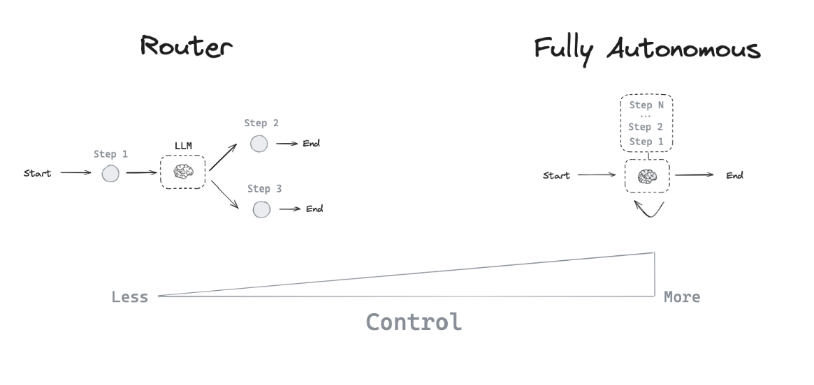
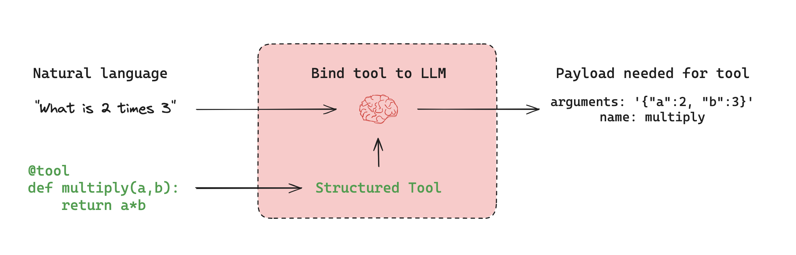

# Agent architectures

許多 LLM 應用程式在 LLM 呼叫之前和/或之後實作了特定的步驟控制流程。例如，RAG 會檢索與使用者問題相關的文檔，並將這些文檔傳遞給 LLM，以便將模型的回應基於提供的文檔上下文。

我們有時希望 LLM 系統能夠自主選擇控制流來解決更複雜的問題，而不是硬編碼固定的控制流！這是 agent 的一個定義：==代理程式是一個使用 LLM 來決定應用程式控制流的系統==。 

LLM 可以透過多種方式控制應用程式：
- LLM 可以在兩種潛在路徑之間進行選擇
- LLM 可以決定要呼叫哪些工具
- LLM 可以決定產生的答案是否足夠，或者是否需要更多工作

因此，存在許多不同類型的代理架構，它們為 LLM 提供了不同層級的控制。

## Router

Router 允許 LLM 從一組指定的選項中選擇一個步驟。這是一種控制能力相對有限(對 LLM 本身而言)的代理架構，因為 LLM 通常專注於做出單一決策，並從一組有限的預定義選項中產生特定的輸出。路由器通常採用一些不同的概念來實現這一點。

### Structured Output

LLM 的 structured outputs 透過提供 LLM 在回應中應遵循的特定格式或模式來運作。這類似於工具調用，但更通用。工具呼叫通常涉及選擇和使用預定義函數，而結構化輸出可用於任何類型的格式化回應。實現結構化輸出的常用方法包括：

1. **Prompt engineering**：透過系統提示指示 LLM 以特定格式回應。
2. **Output parsers**：使用後處理從 LLM 回應中擷取結構化資料。
3. **Tool calling**：利用某些 LLM 內建的工具呼叫功能產生結構化輸出。

結構化輸出(structured outputs)對於路由(router)至關重要，因為它們確保 LLM 的決策能夠被系統可靠地解讀和執行。在[本指南](https://python.langchain.com/docs/how_to/structured_output/)中了解更多關於結構化輸出的資訊。

## Tool-calling agent

雖然 Router 允許 LLM 做出單一決策，但更複雜的代理架構透過兩種主要方式擴展 LLM 的控制：

- Multi-step decision making：LLM 可以逐一做出一系列決策，而不僅僅是一個決策。
- Tool access：LLM 可以選擇並使用各種工具來完成任務。

[ReAct](https://arxiv.org/abs/2210.03629) 是一種流行的通用代理架構，它結合了這些擴展，整合了三個核心概念。

1. **[Tool calling](https://langchain-ai.github.io/langgraph/concepts/agentic_concepts/#tool-calling)**: 允許 LLM 根據需要選擇和使用各種工具。
2. **[Memory](https://langchain-ai.github.io/langgraph/concepts/agentic_concepts/#memory)**: 使代理能夠保留和使用來自先前步驟的資訊。
3. **[Planning](https://langchain-ai.github.io/langgraph/concepts/agentic_concepts/#planning)**: 授權 LLM 創建並遵循多步驟計劃來實現目標。

這種架構允許更複雜、更靈活的代理行為，超越簡單的路由，實現多步驟的動態問題求解。與原始論文不同，如今的代理人依賴 LLM 的工具呼叫功能，並對 messages list 進行操作。

在 LangGraph 中，您可以使用預先建置的[代理程式](https://langchain-ai.github.io/langgraph/agents/agents/#2-create-an-agent)來開始使用工具呼叫代理程式。

### Tool calling

當您希望代理與外部系統互動時，tools 非常有用。外部系統（例如 API）通常需要特定的輸入模式或負載，而不是自然語言。例如，當我們將 API 綁定為工具時，我們會賦予模型所需的輸入模式。模型將根據使用者的自然語言輸入選擇呼叫工具，並傳回符合工具所需模式的輸出。

許多 LLM 提供者支援工具調用(tool calling)，並且 LangChain 中的工具調用介面很簡單：您可以簡單地將任何 Python 函數傳遞到 `ChatModel.bind_tools(function)` 中。

### Memory

[記憶](https://langchain-ai.github.io/langgraph/how-tos/memory/add-memory/)對於 agent 至關重要，它使它們能夠在解決問題的多個步驟中保留和利用資訊。記憶在不同層面運作：

1. [Short-term memory](https://langchain-ai.github.io/langgraph/how-tos/memory/add-memory/#add-short-term-memory): 允許代理程式存取在序列的早期步驟中獲取的資訊。
2. [Long-term memory](https://langchain-ai.github.io/langgraph/how-tos/memory/add-memory/#add-long-term-memory): 使代理能夠回憶先前互動中的信息，例如對話中的過去訊息。

LangGraph 提供對記憶體實現的完全控制：
- [State](https://langchain-ai.github.io/langgraph/concepts/low_level/#state): 使用者定義的模式指定要保留的記憶體的精確結構。
- [Checkpointer](https://langchain-ai.github.io/langgraph/concepts/persistence/#checkpoints): 在會話中不同互動的每個步驟中儲存狀態的機制。
- [Store](https://langchain-ai.github.io/langgraph/concepts/persistence/#memory-store): 跨會話儲存使用者特定或應用程式層級資料的機制。

這種靈活的方法可讓您根據特定的代理架構需求自訂記憶體系統。有效的記憶體管理可以增強代理保持上下文、從過往經驗中學習以及隨著時間的推移做出更明智決策的能力。有關新增和管理記憶體的實用指南，請參閱[記憶體](https://langchain-ai.github.io/langgraph/how-tos/memory/add-memory/)。

### Planning

在 tool-calling agent 中，LLM 在 while 迴圈中被重複呼叫。Agent 在每一步都會決定要呼叫哪些工具，以及這些工具的輸入應該是什麼。然後執行這些工具，並將輸出作為觀察值回饋到 LLM 中。當 agent 程式認為它已經擁有足夠的資訊來解決使用者請求並且不需要再呼叫任何工具時，while 循環就會終止。

## Custom agent architectures

雖然 routers 和 tool-calling agents（例如 ReAct）很常見，但[客製化代理架構](https://blog.langchain.dev/why-you-should-outsource-your-agentic-infrastructure-but-own-your-cognitive-architecture/)通常可以提高特定任務的效能。 LangGraph 提供了幾個強大的功能，可用於建立客製化的代理系統：

### Human-in-the-loop

人工參與可以顯著提升代理的可靠性，尤其是在處理敏感任務時。這包括：

- 批准具體行動
- 提供回饋以更新代理狀態
- 在複雜的決策過程中提供指導

當完全自動化不可行或不理想時，人機互動模式至關重要。請參閱我們的 [human-in-the-loop](https://langchain-ai.github.io/langgraph/concepts/human_in_the_loop/) 指南，以了解更多資訊。

### Parallelization

並行處理對於高效的 multi-agent 系統和複雜任務至關重要。 LangGraph 透過其 [Send](https://langchain-ai.github.io/langgraph/concepts/low_level/#send) API 支援並行化，從而實現：

- 多狀態並發處理
- 實作類似 MapReduce 的操作
- 高效處理獨立子任務

有關實際實施，請參閱我們的 [map-reduce](https://langchain-ai.github.io/langgraph/how-tos/graph-api/#map-reduce-and-the-send-api) 教程。

### Subgraphs

Subgraphs 對於管理複雜的 agent 架構至關重要，尤其是在多代理系統中。它們可以實現以下功能：

- 獨立管理各個代理人的狀態
- 代理團隊的層級組織
- 代理與主系統之間的受控通信

Subgraphs 透過狀態架構中的重疊鍵與 parent graph 進行通訊。這實現了靈活、模組化的代理設計。有關實作細節，請參閱我們的 [subgraph how-to guide](https://langchain-ai.github.io/langgraph/how-tos/subgraph/)。

### Reflection

反射機制可以透過以下方式顯著提高代理的可靠性：

- 評估任務完成度和正確性
- 提供反饋以進行迭代改進
- 實現自我糾正和學習

雖然反射通常基於 LLM，但它也可以使用確定性方法。例如，在編碼任務中，編譯錯誤可以作為回饋。[本影片](https://www.youtube.com/watch?v=MvNdgmM7uyc)示範了這種方法，並使用 LangGraph 進行自校正程式碼產生。

透過利用這些功能，LangGraph 可以創建複雜的、特定任務的代理架構，可以處理複雜的工作流程、有效協作並不斷提高其效能。