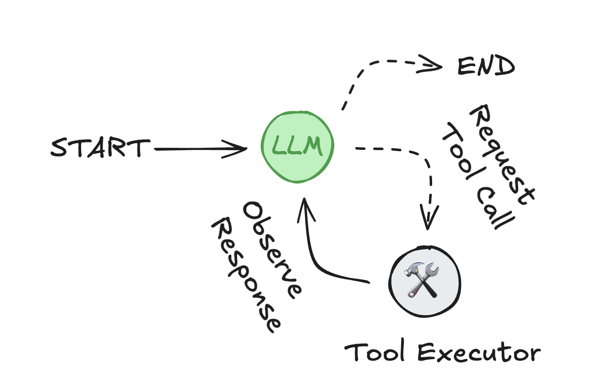
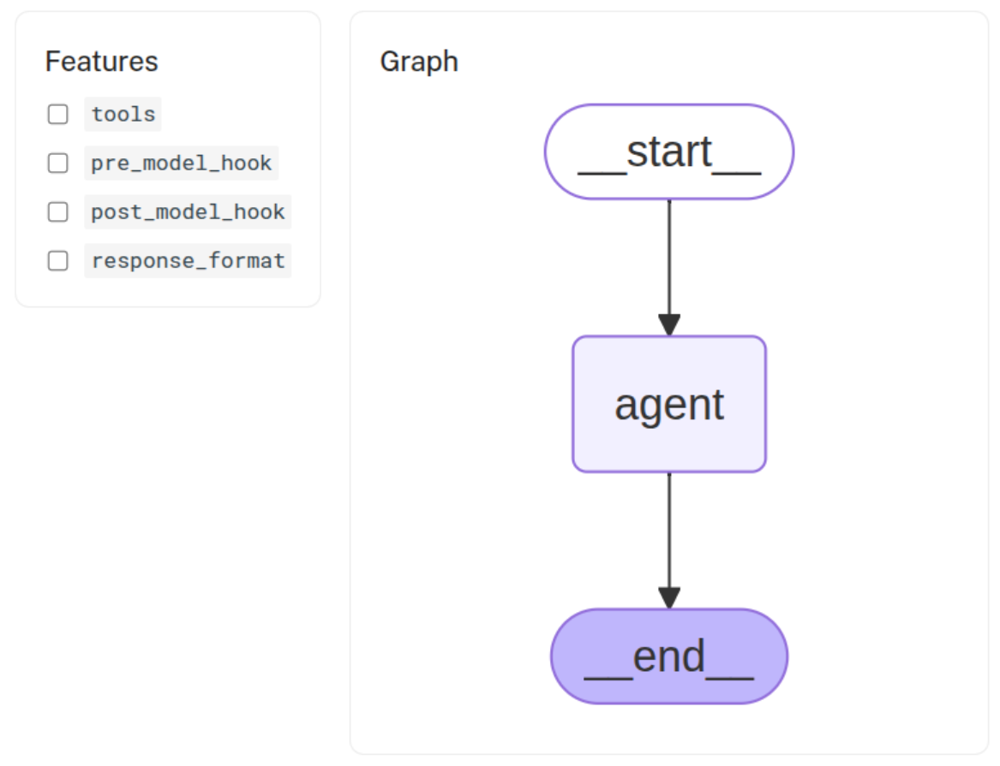
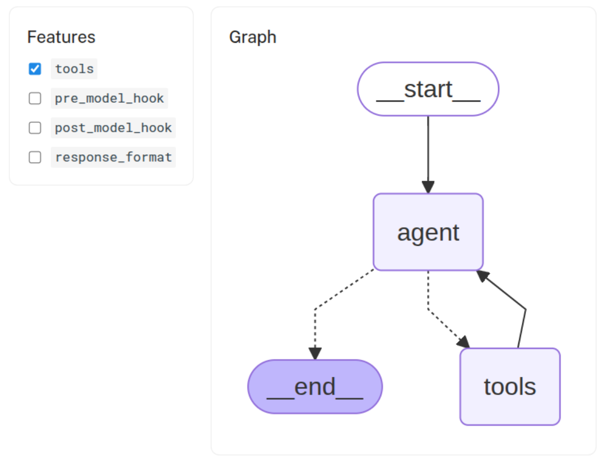
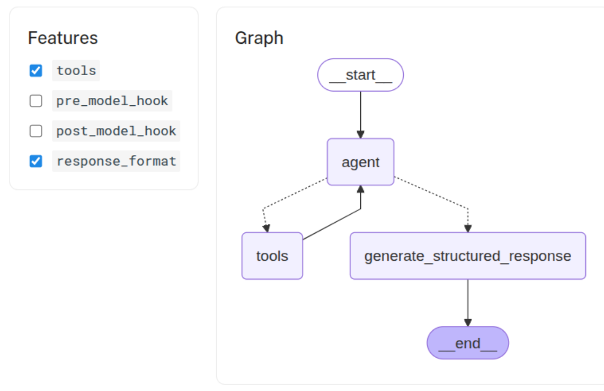
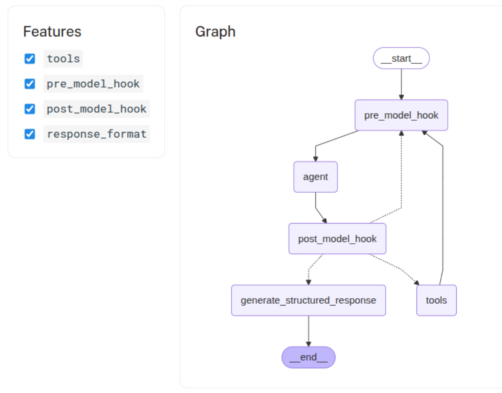

# Agent development using prebuilt components

LangGraph 提供了用於建立基於 agent 的應用程式的低階原語和高級預建構元件。本節重點介紹預先建置的、即用型元件，旨在幫助您快速可靠地建立代理系統，而無需從頭開始實現編排、記憶體或人工回饋處理。

## What is an agent?

Agent 由三個元件組成：**大型語言模型 (LLM)**、一組可供使用的 **tools** 以及提供指令的 **prompt**。

LLM 以循環方式運作。在每次迭代中，它會選擇一個要呼叫的工具，提供輸入，接收結果（觀察結果），並使用該觀察結果來指導下一步操作。循環持續進行，直到滿足停止條件—— ==通常是當代理收集到足夠的資訊來回應使用者時==。



!!! info
    Agent loop：LLM 選擇工具並使用其輸出來滿足使用者請求。

## Key features

LangGraph 包含建構強大、可投入生產的代理系統所需的幾項功能：

- **[Memory integration](https://langchain-ai.github.io/langgraph/how-tos/memory/add-memory/)**: 原生支援短期（基於會話）和長期（跨會話持久）記憶，從而實現聊天機器人和助手的狀態行為。
- **[Human-in-the-loop control](https://langchain-ai.github.io/langgraph/concepts/human_in_the_loop/)**: 執行可以無限期暫停，以等待人工回饋——這與基於 WebSocket 的解決方案受限於即時互動不同。這使得在工作流程的任何階段都能實現非同步審批、更正或介入。
- **[Streaming support](https://langchain-ai.github.io/langgraph/how-tos/streaming/)**: 代理狀態、模型令牌、工具輸出或組合流的即時流。
- **[Deployment tooling](https://langchain-ai.github.io/langgraph/tutorials/langgraph-platform/local-server/)**: 包含無需基礎架構的部署工具。 LangGraph 平台支援測試、調試和部署。
  - **[Studio](https://langchain-ai.github.io/langgraph/concepts/langgraph_studio/):**: 用於檢查和調試工作流程的可視化 IDE。
  - 支援多種[生產部署選項](https://langchain-ai.github.io/langgraph/concepts/deployment_options.md)。

## High-level building blocks

LangGraph 附帶一組預先建置元件，用於實現常見的代理行為和工作流程。這些抽象建構於 LangGraph 框架之上，不僅能夠更快投入生產，還能靈活地進行進階客製化。

使用 LangGraph 進行代理開發，您可以專注於應用程式的邏輯和行為，而無需建立和維護用於狀態、記憶體和人工回饋的支援基礎架構。

## Package ecosystem

高級組件被組織成幾個包，每個包都有特定的重點。

| Package                     | Description               | Installation                              |
|-----------------------------|---------------------------|-------------------------------------------|
| langgraph-prebuilt | 用於建立代理的預先[建置元件](https://langchain-ai.github.io/langgraph/agents/agents/)（langgraph 的一部分）| `pip install -U langgraph langchain`      |
| langgraph-supervisor    | 建構 [supervisor agents](https://langchain-ai.github.io/langgraph/agents/multi-agent/#supervisor) 的工具         | `pip install -U langgraph-supervisor`     |
| langgraph-swarm         | 建構 [swarm](https://langchain-ai.github.io/langgraph/agents/multi-agent/#swarm) multi-agent 系統的工具     | `pip install -U langgraph-swarm`         |
| langchain-mcp-adapters  | 用於工具和資源整合的 [MCP 伺服器](https://langchain-ai.github.io/langgraph/agents/mcp/)接口    | `pip install -U langchain-mcp-adapters`  |
| langmem                 | Agent 記憶體管理：[短期](https://langchain-ai.github.io/langgraph/how-tos/memory/add-memory/)和[長期](https://langchain-ai.github.io/langgraph/how-tos/memory/add-memory/)            | `pip install -U langmem`                 |
| agentevals              | [評估 agent 績效](https://langchain-ai.github.io/langgraph/agents/evals/)的工具程序            | `pip install -U agentevals`              |


## Visualize an agent graph

使用下列工具視覺化 [create_react_agent](https://langchain-ai.github.io/langgraph/reference/agents/#langgraph.prebuilt.chat_agent_executor.create_react_agent) 產生的 graph，並查看對應程式碼的概要。它允許您探索代理的基礎架構，該基礎架構由以下內容定義：

- [tools](https://langchain-ai.github.io/langgraph/agents/tools/): 代理程式可以用來執行任務的工具（函數、API 或其他可呼叫物件）清單。
- [pre_model_hook](https://langchain-ai.github.io/langgraph/how-tos/create-react-agent-manage-message-history/): 在呼叫模型之前呼叫的函數。它可用於壓縮訊息或執行其他預處理任務。
- post_model_hook: 呼叫模型後呼叫的函數。它可用於實現護欄、人機互動流程或其他後處理任務。
- [response_format](https://langchain-ai.github.io/langgraph/agents/agents/#6-configure-structured-output): 用於約束最終輸出類型的資料結構，例如 pydantic BaseModel。



```python
from langgraph.prebuilt import create_react_agent
from langchain_openai import ChatOpenAI

model = ChatOpenAI("o4-mini")

agent = create_react_agent(
    model,
)

agent.get_graph().draw_mermaid_png()
```




```python
from langgraph.prebuilt import create_react_agent
from langchain_openai import ChatOpenAI

model = ChatOpenAI("o4-mini")

def tool() -> None:
    """Testing tool."""
    ...

agent = create_react_agent(
    model,
    tools=[tool],
)

agent.get_graph().draw_mermaid_png()
```




```python
from langgraph.prebuilt import create_react_agent
from langchain_openai import ChatOpenAI
from pydantic import BaseModel

model = ChatOpenAI("o4-mini")

def tool() -> None:
    """Testing tool."""
    ...

class ResponseFormat(BaseModel):
    """Response format for the agent."""
    result: str

agent = create_react_agent(
    model,
    tools=[tool],
    response_format=ResponseFormat,
)

agent.get_graph().draw_mermaid_png()
```




```python
from langgraph.prebuilt import create_react_agent
from langchain_openai import ChatOpenAI
from pydantic import BaseModel

model = ChatOpenAI("o4-mini")

def tool() -> None:
    """Testing tool."""
    ...

def pre_model_hook() -> None:
    """Pre-model hook."""
    ...

def post_model_hook() -> None:
    """Post-model hook."""
    ...

class ResponseFormat(BaseModel):
    """Response format for the agent."""
    result: str

agent = create_react_agent(
    model,
    tools=[tool],
    pre_model_hook=pre_model_hook,
    post_model_hook=post_model_hook,
    response_format=ResponseFormat,
)

agent.get_graph().draw_mermaid_png()
```
