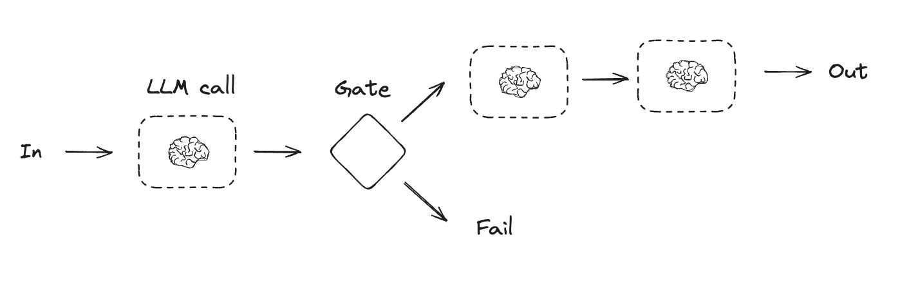
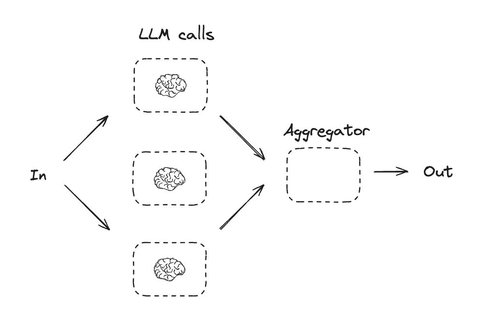
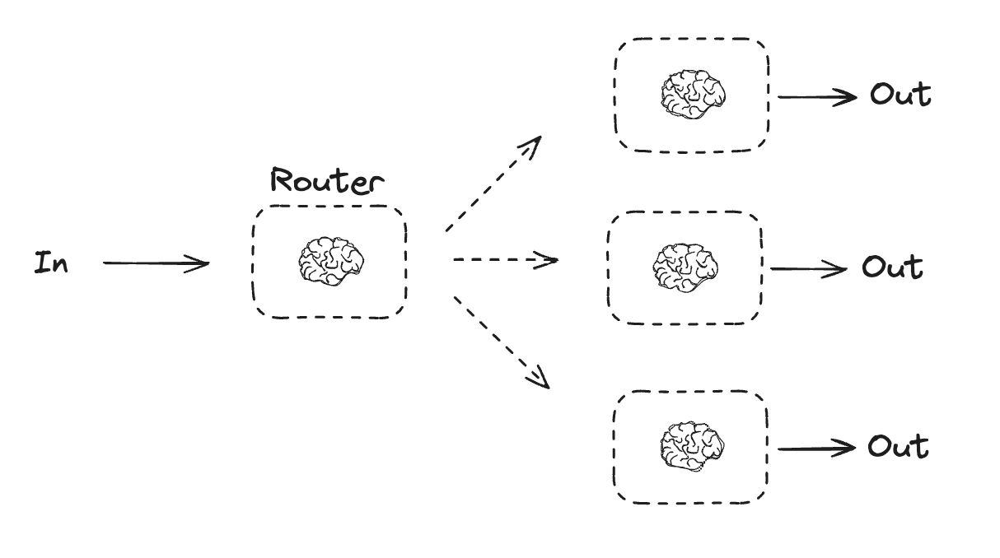
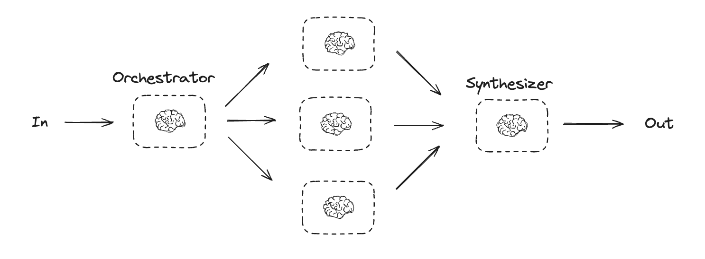
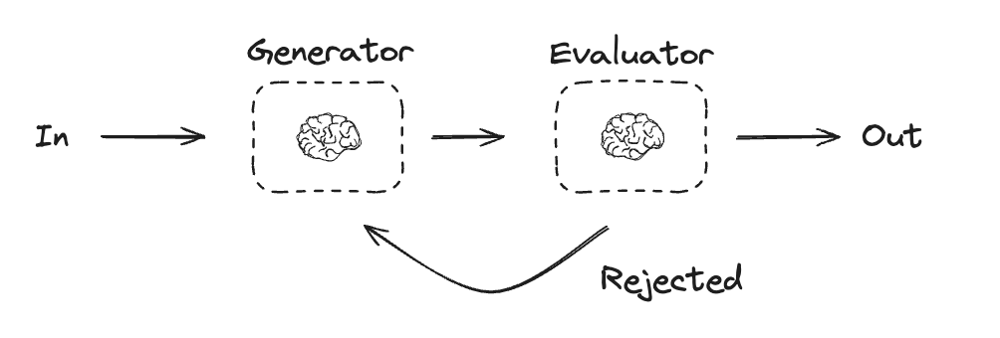
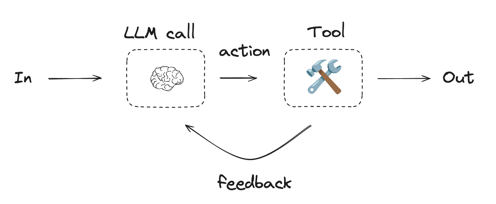

# Workflows and Agents

本文回顧了 agent 系統的常見模式。在描述這些系統時，區分 "workflows" 和 "agents" 會很有幫助。 Anthropic 的部落格文章 [Building Effective Agents](https://python.langchain.com/docs/integrations/providers/anthropic/?_gl=1*v405t1*_gcl_au*MTMzOTIyOTUzNS4xNzUwNTUxODU5*_ga*MTM5NTM1ODE0Mi4xNzQ3MDkyMTE0*_ga_47WX3HKKY2*czE3NTEzMjY2MjkkbzE3JGcxJHQxNzUxMzI3ODQ2JGo2MCRsMCRoMA..) 很好地解釋了理解這種差異的一種方法：

> Workflows 是透過預先定義程式碼路徑協調 LLM 和工具的系統。而 Agents 則是 LLM 動態控制自身流程和工具使用的系統，從而控制其如何完成任務。


這裡有一個簡單的方法來形象化地展示這些差異：


在建立代理和工作流程時，LangGraph 提供了許多好處，包括 persistence, streaming以及對 streaming 和部署的支援。

## Set up

您可以使用任何支援結構化輸出(structured outputs)和工具呼叫(tool calling)的聊天模型。下面，我們將展示安裝軟體包、設定 API 金鑰以及測試 LLM 結構化輸出/工具呼叫的過程。

```bash
pip install langchain_core langchain-openai langgraph
```

## Initialize an LLM

```python
import os
import getpass

from langchain_openai import ChatOpenAI

def _set_env(var: str):
    if not os.environ.get(var):
        os.environ[var] = getpass.getpass(f"{var}: ")


_set_env("OPENAI_API_KEY")

llm = ChatOpenAI(model="gpt-4.1-mini")
```

## Building Blocks: The Augmented LLM

LLM 具有支援建置工作流程和代理程式的增強功能。這些功能包括結構化輸出和工具調用，如下列圖片所示：


```python
# Schema for structured output
from pydantic import BaseModel, Field

class SearchQuery(BaseModel):
    search_query: str = Field(None, description="Query that is optimized web search.")
    justification: str = Field(
        None, description="Why this query is relevant to the user's request."
    )


# 使用結構化輸出模式增強 LLM
structured_llm = llm.with_structured_output(SearchQuery)

# 呼叫增強型 LLM
output = structured_llm.invoke("How does Calcium CT score relate to high cholesterol?")

# 定義一個工具
def multiply(a: int, b: int) -> int:
    return a * b

# 使用工具增強 LLM
llm_with_tools = llm.bind_tools([multiply])

# 使用觸發工具呼叫的輸入來呼叫 LLM
msg = llm_with_tools.invoke("What is 2 times 3?")

# 取得工具調用
msg.tool_calls
```

## Prompt chaining

在 prompt chaining 中，每個 LLM 呼叫都會處理前一個呼叫的輸出。

正如 Anthropic 關於建立高效能代理的部落格中所述：

> prompt chaining 將任務分解為一系列步驟，其中每個 LLM 呼叫都會處理前一個步驟的輸出。您可以在任何中間步驟上新增程序化檢查（請參閱下圖中的「gate」），以確保流程正常進行。
>
> **何時使用此工作流程**：此工作流程非常適合任務可以輕鬆清晰地分解為固定子任務的情況。其主要目標是透過簡化每個 LLM 呼叫來降低延遲，從而提高準確率。

)

=== "Graph API"

    ```python
    from typing_extensions import TypedDict
    from langgraph.graph import StateGraph, START, END
    from IPython.display import Image, display

    # Graph state
    class State(TypedDict):
        topic: str
        joke: str
        improved_joke: str
        final_joke: str

    # Nodes
    def generate_joke(state: State):
        """First LLM call to generate initial joke"""

        msg = llm.invoke(f"Write a short joke about {state['topic']}")
        return {"joke": msg.content}


    def check_punchline(state: State):
        """Gate function to check if the joke has a punchline"""

        # Simple check - does the joke contain "?" or "!"
        if "?" in state["joke"] or "!" in state["joke"]:
            return "Pass"
        return "Fail"

    def improve_joke(state: State):
        """Second LLM call to improve the joke"""

        msg = llm.invoke(f"Make this joke funnier by adding wordplay: {state['joke']}")
        return {"improved_joke": msg.content}

    def polish_joke(state: State):
        """Third LLM call for final polish"""

        msg = llm.invoke(f"Add a surprising twist to this joke: {state['improved_joke']}")
        return {"final_joke": msg.content}


    # Build workflow
    workflow = StateGraph(State)

    # Add nodes
    workflow.add_node("generate_joke", generate_joke)
    workflow.add_node("improve_joke", improve_joke)
    workflow.add_node("polish_joke", polish_joke)

    # Add edges to connect nodes
    workflow.add_edge(START, "generate_joke")
    workflow.add_conditional_edges(
        "generate_joke", check_punchline, {"Fail": "improve_joke", "Pass": END}
    )
    workflow.add_edge("improve_joke", "polish_joke")
    workflow.add_edge("polish_joke", END)

    # Compile
    chain = workflow.compile()

    # Show workflow
    display(Image(chain.get_graph().draw_mermaid_png()))

    # Invoke
    state = chain.invoke({"topic": "cats"})
    print("Initial joke:")
    print(state["joke"])
    print("\n--- --- ---\n")
    if "improved_joke" in state:
        print("Improved joke:")
        print(state["improved_joke"])
        print("\n--- --- ---\n")

        print("Final joke:")
        print(state["final_joke"])
    else:
        print("Joke failed quality gate - no punchline detected!")
    ```

    LangChain Academy:
    - 請參閱[此處](https://github.com/langchain-ai/langchain-academy/blob/main/module-1/chain.ipynb)有關 Prompt Chaining llelization 的課程。

=== "Functional API"

    ```python
    from langgraph.func import entrypoint, task


    # Tasks
    @task
    def generate_joke(topic: str):
        """First LLM call to generate initial joke"""
        msg = llm.invoke(f"Write a short joke about {topic}")
        return msg.content


    def check_punchline(joke: str):
        """Gate function to check if the joke has a punchline"""
        # Simple check - does the joke contain "?" or "!"
        if "?" in joke or "!" in joke:
            return "Fail"

        return "Pass"


    @task
    def improve_joke(joke: str):
        """Second LLM call to improve the joke"""
        msg = llm.invoke(f"Make this joke funnier by adding wordplay: {joke}")
        return msg.content


    @task
    def polish_joke(joke: str):
        """Third LLM call for final polish"""
        msg = llm.invoke(f"Add a surprising twist to this joke: {joke}")
        return msg.content


    @entrypoint()
    def prompt_chaining_workflow(topic: str):
        original_joke = generate_joke(topic).result()
        if check_punchline(original_joke) == "Pass":
            return original_joke

        improved_joke = improve_joke(original_joke).result()
        return polish_joke(improved_joke).result()

    # Invoke
    for step in prompt_chaining_workflow.stream("cats", stream_mode="updates"):
        print(step)
        print("\n")
    ```

## Parallelization

透過併行化，LLM 可以同時執行一項任務：

> LLM 有時可以同時處理一項任務，並以程式設計方式匯總其輸出。這種工作流程，即併行化，體現在兩個關鍵方面：
> - Sectioning：將任務分解為平行運行的獨立子任務。
> - Voting：多次運行同一任務以獲得不同的輸出。
>
> 何時使用此工作流程：當劃分的子任務可以併行化以提高速度，或者當需要多個視角或嘗試以獲得更高置信度的結果時，併行化非常有效。對於包含多個考慮的複雜任務，當每個考慮都由單獨的 LLM 呼叫處理時，LLM 通常表現更佳，從而能夠專注於每個特定方面。




=== "Graph API"

    ```python
    # Graph state
    class State(TypedDict):
        topic: str
        joke: str
        story: str
        poem: str
        combined_output: str


    # Nodes
    def call_llm_1(state: State):
        """First LLM call to generate initial joke"""

        msg = llm.invoke(f"Write a joke about {state['topic']}")
        return {"joke": msg.content}


    def call_llm_2(state: State):
        """Second LLM call to generate story"""

        msg = llm.invoke(f"Write a story about {state['topic']}")
        return {"story": msg.content}


    def call_llm_3(state: State):
        """Third LLM call to generate poem"""

        msg = llm.invoke(f"Write a poem about {state['topic']}")
        return {"poem": msg.content}


    def aggregator(state: State):
        """Combine the joke and story into a single output"""

        combined = f"Here's a story, joke, and poem about {state['topic']}!\n\n"
        combined += f"STORY:\n{state['story']}\n\n"
        combined += f"JOKE:\n{state['joke']}\n\n"
        combined += f"POEM:\n{state['poem']}"
        return {"combined_output": combined}


    # Build workflow
    parallel_builder = StateGraph(State)

    # Add nodes
    parallel_builder.add_node("call_llm_1", call_llm_1)
    parallel_builder.add_node("call_llm_2", call_llm_2)
    parallel_builder.add_node("call_llm_3", call_llm_3)
    parallel_builder.add_node("aggregator", aggregator)

    # Add edges to connect nodes
    parallel_builder.add_edge(START, "call_llm_1")
    parallel_builder.add_edge(START, "call_llm_2")
    parallel_builder.add_edge(START, "call_llm_3")
    parallel_builder.add_edge("call_llm_1", "aggregator")
    parallel_builder.add_edge("call_llm_2", "aggregator")
    parallel_builder.add_edge("call_llm_3", "aggregator")
    parallel_builder.add_edge("aggregator", END)
    parallel_workflow = parallel_builder.compile()

    # Show workflow
    display(Image(parallel_workflow.get_graph().draw_mermaid_png()))

    # Invoke
    state = parallel_workflow.invoke({"topic": "cats"})
    print(state["combined_output"])
    ```

    LangChain Academy:
    - 請參閱[此處](https://github.com/langchain-ai/langchain-academy/blob/main/module-1/simple-graph.ipynb)有關 parallelization 的課程。

=== "Functional API"

    ```python
    @task
    def call_llm_1(topic: str):
        """First LLM call to generate initial joke"""
        msg = llm.invoke(f"Write a joke about {topic}")
        return msg.content


    @task
    def call_llm_2(topic: str):
        """Second LLM call to generate story"""
        msg = llm.invoke(f"Write a story about {topic}")
        return msg.content


    @task
    def call_llm_3(topic):
        """Third LLM call to generate poem"""
        msg = llm.invoke(f"Write a poem about {topic}")
        return msg.content


    @task
    def aggregator(topic, joke, story, poem):
        """Combine the joke and story into a single output"""

        combined = f"Here's a story, joke, and poem about {topic}!\n\n"
        combined += f"STORY:\n{story}\n\n"
        combined += f"JOKE:\n{joke}\n\n"
        combined += f"POEM:\n{poem}"
        return combined


    # Build workflow
    @entrypoint()
    def parallel_workflow(topic: str):
        joke_fut = call_llm_1(topic)
        story_fut = call_llm_2(topic)
        poem_fut = call_llm_3(topic)
        return aggregator(
            topic, joke_fut.result(), story_fut.result(), poem_fut.result()
        ).result()

    # Invoke
    for step in parallel_workflow.stream("cats", stream_mode="updates"):
        print(step)
        print("\n")
    ```

## Routing

路由會對輸入進行分類，並將其定向到後續任務。正如 Anthropic 關於建立高效能代理的部落格中所述：

> 路由會對輸入進行分類，並將其定向到專門的後續任務。此工作流程允許分離關注點，並建立更專業的提示。如果沒有此工作流程，針對一種輸入進行最佳化可能會損害其他輸入的效能。
> 
> **何時使用此工作流程**：路由非常適合複雜任務，這些任務包含不同的類別，最好單獨處理，並且可以透過 LLM 或更傳統的分類模型/演算法進行準確分類。




=== "Graph API"

    ```python
    from typing_extensions import Literal
    from langchain_core.messages import HumanMessage, SystemMessage


    # Schema for structured output to use as routing logic
    class Route(BaseModel):
        step: Literal["poem", "story", "joke"] = Field(
            None, description="The next step in the routing process"
        )


    # Augment the LLM with schema for structured output
    router = llm.with_structured_output(Route)


    # State
    class State(TypedDict):
        input: str
        decision: str
        output: str


    # Nodes
    def llm_call_1(state: State):
        """Write a story"""

        result = llm.invoke(state["input"])
        return {"output": result.content}


    def llm_call_2(state: State):
        """Write a joke"""

        result = llm.invoke(state["input"])
        return {"output": result.content}


    def llm_call_3(state: State):
        """Write a poem"""

        result = llm.invoke(state["input"])
        return {"output": result.content}


    def llm_call_router(state: State):
        """Route the input to the appropriate node"""

        # Run the augmented LLM with structured output to serve as routing logic
        decision = router.invoke(
            [
                SystemMessage(
                    content="Route the input to story, joke, or poem based on the user's request."
                ),
                HumanMessage(content=state["input"]),
            ]
        )

        return {"decision": decision.step}


    # Conditional edge function to route to the appropriate node
    def route_decision(state: State):
        # Return the node name you want to visit next
        if state["decision"] == "story":
            return "llm_call_1"
        elif state["decision"] == "joke":
            return "llm_call_2"
        elif state["decision"] == "poem":
            return "llm_call_3"


    # Build workflow
    router_builder = StateGraph(State)

    # Add nodes
    router_builder.add_node("llm_call_1", llm_call_1)
    router_builder.add_node("llm_call_2", llm_call_2)
    router_builder.add_node("llm_call_3", llm_call_3)
    router_builder.add_node("llm_call_router", llm_call_router)

    # Add edges to connect nodes
    router_builder.add_edge(START, "llm_call_router")
    router_builder.add_conditional_edges(
        "llm_call_router",
        route_decision,
        {  # Name returned by route_decision : Name of next node to visit
            "llm_call_1": "llm_call_1",
            "llm_call_2": "llm_call_2",
            "llm_call_3": "llm_call_3",
        },
    )
    router_builder.add_edge("llm_call_1", END)
    router_builder.add_edge("llm_call_2", END)
    router_builder.add_edge("llm_call_3", END)

    # Compile workflow
    router_workflow = router_builder.compile()

    # Show the workflow
    display(Image(router_workflow.get_graph().draw_mermaid_png()))

    # Invoke
    state = router_workflow.invoke({"input": "Write me a joke about cats"})
    print(state["output"])
    ```

    LangChain Academy:
    - 請參閱[此處](https://github.com/langchain-ai/langchain-academy/blob/main/module-1/router.ipynb)有關 routing 的課程。

    範例:
    - [這是](https://langchain-ai.github.io/langgraph/tutorials/rag/langgraph_adaptive_rag_local/) RAG 路由問題的工作流程。點擊[此處](https://www.youtube.com/watch?v=bq1Plo2RhYI)觀看我們的影片。

=== "Functional API"

    ```python
    from typing_extensions import Literal
    from pydantic import BaseModel
    from langchain_core.messages import HumanMessage, SystemMessage


    # Schema for structured output to use as routing logic
    class Route(BaseModel):
        step: Literal["poem", "story", "joke"] = Field(
            None, description="The next step in the routing process"
        )


    # Augment the LLM with schema for structured output
    router = llm.with_structured_output(Route)


    @task
    def llm_call_1(input_: str):
        """Write a story"""
        result = llm.invoke(input_)
        return result.content


    @task
    def llm_call_2(input_: str):
        """Write a joke"""
        result = llm.invoke(input_)
        return result.content


    @task
    def llm_call_3(input_: str):
        """Write a poem"""
        result = llm.invoke(input_)
        return result.content


    def llm_call_router(input_: str):
        """Route the input to the appropriate node"""
        # Run the augmented LLM with structured output to serve as routing logic
        decision = router.invoke(
            [
                SystemMessage(
                    content="Route the input to story, joke, or poem based on the user's request."
                ),
                HumanMessage(content=input_),
            ]
        )
        return decision.step


    # Create workflow
    @entrypoint()
    def router_workflow(input_: str):
        next_step = llm_call_router(input_)
        if next_step == "story":
            llm_call = llm_call_1
        elif next_step == "joke":
            llm_call = llm_call_2
        elif next_step == "poem":
            llm_call = llm_call_3

        return llm_call(input_).result()

    # Invoke
    for step in router_workflow.stream("Write me a joke about cats", stream_mode="updates"):
        print(step)
        print("\n")
    ```

## Orchestrator-Worker

使用 Orchestrator-Worker 時，Orchestrator 會將任務分解，並將每個子任務交給 Worker。正如 Anthropic 部落格「建立高效能代理」中所述：

> 在 Orchestrator-Workers 工作流程中，中央 LLM 會動態分解任務，將其委託給 Worker LLM，並合成其結果。
>
> **何時使用此工作流程**：此工作流程非常適合無法預測所需子任務的複雜任務（例如，在編碼過程中，需要變更的檔案數量以及每個檔案的變更性質可能取決於任務本身）。雖然兩者在拓撲結構上相似，但與並行化的主要區別在於其靈活性——子任務並非預先定義，而是由 Orchestrator 根據特定輸入確定。



=== "Graph API"

    ```python
    from typing import Annotated, List
    import operator


    # Schema for structured output to use in planning
    class Section(BaseModel):
        name: str = Field(
            description="Name for this section of the report.",
        )
        description: str = Field(
            description="Brief overview of the main topics and concepts to be covered in this section.",
        )


    class Sections(BaseModel):
        sections: List[Section] = Field(
            description="Sections of the report.",
        )


    # Augment the LLM with schema for structured output
    planner = llm.with_structured_output(Sections)
    ```

    **在 LangGraph 中建立 Worker**

    由於 `Orchestrator-Worker` 工作流程很常見，LangGraph 提供了 `Send` API 來支援此工作流程。它允許您動態建立 Worker 節點並向每個節點發送特定的輸入。每個 Worker 都有自己的狀態，所有 Worker 的輸出都會寫入 Orchestrator 圖表可存取的共用狀態鍵。這使得 Orchestrator 能夠存取所有 Worker 的輸出，並將它們合成為最終輸出。如下所示，我們遍歷一個部分列表，並將每個部分傳送到一個 Worker 節點。請參閱[此處](https://langchain-ai.github.io/langgraph/how-tos/map-reduce/)和[此處](https://langchain-ai.github.io/langgraph/concepts/low_level/#send)的更多文件。

    ```python
    from langgraph.types import Send


    # Graph state
    class State(TypedDict):
        topic: str  # Report topic
        sections: list[Section]  # List of report sections
        completed_sections: Annotated[
            list, operator.add
        ]  # All workers write to this key in parallel
        final_report: str  # Final report


    # Worker state
    class WorkerState(TypedDict):
        section: Section
        completed_sections: Annotated[list, operator.add]


    # Nodes
    def orchestrator(state: State):
        """Orchestrator that generates a plan for the report"""

        # Generate queries
        report_sections = planner.invoke(
            [
                SystemMessage(content="Generate a plan for the report."),
                HumanMessage(content=f"Here is the report topic: {state['topic']}"),
            ]
        )

        return {"sections": report_sections.sections}


    def llm_call(state: WorkerState):
        """Worker writes a section of the report"""

        # Generate section
        section = llm.invoke(
            [
                SystemMessage(
                    content="Write a report section following the provided name and description. Include no preamble for each section. Use markdown formatting."
                ),
                HumanMessage(
                    content=f"Here is the section name: {state['section'].name} and description: {state['section'].description}"
                ),
            ]
        )

        # Write the updated section to completed sections
        return {"completed_sections": [section.content]}


    def synthesizer(state: State):
        """Synthesize full report from sections"""

        # List of completed sections
        completed_sections = state["completed_sections"]

        # Format completed section to str to use as context for final sections
        completed_report_sections = "\n\n---\n\n".join(completed_sections)

        return {"final_report": completed_report_sections}


    # Conditional edge function to create llm_call workers that each write a section of the report
    def assign_workers(state: State):
        """Assign a worker to each section in the plan"""

        # Kick off section writing in parallel via Send() API
        return [Send("llm_call", {"section": s}) for s in state["sections"]]


    # Build workflow
    orchestrator_worker_builder = StateGraph(State)

    # Add the nodes
    orchestrator_worker_builder.add_node("orchestrator", orchestrator)
    orchestrator_worker_builder.add_node("llm_call", llm_call)
    orchestrator_worker_builder.add_node("synthesizer", synthesizer)

    # Add edges to connect nodes
    orchestrator_worker_builder.add_edge(START, "orchestrator")
    orchestrator_worker_builder.add_conditional_edges(
        "orchestrator", assign_workers, ["llm_call"]
    )
    orchestrator_worker_builder.add_edge("llm_call", "synthesizer")
    orchestrator_worker_builder.add_edge("synthesizer", END)

    # Compile the workflow
    orchestrator_worker = orchestrator_worker_builder.compile()

    # Show the workflow
    display(Image(orchestrator_worker.get_graph().draw_mermaid_png()))

    # Invoke
    state = orchestrator_worker.invoke({"topic": "Create a report on LLM scaling laws"})

    from IPython.display import Markdown
    Markdown(state["final_report"])
    ```

    LangChain Academy:
    - 請參閱[此處](https://github.com/langchain-ai/langchain-academy/blob/main/module-4/map-reduce.ipynb)有關 Orchestrator-worker 的課程。

    範例:
    - [這是](https://github.com/langchain-ai/report-mAIstro)一個使用 Orchestrator-worker 進行報告規劃和撰寫的專案。點擊[此處](https://www.youtube.com/watch?v=wSxZ7yFbbas)觀看我們的影片。

=== "Functional API"

    ```python
    from typing import List


    # Schema for structured output to use in planning
    class Section(BaseModel):
        name: str = Field(
            description="Name for this section of the report.",
        )
        description: str = Field(
            description="Brief overview of the main topics and concepts to be covered in this section.",
        )


    class Sections(BaseModel):
        sections: List[Section] = Field(
            description="Sections of the report.",
        )


    # Augment the LLM with schema for structured output
    planner = llm.with_structured_output(Sections)


    @task
    def orchestrator(topic: str):
        """Orchestrator that generates a plan for the report"""
        # Generate queries
        report_sections = planner.invoke(
            [
                SystemMessage(content="Generate a plan for the report."),
                HumanMessage(content=f"Here is the report topic: {topic}"),
            ]
        )

        return report_sections.sections


    @task
    def llm_call(section: Section):
        """Worker writes a section of the report"""

        # Generate section
        result = llm.invoke(
            [
                SystemMessage(content="Write a report section."),
                HumanMessage(
                    content=f"Here is the section name: {section.name} and description: {section.description}"
                ),
            ]
        )

        # Write the updated section to completed sections
        return result.content


    @task
    def synthesizer(completed_sections: list[str]):
        """Synthesize full report from sections"""
        final_report = "\n\n---\n\n".join(completed_sections)
        return final_report


    @entrypoint()
    def orchestrator_worker(topic: str):
        sections = orchestrator(topic).result()
        section_futures = [llm_call(section) for section in sections]
        final_report = synthesizer(
            [section_fut.result() for section_fut in section_futures]
        ).result()
        return final_report

    # Invoke
    report = orchestrator_worker.invoke("Create a report on LLM scaling laws")
    from IPython.display import Markdown
    Markdown(report)
    ```

## Evaluator-optimizer

在 evaluator-optimizer 工作流程中，一個 LLM 呼叫產生回應，而另一個呼叫在循環中提供評估和回饋：

> 在 evaluator-optimizer 工作流程中，一個 LLM 呼叫產生回應，另一個呼叫則循環提供評估和回饋。
>
> **何時使用此工作流程**：當我們擁有明確的評估標準，並且迭代改進能夠提供可衡量的價值時，此工作流程尤其有效。良好契合的兩個標誌是：首先，當人類清楚地表達回饋時，LLM 反應可以顯著改善；其次，LLM 能夠提供此類回饋。這類似於人類作家在撰寫精良文件時可能經歷的迭代寫作過程。




=== "Graph API"

    ```python
    # Graph state
    class State(TypedDict):
        joke: str
        topic: str
        feedback: str
        funny_or_not: str


    # Schema for structured output to use in evaluation
    class Feedback(BaseModel):
        grade: Literal["funny", "not funny"] = Field(
            description="Decide if the joke is funny or not.",
        )
        feedback: str = Field(
            description="If the joke is not funny, provide feedback on how to improve it.",
        )


    # Augment the LLM with schema for structured output
    evaluator = llm.with_structured_output(Feedback)


    # Nodes
    def llm_call_generator(state: State):
        """LLM generates a joke"""

        if state.get("feedback"):
            msg = llm.invoke(
                f"Write a joke about {state['topic']} but take into account the feedback: {state['feedback']}"
            )
        else:
            msg = llm.invoke(f"Write a joke about {state['topic']}")
        return {"joke": msg.content}


    def llm_call_evaluator(state: State):
        """LLM evaluates the joke"""

        grade = evaluator.invoke(f"Grade the joke {state['joke']}")
        return {"funny_or_not": grade.grade, "feedback": grade.feedback}


    # Conditional edge function to route back to joke generator or end based upon feedback from the evaluator
    def route_joke(state: State):
        """Route back to joke generator or end based upon feedback from the evaluator"""

        if state["funny_or_not"] == "funny":
            return "Accepted"
        elif state["funny_or_not"] == "not funny":
            return "Rejected + Feedback"


    # Build workflow
    optimizer_builder = StateGraph(State)

    # Add the nodes
    optimizer_builder.add_node("llm_call_generator", llm_call_generator)
    optimizer_builder.add_node("llm_call_evaluator", llm_call_evaluator)

    # Add edges to connect nodes
    optimizer_builder.add_edge(START, "llm_call_generator")
    optimizer_builder.add_edge("llm_call_generator", "llm_call_evaluator")
    optimizer_builder.add_conditional_edges(
        "llm_call_evaluator",
        route_joke,
        {  # Name returned by route_joke : Name of next node to visit
            "Accepted": END,
            "Rejected + Feedback": "llm_call_generator",
        },
    )

    # Compile the workflow
    optimizer_workflow = optimizer_builder.compile()

    # Show the workflow
    display(Image(optimizer_workflow.get_graph().draw_mermaid_png()))

    # Invoke
    state = optimizer_workflow.invoke({"topic": "Cats"})
    print(state["joke"])
    ```

    範例:
    - [這是](https://github.com/langchain-ai/local-deep-researcher)一個使用評估優化器來改進報告的助手。點擊[此處](https://www.youtube.com/watch?v=XGuTzHoqlj8)觀看我們的影片。
    - [這是](https://langchain-ai.github.io/langgraph/tutorials/rag/langgraph_adaptive_rag_local/) RAG 的工作流程，用於對錯覺或錯誤答案進行評分。點擊[此處](https://www.youtube.com/watch?v=bq1Plo2RhYI)觀看我們的影片。


=== "Functional API"

    ```python
    # Schema for structured output to use in evaluation
    class Feedback(BaseModel):
        grade: Literal["funny", "not funny"] = Field(
            description="Decide if the joke is funny or not.",
        )
        feedback: str = Field(
            description="If the joke is not funny, provide feedback on how to improve it.",
        )


    # Augment the LLM with schema for structured output
    evaluator = llm.with_structured_output(Feedback)


    # Nodes
    @task
    def llm_call_generator(topic: str, feedback: Feedback):
        """LLM generates a joke"""
        if feedback:
            msg = llm.invoke(
                f"Write a joke about {topic} but take into account the feedback: {feedback}"
            )
        else:
            msg = llm.invoke(f"Write a joke about {topic}")
        return msg.content


    @task
    def llm_call_evaluator(joke: str):
        """LLM evaluates the joke"""
        feedback = evaluator.invoke(f"Grade the joke {joke}")
        return feedback


    @entrypoint()
    def optimizer_workflow(topic: str):
        feedback = None
        while True:
            joke = llm_call_generator(topic, feedback).result()
            feedback = llm_call_evaluator(joke).result()
            if feedback.grade == "funny":
                break

        return joke

    # Invoke
    for step in optimizer_workflow.stream("Cats", stream_mode="updates"):
        print(step)
        print("\n")
    ```

## Agent

Agent 通常以 LLM 的形式實現，根據環境回饋循環執行操作（透過工具呼叫）。正如 Anthropic 關於建立高效能代理的部落格中所述：

> Agent 可以處理複雜的任務，但其實作通常很簡單。它們通常只是基於環境回饋循環使用工具的 LLM。因此，清晰周到地設計工具集及其文件至關重要。
>
> **何時使用 Agent**：Agent 可用於開放式問題，這些問題難以或無法預測所需的步驟數，且您無法硬編碼固定路徑。 LLM 可能會運行多輪，您必須對其決策有一定程度的信任。Agent 的自主性使其成為在可信任環境中擴展任務的理想選擇。



```python
from langchain_core.tools import tool


# Define tools
@tool
def multiply(a: int, b: int) -> int:
    """Multiply a and b.

    Args:
        a: first int
        b: second int
    """
    return a * b


@tool
def add(a: int, b: int) -> int:
    """Adds a and b.

    Args:
        a: first int
        b: second int
    """
    return a + b


@tool
def divide(a: int, b: int) -> float:
    """Divide a and b.

    Args:
        a: first int
        b: second int
    """
    return a / b


# Augment the LLM with tools
tools = [add, multiply, divide]
tools_by_name = {tool.name: tool for tool in tools}
llm_with_tools = llm.bind_tools(tools)
```

=== "Graph API"

    ```python
    from langgraph.graph import MessagesState
    from langchain_core.messages import SystemMessage, HumanMessage, ToolMessage


    # Nodes
    def llm_call(state: MessagesState):
        """LLM decides whether to call a tool or not"""

        return {
            "messages": [
                llm_with_tools.invoke(
                    [
                        SystemMessage(
                            content="You are a helpful assistant tasked with performing arithmetic on a set of inputs."
                        )
                    ]
                    + state["messages"]
                )
            ]
        }


    def tool_node(state: dict):
        """Performs the tool call"""

        result = []
        for tool_call in state["messages"][-1].tool_calls:
            tool = tools_by_name[tool_call["name"]]
            observation = tool.invoke(tool_call["args"])
            result.append(ToolMessage(content=observation, tool_call_id=tool_call["id"]))
        return {"messages": result}


    # Conditional edge function to route to the tool node or end based upon whether the LLM made a tool call
    def should_continue(state: MessagesState) -> Literal["environment", END]:
        """Decide if we should continue the loop or stop based upon whether the LLM made a tool call"""

        messages = state["messages"]
        last_message = messages[-1]
        # If the LLM makes a tool call, then perform an action
        if last_message.tool_calls:
            return "Action"
        # Otherwise, we stop (reply to the user)
        return END


    # Build workflow
    agent_builder = StateGraph(MessagesState)

    # Add nodes
    agent_builder.add_node("llm_call", llm_call)
    agent_builder.add_node("environment", tool_node)

    # Add edges to connect nodes
    agent_builder.add_edge(START, "llm_call")
    agent_builder.add_conditional_edges(
        "llm_call",
        should_continue,
        {
            # Name returned by should_continue : Name of next node to visit
            "Action": "environment",
            END: END,
        },
    )
    agent_builder.add_edge("environment", "llm_call")

    # Compile the agent
    agent = agent_builder.compile()

    # Show the agent
    display(Image(agent.get_graph(xray=True).draw_mermaid_png()))

    # Invoke
    messages = [HumanMessage(content="Add 3 and 4.")]
    messages = agent.invoke({"messages": messages})
    for m in messages["messages"]:
        m.pretty_print()
    ```

    LangChain Academy:
    - 請參閱[此處](https://github.com/langchain-ai/langchain-academy/blob/main/module-1/agent.ipynb)有關代理的課程。

    範例:
    - [這是](https://github.com/langchain-ai/memory-agent)一個使用工具呼叫代理來創建/儲存長期記憶的項目。

=== "Functional API"

    ```python
    from langgraph.graph import add_messages
    from langchain_core.messages import (
        SystemMessage,
        HumanMessage,
        BaseMessage,
        ToolCall,
    )


    @task
    def call_llm(messages: list[BaseMessage]):
        """LLM decides whether to call a tool or not"""
        return llm_with_tools.invoke(
            [
                SystemMessage(
                    content="You are a helpful assistant tasked with performing arithmetic on a set of inputs."
                )
            ]
            + messages
        )


    @task
    def call_tool(tool_call: ToolCall):
        """Performs the tool call"""
        tool = tools_by_name[tool_call["name"]]
        return tool.invoke(tool_call)


    @entrypoint()
    def agent(messages: list[BaseMessage]):
        llm_response = call_llm(messages).result()

        while True:
            if not llm_response.tool_calls:
                break

            # Execute tools
            tool_result_futures = [
                call_tool(tool_call) for tool_call in llm_response.tool_calls
            ]
            tool_results = [fut.result() for fut in tool_result_futures]
            messages = add_messages(messages, [llm_response, *tool_results])
            llm_response = call_llm(messages).result()

        messages = add_messages(messages, llm_response)
        return messages

    # Invoke
    messages = [HumanMessage(content="Add 3 and 4.")]
    for chunk in agent.stream(messages, stream_mode="updates"):
        print(chunk)
        print("\n")
    ```


**Pre-built**:

LangGraph 也提供了一種預先建置的方法來建立如上所述的代理程式（使用 [create_react_agent](https://langchain-ai.github.io/langgraph/reference/agents/#langgraph.prebuilt.chat_agent_executor.create_react_agent) 函數）：

```python
from langgraph.prebuilt import create_react_agent

# Pass in:
# (1) the augmented LLM with tools
# (2) the tools list (which is used to create the tool node)
pre_built_agent = create_react_agent(llm, tools=tools)

# Show the agent
display(Image(pre_built_agent.get_graph().draw_mermaid_png()))

# Invoke
messages = [HumanMessage(content="Add 3 and 4.")]
messages = pre_built_agent.invoke({"messages": messages})
for m in messages["messages"]:
    m.pretty_print()
```

## What LangGraph provides

透過在 LangGraph 中建構上述各項，我們得到了以下幾點：

### Persistence: Human-in-the-Loop

LangGraph 持久層支援操作的中斷和批准（例如，Human In The Loop）。請參閱 [LangChain Academy 的模組 3](https://github.com/langchain-ai/langchain-academy/tree/main/module-3)。


### Persistence: Memory

LangGraph 持久層支持對話式（短期）記憶和長期記憶。請參閱 [LangChain 學院的模組 2 和模組 5](https://github.com/langchain-ai/langchain-academy/tree/main/module-5)。

### Streaming

LangGraph 提供了多種方式來串流工作流程/代理的輸出或中間狀態。請參閱 [LangChain Academy 的模組 3](https://github.com/langchain-ai/langchain-academy/blob/main/module-3/streaming-interruption.ipynb)。

### Deployment

LangGraph 為部署、可觀察性和評估提供了便利的入門途徑。請參閱 [LangChain Academy 的第六模組](https://github.com/langchain-ai/langchain-academy/tree/main/module-6)。

