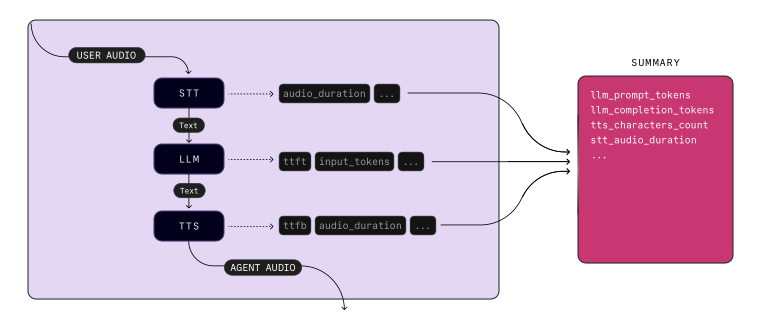

# Capturing metrics

> 記錄代理程式上的效能和使用情況指標，以進行偵錯和洞察。

## Overview

為了提高對代理效能和模型使用的可觀察性，您可以記錄 LiveKit 代理程式提供的詳細指標。這些指標提供了有關會話不同階段的持續時間、延遲和使用情況的見解。

## Logging events

每當活動會話期間有新的指標物件可用時，`AgentSession` 就會觸發代理指標事件。

也提供了 `log_metrics` 輔助函數來格式化每種指標類型的日誌輸出。

```python
from livekit.agents import metrics, MetricsCollectedEvent

...

@session.on("metrics_collected")
def _on_metrics_collected(ev: MetricsCollectedEvent):
    metrics.log_metrics(ev.metrics)

```

## Aggregating metrics

`metrics` 模組還包括一個 `UsageCollector` 輔助類，用於聚合會話中的使用情況指標。它追蹤 LLM, TTS 和 STT API 使用等指標，這有助於估算會話成本。

```python
from livekit.agents import metrics, MetricsCollectedEvent

...

usage_collector = metrics.UsageCollector()

@session.on("metrics_collected")
def _on_metrics_collected(ev: MetricsCollectedEvent):
    usage_collector.collect(ev.metrics)

async def log_usage():
    summary = usage_collector.get_summary()
    logger.info(f"Usage: {summary}")

# At shutdown, generate and log the summary from the usage collector
ctx.add_shutdown_callback(log_usage)

```

## Metrics reference



### Speech-to-text (STT)

STT 模型處理完音訊輸入後，會發出 `STTMetrics`。此指標僅在使用 STT 元件時可用，不適用於即時 API。

| Metric | Description |
|--------|-------------|
| `audio_duration` | STT 模型接收的音訊輸入的持續時間（秒）。 |
| `duration` | 對於非流式 STT，建立 transcript 所需的時間（秒）。對於串流 STT，始終為 `0`。 |
| `streamed` | `True` 如果 STT 處於流模式。|

### LLM

每次 LLM 推理完成後都會發出 `LLMMetrics`。如果響應包括工具調用，則事件不包括執行這些調用所花費的時間。每個工具呼叫回應都會觸發單獨的 `LLMMetrics` 事件。


| Metric | Description |
|--------|-------------|
| `duration` | LLM 產生整個完成所花費的時間（秒）。 |
| `completion_tokens` | LLM 在完成過程中產生的文字 token 數量。|
| `prompt_tokens` | 發送給 LLM 的提示中提供的 token 數量。 |
| `prompt_cached_tokens` | 輸入提示中快取的 token 數量。|
| `speech_id` | 表示使用者輸入對話輪次的唯一識別碼。|
| `total_tokens` | 完成時的總 token 使用量。 |
| `tokens_per_second` | LLM 產生完成的 token 產生速率 (tokens/second)。|
| `ttft` | LLM 產生完成的第一個 token 所花費的時間（秒）。 |

### Text-to-speech (TTS)

TTS 從文字輸入產生語音後，會發出 `TTSMetrics`。

| Metric | Description |
|--------|-------------|
| `audio_duration` | TTS 模型產生的音訊輸出的時長（秒）。 |
| `characters_count` | 輸入到 TTS 模型的文字的字元數。 |
| `duration` | TTS 模型產生整個音訊輸出所需的時間（秒）。 |
| `ttfb` | TTS 模型產生其音訊輸出的第一個位元組所花費的時間（秒）。 |
| `speech_id` | 連結到使用者對話輪次的標識符。 |
| `streamed` | `True` 如果 TTS 處於流模式。 |

### End-of-utterance (EOU)

當確定使用者已說完話時，會發出 `EOUMetrics`。它包括與回合結束檢測和轉錄延遲相關的指標。

僅當 `turn_detection` 設定為 VAD 或 LiveKit 的轉彎偵測器外掛程式時，此事件才在即時 API 中可用。當使用伺服器端轉彎偵測時，不會發出 EOUMetrics，因為此資訊不可用。

| Metric | Description |
|--------|-------------|
| `end_of_utterance_delay` | 從語音結束（由 VAD 檢測）到使用者發言被認為完成的時間（以秒為單位）。這包括任何 `transcription_delay`。 |
| `transcription_delay` | 對話結束與最終 transcript 發布之間的時間（秒） |
| `on_user_turn_completed_delay` | 執行 `on_user_turn_completed` 回呼所需的時間（以秒為單位）。 |
| `speech_id` | 指示使用者對話輪次的唯一識別碼。|

## Measuring conversation latency

總對話延遲定義為代理回應使用者話語所需的時間。根據上述指標，可以如下計算：

```python
total_latency = eou.end_of_utterance_delay + llm.ttft + tts.ttfb

```