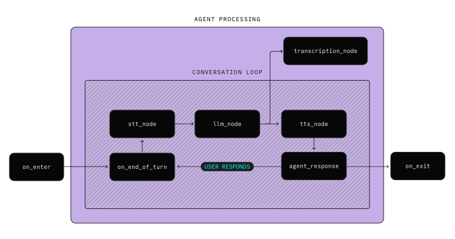
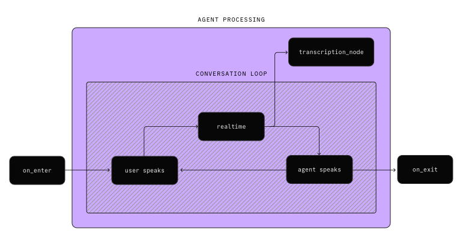

# Pipeline nodes and hooks

> 了解如何使用語音管道中的節點和 hook 自訂代理程式的行為。

## Overview

您可以在處理路徑中的多個 **nodes** 上完全自訂代理程式的行為。節點(node)是路徑中一個過程轉換到另一個過程的點。一些範例客製化包括：

- 使用無需插件的自訂 STT, LLM 或 TTS 提供者。
- 當代理程式進入會話時產生自訂問候語。
- 在將 STT 輸出傳送到 LLM 之前，修改 STT 輸出以刪除填充字。
- 在將 LLM 輸出發送到 TTS 之前對其進行修改以自訂發音。
- 當代理或使用者講完話時更新使用者介面。


`Agent` 支援下列 nodes 和 hooks。有些節點僅適用於 `STT-LLM-TTS` 管道(pipeline)模型，其他節點僅適用於即時(realtime)模型。

Lifecycle hooks:

- `on_enter()`: 在代理成為會話中的活動代理後呼叫。
- `on_exit()`: 在代理將控制權交給同一會話中的另一個代理之前呼叫。
- `on_user_turn_completed()`: 當使用者的 [turn](https://docs.livekit.io/agents/build/turns.md) 結束時，在代理回覆之前呼叫。

STT-LLM-TTS pipeline nodes:

- `stt_node()`: 將輸入音訊轉錄為文字。
- `llm_node()`: 執行推理並產生新的對話回應（或工具呼叫）。
- `tts_node()`: 從 LLM 文字輸出合成語音。

Realtime model nodes:

- `realtime_audio_output_node()`: 在發布給使用者之前調整輸出音訊。

Transcription node:

- `transcription_node()`: 在發送給使用者之前調整管道或即時模型轉錄。

下圖顯示了 `STT-LLM-TTS` 管道模型和即時模型的處理路徑。

=== "STT-LLM-TTS pipeline"




=== "Realtime model"



## How to implement

覆寫自訂 `Agent` 子類別中的方法來自訂代理程式在處理路徑中的特定節點上的行為。若要使用預設值，請呼叫 `Agent.default.<node-name>()`。例如，此程式碼覆蓋了 STT 節點，同時保持了預設行為。

```python
async def stt_node(self, audio: AsyncIterable[rtc.AudioFrame], model_settings: ModelSettings) -> Optional[AsyncIterable[stt.SpeechEvent]]:
    # insert custom before STT processing here
    events = Agent.default.stt_node(self, audio, model_settings)
    # insert custom after STT processing here
    return events

```

## Lifecycle hooks

以下 lifecycle hooks 可供客製化。

### On enter

當代理程式成為會話中的活動代理程式時，將呼叫 `on_enter` 節點。每個會話一次只能有一個 active 代理，可以從 `session.agent` 屬性中讀取。使用 [Workflows](./workflows.md) 變更 active 代理程式。

例如，向使用者打招呼：

```python
async def on_enter(self):
    await self.session.generate_reply(
        instructions="Greet the user with a warm welcome",
    )

```

### On exit

在代理將控制權移交給同一會話中的另一個代理程式作為 [workflow](https://docs.livekit.io/agents/build/workflows.md) 的一部分之前，將呼叫 `on_exit` 節點。使用它來保存資料、告別或執行其他操作和清理。

例如，說再見：

```python
async def on_exit(self):
    await self.session.generate_reply(
        instructions="Tell the user a friendly goodbye before you exit.",
    )

```

### On user turn completed

當使用者的 turn 結束(一句話完成)，且在代理回復之前，會呼叫 `on_user_turn_completed` 節點。重寫此方法可以修改本次對話的內容、取消代理程式的回覆或執行其他操作。

!!! info
    **Realtime model turn detection**

    若要將 `on_user_turn_completed` 節點與 [即時模型](https://docs.livekit.io/agents/integrations/realtime.md) 一起使用，您必須將 [turn detection](https://docs.livekit.io/agents/build/turns.md) 配置為在即時代理模型中進行，而不是在即時代理模型中進行。

節點 (node) 接收以下參數：

- `turn_ctx`: 完整的 `ChatContext`，最更新但不包括用戶的最新消息。
- `new_message`: 用戶的最新消息，代表他們當前的對話。

節點完成後，`new_message` 被加入到聊天上下文(chat context)中。

此節點的常見用途是[retrieval-augmented generation (RAG)](https://docs.livekit.io/agents/build/external-data.md)。您可以檢索與最新訊息相關的上下文並將其注入到 LLM 的聊天上下文中。

```python
from livekit.agents import ChatContext, ChatMessage

async def on_user_turn_completed(
    self, turn_ctx: ChatContext, new_message: ChatMessage,
) -> None:
    rag_content = await my_rag_lookup(new_message.text_content())
    turn_ctx.add_message(
        role="assistant", 
        content=f"Additional information relevant to the user's next message: {rag_content}"
    )

```

以這種方式新增的附加訊息不會在當前回合之後保留。若要將訊息永久新增至聊天記錄中，請使用 `update_chat_ctx` 方法：

```python
async def on_user_turn_completed(
    self, turn_ctx: ChatContext, new_message: ChatMessage,
) -> None:
    rag_content = await my_rag_lookup(new_message.text_content())
    turn_ctx.add_message(role="assistant", content=rag_content)
    await self.update_chat_ctx(turn_ctx)

```

您也可以編輯 `new_message` 對象，以便在將使用者訊息新增至聊天上下文之前對其進行修改。例如，您可以刪除令人反感的內容或新增其他上下文。這些變更將保留在以後的聊天記錄中。

```python
async def on_user_turn_completed(
    self, turn_ctx: ChatContext, new_message: ChatMessage,
) -> None:
    new_message.content = ["... modified message ..."]

```

若要完全中止生成（例如，在即按即說介面中），您可以執行以下操作：

```python
async def on_user_turn_completed(
    self, turn_ctx: ChatContext, new_message: ChatMessage,
) -> None:
    if not new_message.text_content:
        # for example, raise StopResponse to stop the agent from generating a reply
        raise StopResponse()

```

完整範例，請參閱 [multi-user agent with push to talk example](https://github.com/livekit/agents/blob/main/examples/voice_agents/push_to_talk.py)。

## STT-LLM-TTS pipeline nodes

以下節點適用於 `STT-LLM-TTS` 管道模型。

### STT node

`stt_node` 將音訊 frames 轉錄為語音事件，將使用者音訊輸入轉換為 LLM 的文字。預設情況下，此節點使用目前代理的語音轉文字 (STT) 功能。如果 STT 實作本身不支援串流，則語音活動偵測 (VAD) 機制會包裝 STT。

您可以覆蓋此節點來實現：

- 音訊幀的自訂預處理
- 額外的緩衝機制
- 替代 STT 策略
- 對轉錄文字進行後期處理

若要使用預設實現，請呼叫 `Agent.default.stt_node()`。

本範例新增了雜訊過濾步驟：

```python
from livekit import rtc
from livekit.agents import ModelSettings, stt, Agent
from typing import AsyncIterable, Optional

async def stt_node(
    self, audio: AsyncIterable[rtc.AudioFrame], model_settings: ModelSettings
) -> Optional[AsyncIterable[stt.SpeechEvent]]:
    async def filtered_audio():
        async for frame in audio:
            # insert custom audio preprocessing here
            yield frame
    
    async for event in Agent.default.stt_node(self, filtered_audio(), model_settings):
        # insert custom text postprocessing here 
        yield event

```

### LLM node

`llm_node` 負責根據當前聊天上下文進行推理，並建立代理的回應或工具呼叫。它可能產生純文字（作為 `str`）以用於直接文字生成，或產生可以包含文字和可選工具呼叫的 `llm.ChatChunk` 物件。`ChatChunk` 有助於捕獲更複雜的輸出，例如函數呼叫、使用情況統計或其他元資料。

您可以覆蓋此節點(node)以：

- 客製化 LLM 的使用方式
- 在推理之前修改聊天上下文
- 調整工具呼叫和回應的處理方式
- 無需插件即可實現自訂 LLM 提供程序

若要使用預設實現，請呼叫 `Agent.default.llm_node()`。

```python
from livekit.agents import ModelSettings, llm, FunctionTool, Agent
from typing import AsyncIterable

async def llm_node(
    self,
    chat_ctx: llm.ChatContext,
    tools: list[FunctionTool],
    model_settings: ModelSettings
) -> AsyncIterable[llm.ChatChunk]:
    # Insert custom preprocessing here
    async for chunk in Agent.default.llm_node(self, chat_ctx, tools, model_settings):
        # Insert custom postprocessing here
        yield chunk

```

### TTS node

`tts_node` 從文字片段合成音頻，將 LLM 輸出轉換為語音。預設情況下，此節點使用代理程式的文字轉語音功能。如果 TTS 實作本身不支援串流傳輸，它會使用句子標記器來分割文字以進行增量合成。

您可以覆蓋此節點以：

- 提供不同的文字分塊 (text chunking) 行為
- 實現自訂 TTS 引擎
- [新增自訂發音規則](https://docs.livekit.io/agents/build/audio.md#pronunciation)
- [調整音訊輸出音量](https://docs.livekit.io/agents/build/audio.md#volume)
- 應用任何其他專門的音訊處理

若要使用預設實現，請呼叫 `Agent.default.tts_node()`。

```python
from livekit.agents import ModelSettings, rtc, Agent
from typing import AsyncIterable

async def tts_node(
    self, text: AsyncIterable[str], model_settings: ModelSettings
) -> AsyncIterable[rtc.AudioFrame]:
    # Insert custom text processing here
    async for frame in Agent.default.tts_node(self, text, model_settings):
        # Insert custom audio processing here
        yield frame

```

## Realtime model nodes

以下節點可用於即時模型。

### Realtime audio output node

當即時模型輸出語音時，會呼叫 `realtime_audio_output_node`。這使您可以在將音訊輸出發送給用戶之前對其進行修改。例如，您可以[調整音訊輸出的音量](https://docs.livekit.io/agents/build/audio.md#volume)。

若要使用預設實現，請呼叫 `Agent.default.realtime_audio_output_node()`。

```python
from livekit.agents import ModelSettings, rtc, Agent
from typing import AsyncIterable

async def realtime_audio_output_node(
    self, audio: AsyncIterable[rtc.AudioFrame], model_settings: ModelSettings
) -> AsyncIterable[rtc.AudioFrame]:
    # Insert custom audio preprocessing here
    async for frame in Agent.default.realtime_audio_output_node(self, audio, model_settings):
        # Insert custom audio postprocessing here
        yield frame

```

## Transcription node

`transcription_node` 負責完成文字片段的轉錄。此節點是代理轉錄轉發路徑的一部分，可用於將來自 LLM（或任何其他來源）的文字調整或後處理為最終轉錄形式。

預設情況下，節點只是將轉錄傳遞給將其轉發到指定輸出的任務。您可以覆蓋此節點以：

- 清理格式
- 修復標點符號
- 刪除不需要的字符
- 執行任何其他文字轉換

若要使用預設實現，請呼叫 `Agent.default.transcription_node()`。

```python
from livekit.agents import ModelSettings
from typing import AsyncIterable

async def transcription_node(self, text: AsyncIterable[str], model_settings: ModelSettings) -> AsyncIterable[str]: 
    async for delta in text:
        yield delta.replace("😘", "")

```

## Examples

以下範例示範了 nodes 和 hooks 的高階用法：

- **[Restaurant Agent](https://github.com/livekit/agents/blob/main/examples/voice_agents/restaurant_agent.py)**: 餐廳前台代理展示了 `on_enter` 和 `on_exit` 生命週期掛鉤。

- **[Structured Output](https://github.com/livekit/agents/blob/main/examples/voice_agents/structured_output.py)**: 透過覆蓋 `llm_node` 和 `tts_node` 來處理來自 LLM 的結構化輸出。

- **[Chain-of-thought agent](https://docs.livekit.io/recipes/chain-of-thought.md)**: 使用 `llm_node` 建立一個用於思路鏈推理的代理來清理 TTS 之前的文字。

- **[Keyword Detection](https://github.com/livekit-examples/python-agents-examples/tree/main/pipeline-stt/keyword_detection.py)**: 使用 `stt_node` 偵測使用者語音中的關鍵字。

- **[LLM Content Filter](https://github.com/livekit-examples/python-agents-examples/tree/main/pipeline-llm/llm_powered_content_filter.py)**: 在 `llm_node` 中實現內容過濾。

- **[Speedup Output Audio](https://github.com/livekit/agents/blob/main/examples/voice_agents/speedup_output_audio.py)**: 使用 `tts_node` 或 `realtime_audio_output_node` 加速代理的輸出音訊。
