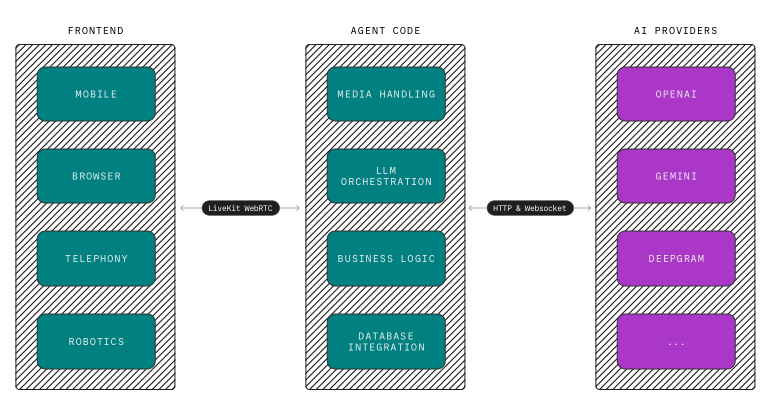
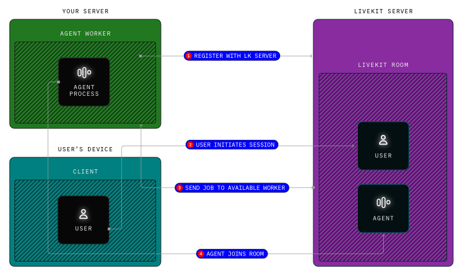

# LiveKit Agents

> 用於生產等級多模態和語音 AI 代理的 Realtime framework。

## Introduction

Agents framework 可讓您將 Python 或 Node.js 程式新增至任何 LiveKit 房間作為完整的即時參與者 (participant)。 SDK 包含一整套工具和抽象定義，可輕鬆透過與任何供應商合作的 AI pipeline 提供即時媒體和數據，並將即時結果發布回房間。

如果您想立即體驗範例程式碼，請遵循此快速入門指南。只需幾分鐘即可建立您的第一個語音代理。

- **[Voice AI quickstart](./start/voice-ai.md)**: 在不到 10 分鐘的時間內使用 Python 建立一個簡單的語音助理。

- **[GitHub repository](https://github.com/livekit/agents)**: LiveKit Agents SDK 的 Python 原始碼和範例。

- **[SDK reference](https://docs.livekit.io/reference/python/v1/livekit/agents/index.html)**: LiveKit Agents SDK 的 Python 參考文件。

## Use cases

Agents 代理的一些應用案例包括：

- **Multimodal assistant**: 與 AI 助理交談、發送簡訊或分享螢幕。
- **Telehealth**: 將人工智慧引入即時遠距醫療諮詢，無論是否有人類參與 (human-in-the-loop)。
- **Call center**: 透過入站和出站呼叫支援將 AI 部署到客戶服務的第一線。
- **Realtime translation**: 即時翻譯對話。
- **NPCs**: 添加由語言模型而不是靜態腳本支援的逼真的 NPC。
- **Robotics**: 將機器人的大腦放入雲端，使其能夠存取最強大的模型。

以下 [recipes](https://docs.livekit.io/recipes.md) 示範了其中一些用例：

- **[Medical Office Triage](https://github.com/livekit-examples/python-agents-examples/tree/main/complex-agents/medical_office_triage)**: 根據症狀和病史對患者進行分類的代理。

- **[Restaurant Agent](https://github.com/livekit/agents/blob/main/examples/voice_agents/restaurant_agent.py)**: 餐廳前台代理可以接受訂單、將商品添加到共享購物車並結帳。

- **[Company Directory](https://docs.livekit.io/recipes/company-directory.md)**: 建立一個 AI 公司目錄代理。代理可以回應 DTMF 音調和語音提示，然後重新導向呼叫者。

- **[Pipeline Translator](https://github.com/livekit-examples/python-agents-examples/tree/main/translators/pipeline_translator.py)**: 在處理管道中實現翻譯。

## Framework overview

您的代理程式碼可作為強大的 AI 模型和您的使用者之間的有狀態即時橋樑。雖然人工智慧模型通常在具有可靠連接的資料中心運行，但用戶通常透過品質參差不齊的行動網路連接。

即使在連線不穩定的情況下，WebRTC 也能確保代理程式和使用者之間的順暢通訊。前端和代理程式之間使用 LiveKit WebRTC，而代理程式使用 HTTP 和 WebSockets 與後端進行通訊。此設定提供了 WebRTC 的優勢，但又沒有其典型的複雜性。

代理程式 SDK 包括用於處理即時語音 AI 核心挑戰的組件，例如透過 `STT-LLM-TTS` 管道傳輸音訊、可靠的語氣檢測、處理中斷和 LLM 編排。它支援大多數主要 AI 提供者的插件，並且還在不斷添加更多插件。該框架完全開源，並得到活躍社群的支持。

框架其他功能包括：

- **Voice, video, and text**: 建置可以處理即時輸入並以任何方式產生輸出的代理程式。
- **Tool use**: 定義與任何 LLM 相容的工具，甚至將工具呼叫轉發到您的前端。
- **Multi-agent handoff**: 將複雜的工作流程分解為更簡單的任務。
- **Extensive integrations**: 與幾乎所有針對 LLM、STT、TTS 等的 AI 供應商整合。
- **State-of-the-art turn detection**: 使用自訂語氣轉彎偵測模型實現逼真的對話流。
- **Made for developers**: 在程式碼中建立您的代理，而不是配置。
- **Production ready**: 包括內建工作程序編排、負載平衡和 Kubernetes 相容性。
- **Open source**: 該框架和整個 LiveKit 生態系統在 Apache 2.0 許可下開源。

## How agents connect to LiveKit

當你的代理程式碼啟動時，它首先向 LiveKit 伺服器（[self hosted](https://docs.livekit.io/home/self-hosting/deployment.md) 或 [LiveKit Cloud](https://cloud.livekit.io)）註冊，以 **worker** 進程運行。**Worker** 等待，直到收到調度請求(`dispatch request`)。為了滿足這個請求，**worker** 啟動一個加入房間的 **job** 子程序。預設情況下，您的 **worker** 會被派往 LiveKit 專案中建立的每個新房間。要了解有關 **Worker** 的更多信息，請參閱 [Worker lifecycle](https://docs.livekit.io/agents/worker.md) 指南。

在您的代理和使用者加入房間後，代理程式和您的前端應用程式可以使用 LiveKit WebRTC 進行通訊。這使得在任何網路條件下都能實現可靠、快速的即時通訊。 LiveKit 還全面支援電話功能，因此用戶可以透過電話而不是前端應用程式加入通話。

要了解有關 LiveKit 整體工作原理的更多信息，請參閱 [LiveKit 簡介](https://docs.livekit.io/home/get-started/intro-to-livekit.md) 指南。

## Getting started

請按照這些指南了解更多資訊並開始使用 LiveKit Agents。

- **[Voice AI quickstart](https://docs.livekit.io/agents/start/voice-ai.md)**: 在不到 10 分鐘的時間內使用 Python 建立一個簡單的語音助理。

- **[Recipes](https://docs.livekit.io/recipes.md)**: LiveKit Agents 的全面範例、指南和配方集合。

- **[Intro to LiveKit](https://docs.livekit.io/home/get-started/intro-to-livekit.md)**: LiveKit 生態系概論。

- **[Web and mobile frontends](https://docs.livekit.io/agents/start/frontend.md)**: 透過自訂網路或行動應用程式將您的代理程式放在您的口袋中。

- **[Telephony integration](https://docs.livekit.io/agents/start/telephony.md)**: 您的代理商可以使用 LiveKit 的 SIP 整合撥打和接聽電話。

- **[Building voice agents](https://docs.livekit.io/agents/build.md)**: 使用 LiveKit 建立高級語音 AI 應用程式的綜合文件。

- **[Worker lifecycle](https://docs.livekit.io/agents/worker.md)**: 了解如何透過 workers 和 jobs 來管理您的代理。

- **[Deploying to production](https://docs.livekit.io/agents/ops/deployment.md)**: 在生產環境中部署語音代理的指南。

- **[Integration guides](https://docs.livekit.io/agents/integrations.md)**: 探索可用於 LiveKit Agents 的 AI 提供者的完整清單。
