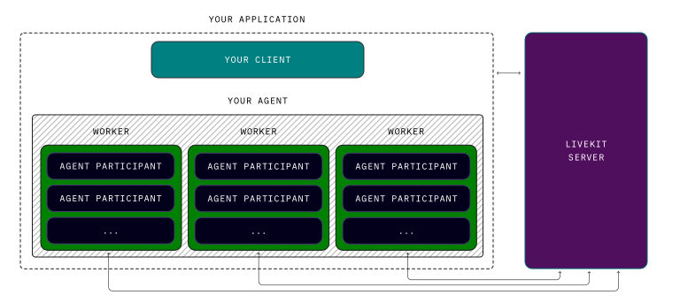

# Deploying to production

> 在生產環境中執行 LiveKit Agents 的指南。

## Overview

LiveKit Agent 使用適合 Kubernetes 等容器編排系統的工作執行緒池 (worker pool model) 模型。每個 worker 執行緒（即 `python agent.py start` 的一個實例）都會向 LiveKit 伺服器註冊。 LiveKit 伺服器會在所有可用 worker 執行緒之間平衡任務分配。工作執行緒會為每個任務產生一個新的子進程，您的程式碼和代理參與者將在該子進程中運行。

部署到生產環境通常需要一個簡單的 `Dockerfile`，以 `CMD ["python", "agent.py", "start"]` 結尾，以及根據負載擴展工作池的部署平台。




## Where to deploy

LiveKit Agent 可以部署在任何地方。推薦使用 Docker 並部署到編排服務。 LiveKit 團隊和社群發現，以下部署平台最容易部署和自動擴展工作器。

- **[LiveKit Cloud Agents Beta](https://livekit.io/cloud-agents-beta)**: 您的代理程式與 LiveKit Cloud 運行在同一個網路和基礎架構上，建置、部署和擴充均由 LiveKit Cloud 為您處理。立即註冊公測版，立即體驗。

- **[Kubernetes](https://github.com/livekit-examples/agent-deployment/tree/main/kubernetes)**: 在 Kubernetes 上部署和自動擴充 LiveKit 代理程式的範例設定。

- **[Render.com](https://github.com/livekit-examples/agent-deployment/tree/main/render.com)**: 在 Render.com 上部署和自動縮放 LiveKit 代理程式的範例配置。

- **[More deployment examples](https://github.com/livekit-examples/agent-deployment)**: 各種部署平台的範例 `Dockerfile` 和設定檔。

## Networking

Worker 使用 WebSocket 連線向 LiveKit 伺服器註冊並接受傳入的作業。這意味著 Worker 無需向公共網際網路公開任何入站主機或連接埠。

您可以選擇公開一個私有健康檢查端點進行監控，但這對於正常運作並非必要。預設健康檢查伺服器監聽 `http://0.0.0.0:8081/`。

## Environment variables

最好為您的工作器配置環境變量，用於儲存 API 金鑰等機密資訊。除了 LiveKit 變數之外，您可能還需要代理所依賴的外部服務的其他金鑰。

例如，使用 [Voice AI 快速入門](https://docs.livekit.io/agents/start/voice-ai.md) 建置的代理程式至少需要以下金鑰：


**Filename: `.env`**

```shell
DEEPGRAM_API_KEY=<Your Deepgram API Key>
OPENAI_API_KEY=<Your OpenAI API Key>
CARTESIA_API_KEY=<Your Cartesia API Key>
LIVEKIT_API_KEY=%{apiKey}%
LIVEKIT_API_SECRET=%{apiSecret}%
LIVEKIT_URL=%{wsURL}%

```

!!! info
     **Project environments**

     建議在預發布、生產和開發環境中使用單獨的 LiveKit 實例。這可確保您可以繼續在本地處理代理，而不會意外處理實際用戶流量。

     在 LiveKit Cloud 中，為每個環境建立一個單獨的專案。每個項目都有唯一的 URL、API 金鑰和密碼。

     對於自架 LiveKit 伺服器，使用單獨的部署進行暫存和生產，並使用本機伺服器進行開發

## Storage

除了 Docker 映像本身的大小（通常小於 1GB）之外，Worker 和 job 進程沒有特殊的儲存需求。 10GB 的臨時儲存應該足以滿足此需求以及您的應用程式的任何臨時儲存需求。


## Memory and CPU

記憶體和 CPU 要求會因應用的具體細節而有很大差異。例如，應用了[增強型降噪](https://docs.livekit.io/cloud/noise-cancellation.md)的代理程式比未套用增強型降噪的代理程式需要更多的 CPU 和記憶體。

LiveKit 建議大多數語音對語音應用程式每 25 個併發會話配備 4 個核心和 8GB 記憶體作為起始規則。

!!! info
    **Real world load test results**

    LiveKit 運行了負載測試來評估典型語音到語音應用程式的記憶體和 CPU 要求。

      - 30 agents，每 agent 位於各自的 LiveKit Cloud 房間。
      - 30 名模擬使用者參與者，每個房間一名。
      - 每位模擬參與者向 agent 發布循環語音音訊。
      - 每位 agent 訂閱用戶的傳入音訊並運行 Silero VAD 插件。
      - 每位 agent 發布自己的音訊（簡單的循環正弦波）。
      - 一位額外的用戶參與者，配備相應的語音 AI agent，以確保主觀服務質量
  
    本次測試在一台 4 核心、8GB 的​​機器上運行了所有代理程式。該機器的峰值使用率達到：

      - CPU: ~3.8 cores utilized
      - Memory: ~2.8GB used


## Rollout

收到 `SIGINT` 或 `SIGTERM` 訊號後，工作執行緒會停止接受作業。任何仍在工作執行緒上執行的作業將繼續執行直至完成。務必配置足夠長的寬限期，以確保作業能夠在不影響使用者體驗的情況下完成。

語音 AI 應用可能需要 10 分鐘以上的寬限期才能完成對話。

不同的部署平台設定此寬限期的方式不同。在 Kubernetes 中，它是 Pod 規範中的 `terminationGracePeriodSeconds` 欄位。

有關更多信息，請參閱您部署平台的文檔。

## Load balancing

LiveKit 伺服器內建均衡的作業分配系統。系統採用循環分配機制，遵循單一分配原則，確保每個作業只分配給一名工作人員。如果工作人員未能在預設的逾時時間內接受作業，則該作業將被指派給其他空閒的工作人員。

LiveKit Cloud 也運用地理親和原則，優先配對地理位置最接近的使用者和工作人員。這確保了用戶和客服人員之間的延遲盡可能低。

## Worker availability

Worker 的可用性由 `WorkerOptions` 設定中的 `load_fnc` 和 `load_threshold` 參數定義。

`load_fnc` 必須傳回介於 0 到 1 之間的值，以指示 Worker 的繁忙程度。 `load_threshold` 是 Worker 的負載值，超過該值時，Worker 將停止接受新作業。

預設的 `load_fnc` 是整體 CPU 使用率，預設的 `load_threshold` 為 `0.75`。

## Autoscaling

若要處理多變的流量模式，請為您的部署平台新增自動擴縮策略。您的自動擴縮器應使用與 `load_fnc` 相同的底層指標（預設值為 CPU 使用率），但應以低於工作執行緒 `load_threshold` 的閾值進行擴縮。這可以透過在現有工作線程停止服務之前添加新工作線程來確保服務的連續性。例如，如果您的 `load_threshold` 為 `0.75`，則應以 `0.50` 進行擴縮。

由於語音代理通常是長時間運行的任務（相對於典型的 Web 請求而言），負載的快速成長更有可能持續下去。用專業術語來說：峰值不會那麼劇烈。對於您的自動擴容配置，在擴容時應考慮減少冷卻/穩定期。在縮容時，請考慮增加冷卻/穩定期，因為工作者需要時間來消耗資源。

例如，如果使用水平 Pod 自動縮放器在 Kubernetes 上部署，請參閱 [stabilizationWindowSeconds](https://kubernetes.io/docs/tasks/run-application/horizo​​ntal-pod-autoscale/#default-behavior)。