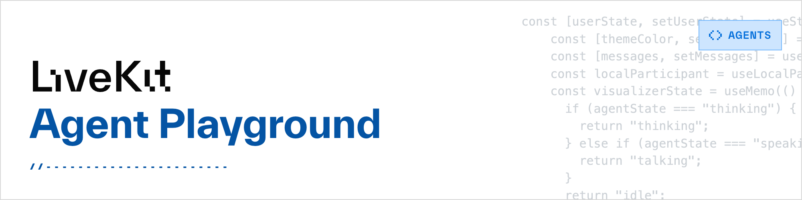

# Agents playground

> 用於測試您的多模態 AI 代理程式的虛擬工作台。

## Overview

LiveKit Agents 遊樂場是一個多功能的 Web 前端，可讓您輕鬆測試多模態 AI 代理，而無需擔心 UI，直到您對 AI 滿意為止。

要使用遊樂場，您首先需要有一個在 `dev` 或 `start` 模式下運行的代理程式。如果您還沒有這樣做，請先按照 [Voice AI 快速入門](./voice-ai.md) 進行操作。

| Feature | Notes |
|---------|-------|
| Audio | 帶可視化器的麥克風輸入和揚聲器輸出 |
| Text | 即時轉錄和聊天輸入 |
| Video | 即時網路攝影機輸入、即時輸出 |

## Links

按照這些連結開始使用遊樂場。

- **[Hosted playground](https://agents-playground.livekit.io)**: 與 LiveKit Cloud 無縫整合的託管遊樂場。

- **[Source code](https://github.com/livekit/agents-playground/)**: 自己運行遊樂場或將其用作您自己的應用程式的起點。


### Locally run playground

Agents Playground 主要在幫助那些使用 LiveKit Agents Framework 建置的伺服器端代理程式快速進行原型設計。輕鬆利用 LiveKit WebRTC 會話並處理或產生音訊、視訊和資料流。該遊樂場包括透過視訊、音訊和聊天與任何 LiveKit 代理進行充分互動的組件。



- [Livekit Playground 源碼](https://github.com/livekit/agents-playground/)

#### Running LiveKit locally

本地運行 LiveKit:

1. Install LiveKit Server

    ```bash
    curl -sSL https://get.livekit.io | bash
    ```

2. Start the server in dev mode 

    您可以透過執行以下命令以開發模式啟動 LiveKit：

    ```bash
    livekit-server --dev
    ```

    這將使用以下 API 金鑰/秘密對啟動一個實例：

    ```bash
    API key: devkey
    API secret: secret
    ```

    若要自訂您的生產設置，請參閱[部署指南](https://docs.livekit.io/home/self-hosting/deployment/)。

    !!! info
        預設情況下，LiveKit 的訊號伺服器綁定到 `127.0.0.1:7880`。如果您想從網路上的其他裝置存取它，請傳入`--bind 0.0.0.0`

#### Running Agent playground

1. 下載 NodeJS 和 pnpm

    ```bash
    # Download and install nvm:
    curl -o- https://raw.githubusercontent.com/nvm-sh/nvm/v0.40.3/install.sh | bash

    # in lieu of restarting the shell
    \. "$HOME/.nvm/nvm.sh"

    # Download and install Node.js:
    nvm install 24

    # Verify the Node.js version:
    node -v # Should print "v24.1.0".
    nvm current # Should print "v24.1.0".

    # Download and install pnpm:
    corepack enable pnpm

    # Verify pnpm version:
    pnpm -v
    ```

2. 複製下載 playgound source

    ```bash
    https://github.com/livekit/agents-playground.git
    ```

3. 更改資料夾

    ```bash
    cd agents-playground
    ```

4. 安裝依賴項

    ```bash
    npm install
    ```

5. 將 `.env.example` 檔案複製並重新命名為 `.env.local`，並填寫必要的環境變數。

    ```bash
    LIVEKIT_API_KEY=<your API KEY>
    LIVEKIT_API_SECRET=<Your API Secret>
    NEXT_PUBLIC_LIVEKIT_URL=wss://<Your Cloud URL>
    ```

    > 根據 Livekit Server 的實例 (Cloud or Self-hosted) 來修改上述的環境變數

6. 運行開發伺服器

    ```bash
    npm run dev
    ```

7. 使用瀏覽器開啟 `http://localhost:3000` 查看結果。
8. 啟動您的代理程式（使用與步驟 5 相同的專案變數）。
9. 連接到一個 livekit 房間並查看你的代理連接到遊樂場
