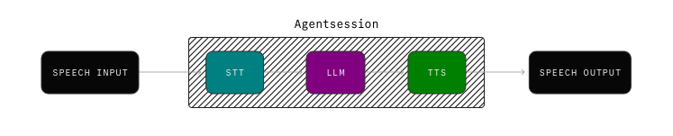
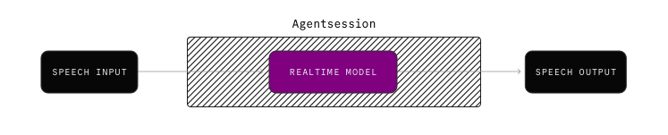
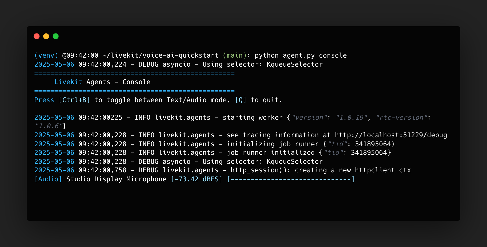
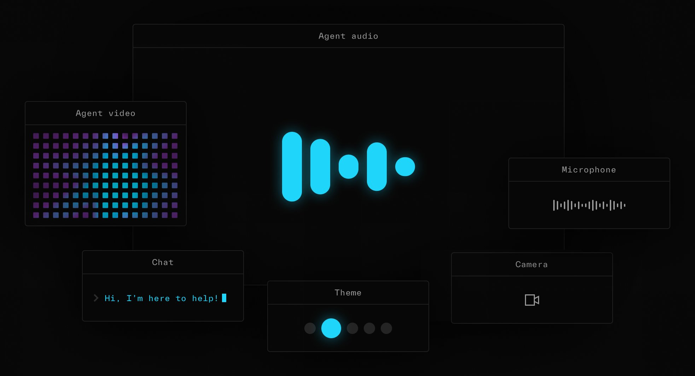

# Voice AI quickstart

> 在不到 10 分鐘的時間內使用 Python 建立一個簡單的語音助理。

## Overview

本指南將引導您使用 LiveKit Agents for Python 設定您的第一個語音助理。不到 10 分鐘，您將擁有一個可以在終端機、瀏覽器、電話或本機應用程式中與其對話的語音助理。

## Requirements

以下部分介紹了開始使用 LiveKit Agents 的最低要求。

### Python

LiveKit Agents 需要 Python 3.9 或更高版本。

### LiveKit server

您需要一個 LiveKit 伺服器實例來在使用者和代理之間傳輸即時媒體。最簡單的開始方式是使用免費的 [LiveKit Cloud](https://cloud.livekit.io/) 帳戶。建立一個專案並按照以下步驟使用 API 金鑰。如果您願意，您也可以[自行託管 LiveKit](../../home/self-hosting/local.md)。

您可以透過執行以下命令以開發模式啟動 LiveKit：

```text
livekit-server --dev --bind 0.0.0.0
```

### AI providers

LiveKit Agents [可與大多數 AI 模型供應商整合](https://docs.livekit.io/agents/integrations.md)，並支援高效能 `STT-LLM-TTS` 語音管道以及逼真的多模態模型。

本指南的其餘部分假設您使用以下兩個入門套件之一，它們提供了價值、功能和易於設定的最佳組合。


=== "STT-LLM-TTS pipeline"

    您的代理將三個專業服務提供者串聯成一個高效能語音管道。您需要每個帳戶和 API 金鑰。

    

    | Component | Provider | Required Key | Alternatives |
    |-----------|----------|--------------|--------------|
    | STT | [Deepgram](https://deepgram.com/) | `DEEPGRAM_API_KEY` | [STT integrations](https://docs.livekit.io/agents/integrations/stt.md#providers) |
    | LLM | [OpenAI](https://platform.openai.com/) | `OPENAI_API_KEY` | [LLM integrations](https://docs.livekit.io/agents/integrations/llm.md#providers) |
    | TTS | [Cartesia](https://cartesia.ai) | `CARTESIA_API_KEY` | [TTS integrations](https://docs.livekit.io/agents/integrations/tts.md#providers) |

=== "Realtime model"

    您的代理可使用單一即時模型來提供富有表現力和逼真的語音體驗。

    

    | Component | Provider | Required Key | Alternatives |
    |-----------|----------|--------------|--------------|
    | Realtime model | [OpenAI](https://platform.openai.com/docs/guides/realtime) | `OPENAI_API_KEY` | [Realtime models](https://docs.livekit.io/agents/integrations/realtime.md#providers) |

## Setup

使用以下部分中的說明來設定您的新專案。

### Packages

!!! info
    **Noise cancellation**

    此範例整合了 LiveKit Cloud [增強的背景語音/噪音消除](https://docs.livekit.io/home/cloud/noise-cancellation.md)，並由 Krisp 提供支援。

    如果您不使用 LiveKit Cloud，請從下列程式碼中省略外掛程式和 `noise_cancellation` 參數。
    對於電話應用程序，使用 `BVCTelephony` 模型可獲得最佳效果。


=== "STT-LLM-TTS pipeline"

    安裝以下套件包，使用 `STT-LLM-TTS` 管道、噪音消除和[語音轉折檢測](https://docs.livekit.io/agents/build/turns.md)構建完整的語音 AI 代理：


    ```shell
    pip install \
        "livekit-agents[deepgram,openai,cartesia,silero,turn-detector]~=1.0" \
        "livekit-plugins-noise-cancellation~=0.2" \
        "python-dotenv"

    ```

=== "Realtime model"

    安裝以下軟體套件包以使用即時模型和噪音消除功能建立完整的語音 AI 代理。

    ```shell
    pip install \
        "livekit-agents[openai]~=1.0" \
        "livekit-plugins-noise-cancellation~=0.2" \
        "python-dotenv"

    ```

### Environment variables

建立一個名為 `.env` 的檔案並新增您的 LiveKit 憑證以及您的 AI 提供者所需的 API 金鑰。

=== "STT-LLM-TTS pipeline(Mixed)"

    - 檔案名稱: `.env`

    ```shell
    DEEPGRAM_API_KEY=<Your Deepgram API Key>
    OPENAI_API_KEY=<Your OpenAI API Key>
    CARTESIA_API_KEY=<Your Cartesia API Key>
    LIVEKIT_API_KEY=%{apiKey}%
    LIVEKIT_API_SECRET=%{apiSecret}%
    LIVEKIT_URL=%{wsURL}%

    ```

=== "STT-LLM-TTS pipeline(OpenAI)"

    - 檔案名稱: `.env`

    ```shell    
    OPENAI_API_KEY=<Your OpenAI API Key>
    LIVEKIT_API_KEY=%{apiKey}%
    LIVEKIT_API_SECRET=%{apiSecret}%
    LIVEKIT_URL=%{wsURL}%

    ```

=== "Realtime model"

    - 檔案名稱: `.env`

    ```shell
    OPENAI_API_KEY=<Your OpenAI API Key>
    LIVEKIT_API_KEY=%{apiKey}%
    LIVEKIT_API_SECRET=%{apiSecret}%
    LIVEKIT_URL=%{wsURL}%

    ```

### Agent code

為您的第一個語音代理創建一個名為 `agent.py` 的文件，其中包含以下程式碼。

=== "STT-LLM-TTS pipeline(Mixed)"

    - Filename: `agent.py`

    ```python
    from dotenv import load_dotenv

    from livekit import agents
    from livekit.agents import AgentSession, Agent, RoomInputOptions
    from livekit.plugins import (
        openai,
        cartesia,
        deepgram,
        noise_cancellation,
        silero,
    )
    from livekit.plugins.turn_detector.multilingual import MultilingualModel

    # 載入環境變數
    load_dotenv()

    # 構建一個 VoiceAssistant
    class Assistant(Agent):
        def __init__(self) -> None:
            super().__init__(instructions="You are a helpful voice AI assistant.")

    # 定義 VoiceAssistant 的進入點
    async def entrypoint(ctx: agents.JobContext):
        # 連接至 LiveKit Server
        await ctx.connect()

        # 構建一個 AgentSession
        session = AgentSession(
            stt=deepgram.STT(model="nova-3", language="multi"), # 定義 Sound to Text
            llm=openai.LLM(model="gpt-4o-mini"), # 定義 LLM
            tts=cartesia.TTS(), # 定義 Text to Sound
            vad=silero.VAD.load(), # 定義 Voice Activity Detection
            turn_detection=MultilingualModel(),
        )

        # 啟動 AgentSession
        await session.start(
            room=ctx.room, # 連接至 LiveKit 房間
            agent=Assistant(), # 要使用的 VoiceAgent 實例
            room_input_options=RoomInputOptions(
                # LiveKit Cloud enhanced noise cancellation
                # - If self-hosting, omit this parameter
                # - For telephony applications, use `BVCTelephony` for best results
                noise_cancellation=noise_cancellation.BVC(), 
            ),
        )        

        # 當 AgentSession 連接至 LiveKit 房間後就跟 participant 打招呼
        await session.generate_reply(
            instructions="Greet the user and offer your assistance."
        )


    if __name__ == "__main__":
        agents.cli.run_app(agents.WorkerOptions(entrypoint_fnc=entrypoint))


    ```

=== "STT-LLM-TTS pipeline(OpenAI)"

    - Filename: `agent.py`

    ```python
    from dotenv import load_dotenv

    from livekit import agents
    from livekit.agents import AgentSession, Agent, RoomInputOptions
    from livekit.plugins import (
        openai,
        silero,
    )
    from livekit.plugins.turn_detector.multilingual import MultilingualModel

    # 載入環境變數
    load_dotenv()

    # 構建一個 VoiceAssistant
    class Assistant(Agent):
        def __init__(self) -> None:
            super().__init__(instructions="You are a helpful voice AI assistant.")

    # 定義 VoiceAssistant 的進入點
    async def entrypoint(ctx: agents.JobContext):
        # 連接至 LiveKit Server
        await ctx.connect()

        # 構建一個 AgentSession
        session = AgentSession(
            stt=openai.STT(model="whisper-1"), # 定義 Sound to Text
            llm=openai.LLM(model="gpt-4o-mini"), # 定義 LLM
            tts=openai.TTS(model="tts-1", voice="coral"), # 定義 Text to Sound
            vad=silero.VAD.load(), # 定義 Voice Activity Detection
            turn_detection=MultilingualModel(),
        )

        # 啟動 AgentSession
        await session.start(
            room=ctx.room, # 連接至 LiveKit 房間
            agent=Assistant(), # 要使用的 VoiceAgent 實例
        )        

        # 當 AgentSession 連接至 LiveKit 房間後就跟 participant 打招呼
        await session.generate_reply(
            instructions="Greet the user and offer your assistance."
        )


    if __name__ == "__main__":
        agents.cli.run_app(agents.WorkerOptions(entrypoint_fnc=entrypoint))


    ```

=== "Realtime model"

    - Filename: `agent.py`

    ```python
    from dotenv import load_dotenv

    from livekit import agents
    from livekit.agents import AgentSession, Agent, RoomInputOptions
    from livekit.plugins import (
        openai,
        noise_cancellation,
    )

    # 載入環境變數
    load_dotenv()

    # 構建一個 VoiceAssistant
    class Assistant(Agent):
        def __init__(self) -> None:
            super().__init__(instructions="You are a helpful voice AI assistant.")

    # 定義 VoiceAssistant 的進入點
    async def entrypoint(ctx: agents.JobContext):
        # 連接至 LiveKit Server
        await ctx.connect()

        # 構建一個 AgentSession
        session = AgentSession(
            llm=openai.realtime.RealtimeModel(
                voice="coral"
            )
        )

        # 啟動 AgentSession
        await session.start(
            room=ctx.room,
            agent=Assistant(),
            room_input_options=RoomInputOptions(
                # LiveKit Cloud enhanced noise cancellation
                # - If self-hosting, omit this parameter
                # - For telephony applications, use `BVCTelephony` for best results
                noise_cancellation=noise_cancellation.BVC(),
            ),
        )

        
        # 當 AgentSession 連接至 LiveKit 房間後就跟 participant 打招呼
        await session.generate_reply(
            instructions="Greet the user and offer your assistance."
        )


    if __name__ == "__main__":
        agents.cli.run_app(agents.WorkerOptions(entrypoint_fnc=entrypoint))


    ```

## Download model files

要使用 `turn-detector`, `silero` 或 `noise-cancellation` 插件，首先需要下載模型檔：

```shell
python agent.py download-files
```

## Speak to your agent

在 `console` 模式下啟動您的代理程式以在您的 terminal 運行：


```shell
python agent.py console

```

您的代理在 terminal 與您交談，您也可以與其交談。




## Connect to playground

以 `dev` 模式啟動您的代理，將其連接到 LiveKit 並使其可從互聯網上的任何地方使用：

```shell
python agent.py dev

```

使用 [Agents playground](./playground.md) 與您的代理程式對話並探索其全部多模態功能。



恭喜，您的代理程式已啟動並運行。在建置和測試代理程式時繼續使用 playground 或 `console` 模式。

!!! info
    **Agent CLI modes**

    在 `console` 模式下，代理程式在本機上運行，並且僅在您的 terminal 可用。

    在 `dev`（開發/偵錯）或 `start`（生產）模式下執行您的代理程式以連接到 LiveKit 並加入房間。

## Next steps

按照這些指南，讓您的語音 AI 應用在現實世界中。

- **[Web and mobile frontends](https://docs.livekit.io/agents/start/frontend.md)**: Put your agent in your pocket with a custom web or mobile app.

- **[Telephony integration](https://docs.livekit.io/agents/start/telephony.md)**: Your agent can place and receive calls with LiveKit's SIP integration.

- **[Building voice agents](https://docs.livekit.io/agents/build.md)**: Comprehensive documentation to build advanced voice AI apps with LiveKit.

- **[Worker lifecycle](https://docs.livekit.io/agents/worker.md)**: Learn how to manage your agents with workers and jobs.

- **[Deploying to production](https://docs.livekit.io/agents/ops/deployment.md)**: Guide to deploying your voice agent in a production environment.

- **[Integration guides](https://docs.livekit.io/agents/integrations.md)**: Explore the full list of AI providers available for LiveKit Agents.

- **[Recipes](https://docs.livekit.io/recipes.md)**: A comprehensive collection of examples, guides, and recipes for LiveKit Agents.