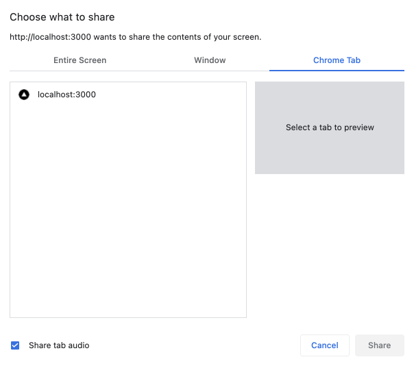

# Screen sharing

> 使用 LiveKit 發佈您的螢幕。

## Overview

LiveKit 原生支援所有平台的螢幕分享。您的螢幕將作為視訊軌道發布，就像您的相機一樣。一些平台也支援本地音訊共享。

每個平台的步驟略有不同：

=== "JavaScript"

    ```typescript
    // The browser will prompt the user for access and offer a choice of screen, window, or tab 
    await room.localParticipant.setScreenShareEnabled(true);

    ```

=== "Swift"

    在 iOS 上，LiveKit 透過兩種模式與 ReplayKit 整合：

    1. **In-app capture (default)**: 用於在您的應用程式內分享內容
    2. **Broadcast capture**: 即使用戶切換到其他應用程式時也能分享螢幕內容

#### In-app capture

預設的應用程式內捕獲模式不需要額外的配置，但僅共用目前應用程式。

```swift
localParticipant.setScreenShare(enabled: true)

```

#### Broadcast capture

要在您的應用程式在背景運行時共享全屏，您需要設定廣播擴展。這將允許用戶 `Start Broadcast`。您可以從您的應用程式中提示這一點，或者使用者可以從控制中心啟動它。

完整步驟已在我們的 [iOS 畫面分享指南](https://github.com/livekit/client-sdk-swift/blob/main/Docs/ios-screen-sharing.md) 中描述，摘要如下：

1. Add a new "Broadcast Upload Extension" target with the bundle identifier `<your-app-bundle-identifier>.broadcast`.
2. Replace the default `SampleHandler.swift` with the following:

```swift
import LiveKit

#if os(iOS)
@available(macCatalyst 13.1, *)
class SampleHandler: LKSampleHandler {
    override var enableLogging: Bool { true }
}
#endif

```

1. Add both your main app and broadcast extension to a common App Group, named `group.<your-app-bundle-identifier>`.
2. Present the broadcast dialog from your app:

```swift
localParticipant.setScreenShare(enabled: true)

```

=== "Android"

    在 Android 上，螢幕擷取是使用 `MediaProjectionManager` 執行的：

    ```kotlin
    // Create an intent launcher for screen capture
    // This *must* be registered prior to onCreate(), ideally as an instance val
    val screenCaptureIntentLauncher = registerForActivityResult(
        ActivityResultContracts.StartActivityForResult()
    ) { result ->
        val resultCode = result.resultCode
        val data = result.data
        if (resultCode != Activity.RESULT_OK || data == null) {
            return@registerForActivityResult
        }
        lifecycleScope.launch {
            room.localParticipant.setScreenShareEnabled(true, data)
        }
    }

    // When it's time to enable the screen share, perform the following
    val mediaProjectionManager =
        getSystemService(MEDIA_PROJECTION_SERVICE) as MediaProjectionManager
    screenCaptureIntentLauncher.launch(mediaProjectionManager.createScreenCaptureIntent())

    ```

=== "Flutter"

    ```dart
    room.localParticipant.setScreenShareEnabled(true);

    ```

    在 Android 上，您必須在 `AndroidManifest.xml` 中定義前台服務：

    ```xml
    <manifest xmlns:android="http://schemas.android.com/apk/res/android">
    <application>
        ...
        <service
            android:name="de.julianassmann.flutter_background.IsolateHolderService"
            android:enabled="true"
            android:exported="false"
            android:foregroundServiceType="mediaProjection" />
    </application>
    </manifest>

    ```

    在 iOS 上，依照[本指南](https://github.com/flutter-webrtc/flutter-webrtc/wiki/iOS-Screen-Sharing#broadcast-extension-quick-setup)設定廣播擴充。


=== "Unity (WebGL)"

    ```csharp
    yield return currentRoom.LocalParticipant.SetScreenShareEnabled(true);

    ```

## Sharing browser audio

!!! info
    僅在某些瀏覽器中可以共享音訊。請在 [MDN 相容性表](https://developer.mozilla.org/en-US/docs/Web/API/Screen_Capture_API/Using_Screen_Capture#browser_compatibility) 檢查瀏覽器支援情況。

若要從瀏覽器標籤共用音頻，您可以使用啟用音訊選項的 `createScreenTracks` 方法：

```js
const tracks = await localParticipant.createScreenTracks({
  audio: true,
});

tracks.forEach((track) => {
  localParticipant.publishTrack(track);
});

```

### Testing audio sharing

#### Publisher

共享音頻時，請確保選擇 **Browser Tab**（而不是視窗）和 ☑️ 共享選項卡音頻，否則在調用 `createScreenTracks` 時不會產生音軌：



#### Subscriber

在接收端，您可以使用 [`RoomAudioRenderer`](https://github.com/livekit/components-js/blob/main/packages/react/src/components/RoomAudioRenderer.tsx) 自動播放房間的所有音軌，或使用[`AudioTrack`](https://github.com/livekit/components-js/blob/main/packages/react/src/components/participant/AudioTrack.tsx) 或您自己的自訂 `<audio>` 標籤將音軌新增至頁面。如果您聽不到任何聲音，請檢查您是否從伺服器接收了曲目：


=== "JavaScript"

    ```javascript
    room.getParticipantByIdentity('<participant_id>').getTrackPublication('screen_share_audio');

    ```
