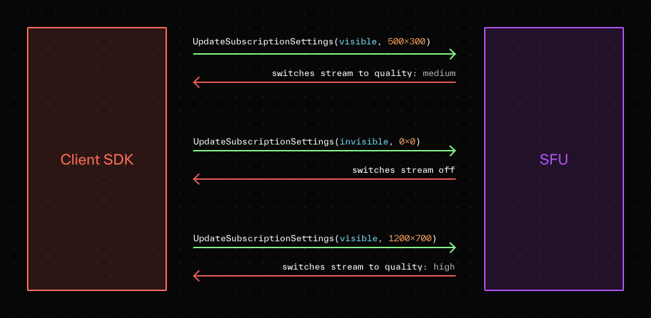

# Subscribing to tracks

> 在您的應用程式中播放和渲染即時媒體軌道。

## Overview

連接到房間後，參與者可以接收和渲染發佈到該房間的任何軌道。當啟用 `autoSubscribe`（預設）時，伺服器會自動向參與者提供新的軌道，使其準備好進行渲染。

## Track subscription

渲染媒體軌道從訂閱開始，以從伺服器接收軌道資料。

如[房間、參與者和軌道](https://docs.livekit.io/home/get-started/api-primitives.md)指南中所述，LiveKit 使用兩種結構來模擬軌道： `TrackPublication` 和 `Track`。將 `TrackPublication` 視為在伺服器上註冊的軌道的元數據，將 `Track` 視為原始媒體串流。即使未訂閱該曲目，用戶端也始終可以獲得軌道出版物。

追蹤訂閱回調為您的應用程式提供 `Track` 和 `TrackPublication` 物件。

訂閱的回呼將在 `Room` 和 `RemoteParticipant` 物件上觸發。

=== "JavaScript"

    ```typescript
    import { connect, RoomEvent } from 'livekit-client';

    room.on(RoomEvent.TrackSubscribed, handleTrackSubscribed);

    function handleTrackSubscribed(
        track: RemoteTrack,
        publication: RemoteTrackPublication,
        participant: RemoteParticipant,
    ) {
    /* Do things with track, publication or participant */
    }
    ```

=== "React"

    ```typescript
    import { useTracks } from '@livekit/components-react';

    export const MyPage = () => {
    return (
        <LiveKitRoom ...>
        <MyComponent />
        </LiveKitRoom>
    )
    }

    export const MyComponent = () => {
    const cameraTracks = useTracks([Track.Source.Camera], {onlySubscribed: true});
    return (
        <>
        {cameraTracks.map((trackReference) => {
            return (
            <VideoTrack {...trackReference} />
            )
        })}
        </>
    )
    }

    ```

=== "Swift"

    ```swift
    let room = LiveKit.connect(options: ConnectOptions(url: url, token: token), delegate: self)
    ...
    func room(_ room: Room,
                participant: RemoteParticipant,
                didSubscribe publication: RemoteTrackPublication,
                track: Track) {

        /* Do things with track, publication or participant */
    }

    ```

=== "Android"

    ```kotlin
    coroutineScope.launch {
        room.events.collect { event ->
            when(event) {
                is RoomEvent.TrackSubscribed -> {
                    /* Do things with track, publication or participant */
            }
                else -> {}
            }
        }
    }

    ```

=== "Flutter"

    ```dart
    class ParticipantWidget extends StatefulWidget {
    final Participant participant;

    ParticipantWidget(this.participant);

    @override
    State<StatefulWidget> createState() {
            return _ParticipantState();
        }
    }

    class _ParticipantState extends State<ParticipantWidget> {
    TrackPublication? videoPub;

    @override
    void initState() {
        super.initState();
        // When track subscriptions change, Participant notifies listeners
        // Uses the built-in ChangeNotifier API
        widget.participant.addListener(_onChange);
    }

    @override
    void dispose() {
        super.dispose();
        widget.participant.removeListener(_onChange);
    }

    void _onChange() {
        TrackPublication? pub;
        var visibleVideos = widget.participant.videoTracks.values.where((pub) {
        return pub.kind == TrackType.VIDEO && pub.subscribed && !pub.muted;
        });
        if (visibleVideos.isNotEmpty) {
        pub = visibleVideos.first;
        }
        // setState will trigger a build
        setState(() {
        // Your updates here
        videoPub = pub;
        });
    }

    @override
    Widget build(BuildContext context) {
        // Your build function
    }
    }

    ```

=== "Python"

    ```python
    @room.on("track_subscribed")
    def on_track_subscribed(track: rtc.Track, publication: rtc.RemoteTrackPublication, participant: rtc.RemoteParticipant):
        if track.kind == rtc.TrackKind.KIND_VIDEO:
            video_stream = rtc.VideoStream(track)
            async for frame in video_stream:
                # Received a video frame from the track, process it here
                pass
            await video_stream.aclose()

    ```

=== "Rust"

    ```rust
    while let Some(msg) = rx.recv().await {
        #[allow(clippy::single_match)]
        match msg {
            RoomEvent::TrackSubscribed {
                track,
                publication: _,
                participant: _,
            } => {
                if let RemoteTrack::Audio(audio_track) = track {
                    let rtc_track = audio_track.rtc_track();
                    let mut audio_stream = NativeAudioStream::new(rtc_track);
                    while let Some(frame) = audio_stream.next().await {
                        // do something with audio frame
                    }
                    break;
                }
            }
            _ => {}
        }
    }

    ```

=== "Unity"

    ```csharp
    Room.TrackSubscribed += (track, publication, participant) =>
    {
        // Do things with track, publication or participant
    };

    ```

!!! info
    本指南重點介紹前端應用程式。若要在後端使用媒體，請使用 [LiveKit Agents 框架](https://docs.livekit.io/agents.md) 或適用於 [Go](https://github.com/livekit/server-sdk-go), [Rust](https://github.com/livekit/ [Node.js](https://github.com/livekit/node-sdks) 的 SDK。
    

## Media playback

訂閱音訊或視訊軌道後，即可在您的應用程式中播放

=== "JavaScript"

    ```typescript
    function handleTrackSubscribed(
    track: RemoteTrack,
    publication: RemoteTrackPublication,
    participant: RemoteParticipant,
    ) {
    // Attach track to a new HTMLVideoElement or HTMLAudioElement
    const element = track.attach();
    parentElement.appendChild(element);
    // Or attach to existing element
    // track.attach(element)
    }

    ```

=== "React"

    ```tsx
    export const MyComponent = ({ audioTrack, videoTrack }) => {
    return (
        <div>
        <VideoTrack trackRef={videoTrack} />
        <AudioTrack trackRef={audioTrack} />
        </div>
    );
    };

    ```

=== "React Native"

    訂閱軌道後，音訊播放將自動開始。影片播放需要使用 `VideoTrack` 組件：

    ```tsx
    export const MyComponent = ({ videoTrack }) => {
    return <VideoTrack trackRef={videoTrack} />;
    };

    ```

=== "Swift"

    訂閱軌道後，音訊播放將自動開始。影片播放需要 `VideoView` 元件：

    ```swift
    func room(_ room: Room,
            participant: RemoteParticipant,
            didSubscribe publication: RemoteTrackPublication,
            track: Track) {

    // Audio tracks are automatically played.
    if let videoTrack = track as? VideoTrack {
        DispatchQueue.main.async {
        // VideoView is compatible with both iOS and MacOS
        let videoView = VideoView(frame: .zero)
        videoView.translatesAutoresizingMaskIntoConstraints = false
        self.view.addSubview(videoView)

        /* Add any app-specific layout constraints */

        videoView.track = videoTrack
        }
    }
    }

    ```

=== "Android"

    訂閱軌道後，音訊播放將自動開始。影片播放需要 `VideoTrack` 元件：

    ```kotlin
    coroutineScope.launch {
    room.events.collect { event ->
        when(event) {
        is RoomEvent.TrackSubscribed -> {
            // Audio tracks are automatically played.
            val videoTrack = event.track as? VideoTrack ?: return@collect
            videoTrack.addRenderer(videoRenderer)
        }
        else -> {}
        }
    }
    }

    ```

=== "Flutter"

    訂閱軌道後，音訊播放將自動開始。影片播放需要 `VideoTrackRenderer` 元件：

    ```dart
    class _ParticipantState extends State<ParticipantWidget> {
    TrackPublication? videoPub;
    ...
    @override
    Widget build(BuildContext context) {
        // Audio tracks are automatically played.
        var videoPub = this.videoPub;
        if (videoPub != null) {
        return VideoTrackRenderer(videoPub.track as VideoTrack);
        } else {
        return Container(
            color: Colors.grey,
        );
        }
    }
    }

    ```

=== "Unity (WebGL)"

    訂閱軌道後，音訊播放將自動開始。影片播放需要 `HTMLVideoElement` 元件：

    ```csharp
    Room.TrackSubscribed += (track, publication, participant) =>
    {
        var element = track.Attach();

        if (element is HTMLVideoElement video)
        {
            video.VideoReceived += tex =>
            {
                // Do things with tex
            };
        }
    };

```

### Volume control

音軌支援 0 至 1.0 之間的音量，預設值為 1.0。如果需要，您可以透過設定軌道上的音量屬性來調整音量。

=== "JavaScript"

    ```typescript
    track.setVolume(0.5);

    ```

=== "Swift"

    ```swift
    track.volume = 0.5

    ```

=== "Android"

    ```kotlin
    track.setVolume(0.5)

    ```


=== "Flutter"

    ```dart
    track.setVolume(0.5)

    ```

## Active speaker identification

LiveKit 可以自動偵測正在發言的參與者，並在他們的發言狀態變更時發送更新。發言人更新資訊將發送給本地和遠端參與者。這些事件在 Room 和 Participant 物件上觸發，讓您可以在 UI 中識別活躍的發言者。

=== "JavaScript"

    ```typescript
    room.on(RoomEvent.ActiveSpeakersChanged, (speakers: Participant[]) => {
    // Speakers contain all of the current active speakers
    });

    participant.on(ParticipantEvent.IsSpeakingChanged, (speaking: boolean) => {
    console.log(
        `${participant.identity} is ${speaking ? 'now' : 'no longer'} speaking. audio level: ${participant.audioLevel}`,
    );
    });

    ```

=== "React"

    ```tsx
    export const MyComponent = ({ participant }) => {
    const { isSpeaking } = useParticipant(participant);

    return <div>{isSpeaking ? 'speaking' : 'not speaking'}</div>;
    };

    ```

=== "React Native"

    ```tsx
    export const MyComponent = ({ participant }) => {
    const { isSpeaking } = useParticipant(participant);

    return <Text>{isSpeaking ? 'speaking' : 'not speaking'}</Text>;
    };

    ```

=== "Swift"

    ```swift
    extension MyRoomHandler : RoomDelegate {
    func activeSpeakersDidChange(speakers: [Participant], room _: Room) {
        // Do something with the active speakers
    }
    }

    extension ParticipantHandler : ParticipantDelegate {
    /// The isSpeaking status of the participant has changed
    func isSpeakingDidChange(participant: Participant) {
        print("\(participant.identity) is now speaking: \(participant.isSpeaking), audioLevel: \(participant.audioLevel)")
    }
    }

    ```

=== "Android"

    ```kotlin
    coroutineScope.launch {
    room::activeSpeakers.flow.collect { currentActiveSpeakers ->
        // Manage speaker changes across the room
    }
    }

    coroutineScope.launch {
    remoteParticipant::isSpeaking.flow.collect { isSpeaking ->
        // Handle a certain participant speaker status change
    }
    }

    ```

=== "Flutter"

    ```dart
    class _ParticipantState extends State<ParticipantWidget> {
    late final _listener = widget.participant.createListener()

    @override
    void initState() {
        super.initState();
        _listener.on<SpeakingChangedEvent>((e) {
        // Handle isSpeaking change
        })
    }
    }

    ```

=== "Unity (WebGL)"

    ```csharp
    Room.ActiveSpeakersChanged += speakers =>
    {
        // Do something with the active speakers
    };

    participant.IsSpeakingChanged += speaking =>
    {
        Debug.Log($"{participant.Identity} is {(speaking ? "now" : "no longer")} speaking. Audio level {participant.AudioLevel}");
    };

    ```

## Selective subscription

停用 `autoSubscribe` 以手動控制參與者應訂閱的軌道。這適用於空間應用和/或需要精確控制每個參與者接收內容的應用。

LiveKit 的 SDK 和伺服器 API 均具有選擇性訂閱的控制項。配置完成後，只有明確訂閱的軌道才會傳送給參與者。

### From frontend

=== "JavaScript"

    ```typescript
    let room = await room.connect(url, token, {
    autoSubscribe: false,
    });

    room.on(RoomEvent.TrackPublished, (publication, participant) => {
    publication.setSubscribed(true);
    });

    // Also subscribe to tracks published before participant joined
    room.remoteParticipants.forEach((participant) => {
    participant.trackPublications.forEach((publication) => {
        publication.setSubscribed(true);
    });
    });

    ```

=== "Swift"

    ```swift
    let connectOptions = ConnectOptions(
    url: "ws://<your_host>",
    token: "<your_token>",
    autoSubscribe: false
    )
    let room = LiveKit.connect(options: connectOptions, delegate: self)

    func didPublishRemoteTrack(publication: RemoteTrackPublication, participant: RemoteParticipant) {
        publication.set(subscribed: true)
    }

    // Also subscribe to tracks published before participant joined
    for participant in roomCtx.room.room.remoteParticipants {
        for publication in participant.tracks {
            publication.set(subscribed: true)
        }
    }

    ```

=== "Android"

    ```kotlin
    class ViewModel(...) {
    suspend fun connect() {
        val room = LiveKit.create(appContext = application)
        room.connect(
            url = url,
            token = token,
            options = ConnectOptions(autoSubscribe = false)
        )

        // Also subscribe to tracks published before participant joined
        for (participant in room.remoteParticipants.values) {
        for (publication in participant.trackPublications.values) {
            val remotePub = publication as RemoteTrackPublication
            remotePub.setSubscribed(true)
        }
        }
        viewModelScope.launch {
        room.events.collect { event ->
            if(event is RoomEvent.TrackPublished) {
            val remotePub = event.publication as RemoteTrackPublication
            remotePub.setSubscribed(true)
            }
        }
        }
    }
    }

    ```

=== "Flutter"

    ```dart
    const roomOptions = RoomOptions(
        adaptiveStream: true,
        dynacast: true);
    const connectOptions = ConnectOptions(
        autoSubscribe: false);

    final room = Room();
    await room.connect(url, token, connectOptions: connectOptions, roomOptions: roomOptions);
    // If necessary, we can listen to room events here
    final listener = room.createListener();

    class RoomHandler {
    Room room;
    late EventsListener<RoomEvent> _listener;

    RoomHandler(this.room) {
        _listener = room.createListener();
        _listener.on<TrackPublishedEvent>((e) {
        unawaited(e.publication.subscribe());
        });

        // Also subscribe to tracks published before participant joined
        for (RemoteParticipant participant in room.remoteParticipants.values) {
        for (RemoteTrackPublication publication
            in participant.trackPublications.values) {
            unawaited(publication.subscribe());
        }
        }
    }
    }

    ```

=== "Python"

    ```python
    @room.on("track_published")
        def on_track_published(
            publication: rtc.RemoteTrackPublication, participant: rtc.RemoteParticipant
        ):
            publication.set_subscribed(True)

    await room.connect(url, token, rtc.RoomOptions(auto_subscribe=False))

    # Also subscribe to tracks published before participant joined
    for p in room.remote_participants.values():
    for pub in p.track_publications.values():
        pub.set_subscribed(True)

    ```

=== "Unity (WebGL)"

    ```csharp
    yield return room.Connect(url, token, new RoomConnectOptions()
    {
        AutoSubscribe = false
    });

    room.TrackPublished += (publication, participant) =>
    {
        publication.SetSubscribed(true);
    };

    ```

### From server API

這些控制項也可透過伺服器 API 使用。

=== "Node.js"

    ```typescript
    import { RoomServiceClient } from 'livekit-server-sdk';

    const roomServiceClient = new RoomServiceClient('myhost', 'api-key', 'my secret');

    // Subscribe to new track
    roomServiceClient.updateSubscriptions('myroom', 'receiving-participant-identity', ['TR_TRACKID'], true);

    // Unsubscribe from existing track
    roomServiceClient.updateSubscriptions('myroom', 'receiving-participant-identity', ['TR_TRACKID'], false);

    ```

=== "Go"

    ```go
    import (
    lksdk "github.com/livekit/server-sdk-go"
    )

    roomServiceClient := lksdk.NewRoomServiceClient(host, apiKey, apiSecret)
    _, err := roomServiceClient.UpdateSubscriptions(context.Background(), &livekit.UpdateSubscriptionsRequest{
    Room: "myroom",
    Identity: "receiving-participant-identity",
    TrackSids: []string{"TR_TRACKID"},
    Subscribe: true
    })

    ```

## Adaptive stream

在應用程式中，渲染軌道的視訊元素可能大小不同，有時甚至被隱藏。取得高解析度影片但僅將其渲染在 150x150 的盒子中會非常浪費。

自適應串流允許開發人員建立動態視訊應用程序，而無需擔心介面設計或​​用戶互動如何影響視訊品質。它允許我們獲取高品質渲染所需的最少位數，並有助於擴展到非常大的會話。

當啟用自適應流時，LiveKit SDK 將監視軌道所附加的 UI 元素的大小和可見性。然後它將自動與伺服器協調，以確保發回與 UI 元素最匹配的同步廣播層。如果元素被隱藏，SDK 將自動暫停伺服器端的相關軌道，直到元素變得可見。

!!! info
    使用 JS SDK，必須使用 `Track.attach()` 才能使 adaptive stream 有效。



## Enabling/disabling tracks

尋求細粒度控制的實作可以自行決定啟用或停用軌道。這可用於實現用戶端靜音。（例如，將房間中的發布者靜音，但僅限於目前使用者）。

停用後，參與者將不會收到該軌道的任何新數據。如果隨後啟用已停用的軌道，則會再次接收新資料。

當優化參與者的頻寬消耗時，`disable` 操作很有用。例如，如果特定使用者的視訊軌道不在螢幕上，則停用該軌道將減少 LiveKit 伺服器發送的位元組數，直到再次需要該軌道的資料。

=== "JavaScript"

    ```typescript
    import { connect, RoomEvent } from 'livekit-client';

    room.on(RoomEvent.TrackSubscribed, handleTrackSubscribed);

    function handleTrackSubscribed(
    track: RemoteTrack,
    publication: RemoteTrackPublication,
    participant: RemoteParticipant,
    ) {
    publication.setEnabled(false);
    }

    ```

=== "Swift"

    ```swift
    let room = LiveKit.connect(options: ConnectOptions(url: url, token: token), delegate: self)
    ...
    func room(_ room: Room,
            participant: RemoteParticipant,
            didSubscribe publication: RemoteTrackPublication,
            track: Track) {

    publication.setEnabled(false)
    }

    ```

=== "Android"

    ```kotlin
    coroutineScope.launch {
    room.events.collect { event ->
        when(event) {
        is RoomEvent.TrackSubscribed -> {
            event.publication.setEnabled(false)
        }
        else -> {}
        }
    }
    }

    ```

=== "Flutter"

    ```dart
    void disableTrack(RemoteTrackPublication publication) {
    publication.enabled = false;
    }

    ```

=== "Unity (WebGL)"

    ```csharp
    room.TrackSubscribed += (track, publication, participant) =>
    {
        publication.SetEnabled(false);
    };

    ```

!!! info
    您可能想知道 `subscribe` 和 `unsubscribe` 與 `enable` 和 `disable` 有何不同。一個軌道必須被訂閱並啟用，參與者才能接收資料。如果某個軌道尚未被訂閱（或已取消訂閱）或已停用，則執行這些操作的參與者將不會收到該軌道的資料。

    這兩個行動之間的差別在於 `negotiation`。訂閱(subscribe)需要與 LiveKit 伺服器進行協商握手，而啟用(enable)/停用(disable)則不需要。根據個人的使用情況，這可以使啟用(enable)/停用(disable)更有效率，特別是當軌道可能頻繁打開或關閉時。

## Simulcast controls

如果視訊軌道啟用了同步廣播，接收參與者可能需要手動指定最大可接收品質。這會導致目標軌道的品質和頻寬降低。例如，當應用程式的使用者介面顯示特定使用者的視訊軌道的小縮圖時，這可能會派上用場。

=== "JavaScript"

    ```typescript
    import { connect, RoomEvent } from 'livekit-client';

    connect('ws://your_host', token, {
    audio: true,
    video: true,
    }).then((room) => {
    room.on(RoomEvent.TrackSubscribed, handleTrackSubscribed);
    });

    function handleTrackSubscribed(
    track: RemoteTrack,
    publication: RemoteTrackPublication,
    participant: RemoteParticipant,
    ) {
    if (track.kind === Track.Kind.Video) {
        publication.setVideoQuality(VideoQuality.LOW);
    }
    }

    ```

=== "Swift"

    ```swift
    let room = LiveKit.connect(url, token, delegate: self)
    ...
    func room(_ room: Room,
            participant: RemoteParticipant,
            didSubscribe publication: RemoteTrackPublication,
            track: Track) {

    if let _ = track as? VideoTrack {
        publication.setVideoQuality(.low)
    }
    }

    ```

=== "Android"

    ```kotlin
    coroutineScope.launch {
    room.events.collect { event ->
        when(event) {
        is RoomEvent.TrackSubscribed -> {
            event.publication.setVideoQuality(VideoQuality.LOW)
        }
        else -> {}
        }
    }
    }

    ```

=== "Flutter"

    ```dart
    var listener = room.createListener();
    listener.on<TrackSubscribedEvent>((e) {
    if (e.publication.kind == TrackType.VIDEO) {
        e.publication.videoQuality = VideoQuality.LOW;
    }
    })

    ```


=== "Unity (WebGL)"

    ```csharp
    room.TrackSubscribed += (track, publication, participant) =>
    {
        if(publication.Kind == TrackKind.Video)
            publication.SetVideoQuality(VideoQuality.LOW);
    };

    ```
