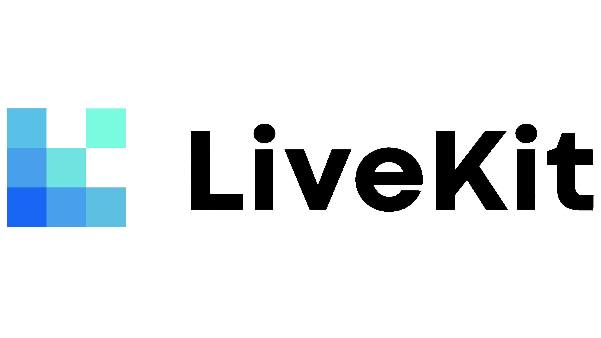
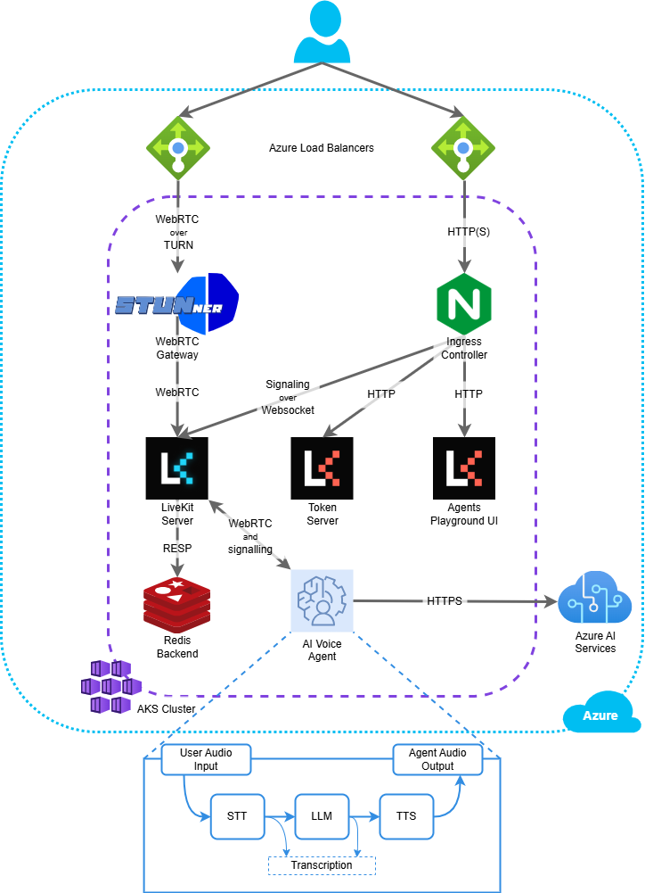

# Intro to LiveKit

> LiveKit 生態系概觀。

LiveKit 是一個供開發人員建立即時媒體應用程式的開源平台。它可以輕鬆整合音訊、視訊、文字、數據和 AI 模型，同時提供基於 WebRTC 構建的可擴展即時基礎設施。

## Why choose LiveKit?

LiveKit 為即時應用程式提供了完整的解決方案，具有以下幾個主要優勢：

- **Developer-friendly**: 跨平台一致的 API，具有全面且記錄良好的 SDK。
- **Open source**: 無需被某特定供應商鎖定，完全透明且靈活。
- **AI-native**: 將 AI 模型整合到即時體驗中的一流支援。
- **Scalable**: 可以支援從少數用戶到數千名甚至更多的並發參與者。
- **Deployment flexibility**: 選擇完全託管雲端或自託管選項。
- **Private and secure**: 端對端加密、符合 HIPAA 規定等等。
- **Built on WebRTC**: 最強大的即時媒體協議，可在任何網路條件下實現最佳效能。

### What is WebRTC?

與其他建立即時應用程式（如 websockets）的選項相比，WebRTC 具有顯著的優勢。

- **Optimized for media**: 專為音訊和視訊而設計，具有先進的編解碼器和壓縮演算法。
- **Network resilient**: 由於 UDP、自適應位元率等特性，即使在具有挑戰性的網路條件下也能可靠地運作。
- **Broad compatibility**: 所有現代瀏覽器均原生支援。

LiveKit 處理運行生產級 WebRTC 基礎架構的所有複雜性，同時擴展對行動應用程式、後端和電話的支援。

## LiveKit ecosystem

LiveKit 平台由以下核心元件組成：

- **LiveKit Server**: 一個開源媒體伺服器，可實現參與者之間的即時通訊。使用 LiveKit 完全託管的全球雲，或自行託管您自己的雲端。
- **LiveKit SDKs**: 功能齊全的 Web、本機和後端 SDK，可輕鬆加入房間並發布和使用即時媒體和資料。
- **LiveKit Agents**: 用於建立即時多模式 AI 代理的框架，為幾乎所有 AI 提供者提供大量插件。
- **Telephony**: 靈活的 SIP 集成，可用於將電話呼入或呼出任何 LiveKit 房間或代理會話。
- **Egress**: 從 LiveKit 房間錄製和匯出即時媒體。
- **Ingress**: 將外部流（例如 RTMP 和 WHIP）引入 LiveKit 房間。
- **Server APIs**: 用於管理房間等的 REST API。包括 SDK 和 CLI。

## Deployment options

LiveKit 為 LiveKit Server 提供了兩種部署選項以滿足您的需求：

- **LiveKit Cloud**: 具有自動擴展和高可靠性的完全託管、全球分佈的服務。受到從新創公司到大型企業等各種規模公司的信賴。
- **Self-hosted**: 在您自己的基礎架構上運行開源 LiveKit 伺服器，以實現最大程度的控制和自訂。

這兩個選項都提供相同的核心平台功能並使用相同的 SDK。

## What can you build with LiveKit?

- **AI assistants**: 由任何 AI 模型驅動的語音和視訊代理。
- **Video conferencing**: 適合任何規模的團隊的安全、私密會議。
- **Interactive livestreaming**: 向即時參與的觀眾進行廣播。
- **Robotics**: 將即時視訊和強大的 AI 模型整合到現實世界的設備中。
- **Healthcare**: 符合 HIPAA 標準的遠距醫療，由 AI 和人類參與。
- **Customer service**: 靈活且可觀察的網路、行動和電話支援選項。

無論您的使用情況如何，LiveKit 都可以輕鬆建立創新、智慧的即時應用程序，而無需擔心擴展媒體基礎設施。立即開始使用 LiveKit。

