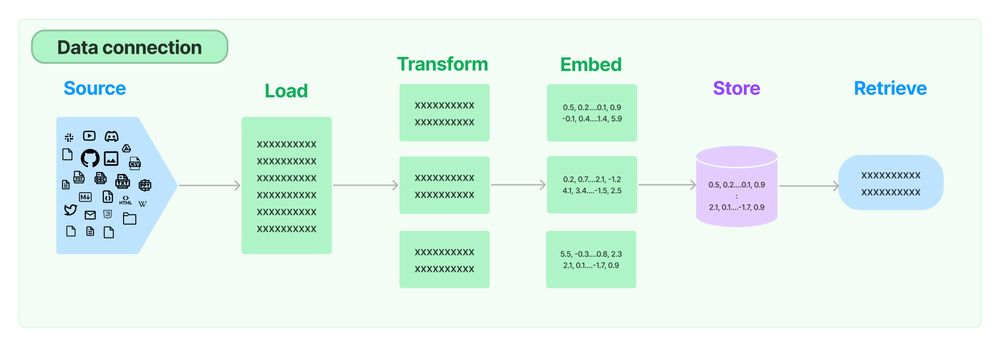
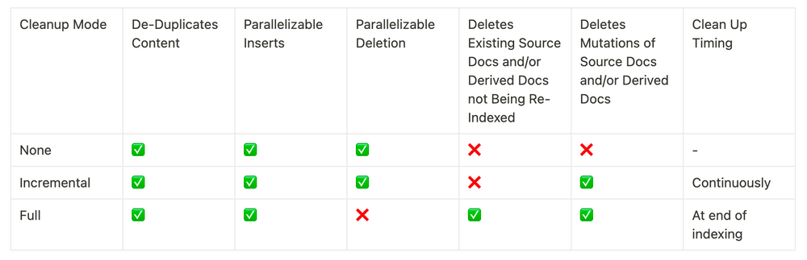

# 將資料來源同步到向量數據庫

原文: [Syncing data sources to vector stores](https://blog.langchain.dev/syncing-data-sources-to-vector-stores/)

大多數複雜且知識密集的 LLM 應用程式都需要執行資料檢索以實現檢索增強生成 (RAG)。典型 RAG 堆疊的核心元件是向量存儲，用於支援文件檢索。



使用向量儲存需要設定索引管道來從來源（網站、文件等）載入資料、將資料轉換為文件、嵌入這些文檔，並將嵌入和文件插入向量儲存中。

如果您的資料來源或處理步驟發生變化，則需要重新索引資料。如果這種情況經常發生，而且變更是增量式的，那麼對正在索引的內容與向量儲存中已有的內容進行重複資料刪除就變得很有價值。這避免了將時間和金錢花在多餘的工作上。設定向量儲存清理流程以從向量儲存中刪除陳舊資料也變得非常重要。

## LangChain Indexing API

新的 LangChain Indexing API 可以輕鬆地將任何來源的文件載入到向量儲存中並保持同步。具體來說，它有助於：

- 避免將重複的內容寫入向量存儲
- 避免重寫未更改的內容
- 避免在未更改的內容上重新計算嵌入

至關重要的是，indexing API 甚至可以處理相對於原始來源文件經歷了多個轉換步驟（例如，透過文字分塊）的文檔。

## 運作設計

LangChain indexing 利用記錄管理器 (`RecordManager`) 來追蹤文件寫入向量儲存的情況。

索引內容時，會計算每個文件的雜湊值，並將以下資訊儲存在記錄管理器中：

- 文檔哈希（頁面內容和元資料的哈希）
- 寫入時間
- 來源 ID－每個文件應在其元資料中包含信息，以便我們確定該文件的最終來源

### 清理模式

將文件重新索引到向量儲存時，可能會刪除向量儲存中的某些現有文件。如果您在插入之前更改了文件的處理方式或來源文件已更改，則您需要刪除與正在索引的新文件來自相同來源的所有現有文件。如果某些來源文件已被刪除，您將需要刪除向量儲存中的所有現有文件並將其替換為重新索引的文件。

Indexing API 清理模式可讓您選擇所需的行為：



有關 API 及其限制的更詳細文檔，請查看文件：

- https://python.langchain.com/docs/modules/data_connection/indexing

- `None` 不進行任何自動清理，允許使用者手動清理舊內容。
- `Incremental` 與 `Full` 提供以下自動清理功能：
    - 如果來源文件或衍生文件的內容發生更改，則增量或完整模式都會清理（刪除）內容的先前版本。
    - 如果來源文件已被刪除（表示它不包含在目前正在索引的文件中），則完全清理模式會將其從向量儲存中正確刪除，但增量模式不會。

當內容變更（例如，來源 PDF 檔案被修改）時，在索引期間將有一段時間新舊版本都可能傳回給使用者。這種情況發生在新內容寫入之後、舊版被刪除之前。

- `Incremental` 索引可以最大限度地減少這段時間，因為它能夠連續清理，正如它所寫的那樣。
- `Full` 模式在所有批次寫入後進行清理。


## 要求

1. 不要與已預先填入了獨立於索引 API 的內容的儲存空間一起使用，因為記錄管理器不會知道先前已插入記錄。
2. 僅適用於支援的 LangChain 向量存儲
    - 按 id 新增文件（帶有 ids 參數的 add_documents 方法）
    - 按 id 刪除（帶有 ids 參數的刪除方法）

相容的向量存儲：

- `AnalyticDB`
- `AstraDB`
- `AwaDB`
- `Bagel`
- `Cassandra`
- `Chroma`
- `DashVector` 
- `DatabricksVectorSearch`
- `DeepLake`
- `Dingo`
- `ElasticVectorSearch`
- `ElasticsearchStore`
- `FAISS`
- `MyScale`
- `PGVector`
- `Pinecone`
- `Qdrant`
- `Redis`
- `ScaNN`
- `SupabaseVectorStore`
- `SurrealDBStore`
- `TimescaleVector`
- `Vald`
- `Vearch`
- `VespaStore`
- `Weaviate`
- `ZepVectorStore`

## 注意

記錄管理器(record manager)依靠基於時間的機制來確定可以清理哪些內容（當使用 `full` 或 `incremental` 清理模式時）。

如果兩個任務連續運行，且第一個任務在時鐘時間變更之前完成，則第二個任務可能無法清理內容。

這在實際設定中不太可能成為問題，原因如下：

1. RecordManager 使用更高解析度的時間戳記。
2. 資料需要在第一個和第二個任務運行之間發生變化，如果任務之間的時間間隔很小時，這種情況就不太可能發生。
3. 索引任務通常需要幾毫秒以上的時間。

## Quickstart

```python
from langchain.indexes import SQLRecordManager, index
from langchain.schema import Document
from langchain_community.vectorstores import ElasticsearchStore
from langchain_openai import OpenAIEmbeddings
```

初始化向量儲存並設定嵌入:

```python
collection_name = "test_index"

embedding = OpenAIEmbeddings()

vectorstore = ElasticsearchStore(
    es_url="http://localhost:9200", index_name="test_index", embedding=embedding
)
```

使用適當的命名空間初始化記錄管理器。

!!!info
    建議：使用同時考慮向量儲存和向量儲存中的集合名稱的命名空間；例如，`redis/my_docs`、`chromadb/my_docs` 或 `postgres/my_docs`。


```python
namespace = f"elasticsearch/{collection_name}"

record_manager = SQLRecordManager(
    namespace, db_url="sqlite:///record_manager_cache.sql"
)
```

在使用記錄管理器之前建立 schema。

```python
record_manager.create_schema()
```

讓我們索引一些測試文件：

```python
doc1 = Document(page_content="kitty", metadata={"source": "kitty.txt"})
doc2 = Document(page_content="doggy", metadata={"source": "doggy.txt"})
```

索引到空向量存儲中：

```python
def _clear():
    """Hacky helper method to clear content. See the `full` mode section to to understand why it works."""
    index([], record_manager, vectorstore, cleanup="full", source_id_key="source")
```

### `None` 刪除模式

此模式不會自動清理舊版的內容；但是，它仍然負責內容重複刪除。

```python
_clear()

index(
    [doc1, doc1, doc1, doc1, doc1],
    record_manager,
    vectorstore,
    cleanup=None,
    source_id_key="source",
)
```

結果:

```bash
{'num_added': 1, 'num_updated': 0, 'num_skipped': 0, 'num_deleted': 0}
```

```python
_clear()

index([doc1, doc2], record_manager, vectorstore, cleanup=None, source_id_key="source")
```

結果:

```bash
{'num_added': 2, 'num_updated': 0, 'num_skipped': 0, 'num_deleted': 0}
```

第二次將跳過所有內容：

```python
index([doc1, doc2], record_manager, vectorstore, cleanup=None, source_id_key="source")
```

結果:

```bash
{'num_added': 0, 'num_updated': 0, 'num_skipped': 2, 'num_deleted': 0}
```

### `incremental` 刪除模式

```python
_clear()

index(
    [doc1, doc2],
    record_manager,
    vectorstore,
    cleanup="incremental",
    source_id_key="source",
)
```

結果:

```bash
{'num_added': 2, 'num_updated': 0, 'num_skipped': 0, 'num_deleted': 0}
```

再次索引應該會導致兩個文件都被跳過——同時也會跳過嵌入操作！

```python
index(
    [doc1, doc2],
    record_manager,
    vectorstore,
    cleanup="incremental",
    source_id_key="source",
)
```

結果:

```bash
{'num_added': 0, 'num_updated': 0, 'num_skipped': 2, 'num_deleted': 0}
```

如果我們不提供增量索引模式的文檔，則什麼都不會改變。

```python
index([], record_manager, vectorstore, cleanup="incremental", source_id_key="source")
```

結果:

```bash
{'num_added': 0, 'num_updated': 0, 'num_skipped': 0, 'num_deleted': 0}
```

如果我們改變一個文檔，新版本將被寫入，所有共享相同來源的舊版本將被刪除。

```python
changed_doc_2 = Document(page_content="puppy", metadata={"source": "doggy.txt"})

index(
    [changed_doc_2],
    record_manager,
    vectorstore,
    cleanup="incremental",
    source_id_key="source",
)
```

結果:

```bash
{'num_added': 1, 'num_updated': 0, 'num_skipped': 0, 'num_deleted': 1}
```

### `full` 刪除模式

在 `full` 模式下，使用者應該傳遞應索引到索引功能中的完整內容。

任何未傳遞到索引功能且存在於向量儲存中的文件都將被刪除！

此行為對於處理來源文件的刪除很有用。

```python
_clear()

all_docs = [doc1, doc2]

index(all_docs, record_manager, vectorstore, cleanup="full", source_id_key="source")
```

結果:

```bash
{'num_added': 2, 'num_updated': 0, 'num_skipped': 0, 'num_deleted': 0}
```

假設有人刪除了第一個文檔：

```python
del all_docs[0]

print(all_docs)
```

結果:

```bash
[Document(page_content='doggy', metadata={'source': 'doggy.txt'})]
```

使用完整模式也會清除已刪除的內容。

```python
index(all_docs, record_manager, vectorstore, cleanup="full", source_id_key="source")
```

結果:

```bash
{'num_added': 0, 'num_updated': 0, 'num_skipped': 1, 'num_deleted': 1}
```

## Source 欄位

`metadata` 屬性包含一個稱為 `source` 的欄位。該 `source` 應指出與給定文檔相關的最終出處。

例如，如果這些文檔代表某個父文檔的區塊，則兩個文檔的來源應該相同並引用父文檔。

一般來說，應始終指定 `source`。如果您從不打算使用增量模式，並且由於某種原因無法正確指定 `source` 字段，則僅使用 `None`。

```python
from langchain.text_splitter import CharacterTextSplitter

doc1 = Document(
    page_content="kitty kitty kitty kitty kitty", metadata={"source": "kitty.txt"}
)

doc2 = Document(page_content="doggy doggy the doggy", metadata={"source": "doggy.txt"})

new_docs = CharacterTextSplitter(
    separator="t", keep_separator=True, chunk_size=12, chunk_overlap=2
).split_documents([doc1, doc2])

print(new_docs)
```

結果:

```bash
[Document(page_content='kitty kit', metadata={'source': 'kitty.txt'}),
 Document(page_content='tty kitty ki', metadata={'source': 'kitty.txt'}),
 Document(page_content='tty kitty', metadata={'source': 'kitty.txt'}),
 Document(page_content='doggy doggy', metadata={'source': 'doggy.txt'}),
 Document(page_content='the doggy', metadata={'source': 'doggy.txt'})]
```

```python
_clear()

index(
    new_docs,
    record_manager,
    vectorstore,
    cleanup="incremental",
    source_id_key="source",
)
```

結果:

```bash
{'num_added': 5, 'num_updated': 0, 'num_skipped': 0, 'num_deleted': 0}
```

```python
changed_doggy_docs = [
    Document(page_content="woof woof", metadata={"source": "doggy.txt"}),
    Document(page_content="woof woof woof", metadata={"source": "doggy.txt"}),
]
```

這應該刪除與 doggy.txt 來源關聯的文件的舊版本，並將其替換為新版本。

```python
index(
    changed_doggy_docs,
    record_manager,
    vectorstore,
    cleanup="incremental",
    source_id_key="source",
)
```

結果:

```bash
{'num_added': 0, 'num_updated': 0, 'num_skipped': 2, 'num_deleted': 2}
```

```python
vectorstore.similarity_search("dog", k=30)
```

結果:

```bash
[Document(page_content='tty kitty', metadata={'source': 'kitty.txt'}),
 Document(page_content='tty kitty ki', metadata={'source': 'kitty.txt'}),
 Document(page_content='kitty kit', metadata={'source': 'kitty.txt'})]
```

## 與 loader 一起使用

索引可以接受文件的可迭代或任何載入器。

注意：載入程式必須正確設定 source 欄位。

```python
from langchain_community.document_loaders.base import BaseLoader


class MyCustomLoader(BaseLoader):
    def lazy_load(self):
        text_splitter = CharacterTextSplitter(
            separator="t", keep_separator=True, chunk_size=12, chunk_overlap=2
        )
        docs = [
            Document(page_content="woof woof", metadata={"source": "doggy.txt"}),
            Document(page_content="woof woof woof", metadata={"source": "doggy.txt"}),
        ]
        yield from text_splitter.split_documents(docs)

    def load(self):
        return list(self.lazy_load())

_clear()

loader = MyCustomLoader()

loader.load()
```

結果:

```bash
[Document(page_content='woof woof', metadata={'source': 'doggy.txt'}),
 Document(page_content='woof woof woof', metadata={'source': 'doggy.txt'})]
```

```python
index(loader, record_manager, vectorstore, cleanup="full", source_id_key="source")
```

結果:

```bash
{'num_added': 2, 'num_updated': 0, 'num_skipped': 0, 'num_deleted': 0}
```

```python
vectorstore.similarity_search("dog", k=30)
```

結果:

```bash
[Document(page_content='woof woof', metadata={'source': 'doggy.txt'}),
 Document(page_content='woof woof woof', metadata={'source': 'doggy.txt'})]
```