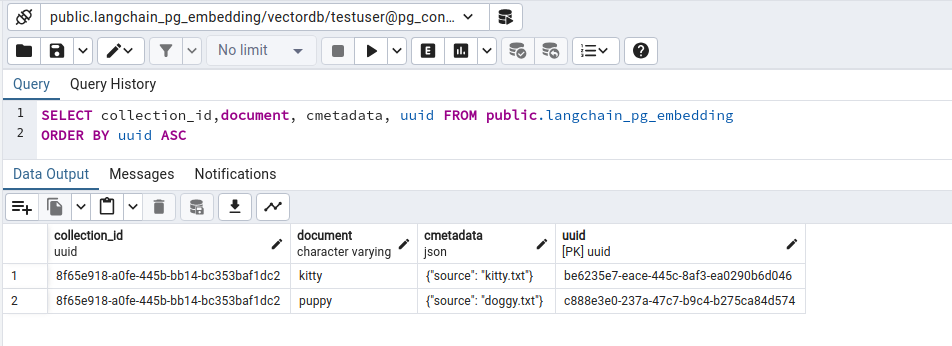

# 將資料來源同步到向量數據庫

- 原文: [Syncing data sources to vector stores](https://blog.langchain.dev/syncing-data-sources-to-vector-stores/)
- 原文: [Lanchain-Indexing](https://python.langchain.com/docs/modules/data_connection/indexing)

大多數複雜且知識密集的 LLM 應用程式都需要執行資料檢索以實現檢索增強生成 (RAG)。典型 RAG 堆疊的核心元件是向量存儲，用於支援文件檢索。


使用向量儲存需要設定索引管道(indexing pipeline)來從來源（網站、文件等）載入資料、將資料轉換為文件、嵌入(embeddings)這些文檔，並將嵌入和文件插入向量儲存中。

{==

如果您的資料來源或處理步驟發生變化，則需要重新索引資料。如果這種情況經常發生，而且變更是增量式的，那麼對正在索引的內容與向量儲存中已有的內容進行重複資料刪除就變得很有價值。這避免了將時間和金錢花在多餘的工作上。設定向量儲存清理流程以從向量儲存中刪除陳舊資料也變得非常重要。

==}

## LangChain Indexing API

新的 LangChain Indexing API 可以輕鬆地將任何來源的文件載入到向量儲存中並保持同步。具體來說，它有助於：

- 避免將重複的內容(duplicated content)寫入向量存儲
- 避免重新寫入未更改的內容(unchanged content)
- 避免在未更改的內容上重新計算嵌入(re-computing embeddings)

至關重要的是，indexing API 甚至可以處理相對於原始來源文件經歷了多個轉換步驟（例如，透過文字分塊）的文檔。

## 運作設計

LangChain indexing 利用記錄管理器 (`RecordManager`) 來追蹤文件寫入向量儲存的情況。

索引內容時，會計算每個文件的雜湊值(hash)，並將以下資訊儲存在記錄管理器(RecordManager)中：

- 文檔 hash（包含了 page_content 和 metadata 的哈希）
- 寫入時間
- `source id` 每個文件應在其元資料中包含一個 `source` 的訊息(比如說辨別文件的唯一檔名或文字的唯一編碼)，以便我們確定該文件的最終來源

### 清理模式

將文件重新索引到向量儲存時，可能會刪除向量儲存中的某些現有文件。如果您在插入之前更改了文件的處理方式或來源文件已更改，則您需要刪除與正在索引的新文件來自相同來源的所有現有文件。如果某些來源文件已被刪除，您將需要刪除向量儲存中的所有現有文件並將其替換為重新索引的文件。

Indexing API 清理模式可讓您選擇所需的行為：

|清理模式|刪除重複內容|可平行化|清理已刪除的來源文檔|清理來源文檔和/或派生文檔的改變|清理時間點|
|---|---|---|---|---|---|
|`None`|✅|✅|❌|❌|-|
|`incremental`|✅|✅|❌|✅|Continuously|
|`full`|✅|❌|✅|✅|At end of indexing|


有關 API 及其限制的更詳細文檔，請查看文件：

- https://python.langchain.com/docs/modules/data_connection/indexing

- `None` 不進行任何自動清理，允許使用者手動清理舊內容。
- `incremental` 與 `full` 提供以下自動清理功能：
    - 如果來源文件或衍生文件的內容發生更改，則增量或完整模式都會清理（刪除）內容的先前版本。
    - 如果來源文件已被刪除（表示它不包含在目前正在索引的文件中），則完全清理模式會將其從向量儲存中正確刪除，但增量模式不會。

當內容變更（例如，來源 PDF 檔案被修改）時，在索引期間將有一段時間新舊版本都可能傳回給使用者。這種情況發生在新內容寫入之後、舊版被刪除之前。

- `incremental` 索引可以最大限度地減少這段時間，因為它能夠連續清理，正如它所寫的那樣。
- `full` 模式在所有批次寫入後進行清理。


## 要求

1. 不要與已預先填入了獨立於索引 API 的內容的儲存空間一起使用，因為記錄管理器(RecordManager)不會知道先前已插入的記錄。
2. 僅適用於支援的 LangChain 向量存儲
    - 按 `id` 新增文件（帶有 `ids` 參數的 `add_documents` 方法）
    - 按 `id` 刪除（帶有 `ids` 參數的 `delete` 方法）

相容的向量存儲：

- `AnalyticDB`
- `AstraDB`
- `AwaDB`
- `Bagel`
- `Cassandra`
- `Chroma`
- `DashVector` 
- `DatabricksVectorSearch`
- `DeepLake`
- `Dingo`
- `ElasticVectorSearch`
- `ElasticsearchStore`
- `FAISS`
- `MyScale`
- `PGVector`
- `Pinecone`
- `Qdrant`
- `Redis`
- `ScaNN`
- `SupabaseVectorStore`
- `SurrealDBStore`
- `TimescaleVector`
- `Vald`
- `Vearch`
- `VespaStore`
- `Weaviate`
- `ZepVectorStore`

## 注意

記錄管理器(record manager)依靠基於時間的機制來確定可以清理哪些內容（當使用 `full` 或 `incremental` 清理模式時）。

如果兩個任務連續運行，且第一個任務在時鐘時間變更之前完成，則第二個任務可能無法清理內容。

這在實際設定中不太可能成為問題，原因如下：

1. RecordManager 使用更高解析度的時間戳記。
2. 資料需要在第一個和第二個任務運行之間發生變化，如果任務之間的時間間隔很小時，這種情況就不太可能發生。
3. 索引任務通常需要幾毫秒以上的時間。

## Quickstart

```python
from langchain.indexes import SQLRecordManager, index
from langchain.docstore.document import Document
from langchain_community.vectorstores.pgvector import PGVector
from langchain_openai import OpenAIEmbeddings
```

初始化向量儲存並設定嵌入:

```python
# **** 初始化向量儲存並設定嵌入 ****

# 定義要保存的 Collection 名稱 (也可想像成不同的 Knowledge-base 的書櫃
collection_name = "test_index"

# 構建轉換文本成 embedding 的轉換器
embeddings = OpenAIEmbeddings()

# PGVector 需要連接到資料庫的連接字串 (connection string)
CONNECTION_STRING = PGVector.connection_string_from_db_params(
    driver=os.environ.get("PGVECTOR_DRIVER", "psycopg2"),
    host=os.environ.get("PGVECTOR_HOST", "localhost"),
    port=int(os.environ.get("PGVECTOR_PORT", "5432")),
    database=os.environ.get("PGVECTOR_DATABASE", "vectordb"),
    user=os.environ.get("PGVECTOR_USER", "testuser"),
    password=os.environ.get("PGVECTOR_PASSWORD", "testpwd"),
)

# 我們使用現有的向量儲存。為此，我們可以直接對其進行初始化。
vectorstore = PGVector(
    connection_string=CONNECTION_STRING,
    collection_name=collection_name,
    embedding_function=embeddings
)
```

使用適當的命名空間初始化記錄管理器。

!!!info
    建議：使用同時考慮向量儲存和向量儲存中的集合名稱的命名空間；例如，`redis/my_docs`、`chromadb/my_docs` 或 `postgres/my_docs`。


```python
# 使用適當的命名空間初始化記錄管理器 (record manager)。
namespace = f"pgvector/{collection_name}"

record_manager = SQLRecordManager(
    namespace=namespace,
    db_url=CONNECTION_STRING
)
```

在使用記錄管理器之前建立 schema。

```python
# 在使用記錄管理器之前建立 schema。
record_manager.create_schema()
```

讓我們索引一些測試文件：

```python
doc1 = Document(page_content="kitty", metadata={"source": "kitty.txt"})
doc2 = Document(page_content="doggy", metadata={"source": "doggy.txt"})
```

索引到空向量存儲中：

```python
# 定義一個函式來清空 VectorStore 裡相關的記錄與 RecordManager 的記錄
def _clear():
    """Hacky helper method to clear content. See the `full` mode section to to understand why it works."""
    index([], record_manager, vectorstore, cleanup="full", source_id_key="source")
```

### `None` 刪除模式

此模式不會自動清理舊版的內容；但是，它仍然負責內容重複刪除。

接下來的測試主要是要來驗證下列的特性:

|刪除模式|刪除重複內容|清理已刪除的來源文檔|清理來源文檔和/或派生文檔的改變|
|---|---|---|---|
|None|✅|❌|❌|

**第一輪測試**

```python
# 此模式不會自動清理舊版的內容；但是，它仍然負責內容重複刪除。
_clear()

# 進行第一輪使用使用 indexing api 來索引文件進到 vectorstore
index_result = index(
    docs_source=[doc1, doc1, doc1, doc1, doc1],
    record_manager=record_manager,
    vector_store=vectorstore,
    cleanup=None,
    source_id_key="source"
)
```

結果:

```bash
{'num_added': 1, 'num_updated': 0, 'num_skipped': 0, 'num_deleted': 0}
```

**第二輪測試**

```python
# 進行第二輪使用 indexing api 來索引文件進到 vectorstore

index_result = index(
    docs_source=[doc1, doc1, doc1, doc1, doc1],
    record_manager=record_manager,
    vector_store=vectorstore,
    cleanup=None,
    source_id_key="source"
)
```

結果:

```bash
{'num_added': 0, 'num_updated': 0, 'num_skipped': 1, 'num_deleted': 0}
```

**第三輪測試**

```python
# 進行第三輪使用 indexing api 來索引文件進到 vectorstore (新文件 doc2)

index_result = index(
    docs_source=[doc1, doc2],
    record_manager=record_manager,
    vector_store=vectorstore,
    cleanup=None,
    source_id_key="source"
)
```

結果:

```bash
{'num_added': 1, 'num_updated': 0, 'num_skipped': 1, 'num_deleted': 0}
```

**第四輪測試**

```python
# 進行第四輪使用 indexing api 來索引文件進到 vectorstore (修改文件 changed_doc_2)

# 舊版本 doc2 = Document(page_content="doggy", metadata={"source": "doggy.txt"})
changed_doc_2 = Document(page_content="puppy", metadata={"source": "doggy.txt"})

index_result = index(
    docs_source=[changed_doc_2],
    record_manager=record_manager,
    vector_store=vectorstore,
    cleanup=None,
    source_id_key="source"
)
```

結果:

```bash
{'num_added': 1, 'num_updated': 0, 'num_skipped': 0, 'num_deleted': 0}
```

觀察在記錄管理器(RecordManager)後台的記錄, 可了解　`None` 刪除模式的特性。


!!! info
    `None` 刪除模式不會自動清理舊版的內容；但是，它仍然負責內容重複刪除 (De-Duplicates Content)。

### `incremental` 刪除模式

接下來的測試主要是要來驗證下列的特性:

|刪除模式|刪除重複內容|清理已刪除的來源文檔|清理來源文檔和/或派生文檔的改變|
|---|---|---|---|
|`incremental`|✅|❌|✅|


**第一輪測試**

```python
# 此模式不會自動清理舊版的內容；但是，它仍然負責內容重複刪除。
_clear()

# 進行第一輪使用使用 indexing api 來索引文件進到 vectorstore
index_result = index(
    docs_source=[doc1, doc2], # <--- 重點
    record_manager=record_manager,
    vector_store=vectorstore,
    cleanup="incremental", # <--- 重點
    source_id_key="source"
)
```

結果:

```bash
{'num_added': 2, 'num_updated': 0, 'num_skipped': 0, 'num_deleted': 0}
```

**第二輪測試**

再次索引應該會導致兩個文件都被跳過——同時也會跳過嵌入操作！

```python
# 進行第二輪使用 indexing api 來索引文件進到 vectorstore

# "再次索引應該會導致兩個文件都被跳過——同時也會跳過嵌入操作！"

index_result = index(
    docs_source=[doc1, doc2], # <--- 重點
    record_manager=record_manager,
    vector_store=vectorstore,
    cleanup="incremental", # <--- 重點
    source_id_key="source"
)
```

結果:

```bash
{'num_added': 0, 'num_updated': 0, 'num_skipped': 2, 'num_deleted': 0}
```

**第三輪測試**

如果我們不提供增量索引模式的文檔，則什麼都不會改變。

```python
# 進行第三輪使用 indexing api 來索引文件進到 vectorstore

# "如果我們不提供增量索引模式的文檔，則什麼都不會改變。"

index_result = index(
    docs_source=[], # <--- 重點
    record_manager=record_manager,
    vector_store=vectorstore,
    cleanup="incremental", # <--- 重點
    source_id_key="source"
)
```

結果:

```bash
{'num_added': 0, 'num_updated': 0, 'num_skipped': 0, 'num_deleted': 0}
```

**第四輪測試**

如果我們改變一個文檔，新版本將被寫入，所有共享相同來源的舊版本將被刪除。

```python
# 進行第四輪使用 indexing api 來索引文件進到 vectorstore

# "如果我們改變一個文檔，新版本將被寫入，所有共享相同 source_id_key 的舊版本將被刪除。"

# 舊版本 doc2 = Document(page_content="doggy", metadata={"source": "doggy.txt"})
changed_doc_2 = Document(page_content="puppy", metadata={"source": "doggy.txt"})

index_result = index(
    docs_source=[changed_doc_2], # <--- 重點
    record_manager=record_manager,
    vector_store=vectorstore,
    cleanup="incremental", # <--- 重點
    source_id_key="source"
)
```

結果:

```bash
{'num_added': 1, 'num_updated': 0, 'num_skipped': 0, 'num_deleted': 1}
```

觀察在記錄管理器(RecordManager)後台的記錄, 可了解　`incremental` 刪除模式的特性。




### `full` 刪除模式

在 `full` 模式下，使用者應該傳遞應索引到索引功能中的完整內容。

任何未傳遞到索引功能且存在於向量儲存中的文件都將被刪除！

此行為對於處理來源文件的刪除很有用。

|刪除模式|刪除重複內容|清理已刪除的來源文檔|清理來源文檔和/或派生文檔的改變|
|---|---|---|---|
|`full`|✅|✅|✅|

**第一輪測試**

```python
_clear()

# 讓我們準備一些測試文件
doc1 = Document(page_content="kitty", metadata={"source": "kitty.txt"})
doc2 = Document(page_content="doggy", metadata={"source": "doggy.txt"})

# 所有的文件 collection
all_docs = [doc1, doc2]

# 進行第一輪使用使用 indexing api 來索引文件進到 vectorstore
index_result = index(
    docs_source=all_docs, # <-- 重點
    record_manager=record_manager,
    vector_store=vectorstore,
    cleanup="full", # <-- 重點
    source_id_key="source"
)
```

結果:

```bash
{'num_added': 2, 'num_updated': 0, 'num_skipped': 0, 'num_deleted': 0}
```

**第二輪測試**

假設有人刪除了第一個文檔：

```python
# 情境: 假設有人刪除了第一個文檔
del all_docs[0]

print("第二輪 Collection 裡的文件有: ", all_docs)
```

結果:

```bash
[Document(page_content='doggy', metadata={'source': 'doggy.txt'})]
```

使用完整模式也會清除已刪除的內容。

```python
# 使用完整模式也會清除已刪除的內容。
index_result = index(
    docs_source=all_docs, # <-- 重點
    record_manager=record_manager,
    vector_store=vectorstore,
    cleanup="full", # <-- 重點
    source_id_key="source"
)
```

結果:

```bash
{'num_added': 0, 'num_updated': 0, 'num_skipped': 1, 'num_deleted': 1}
```

觀察在記錄管理器(RecordManager)後台的記錄, 可了解　`incremental` 刪除模式的特性。


## Source 欄位

`metadata` 屬性包含一個稱為 `source` 的欄位。{==該 `source` 應指出與給定文檔相關的最終出處。==}

例如，如果這些文檔代表某個父文檔的區塊，則兩個文檔的來源應該相同並引用父文檔。

一般來說，應始終指定 `source`。如果您從不打算使用增量模式，並且由於某種原因無法正確指定 `source` 字段，則僅使用 `None`。

**第一輪測試**

```python
# 構建兩筆測試用文件(注意 metadata 中有定義 source 的欄位值)
doc1 = Document(page_content="kitty kitty kitty kitty kitty", metadata={"source": "kitty.txt"})
doc2 = Document(page_content="doggy doggy the doggy", metadata={"source": "doggy.txt"})

# 使用文本拆分器來拆分文本
new_docs = CharacterTextSplitter(
    separator="t", keep_separator=True, chunk_size=12, chunk_overlap=2
).split_documents([doc1, doc2])

# 打印要 indexing 進 vectorstore 的所有文件
print(new_docs)
```

結果:

```bash
[Document(page_content='kitty kit', metadata={'source': 'kitty.txt'}),
 Document(page_content='tty kitty ki', metadata={'source': 'kitty.txt'}),
 Document(page_content='tty kitty', metadata={'source': 'kitty.txt'}),
 Document(page_content='doggy doggy', metadata={'source': 'doggy.txt'}),
 Document(page_content='the doggy', metadata={'source': 'doggy.txt'})]
```

```python
# 使用 indexing api 來索引文件進到 vectorstore
index_result = index(
    docs_source=new_docs, # <-- 重點
    record_manager=record_manager,
    vector_store=vectorstore,
    cleanup="incremental",
    source_id_key="source" # <-- 重點
)
```

結果:

```bash
{'num_added': 5, 'num_updated': 0, 'num_skipped': 0, 'num_deleted': 0}
```

**第二輪測試**

```python
# 進行第二輪使用使用 indexing api 來索引文件進到 vectorstore

# 修改文件
changed_doggy_docs = [
    Document(page_content="woof woof", metadata={"source": "doggy.txt"}),
    Document(page_content="woof woof woof", metadata={"source": "doggy.txt"}),
    Document(page_content="woof woof woof the woofy dog", metadata={"source": "doggy.txt"}),
]
```

這應該刪除與 `doggy.txt` 來源關聯的文件的舊版本，並將其替換為新版本。

```python
# 使用 indexing api 來索引文件進到 vectorstore
index_result = index(
    docs_source=changed_doggy_docs, # <-- 重點
    record_manager=record_manager,
    vector_store=vectorstore,
    cleanup="incremental",
    source_id_key="source" # <-- 重點
)
```

結果:

```bash
# 使用 indexing api 來索引文件進到 vectorstore
index_result = index(
    docs_source=changed_doggy_docs, # <-- 重點
    record_manager=record_manager,
    vector_store=vectorstore,
    cleanup="incremental",
    source_id_key="source" # <-- 重點
)
```

觀察在記錄管理器(RecordManager)後台的記錄, 可了解 `metadata.source` 欄位應對到不同刪除模式的影響。


## 與 loader 一起使用

索引可以接受文件的可迭代或任何載入器。

注意：載入程式必須正確設定 source 欄位。

```python
from langchain_community.document_loaders.base import BaseLoader

# 實作一個客製化的文件載入器
class MyCustomLoader(BaseLoader):
    def lazy_load(self):
        text_splitter = CharacterTextSplitter(
            separator="t", keep_separator=True, chunk_size=12, chunk_overlap=2
        )
        docs = [
            Document(page_content="woof woof", metadata={"source": "doggy.txt"}),
            Document(page_content="woof woof woof", metadata={"source": "doggy.txt"}),
        ]
        yield from text_splitter.split_documents(docs)

    def load(self):
        return list(self.lazy_load())

# 先清除向量資料庫所有的內容
_clear()

# 構建文件載入器
loader = MyCustomLoader()

# 取得要 indexing 到 vectorstore 的文件
loader.load()
```

結果:

```bash
[Document(page_content='woof woof', metadata={'source': 'doggy.txt'}),
 Document(page_content='woof woof woof', metadata={'source': 'doggy.txt'})]
```

```python
# 使用 indexing api 與 loader 來索引文件進到 vectorstore
index_result = index(
    docs_source=loader,
    record_manager=record_manager,
    vector_store=vectorstore,
    cleanup="full",
    source_id_key="source"
)
```

結果:

```bash
{'num_added': 2, 'num_updated': 0, 'num_skipped': 0, 'num_deleted': 0}
```

```python
vectorstore.similarity_search("dog", k=30)
```

結果:

```bash
[Document(page_content='woof woof', metadata={'source': 'doggy.txt'}),
 Document(page_content='woof woof woof', metadata={'source': 'doggy.txt'})]
```