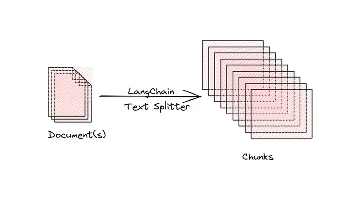
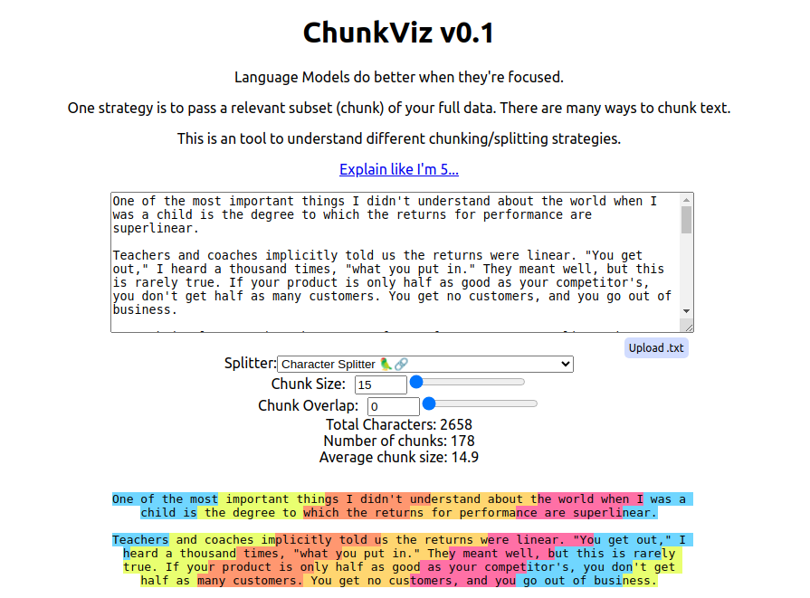

# 文本分割器

原文: [Text Splitters](https://python.langchain.com/docs/modules/data_connection/document_transformers/)

載入文件後，您通常會想要對其進行轉換以更好地適合您的應用程式。最簡單的例子是，您可能想要將長文件分割成更小的區塊，以適合模型的上下文視窗([context-window](https://platform.openai.com/docs/models/gpt-3-5))。 

舉 GPT-3.5 模型為例:

|MODEL	|DESCRIPTION	|CONTEXT WINDOW	|TRAINING DATA|
|-------|---------------|---------------|-------------|
|`gpt-3.5-turbo-1106`|The latest GPT-3.5 Turbo model with improved instruction following, JSON mode, reproducible outputs, parallel function calling, and more. Returns a maximum of 4,096 output tokens. Learn more.	|**16,385  tokens**|Up to Sep 2021|
|`gpt-3.5-turbo`|Currently points to gpt-3.5-turbo-0613.	|**4,096  tokens**|Up to Sep 2021|
|`gpt-3.5-turbo-16k`|Currently points to gpt-3.5-turbo-16k-0613.	|**16,385  tokens**|Up to Sep 2021|
|`gpt-3.5-turbo-instruct`|Similar capabilities as GPT-3 era models. Compatible with legacy Completions endpoint and not Chat Completions.	|**4,096  tokens**|Up to Sep 2021|

LangChain 有許多內建的文件轉換器，可以輕鬆拆分、組合、過濾和以其他方式操作文件。

當您想要處理長文本時，有必要將該文字分割成區塊(chunk)。這聽起來很簡單，但這裡存在著許多潛在的複雜性。理想情況下，{==您希望將語義相關的文字片段保留在一起。==} **語意相關** 的意思可能取決於文本的類型。本文說明了實現此目的的幾種方法。

在較高層面上，文本分割器的工作原理如下：

1. 將文字分成小的、具有語義意義的區塊（通常是句子）。
2. 開始將這些小塊組合成一個更大的塊，直到達到一定的大小（透過某些函數測量）。
3. 一旦達到該大小，請將該區塊設為自己的文字片段，然後開始建立具有一些重疊的新文字區塊（以保持區塊之間的上下文）。

這意味著您可以沿著兩個不同的維度來自訂或客製文字分割器：

1. 文字如何分割
2. 如何測量塊大小

## 文字分割器的類型

LangChain 提供了多種不同類型的文字分割器。下表列出了所有這些以及一些特徵：

- `Name`: 文字分割器的名稱
- `Splits On`: 此文字分割器如何分割文字
- `Adds Metadata`: 此文字分割器是否會添加有關每個區塊來自何處的元資料。
- `Description`: 文字分割器的描述，包括何時使用它的建議。

|Name	|Splits On	|Adds Metadata	|Description|
|-------|-----------|---------------|-----------|
|**Recursive**|A list of user defined characters||遞歸地分割文字。遞歸地分割文本的目的是嘗試使相關的文本片段彼此相鄰。這是開始分割文字的推薦方法。|
|**HTML**|HTML specific characters|✅|根據 HTML 特定字元分割文字。值得注意的是，這添加了有關該區塊來自何處的相關資訊（基於 HTML）|
|**Markdown**|Markdown specific characters|✅|根據 Markdown 特定字元分割文字。值得注意的是，這添加了有關該區塊來自何處的相關資訊（基於 Markdown）|
|**Code**|Code (Python, JS) specific characters||根據特定於程式開發語言的字元分割文字。有 15 種不同的語言可供選擇。|
|**Token**|Tokens	||根據特定的 token 來拆分文字。有幾種不同的方法來衡量 token。|
|**Character**|A user defined character||根據使用者定義的字元拆分文字。比較簡單的方法之一。|
|[Experimental] **Semantic Chunker**|Sentences||首先將句子分割。然後，如果它們在語義上足夠相似，則將它們相鄰地組合起來。|

## 評估文字分割器

您可以使用 Greg Kamradt 建立的 [Chunkviz 公用程式](https://www.chunkviz.com/)來評估文字分割器。 Chunkviz 是一個很好的工具，可以直觀地顯示文字分割器的工作情況。它將向您顯示文字是如何分割的，並幫助調整分割參數。

## 其他文件轉換

文字分割只是您在將文件傳遞給 LLM 之前可能想要對文件進行的轉換的一個範例。前往 [Integration](https://python.langchain.com/docs/integrations/document_transformers/)以取得更多內建文件轉換器與第三方工具整合的文件與資訊。