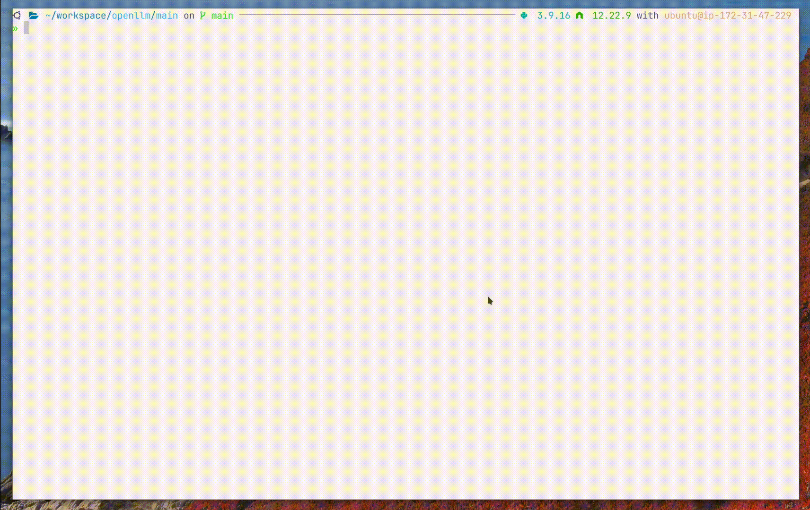

# OpenLLM 介紹

原文: [OpenLLM](https://github.com/bentoml/OpenLLM)

OpenLLM 是一個開源平台，旨在促進大型語言模型 (LLM) 在實際應用中的部署和操作。借助 OpenLLM，您可以在任何開源 LLM 上運行推理，將其部署在雲端或本地，並構建強大的 AI 應用程序。

## 特點

主要特點包括：

- 🚂 **State-of-the-art LLMs**: 對各種開源 LLM 和模型運行時的整合支持，包括但不限於 `Llama 2`、`StableLM`、`Falcon`、`Dolly`、`Flan-T5`、`ChatGLM` 和 `StarCoder`。

- 🔥 **Flexible APIs**: 使用單個命令通過 RESTful API 或 gRPC 為 LLM 提供服務。您可以使用 Web UI、CLI、Python/JavaScript 客戶端或您選擇的任何 HTTP 客戶端與模型進行交互。

- ⛓️ **Freedom to build**: 對 LangChain、BentoML 和 Hugging Face 的支持，讓您可以通過將 LLM 與其他模型和服務組合來輕鬆創建自己的 AI 應用。

- 🎯 **Streamline deployment**: 自動生成 LLM 服務器 Docker 鏡像或通過 ☁️ BentoCloud 部署為無服務器端點，它可以輕鬆管理 GPU 資源、根據流量進行擴展並確保成本效益。

- 🤖️ **Bring your own LLM**: 微調任何 LLM 以滿足您的需求。您可以加載 LoRA 層來微調模型，以獲得特定任務的更高準確性和性能。統一的模型微調 API (`LLM.tuning()`) 即將推出。

- ⚡ **Quantization**: 通過 [bitsandbytes](https://github.com/TimDettmers/bitsandbytes) 和 [GPTQ](https://arxiv.org/abs/2210.17323) 等量化技術，以更少的計算和內存成本運行推理。

- 📡 **Streaming**: 支持通過服務器發送事件 (SSE) 進行令牌流。您可以使用 `/v1/generate_stream` 端點來流式傳輸來自 LLM 的響應。

- 🔄 **Continuous batching**: 通過 vLLM 支持連續批處理，以提高總吞吐量。

OpenLLM 專為致力於構建基於 LLM 的生產就緒應用程序的 AI 應用程序開發人員而設計。它提供了一套全面的工具和功能，用於微調、服務、部署和監控這些模型，從而簡化了 LLM 的端到端部署工作流程。

