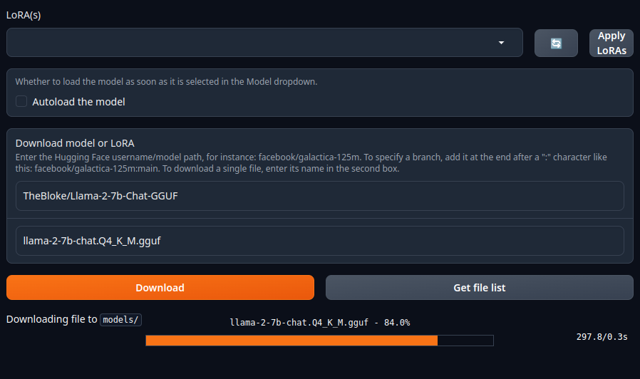

# Text generation web UI 介紹

Text generation web UI 是適用於大型語言模型的 [Gradio](https://www.gradio.app/) Web UI。

它的目標是成為文本生成領域的 [AUTOMATIC1111/stable-diffusion-webui](https://github.com/AUTOMATIC1111/stable-diffusion-webui)。

## 功能

- 3種界面模式：預設(two columns)、筆記本、聊天
- 多模型後端：[`transformers`](https://github.com/huggingface/transformers)、[`llama.cpp`](https://github.com/ggerganov/llama.cpp)、[`ExLlama`](https://github.com/turboderp/exllama)、[`ExLlamaV2`](https://github.com/turboderp/exllamav2)、[`AutoGPTQ`](https://github.com/PanQiWei/AutoGPTQ)、[`GPTQ-for-LLaMa`](https://github.com/qwopqwop200/GPTQ-for-LLaMa)、[`CTransformers`](https://github.com/marella/ctransformers)
- 下拉選單可在不同型號之間快速切換
- `LoRA` 動態加載和卸載 LoRA，使用 QLoRA 訓練新的 LoRA
聊天模式的精確指令模板，包括 `Llama-2-chat`、`Alpaca`、`Vicuna`、`WizardLM`、`StableLM` 等
- 通過 [`transformers`](https://pypi.org/project/transformers/) 套件進行 4-bit, 8-bit 和 CPU 推論
- 將 llama.cpp 模型與 Transformer 採樣器一起使用（`llamacpp_HF` 加載器）
- [Multimodal pipelines，包括 LLaVA 和 MiniGPT-4](https://github.com/oobabooga/text-generation-webui/tree/main/extensions/multimodal)
- [客制擴展框架](https://github.com/oobabooga/text-generation-webui/blob/main/docs/Extensions.md)
- [自定義聊天角色](https://github.com/oobabooga/text-generation-webui/blob/main/docs/Chat-mode.md)
- 非常高效的文本流
- 使用 LaTeX 渲染的 Markdown 輸出，例如與 [GALACTICA](https://github.com/paperswithcode/galai) 一起使用
- API，包括用於 websocket 流的端點（參見[示例](https://github.com/oobabooga/text-generation-webui/blob/main/api-examples)）

## 使用一鍵安裝器安裝

開發者有在 [Github](https://github.com/oobabooga/text-generation-webui) 提供 Linux/Windows/macOS 的一鍵安裝器。

此處以 Linux 為主:

1. Nvidia 顯示卡請安裝 [Nvidia 專有驅動](https://ivonblog.com/posts/ubuntu-install-nvidia-drivers/)以及 CUDA；AMD 安裝 [ROCm](https://docs.amd.com/bundle/ROCm-Installation-Guide-v5.1/page/How_to_Install_ROCm.html)。

2. 使用開發者提供的一鍵安裝器安裝 Miniconda 與依賴套件。中間會詢問顯示卡，輸入 A 選擇 Nvidia。

```bash
wget https://github.com/oobabooga/text-generation-webui/releases/download/installers/oobabooga_linux.zip

unzip oobabooga_linux.zip

cd oobabooga_linux
```

解壓縮之後的目錄:

```bash
oobabooga_linux
├── CMD_FLAGS.txt
├── cmd_linux.sh
├── INSTRUCTIONS.txt
├── start_linux.sh
├── update_linux.sh
└── webui.py
```

修改命令稿執行模式並進行相關套件安裝:

```
chmod +x *.sh

./start_linux.sh
```

詢問顯示卡，輸入 `A` 選擇 Nvidia。

```
What is your GPU

A) NVIDIA
B) AMD (Linux/MacOS only. Requires ROCm SDK 5.4.2/5.4.3 on Linux)
C) Apple M Series
D) None (I want to run models in CPU mode)

Input> A
```

3. 裝完依賴套件後，用瀏覽器開啟 `http://127.0.0.1:7860`，進入網頁界面。

## 下載 LLM 模型

文本生成 WebUI 支持多種語言模型

這裡我以 `transformers` 格式，接下來我們使用 `TheBloke/Llama-2-7b-Chat-GGUF` 做範例。

進入網頁界面 → `Model` 頁籤，在 `Download` 填入下載網址，下載模型。



下載的模型會放到 `text-generation-webui/models/` 目錄。

