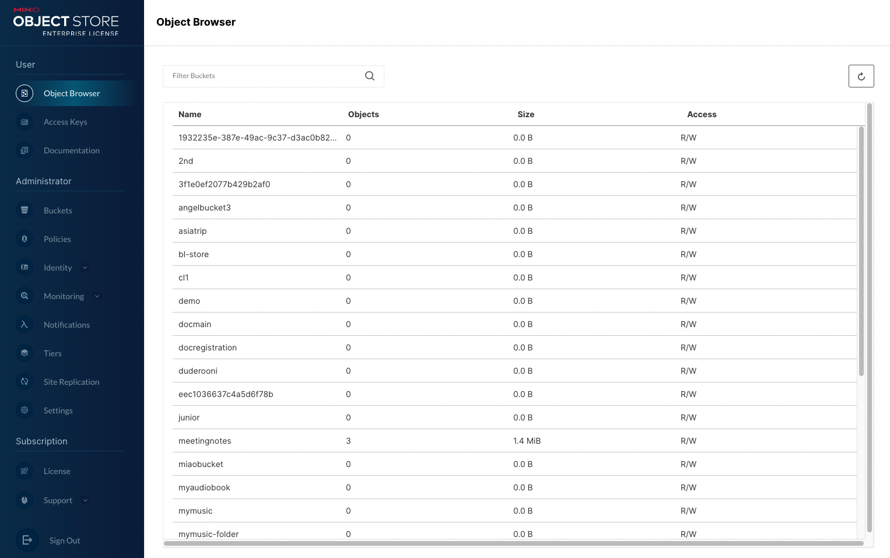

# MinIO Console

MinIO 控制台是一個豐富的圖形用戶界面，提供與 `mc` 命令行工具類似的功能。



本文提供了 MinIO 控制台的概述，並描述了配置選項和登錄說明。

## 概述

您可以使用 MinIO 控制台執行身份和訪問管理、指標和日誌監控或服務器配置等管理任務。

MinIO 控制台作為 MinIO 服務器的一部分。您還可以使用 [github 存儲庫](https://github.com/minio/console)中的說明部署獨立的 MinIO 控制台。

## 配置

MinIO 控制台從 MinIO 服務器繼承了它的大部分配置設置。以下環境變量在 MinIO 控制台中啟用特定行為：

|Environment Variable|Description|
|--------------------|-----------|
|`MINIO_PROMETHEUS_URL`|配置為從 MinIO 部署中抓取指標的 Prometheus 服務器的 URL。 MinIO 控制台使用此服務器來填充指標儀表板。<br/>有關配置 Prometheus 以從 MinIO 收集指標的教程，請參閱[使用 Prometheus 進行監控和警報](https://min.io/docs/minio/linux/operations/monitoring/collect-minio-metrics-using-prometheus.html#minio-metrics-collect-using-prometheus)。|
|`MINIO_SERVER_URL`|MinIO 控制台用於連接到 MinIO 服務器的 URL 主機名。主機名必須可解析且可訪問，控制台才能正常運行。默認情況下，MinIO 控制台使用 IP 地址連接到 MinIO 服務器。例如，當 MinIO 服務器啟動時，服務器日誌包括一行 API：`https://<IP ADDRESS 1> https://<IP ADDRESS 2>`。 MinIO 控制台默認使用 `<IP ADDRESS 1>` 連接。|
|`MINIO_BROWSER_REDIRECT_URL`|配置的外部身份管理器用於返回身份驗證響應的 MinIO 控制台的外部可解析主機名。<br/>當使用反向代理、負載平衡器或類似系統將 MinIO 控制台暴露給公共互聯網時，此變量通常是必需的。指定一個解析為 MinIO 控制台的外部可訪問主機名。|

### 靜態與動態端口分配

默認情況下，MinIO 會在每次服務器啟動時為 MinIO 控制台選擇一個隨機端口。訪問 MinIO 服務器的瀏覽器客戶端會自動重定向到動態選擇的端口上的 MinIO 控制台。此行為模擬了舊版 Web 瀏覽器的行為，同時降低了在嵌入式控制台更新之前運行 MinIO 的系統上發生端口衝突的風險。

在部署中啟動每個 MinIO 服務器時，您可以通過傳遞 `minio server --console-address` 命令行選項來選擇一個顯式靜態端口。

例如，以下命令使用 MinIO 控制台的靜態端口分配 `9001` 啟動分佈式 MinIO 部署。此部署將響應默認 MinIO 服務器端口 `:9000` 上的 S3 API 操作和 MinIO 控制台端口 `:9001` 上的瀏覽器訪問。

```bash
minio server https://minio-{1...4}.example.net/mnt/drive-{1...4} \
      --console-address ":9001"
```

在需要靜態端口用於路由規則的網絡路由組件後面的部署可能需要設置靜態 MinIO 控制台端口。例如，負載均衡器、反向代理或 Kubernetes 入口可能會默認阻止或顯示動態重定向行為的意外行為。

MinIO 控制台為未經身份驗證的用戶顯示登錄屏幕。控制台默認為 MinIO 管理的用戶提供用戶名和密碼提示。

對於配置了多個身份管理器的部署，選擇其他身份驗證方法下拉列表以選擇其他配置的身份提供者之一。您還可以使用通過安全令牌服務 (STS) API 生成的憑據登錄。

