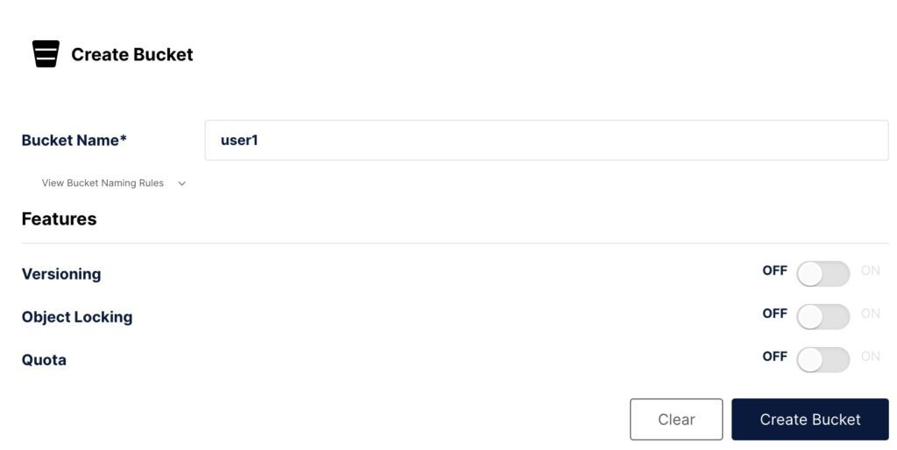
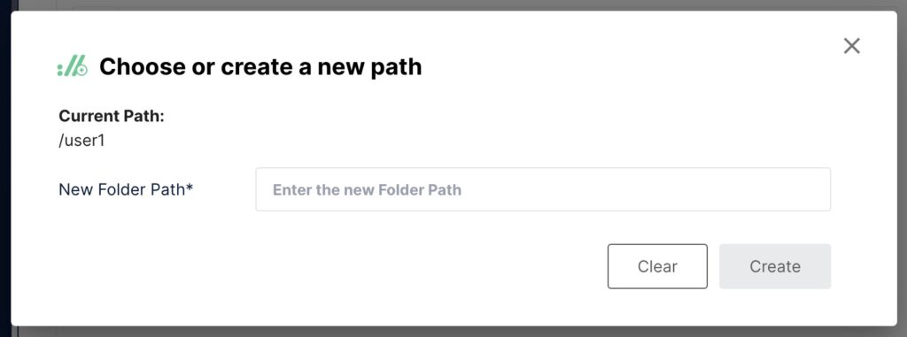
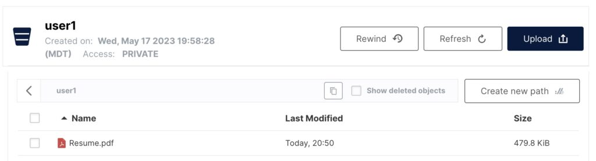

# MinIO 簡介

原文: [Introduction to MinIO](https://www.baeldung.com/minio)

## 簡介

MinIO 是一個高性能的 object 存儲系統。它被設計為雲原生存儲系統的替代方案。事實上，它的 API 與 Amazon S3 完全兼容。

在本教程中，我們將快速介紹如何使用 MinIO。

## 關於 MinIO

MinIO 從一開始就被設計為完全兼容 Amazon S3 存儲 API 的替代方案。他們聲稱是最兼容的 S3 替代方案，同時還提供對應的性能和可擴展性。

MinIO 還提供了多種部署選項。它可以作為大多數流行架構上的本機應用程序運行，也可以使用 Docker 或 Kubernetes 部署為容器化應用程序。

此外，MinIO 是開源軟件。組織可以根據 AGPLv3 許可證的條款免費使用它。

由於其 S3 API 兼容性、在各種部署中運行的能力以及開源特性，MinIO 是開發和測試以及 DevOps 場景的絕佳工具。

##　Object Storage　的工作原理

Object Storage 的概念與標準 Unix 文件系統類似，但我們使用 `bucket` 和 `object` 來代替目錄和文件。

Bucket 可以像目錄一樣嵌套到層次結構中，而 object 可以被認為只是 bytes 的集合。這些集合可以是任意 byte array 或普通文件，例如圖像、PDF 等。

一個範例 object storage 可能如下所示：

```bash
/
/images/
  imge1.png
  image2.jpg
/videos/
  video1.mp4
/users/
  /john.doe/
    3rd quarter revenue report.docx
```

就像目錄和文件一樣，bucket 和 object 也可以擁有權限。這允許對數據進行細粒度的訪問控制，特別是在擁有許多用戶的大型組織中。

### 安裝 MinIO

如前所述，MinIO 幾乎適用於所有平台。有適用於 Windows、Linux 和 MacOS 的獨立安裝程序。然而，出於開發和測試目的，最簡單的入門方法是使用容器化發行版。

讓我們將獨立的 MinIO 服務器作為容器運行：

```bash
$ docker run -p 9000:9000 -p 9090:9090 quay.io/minio/minio server /data --console-address ":9090"
```

雖然容器化部署非常適合評估 MinIO，但也有一些限制需要注意。

具體來說，一些高級功能（例如版本控制、對象鎖定和存儲桶複製）將不起作用。這些功能需要 MinIO 的分佈式部署，這在單服務器部署中是不可用的。

## 使用 MinIO

有多種不同的方法可以與 MinIO 服務器交互並管理 bucket 和 object。下面，我們就來一一看看。

### MinIO Client

[MinIO 客戶端](https://min.io/docs/minio/linux/reference/minio-mc.html)提供與 Unix 文件管理命令（例如 `cp` 和 `ls`）相同的命令，但專為本地和遠程存儲系統而設計。它與 AWS S3 完全兼容，其語法模仿 AWS 客戶端工具的語法。

使用 MinIO 客戶端的第一步是將其配置為與雲存儲系統通信。讓我們將其指向上面的容器化部署：

```bash
$ mc alias set local http://127.0.0.1:9000 minioadmin minioadmin
```

此命令創建 MinIO 容器化部署的別名，該別名可在本地主機、端口 `9000` 上使用。在此部署中，默認訪問密鑰和秘密密鑰均為 `minioadmin` (預設, 但可更改)。

我們可以使用 `admin` 子命令驗證連接：

```bash
$ mc admin info local
```

結果:

```bash
●  127.0.0.1:9000
   Uptime: 28 minutes 
   Version: 2023-06-19T19:52:50Z
   Network: 1/1 OK 
   Drives: 1/1 OK 
   Pool: 1

Pools:
   1st, Erasure sets: 1, Drives per erasure set: 1

0 B Used, 2 Buckets, 0 Objects
1 drive online, 0 drives offline
```

現在，我們可以開始執行創建 bucket 和 object 等基本操作。許多 MinIO 客戶端子命令模仿熟悉的 Unix 命令：

- `cp`：在文件系統之間複製文件或 object。
- `ls`：列出存儲桶中的文件或 object。
- `mb`：創建一個存儲桶（類似於 Linux 上的 `mkdir`）。
- `mv`：將文件或 object 從一個文件系統移動/重新定位到另一個文件系統。
- `rb`：刪除存儲桶（類似於 Linux 上的 `rmdir`）。
- `rm`：刪除文件或 object。

大多數子命令都適用於本地文件系統和雲存儲。例如，我們可以使用以下命令序列創建新的存儲桶，將文件複製到該存儲桶中，在存儲桶之間移動對象，然後刪除存儲桶：

```bash
$ mc mb user1
$ mc cp ~/Resume.pdf prattm
$ mc mb user2
$ mc cp user1/Resume.pdf user2
$ mc rb user1
$ mc ls user2
[2023-05-15 21:39:10 MDT]     491K Resume.pdf
```

### MinIO Console

在 MinIO 部署中管理數據的另一種方法是使用基於 Web 的管理控制台。我們首先在 Web 瀏覽器中打開地址 `http://127.0.0.1:9090`。我們使用 `minioadmin` / `minioadmin` 的默認憑據登錄。

從那裡，我們可以創建我們的第一個存儲桶 `user1`：



請記住，並非所有選項（例如版本控制）都適用於我們的 minio 服務部署。

現在，我們可以導航到 Object Browser 並單擊我們的新存儲桶。在此屏幕上，我們有幾個選項。首先，我們可以使用 “Create new path” 按鈕創建子存儲桶：



我們還可以將文件作為新 object 上傳到存儲桶中：



一般來說，MinIO 管理控制台的功能與命令行客戶端的功能相同。然而，它確實有一些細微的差別。

首先，客戶端不可能像命令行客戶端那樣在存儲桶之間移動 object。

此外，命令行客戶端還有許多管理控制台中不存在的子命令。例如，`diff`、`du` 和 `pipeline` 子命令都模仿標準 Unix 命令，並且在管理控制台中沒有等效命令。

###　MinIO Python SDK

我們將要討論的使用 MinIO 的最後一種方法是使用 Python SDK。首先，我們在應用程序中包含所需的依賴項：

```bash
$ pip3 install minio
```

使用 Python SDK 的第一步是創建客戶端實例：

```python
# Create a client with the MinIO server, its access key and secret key.
client = Minio(
    "http://127.0.0.1:9000",
    access_key="minioadmin",
    secret_key="minioadmin",
)
```

該客戶端可以執行我們之前使用命令行工具和管理控制台看到的所有相同操作。例如，我們可以創建一個存儲桶：

```python
client.make_bucket("user1")
```

然後，我們可以將文件作為 object 上傳到該存儲桶中：

```python
# Upload '/tmp/Resume.pdf' as object name
# 'Resume.pdf' to bucket 'user1'.
client.fput_object("user1", "Resume.pdf", "/tmp/Resume.pdf")
```

最後，讓我們看看如何從存儲桶中獲取 object：

```python
# Download data of an object.
client.fget_object("user1", "Resume.pdf", "/tmp/Resume.pdf")
```

這只是 Python SDK 的一個小範例。請記住，由於 MinIO 完全兼容 S3，因此相同的代碼可用於 Amazon S3。

##　結論

在本文中，我們簡要介紹了 MinIO，這是一個完全兼容 S3 的 object 存儲引擎。雖然它是生產級對象存儲系統，但它也適合其他用例。由於它是開源的，可以部署在任何地方，並且完全兼容 S3，因此它也是object 存儲引擎開發和測試環境的絕佳替代方案。