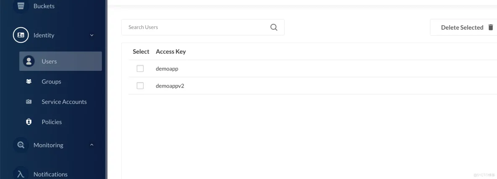
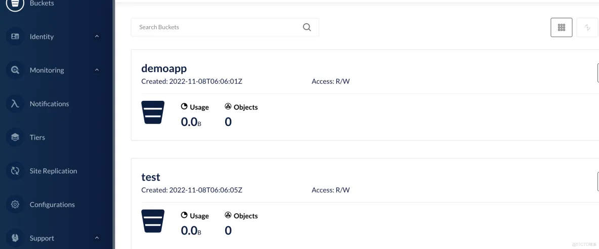
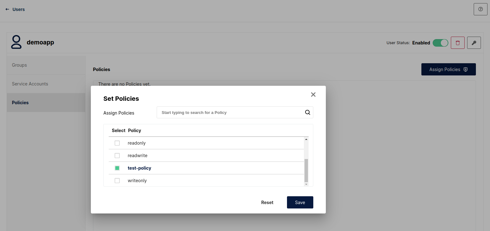
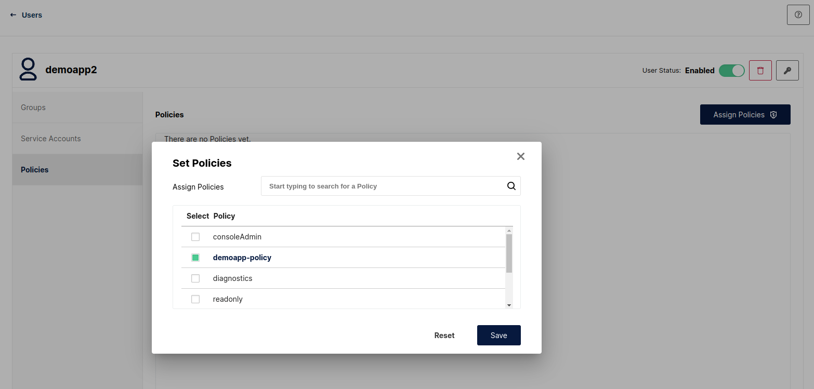
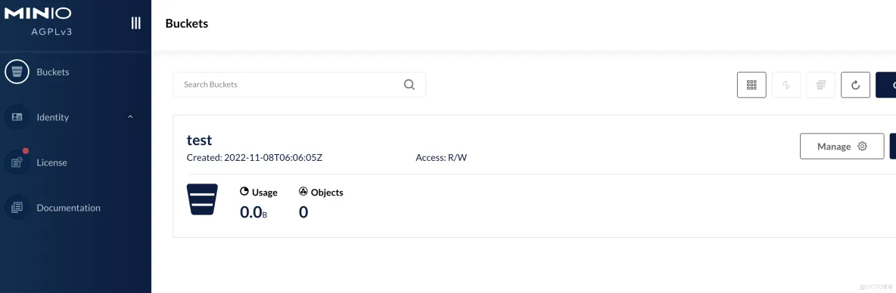

# minio policy 使用

原文: [minio policy 使用](https://blog.51cto.com/rongfengliang/5928029)

minio 參考aws s3 實現了用戶的 iam 訪問控制，使用體驗是一致的，而且比較方便，比如我們創建了一個 user 或者 group 之後就可以了需要進行權限創建分配。

## 創建 User

使用 web 介面來創建兩個 user:

- `demoapp`
- `demoappv2`



## 創建 Bucket

使用 web 介面來創建兩個 bucket:

- `demoapp`
- `test`



## 創建策略

比如 demoapp(user) 使用 test(bucket) 桶，demoappv2(user) 使用 demoapp(bucket) 桶。


**策略: `test-policy`**

```json title="test-policy"
{
    "Version": "2012-10-17",
    "Statement": [
        {
            "Effect": "Allow",
            "Action": [
                "s3:*"
            ],
            "Resource": [
                "arn:aws:s3:::test/*"
            ]
        }
    ]
}
```

**策略: `demoapp-policy`**

```json title="demoapp-policy"
{
    "Version": "2012-10-17",
    "Statement": [
        {
            "Effect": "Allow",
            "Action": [
                "s3:*"
            ],
            "Resource": [
                "arn:aws:s3:::demoapp/*"
            ]
        }
    ]
}
```

## 策略指派

比如 demoapp(user) 使用 test(bucket) 桶，demoappv2(user) 使用 demoapp(bucket) 桶。


**Policy: `test-policy` >> User: `demoapp`**



**Policy: `demoapp-policy` >> User: `demoappv2`**



## 效果

在 Minio 的　web console 上使用 `demoapp` 的帳戶來登入



aws 的 iam 是比較強大的一個東西，是一個面向雲資源管控很不錯的一個給權限模式，很值得學習。

同時 minio 還支持一個 group 的管理能力，方便給多個用戶進行策略分配。

## 参考资料

- ​https://docs.aws.amazon.com/iam/index.html​​​
​​- ​https://docs.aws.amazon.com/IAM/latest/UserGuide/introduction.html​​​
​​- https://min.io/docs/minio/kubernetes/upstream/administration/identity-access-management.html​​​
​​- https://min.io/docs/minio/kubernetes/upstream/administration/identity-access-management/policy-based-access-control.html​

