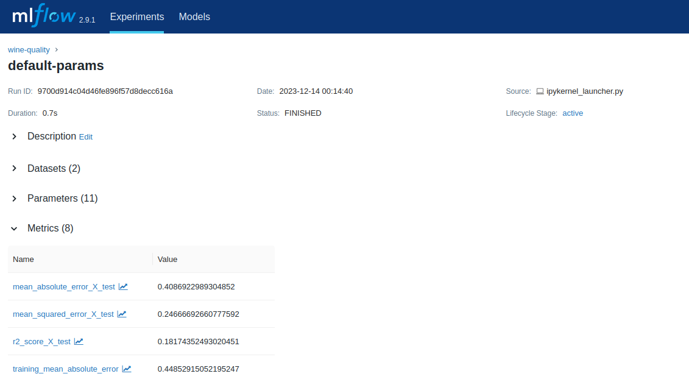
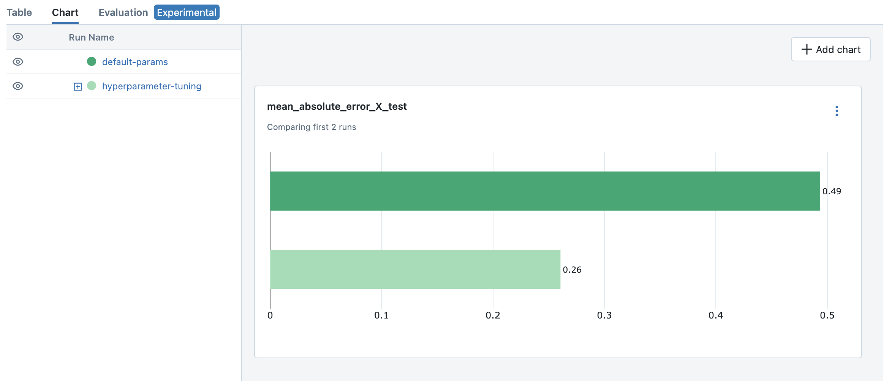

# 使用 MLflow 開發 ML 模型並部署到 Kubernetes

!!! note
    本教學假設您有權存取某一個 Kubernetes 叢集。但是，您也可以使用本機叢集模擬工具（例如 [Kind](https://kind.sigs.k8s.io/docs/user/quick-start) 或 [Minikube](https://minikube.sigs.k8s.io/docs/start/)）在本機電腦上完成本教學。

本指南示範如何將 MLflow 端對端用於：

- 使用 MLflow Tracking 訓練線性迴歸模型。
- 進行超參數調整以找到最佳模型。
- 將模型權重和依賴項打包為 MLflow 模型。
- 使用 `mlflow models serve` 指令透過 MLServer 測試本機服務的模型。
- 使用 KServe 和 MLflow 將模型部署到 Kubernetes 叢集。

我們將在本教程中介紹端到端模型開發流程，包括模型訓練和測試。如果您已經有一個模型並且只是想了解如何將其部署到 Kubernetes，則可以跳到 Step 6 - 在本機測試模型推論服務。

## 簡介

### 使用 KServe 和 MLServer 的可擴展模型推論服務

MLflow 提供了一個易於使用的介面，用於在基於 Flask 的推理伺服器中部署模型。您可以使用 `mlflow models build-docker` 指令將相同推論伺服器容器化，從而將其部署到 Kubernetes 叢集。然而，這種方法可能不可擴展，並且可能不適合生產用例。 Flask 並不是為高效能和可擴展性而設計的（為什麼？），而且手動管理推理伺服器的多個實例也很費力。

幸運的是，MLflow 為此提供了解決方案。 MLflow 提供了一種替代推論引擎，更適合更大規模的推論部署，並且支援 [MLServer](https://mlserver.readthedocs.io/en/latest/)，可以一次性部署到 Kubernetes 上流行的無伺服器模型服務框架，例如 KServe 和 Seldon Core。

### 什麼是 KServe？

KServe 為 Tensorflow、XGBoost、scikit-learn 和 Pytorch 等常見機器學習框架提供高效能、可擴展且高度抽象的介面。它提供了有助於操作大規模機器學習系統的高級功能，例如自動擴展、金絲雀部署、A/B 測試、監控、可擴展性等，並利用 Kubernetes 生態系統（包括 KNative 和 Istio）。

### 將 MLflow 與 KServe 結合使用的好處

雖然 KServe 支援高度可擴展且可用於生產的模型服務，但在那裡部署模型可能需要一些努力。 MLflow 使用 KServe 和 MLServer 簡化了將模型部署到 Kubernetes 叢集的過程。此外，它還提供無縫的端到端模型管理，作為管理整個機器學習生命週期的單一位置。這包括實驗追蹤、模型打包、版本控制、評估和部署，我們將在本教程中介紹這些內容。

## Step 1: 安裝 MLflow 和其他依賴項

首先，請使用以下命令將 mlflow 安裝到本機：

```bash
pip install mlflow[extras]
```

**[extras]** 將安裝本教學所需的其他依賴項，包括 `mlserver` 和 `scikit-learn`。請注意，部署不需要 `scikit-learn`，它只是用於訓練本教程中使用的範例模型。

您可以透過執行以下命令來檢查 MLflow 是否安裝正確：

```bash
mlflow --version
```

## Step 2: 設定 Kubernetes 集群

=== "Kubernetes 集群"

    如果您已經可以存取 Kubernetes 集群，您可以按照[官方說明](https://github.com/kserve/kserve#hammer_and_wrench-installation)將 KServe 安裝到您的集群中。

=== "本機 K8S"

    您可以按照 [KServe QuickStart](https://kserve.github.io/website/latest/get_started/) 使用 [Kind](https://kind.sigs.k8s.io/docs/user/quick-start) 設定本機叢集並在其上安裝 KServe。

現在您已經有一個 Kubernetes 叢集作為部署目標運行，讓我們繼續建立要部署的 MLflow 模型。

## Step 3: 訓練模型

在本教程中，我們將訓練和部署一個簡單的迴歸模型來預測葡萄酒的品質。

讓我們從使用預設超參數訓練模型開始。在筆記本中或作為 Python 腳本執行以下程式碼。

!!! info
    為了方便起見，我們使用 `mlflow.sklearn.autolog()` 函數。此功能可讓 MLflow 在訓練期間自動記錄適當的模型參數和指標集。要了解有關自動記錄功能或如何手動記錄的更多信息，請參閱 [MLflow Tracking 文件](https://mlflow.org/docs/tracking.html)。

```python
import mlflow

import numpy as np
from sklearn import datasets, metrics
from sklearn.linear_model import ElasticNet
from sklearn.model_selection import train_test_split


def eval_metrics(pred, actual):
    rmse = np.sqrt(metrics.mean_squared_error(actual, pred))
    mae = metrics.mean_absolute_error(actual, pred)
    r2 = metrics.r2_score(actual, pred)
    return rmse, mae, r2


# 設定實驗名稱
mlflow.set_experiment("wine-quality")

# 啟用自動記錄到 MLflow
mlflow.sklearn.autolog()

# 加載葡萄酒品質數據集
X, y = datasets.load_wine(return_X_y=True)
X_train, X_test, y_train, y_test = train_test_split(X, y, test_size=0.25)

# 開始運行並訓練模型
with mlflow.start_run(run_name="default-params"):
    lr = ElasticNet()
    lr.fit(X_train, y_train)

    y_pred = lr.predict(X_test)
    metrics = eval_metrics(y_pred, y_test)
```

現在您已經訓練了模型，讓我們透過 MLflow UI 檢查參數和指標是否正確記錄。您可以透過在終端機中執行以下命令來啟動 MLflow UI：

```bash
mlflow ui --port 5000
```

然後造訪 `http://localhost:5000` 開啟 UI。



請開啟左側名為 `wine-quality` 的　Experiment，然後按一下表中名為 `default-params` 的運行。對於這種情況，您應該會看到包括 `alpha` 和 `l1_ratio` 在內的參數以及 `training_score` 和 `mean_absolute_error_X_test` 等指標。

## Step 4: 運行超參數調優

現在我們已經建立了基準模型，讓我們嘗試透過調整超參數來提高其效能。我們將進行隨機搜尋來確定 `alpha` 和 `l1_ratio` 的最佳組合。

```python
from scipy.stats import uniform
from sklearn.model_selection import RandomizedSearchCV

lr = ElasticNet()

# 定義超參數的數值分佈以從中選取參數值
distributions = dict(
    alpha=uniform(loc=0, scale=10),  # sample alpha uniformly from [-5.0, 5.0]
    l1_ratio=uniform(),  # sample l1_ratio uniformlyfrom [0, 1.0]
)

# 初始化隨機搜尋實例
clf = RandomizedSearchCV(
    estimator=lr,
    param_distributions=distributions,
    # Optimize for mean absolute error
    scoring="neg_mean_absolute_error",
    # Use 5-fold cross validation
    cv=5,
    # Try 100 samples. Note that MLflow only logs the top 5 runs.
    n_iter=100,
)

# 開始一個 parent run
with mlflow.start_run(run_name="hyperparameter-tuning"):
    search = clf.fit(X_train, y_train)

    # 評估測試資料集上的最佳模型
    y_pred = clf.best_estimator_.predict(X_test)
    rmse, mae, r2 = eval_metrics(clf.best_estimator_, y_pred, y_test)
    mlflow.log_metrics(
        {
            "mean_squared_error_X_test": rmse,
            "mean_absolute_error_X_test": mae,
            "r2_score_X_test": r2,
        }
    )
```

當您重新開啟 MLflow UI 時，您應該注意到執行 "hyperparameter-tuning"包含 5 個 child runs。 MLflow 利用 parent-child 關係，這對於對一組 runs 來進行分組特別有用，例如超參數調整中的 runs。這裡啟用了自動記錄，並且 MLflow 根據評分指標自動為前 5 個運行建立子運行，在此範例中，平均絕對誤差為負。您也可以手動建立父運行和子運行，請參閱 [Create Child Runs](https://mlflow.org/docs/latest/tracking/tracking-api.html#child-runs)以了解更多詳細資訊。



要比較結果並確定最佳模型，您可以利用 MLflow UI 中的視覺化功能。

1. 選擇第一個 job（“default-params”）和 parent job 進行超參數調整Step 5: （“hyperparameter-turning”）。
2. 按一下 "Chart" 標籤可在圖表中視覺化指標。
3. 預設情況下，會顯示一組預定義指標的一些長條圖。
4. 您可以新增不同的圖表（例如散佈圖）來比較多個指標。例如，我們可以看到超參數調整的最佳模型在測試資料集的均方誤差上優於預設參數模型：

您可以透過查看父運行 “hyperparameter-tuning” 來檢查超參數的最佳組合。在此範例中，最佳模型是 `alpha=0.11714084185001972` 和 `l1_ratio=0.3599780644783639` （您可能會看到不同的結果）。


!!! tip
    要了解有關使用 MLflow 進行超參數調整的更多信息，請參閱[使用 MLflow 和 Optuna 進行超參數調整](https://mlflow.org/docs/traditional-ml/hyperparameter-tuning-with-child-runs/index.html)。

## Step 5: 打包模型和依賴項

由於我們使用自動記錄，MLflow 會自動記錄每次執行的模型。此程序可以方便地將模型權重和依賴項打包為可立即部署的格式。

!!! tip
    在實務中，也建議使用 [MLflow ModelRegistry](https://mlflow.org/docs/model-registry.html) 來註冊和管理模型。

讓我們簡單來看看這種格式是如何出現的。您可以透過 Run detail 頁面上的 Artifacts 頁籤查看記錄的模型。

```bash
model
├── MLmodel
├── model.pkl
├── conda.yaml
├── python_env.yaml
└── requirements.txt
```

`model.pkl` 是包含序列化模型權重的檔案。 `MLmodel` 包含指示 MLflow 如何載入模型的通用元資料。其他檔案指定運行模型所需的依賴項。

!!! info
    如果您選擇手動記錄，則需要使用 `mlflow.sklearn.log_model()` 函數明確記錄模型，如下所示：

    ```python
    mlflow.sklearn.log_model(lr, "model")
    ```

## Step 6: 測試本地服務模型

在部署模型之前，我們先測試一下模型是否可以在本地服務。如本機部署 MLflow 模型中所述，您只需使用單一命令即可執行本機推理伺服器。請記住使用 `--enable-mlserver` 標誌，它指示 MLflow 使用 MLServer 作為推理伺服器。這可確保模型以與 Kubernetes 中相同的方式運作。

```bash
mlflow models serve -m runs:/<run_id_for_your_best_run>/model -p 1234 --enable-mlserver
```

此命令啟動本機推論伺服器并監聽連接埠 1234。您可以使用curl命令向伺服器發送請求：

```bash
$ curl -X POST -H "Content-Type:application/json" --data '{"inputs": [[14.23, 1.71, 2.43, 15.6, 127.0, 2.8, 3.06, 0.28, 2.29, 5.64, 1.04, 3.92, 1065.0]]' http://127.0.0.1:1234/invocations

{"predictions": [-0.03416275504140387]}
```

有關請求格式和回應格式的更多信息，請參閱 [Inference Server Specification](https://mlflow.org/docs/latest/deployment/deploy-model-locally.html#local-inference-server-spec)。

## Step 7: 將模型部署到 KServe

最後，我們就可以將模型部署到 Kubernetes 叢集了。

### 建立命名空間

首先，建立一個測試命名空間來部署 KServe 資源和模型：

```bash
kubectl create namespace mlflow-kserve-test
```

### 建立部署配置

建立一個 YAML 文件，描述 KServe 的模型部署。

有兩種方法可以在 KServe 設定檔中指定部署模型：

1. 使用模型建立 Docker 映像並指定映像 URI。
2. 直接指定模型 URI（僅當您的模型儲存在遠端儲存時才有效）。

請打開下面的選項卡以了解每種方法的詳細資訊。

=== "Using Docker Image"

    **Register Docker Account**

    由於 KServe 無法解析本機建置的 Docker 鏡像，因此您需要將映像推送到 Docker registry。在本教學中，我們將把鏡像推送到 Docker Hub，但您可以使用任何其他 Docker registry，例如 Amazon ECR 或私有的 registry。

    如果您還沒有 Docker Hub 帳戶，請在 https://hub.docker.com/signup 建立帳戶。

    **Build a Docker Image**

    使用 `mlflow models build-docker` 指令建置準備部署的 Docker 鏡像：

    ```bash
    mlflow models build-docker -m runs:/<run_id_for_your_best_run>/model -n <your_dockerhub_user_name>/mlflow-wine-classifier --enable-mlserver
    ```

    此命令使用模型和依賴項建立 Docker 鏡像，並將其標記為 `mlflow-wine-classifier:latest`。

    **Push the Docker Image**

    建置鏡像檔後，將其推送到 Docker Hub（或使用適當的命令推送到另一個註冊表）：

    ```bash
    docker push <your_dockerhub_user_name>/mlflow-wine-classifier
    ```

    **Write Deployment Configuration**

    然後建立一個 YAML 文件，如下所示：

    ```yaml
    apiVersion: "serving.kserve.io/v1beta1"
    kind: "InferenceService"
    metadata:
    name: "mlflow-wine-classifier"
    namespace: "mlflow-kserve-test"
    spec:
    predictor:
        containers:
        - name: "mlflow-wine-classifier"
            image: "<your_docker_user_name>/mlflow-wine-classifier"
            ports:
            - containerPort: 8080
                protocol: TCP
            env:
            - name: PROTOCOL
                value: "v2"
    ```

=== "Using Model URI"

    **Get Remote Model URI**

    KServe 配置允許直接指定模型 URI。但是，它不能解析 MLflow 特定的 URI 模式（如 `runs:/` 和 `model:/`），也不能解析本機檔案 URI（如 `file:///`）。我們需要以遠端儲存 URI 格式指定模型 URI，例如 `s3://xxx` 或 `gs://xxx`。預設情況下，MLflow 將模型儲存在本機檔案系統中，因此您需要配置 MLflow 將模型儲存在遠端儲存中。請參閱 Artifact Store 以了解設定說明。

    配置 artifact store 後，載入最佳模型並將其重新記錄到新的工件存儲，或重複模型訓練步驟。

    **Create Deployment Configuration**

    使用遠端模型 URI，建立一個 YAML 檔案：

    ```yaml
    apiVersion: "serving.kserve.io/v1beta1"
    kind: "InferenceService"
    metadata:
    name: "mlflow-wine-classifier"
    namespace: "mlflow-kserve-test"
    spec:
    predictor:
        model:
        modelFormat:
            name: mlflow
        protocolVersion: v2
        storageUri: "<your_model_uri>"
    ```

### 佈署 Inference Service

執行以下 kubectl 指令將新的 InferenceService 部署到 Kubernetes 叢集：

```bash
$ kubectl apply -f YOUR_CONFIG_FILE.yaml

inferenceservice.serving.kserve.io/mlflow-wine-classifier created
```

您可以透過執行以下命令來檢查部署的狀態：

```bash
$ kubectl get inferenceservice mlflow-wine-classifier

NAME                     URL                                                     READY   PREV   LATEST   PREVROLLEDOUTREVISION   LATESTREADYREVISION
mlflow-wine-classifier   http://mlflow-wine-classifier.mlflow-kserve-test.local   True             100                    mlflow-wine-classifier-100
```

!!! note
    部署狀態可能需要幾分鐘才能準備就緒。有關詳細的部署狀態和日誌，請執行 `kubectl get inferenceservice mlflow-wine-classifier -oyaml`。

### 測試部署

部署準備就緒後，您可以向伺服器發送測試請求。

首先，建立一個包含測試資料的 JSON 檔案並將其儲存為 test-input.json。確保請求資料的格式符合 V2 推理協議，因為我們使用協議版本建立模型：v2。該請求應如下所示：

```json
{
    "inputs": [
      {
        "name": "input",
        "shape": [13],
        "datatype": "FP32",
        "data": [14.23, 1.71, 2.43, 15.6, 127.0, 2.8, 3.06, 0.28, 2.29, 5.64, 1.04, 3.92, 1065.0]
      }
    ]
}
```

然後將請求發送到您的推論服務：

=== "Kubernetes Cluster"

    假設您的叢集透過 LoadBalancer 公開，請依照下列說明尋找入口 IP 和連接埠。然後使用curl命令發送測試請求：

    ```python
    $ SERVICE_HOSTNAME=$(kubectl get inferenceservice mlflow-wine-classifier -n mlflow-kserve-test -o jsonpath='{.status.url}' | cut -d "/" -f 3)
    $ curl -v \
    -H "Host: ${SERVICE_HOSTNAME}" \
    -H "Content-Type: application/json" \
    -d @./test-input.json \
    http://${INGRESS_HOST}:${INGRESS_PORT}/v2/models/mlflow-wine-classifier/infer
    ```

=== "Local Kubernete Emulation"

通常，Kubernetes 叢集會透過 LoadBalancer 公開服務，但 kind 建立的本地叢集沒有。在這種情況下，您可以透過連接埠轉送存取推理服務。

打開一個新終端機並執行以下命令來轉送連接埠：

```bash
$ INGRESS_GATEWAY_SERVICE=$(kubectl get svc -n istio-system --selector="app=istio-ingressgateway" -o jsonpath='{.items[0].metadata.name}')
$ kubectl port-forward -n istio-system svc/${INGRESS_GATEWAY_SERVICE} 8080:80

Forwaring from 127.0.0.1:8080 -> 8080
Forwarding from [::1]:8080 -> 8080
```

然後，在 original terminal 中，向伺服器發送測試請求：

```bash
$ SERVICE_HOSTNAME=$(kubectl get inferenceservice mlflow-wine-classifier -n mlflow-kserve-test -o jsonpath='{.status.url}' | cut -d "/" -f 3)
$ curl -v \
  -H "Host: ${SERVICE_HOSTNAME}" \
  -H "Content-Type: application/json" \
  -d @./test-input.json \
  http://localhost:8080/v2/models/mlflow-wine-classifier/infer
```

然後，在原始終端機中，向伺服器發送測試請求：