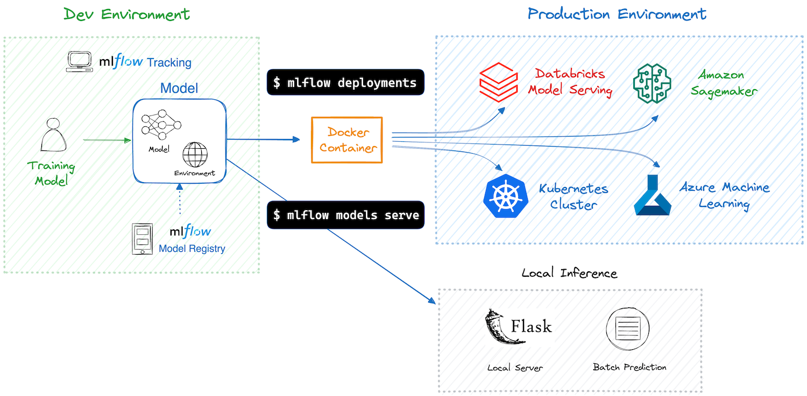
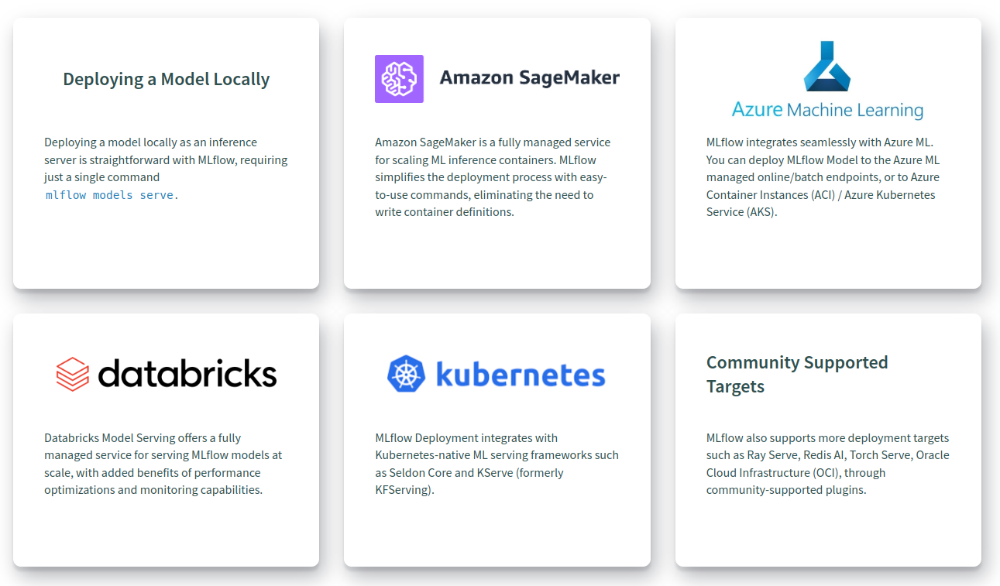

# Deployment

訓練機器學習模型並確保其性能後，下一步是將其部署到生產環境。這個過程可能很複雜，但 MLflow 透過提供簡單的工具集來簡化它，用於將 ML 模型部署到各種目標，包括本地環境、雲端服務和 Kubernetes 叢集。

透過使用 MLflow  deployment toolset，您可以享受以下好處：

- **Effortless Deployment**: MLflow 提供了一個簡單的介面，將模型部署到各種目標，無需編寫樣板程式碼。
- **Dependency and Environment Management**: MLflow 確保部署環境反映訓練環境，擷取所有相依性。這可以保證模型一致運行，無論模型部署在何處。
- **Packaging Models and Code**: 使用 MLflow，不僅是模型，而且任何補充程式碼和配置都與部署容器一起打包。這確保了模型可以無縫執行，不會遺失任何組件。
- **Avoid Vendor Lock-in**: MLflow 提供了打包模型的標準格式和用於部署的統一 API。您可以輕鬆地在部署目標之間切換，而無需重寫程式碼。

## 概念

### MLflow Model

[MLflow Model](../deployment/index.md) 是一種標準格式，它將機器學習模型及其元資料（例如依賴關係和推理 schema）打包在一起。您通常會使用 MLflow Tracking API（例如 `mlflow.pyfunc.log_model()`）來建立一個模型作為訓練執行的結果。或者，可以透過 MLflow 模型註冊表註冊和檢索模型。若要使用 MLflow 部署，您必須先建立模型。

### Container

容器(container)對於簡化和標準化模型部署過程起著至關重要的作用。 MLflow 使用 Docker 容器將模型及其相依性打包，因此可以部署到各個目的地，而不會出現環境相容性問題。有關如何將模型部署為容器的更多詳細信息，請參閱[為 MLflow 模型建立 Docker 映像](https://mlflow.org/docs/latest/deployment/deploy-model-to-kubernetes/index.html#build-docker-for-deployment)。如果您是 Docker 新手，可以從「什麼是容器」開始學習。

### Deployment Target

部署目標是指模型的目標運行環境。 MLflow 支援各種目標，包括本地環境、雲端服務（AWS、Azure）、Kubernetes 叢集等。

## 如何運作的?

MLflow Model 已經打包了您的模型及其依賴項，因此 MLflow 可以建立虛擬環境（用於本機部署）或包含運行模型所需的所有內容的 Docker 容器映像。隨後，MLflow 使用 Flask 等框架啟動具有 REST 端點的推理伺服器，準備將其部署到各個目的地以處理推理請求。有關伺服器和端點的詳細資訊可在[推理伺服器規格](https://mlflow.org/docs/latest/deployment/deploy-model-locally.html#local-inference-server-spec)中找到。

MLflow 提供 CLI 指令和 Python API 來促進部署流程。所需的命令因部署目標而異，因此請繼續閱讀下一節，以了解有關特定目標的更多詳細資訊。

## 支持的 Deployment Targets

MLflow 為各種部署目標提供支援。有關每個內容的詳細資訊和教程，請點擊下面的相應連結。

- [Deploying a Model Locally](https://mlflow.org/docs/latest/deployment/deploy-model-locally.html)
- [Amazon SageMaker](https://mlflow.org/docs/latest/deployment/deploy-model-to-sagemaker.html)
- [Azure Machine Learning](https://learn.microsoft.com/en-us/azure/machine-learning/how-to-deploy-mlflow-models)
- [Kubernetes](https://mlflow.org/docs/latest/deployment/deploy-model-to-kubernetes/index.html)

## API 參考

### Command Line Interface

與部署相關的命令主要分為兩個模組：

- [mlflow models](https://mlflow.org/docs/latest/cli.html#mlflow-models) - 通常用於本地部署。
- [mlflow deployments](https://mlflow.org/docs/latest/cli.html#mlflow-deployments) - 通常用於部署到自訂目標。

請注意，這些類別並未嚴格分開，並且可能重疊。此外，某些目標需要自訂模組或插件，例如，[mlflow sagemaker](https://mlflow.org/docs/latest/cli.html#mlflow-sagemaker) 用於 Amazon SageMaker 部署，Azure ML 需要 [azureml-mlflow](https://pypi.org/project/azureml-mlflow/) 函式庫。

因此，建議查閱您所選目標的具體文件來確定適當的命令。

### Python APIs

MLflow deployment 中幾乎所有可用的功能也可以透過 Python API 存取。有關更多詳細信息，請參閱以下 API 參考：

- [mlflow.models](https://mlflow.org/docs/latest/python_api/mlflow.models.html)
- [mlflow.deployments](https://mlflow.org/docs/latest/python_api/mlflow.deployments.html)
- [mlflow.sagemaker](https://mlflow.org/docs/latest/python_api/mlflow.sagemaker.html)

